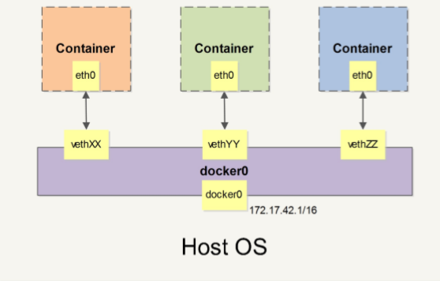

[[TOC]]

2019年7月3日

# 一、Docker 基础

## 1.1 概念

### 1.1.1 **docker  容器技术**

将容器 进程化，而不是像虚拟机一样 虚拟化一台计算机，只是运行容器的 整个进程，故而 cpu ram 等都是  宿住机的。从而 时计算机的 硬件使用率达到高可用。

### 1.1.2 构成

**镜像** ：`docker image ls -a` 查看进行，顾名思义，构建容器示例的模板。

**容器**：`docker container ls`，由 镜像 产生的 实例。容器的实质就是 一个进程，单又 与 宿主机器 中执行的 进程不同，

**仓库**： `docker registry`，一个docker registry  可以包含多个仓库，每个仓库中 包含多个 tag,每个tag 对应一个 镜像

## 1.2 安装 Docker

docker 包含两个版本：CE (社区版 7个月)与 EE(企业版 24个月)。

CE 的更新分为 三个：stable test nightly。

具体安装，不写了。

安装注意：

1. 安装完成 设置国内镜像
2. `sudo groupadd docker
   sudo gpasswd -a $USER docker`当前使用用户添加进 docker 用户组
3. 尽量使用 Debian / Ubuntu 系作为长久服务系统，
4. 启动 docker ： `    systemctl    enable    docker  systemctl    start    docker`

> **CentOS/RHEL    的用户需要注意的事项**
> 在 Ubuntu/Debian上 有 UnionFS 可以使用，如 aufs 或者     overlay2 ，而 CentOS    和    RHEL    的内核中没有相关驱动。因此对于这类系统，一般使用    devicemapper        驱动利用    LVM    的一些机制来模拟分层存储。这样的做法除了性能 比较差外，稳定性一般也不好，而且配置相对复杂。Docker    安装在    CentOS/RHEL 上后，会默认选择        devicemapper    ，但是为了简化配置，其        devicemapper        是 跑在一个稀疏文件模拟的块设备上，也被称为        loop-lvm    。这样的选择是因为不 需要额外配置就可以运行    Docker，这是自动配置唯一能做到的事情。但是        looplvm        的做法非常不好，其稳定性、性能更差，无论是日志还是        docker    info        中 都会看到警告信息。官方文档有明确的文章讲解了如何配置块设备给    devicemapper        驱动做存储层的做法，这类做法也被称为配置        direct-lvm    。
> 除了前面说到的问题外，    devicemapper        +        loop-lvm        还有一个缺陷，因为它是 稀疏文件，所以它会不断增长。用户在使用过程中会注意到    /var/lib/docker/devicemapper/devicemapper/data        不断增长，而且无法控制。很多人会希望删除镜像或者可以解决这个问题，结果发现效果并不明显。原因 就是这个稀疏文件的空间释放后基本不进行垃圾回收的问题。因此往往会出现即使 删除了文件内容，空间却无法回收，随着使用这个稀疏文件一直在不断增长。
> 所以对于    CentOS/RHEL    的用户来说，在没有办法使用        UnionFS        的情况下，一定 要配置        direct-lvm        给        devicemapper    ，无论是为了性能、稳定性还是空间利 用率。
> 或许有人注意到了    CentOS    7    中存在被    backports    回来的        overlay        驱动，不过 CentOS    里的这个驱动达不到生产环境使用的稳定程度，所以不推荐使用。

## 1.3 使用镜像

### 1.3.1 获取镜像

> `docker pull [选项] [仓库地址 或者加端口] 仓库名 [：标签]`
> 
> 例如：
> 
> docker pull ubuntu:18.04  // 不填 仓库地址时，默认 到官网地址获取

### 1.3.2 查看镜像

> docke image ls
> 
> docker system df // 查看镜像占用大小，但非实际大小
> 
> docker image ls -f dangling=true // 虚镜像 -f  == --filter
> 
> docker image prune // 清理 虚镜像
> 
> docker image ls -a // 查看中间层镜像

### 1.3.3 删除镜像

> docker image rm  名/id

以上命令 只会将 镜像 标记。当改镜像 没又被其他镜像使用时，才会被删除

### 1.3.4 构建镜像 commit

即 我们 使用 `docker exec` 进入容器后，对容器中的部署 或者 配置进行了修改，然后退出 `dockers exit` 使用 `dockers commit`  对刚才 的容器操作保存为新版镜像。

但是这样是不推荐的，因为外部是没法知道 做了什么。

而是使用 Dockerfile 定制镜像。

### 1.3.5 Dockerfile 定制镜像

#### 1.3.5.1 基本构建

```dockerfile
FORM 基础镜像
RUN 操作
```

from 也可以指定 一个 空镜像 （scratch ），自己定制

**创建镜像**

```shell
docekr build -t 仓库名[:标签] .(当前文件下的 打包文件上下文) [dockerfile 名称 不填默认 Dockerfile]
```

docker build 还可以使用 git 构建

```shell
docker    build    https://github.com/twang2218/gitlab-ce-zh.git
```

#### 1.3.5.2  COPY 和 ADD 拷贝命令

**共同功能**：都有 复制功能，将 构建时 `.` 下的 文件复制到镜像中。**区别** ： `ADD` 有解压功能

还可以 加上 `    --chown=55:mygroup` 设置 复制的文件 所属组

例如：

```dockerfile
FROM scratch 
ADD    ubuntu-xenial-core-cloudimg-amd64-root.tar.gz    / 
COPY --chown=55:mygrou hom* /mydir/
ADD --chown=55:mygrou XM* /mydir/
```

#### 1.3.5.3 CMD 和 ENTRYPOINT 容器启动命令

```dockerfile
# shell格式：    
CMD    <命令>        
#exec格式：    
CMD    ["可执行文件",    "参数1",    "参数2"...]    
#参数列表格式：    
CMD    ["参数1",    "参数2"...]    
#在指定了ENTRYPOINT    指 令后，用CMD指定具体的参数
```

**共同功能**：都是在 `image`中，用于 搭建容器中启动的 程序 或者脚本的启动。

**区别**  ： 当需要 镜像中 的程序脚本 执行 需要前进参数时，`ENTRYPOINT`  可以在 容器构建时，添加参数

例如 ：

```dockerfile
ENTRYPOINT    [    "curl",    "-s",    "https://ip.cn"    ]
```

```shell
docker    run    myip -i    
```

#### 1.3.5.4 ENV 和 ARG 声明环境变量

```dockerfile
ENV    <key> <value>
ENV    <key1>=<value1>    <key2>=<value2>
```

**共同** ：设置环境变量 可以在 该dockerfile中  `$NAME` 引用，`docker history` 都可以看见

**不同** ：ARG 所设置的 构建环境的环境变量，在将来容器运行时是不会存在这些环境变量的，Dockerfile中的ARG指令是定义参数名称，以及定义其默认值。该默认值可 以在构建命令`docker build` 中用`--build-arg <参数名>=<值>`来覆盖。

例如 ： 

```dockerfile
ENV    NODE_VERSION    7.2.0
```

#### 1.3.5.5 VOLUME 定义匿名卷

```dockerfile
VOLUME    ["<路径1>",    "<路径2>"...]    
VOLUME    <路径>    

# 如
VOLUME    /data
```

```shell
docker run -d -v mydata:/data xxxx
```

#### 1.3.5.6 EXPOSE 声明端口

```dockerfile
EXPOSE <端口1> [<端口2>...]
```

声明 该容器 需要暴露 的端口

与 `    -p    <宿主端口>:<容器端口>` 中的 容器端口 对应

#### 1.3.5.7 WORKDIR 指定工作路径

```dockerfile
WORKDIR    <工作目录路径>
# 如
RUN    cd /app 
RUN echo "hello" > world.txt
```

#### 1.3.5.8 USER 指定当前用户

```dockerfile
USER <用户名>[:<用户组>]
```

在 编写`dockerfile` 中切换用户 不使用 `su`

例如：

```dockerfile
RUN    groupadd -r    redis && useradd -r    -g redis redis
USER redis
RUN    ["redis-server"]
```

#### 1.3.5.9 HEALHCHECK 与 ONBUILD

**HEALHCHECK **健康状态

```dockerfile
FROM nginx 
RUN    apt-get    update && apt-get install -y curl && rm -rf /var/lib /apt/lists/* 
HEALTHCHECK --interval=5s --timeout=3s    \        
CMD    curl -fs http://localhost/ || exit 1
```

这里我们设置了每 5 秒检查一次（这里为了试验所以间隔非常短，实际应该相对较 长），如果健康检查命令超过 3 秒没响应就视为失败，并且使用 `curl -fs http://localhost/ || exit 1`作为健康检查命令。

`docker container ls`查看容器健康状态，`    docker inspect`详细情况

**ONBUILD** 其他构建

```dockerfile
ONBUILD 接其他 构建语句
```

用上语句生成的镜像 不会执行 `ONBUILD` ，其他的 `dockefile`  from 该 镜像时，就会执行 该 `ONBUILD` 后接的语句。

### 1.3.6  Dockefile多阶段构建

当我们需要构建较为复杂的 `dockerfile`时，如果使用 以上的知识，构建的 `dockerfile`往往非常 长，维护，出错概率非常大、灵活性差。

如果将之差分为多个 `dockerfile`文件，再使用 sh脚本 进行部署，可以避免，但是 却 在部署上非常麻烦。

所以 就可以使用 docker 17.05 提供的 多阶段构建。

例如 ：

```dockerfile
FROM imageName as builder
RUN ...
FROM imageName as prod
RUN ...
COPY --from=0 /go/src/github.com/go/helloworld/app    .
CMD ...
```

还可以 创建时 添加 --target  指定 创建阶段镜像。

```shell
docker build --target builder -t imgageName
```

在构建时，复制其他镜像的文件

```dockerfile
COPY --from=0 /go/src/github.com/go/helloworld/app    .
COPY --from=ubuntu:latest /home /home
```

### 1.3.7 其他镜像构建方式

#### 1.3.7.1 从 rootfs 压缩包导入

```shell
docker import [选项] <文件>|<URL>  生成的名字:tag
```

#### 1.3.7.2 docker save 与 doker load

docekr save 命令，用于将镜像 保存为 tar 文件，但这是 在没有 

 docker registry (仓库的情况)

```shell
docker svae <镜像名> | bzip2 | pv | ssh<用户名>@<主机名> 'cat | docker load'
```

```shell
dcoerk svae alpine | gzip > xxx.tar.gz
```

再使用 load 生成 镜像

## 1.4 操作容器

### 1.4.1 启动容器

创建 启动

```shell
docker run 
-t  # 分配一个伪终端
-i  # 显示容器内的 bash
-d  # 后台运行
```

创建

```shell
docker create
```

启动已经停止的容器

```shell
docker container start 容器id
```

终止容器

```shell
docker container stop 容器id
```

重启容器

```shell
docker container restart 容器id
```

进入容器 （启动时-d）

```shell
docker exec -it 容器id bash
# 不使用 attach ，因为 在推出容器时 容器也会关闭
```

删除容器

```shell
docker container rm 容器id # -f 强制删除 运行中的容器
dockercontainer prune
```

### 1.4.2 导出 与 导入容器

```shell
docker export 容器id > xxx.tar
cat xxx.tar | docker import - imageName
```

## 1.5 访问仓库

### 1.5.1 docker hub

docker login 登录。

使用 docker search 搜索

docker push 提交 

### 1.5.2 私有库

**docker-registry**

```shell
docker run -d -p 5000:5000 --restart=always --name registry registry

docker run -d -p 5000:5000 -v /data:/var/lib/registry registry
docker push 127.0.0.1:5000/镜像名:tag
curl 127.0.0.1:5000/v2/_catalog
docker image rm 127.0.0.1:5000/镜像名:tag
docker pull 127.0.0.1:5000/镜像名:tag
```

如果局域网内使用：

需要配置：

```json
{        "registry-mirror":    [                "https://registry.docker-cn.com"        ],        "insecure-registries":    [                "192.168.199.100:5000"        ] }
```

或者 配置 ssh,使用 https

### 1.5.3 Nexus3.x 私有仓库

使用 docker registry 有一些问题，删除镜像后 空间不回收，需要命令。

而 Nexus 提升到 3.x 后，完全支持docker.

Docker Maven Yum PyPI.

具体 可以看 Nexus3.x 的使用

## 1.6 数据持久化管理

### 1.6.1 数据卷

```shell
docker volume create my-vol
docker volume ls
docker volume inspect my-vol # 数据卷明细
docker inspect 容器名称 # 查看 容器挂载的 数据卷
# 使用  可以使用 -v 也可以使用 --mount
-v    my-vol:/wepapp
--mount source=my-vol, =/wabapp

docker volume rm volName
docker volume prune
```

### 1.6.2 主机目录

```shell
# -v --mount 还可以使用 本地文件夹 文件挂载
-v /src/resouce:/:ro
--mount type=bind,source=/src/resouce,target=/,read=only

-v /src/resouce/conf:/conf
```

## 1.7 使用网络

### 1.7.1 简单的容器之间互联

```shell
docker network create -d bridge    my-net

docker run ... --network my-net
```

-d 参数指定Docker网络类型，有bridge overlay。其中overlay网络 类型用于Swarm mode.

### 1.7.2 使用 Docker Compose 互联

多个容器之间的互联，使用 docker compose

**配置DNS**

容器中使用 mount 可以看到挂载信息。

当宿主机器的DNS 发生变化后，通过 `/etc/resolv.conf` 更新

配置全部容器的 DNS ：`/etc/docker/deamon.json`

```json
{
    "dns" : ["114.114.114.114",
            "8.8.8.8"
            ]
}
```

这样 配置 ，当容器启动后，默认配置的 DNS 就是 配置中的。

```shell
docker run -it --rm ubuntu:18.04 cat etc/resolv.conf
# 查看生效
```

手动 配置容器

```shell
docker run -it 
--hostname=xxx 
--dns=114.114.114.114 
--dns-search=.hostname # 设置搜索域  当访问host时  还会取搜索 host.hostname
--rm ubuntu:18.04 
```

## 1.8 网络高级配置

2019年7月8日

安装使用 docker 时，会自动生成一个 docker0 虚拟网桥，实际上为 Linux 的一个 bridge ，可以理解为 软件交换机。

同时，Docker 随机分配 一个 本地 未占用 的 私有网段 中的一个 地址 给 doker0。 例如 `172.17.0.1` 子掩码 `255.255.0.0`。所以以后启动容器的网口也会分配一个同一网段的地址 （172.17.0.1/16 子掩码 16位）

当创建一个 docker 容器时候，同时 会创建一对 `veth pair`接口（数据从一个进，就会从另外一个出）。一段 在容器内 即 `eth0`; 另一端 挂载到 `docker0`网桥，以 `veth`开头，这样 容器 与 主机 就实现了通讯。

 

### 1.8.1 配置指南

docker 网络相关的配置命令（有一些需要重起 docker 服务才能生效）：

+ `-b BRIDGE` 或者 `--bridge=BRIDGE` 指定 容器挂载的网桥。（若指定 overlay网络 类型用于Swarm mode）（1.8.5）
+ `--bip=CIDR`定制 docker0 的掩码  （1.8.4 ）
+ `-H SOCKERT` 或 `--host=SOCKET` docker 服务接受命令的通道
+ `--icc=true|false` 是否支持容器之间通信  (1.8.2.3 )
+ `--ip-forward=true|false` 容器之间通信（影响 容器访问控制） （1.8.2.1 ）
+ `--iptables=true|false` 是否运行docker 添加 iptables (防火墙) 规则 (1.8.2.3 )
+ `--mtu=BYTES` 容器网络中的MTU （1.8.4 ）

既可以在 启动 服务时 使用，又可以 在启动 容器时使用的

+ `--dns=IP_ADDRSS` 使用 指定的 DNS 服务器 （上一节中结束过）
+ `--dns-search=DOMAIN`指定 DNS 搜索域

只能在 容器 启动时使用 即 docker run，应为是针对容器的。

+ `-h HOSTNAME` 或者 `--hostname=HOSTNAME`配置 容器主机名
+ `--link=CONTAINER:ALIAS` 添加到另一个容器的连接
+ `--net=bridge|none|container:NAME_or_ID|host` p配置容器的桥接模式
+ `-p SPEC` 或者 `--publish=SPEC`映射容器端口到宿主主机
+ `-P ` 或者 `--publish-all=true|false` 映射容器所以端口到宿主主机

### 1.8.2 容器访问控制

2019年7月9日

容器的访问控制，主要通过 Linux 上的 `iptables`防火墙 来进行管理和实现。`iptables` 为大部分 Linux 默认防火墙软件

#### **1.8.2.1 容器访问外部网络**

容器需要访问外部网络，需要本地系统的转发支持。

Linux 查询转发打开：

```shell
sysctl net.ipv4.ip_forward # ip 前往
```

如果显示为 `0` ，需要打开

```shell
sysctl -w net.ipv4.ip_forward=1 # 写入 为1
```

docker 服务启动的时候，如果设置 `--ip-forward=true`,docker 就会执行上面的语句。

#### 1.8.2.2 容器之间访问

需要：

+ 容器的网络是否已经互联。默认所有容器都被连接到 docker0 网桥上
+ 本地系统的防火墙软件是否允许。`iptablesx`

不需要配置 `network` ,容器启动后 默认 在`bridge`上

#### 1.8.2.3 访问所有端口

启动 docker 服务时，默认添加一条转发 **策略** 到 `iptables` 的 `FORWARD`   上。策略为 `通过ACCEPT` 或者 `禁止DRPOP`。

具体 通过配置 `--icc=true`（默认值）或者 `--icc=false`进行设置。

或者 使用 `--iptables=false`，不添加 `iptables` 规则

但是 默认情况下，不同容器之间 是允许网络互通。可以 `/etc/default/docker`文件中 配置 `DOCKER_OPTS=-icc=false`禁止。

#### 1.8.2.4 访问指定端口

当配置了 `DOCKER_OPTS=-icc=false`后，可以 使用 

`docker run ... --link=CONTAINER_NAME:ALIAS`

访问容器 的开放端口 （dockerfile 中 EXPOSE 声明的端口）。

但是在之前 **1.7** 中 说的 不再推荐使用 `--link`。`--network` 能否替代？ 待测。。。

```shell
sudo iptables -nL # 查看 规则
```

如果 docker 服务启动时，`-ic=false` 端口禁止，`--iptables=true`并且 添加了防火墙规则。就可以使用 `--link` 添加新规则（`ACCEPT`），访问 开放端口。

### 1.8.3 端口映射实现

默认下 外部网络无法访问容器，但是容器可以访问外部网络

#### 1.8.3.1 容器访问外部实现

容器访问外部的连接，源地址都会被 NAT 成本地系统的 IP地址。使用 iptables 的源地址伪装，

```shell
iptables -t nat -nL # 查看地址伪装   MASQUERADE
```

### 1.8.3.2 外部访问容器实现

熟悉 的 使用端口映射 `-p  -P`。

还是可以通过 以上 查看 nat 表规则。

使用 `-p IP:ip_port:container_port` `-P IP::container_port` 设置 指定地址才能访问。

### 1.8.4 配置 docker0 网桥

Docker 服务默认创建一个docker0 网桥（有一个内部接口），在内核层连通其他的物理 或者 虚拟网卡，所以 与 物理机在同一网络中。

服务启动时配置

+ `--bip=CIDR` ip地址加掩码 例如 ： 192.168.1.2/24
+ `--mtu=BYTES` 允许最大传输单元 默认 1500Bytes

也可以在配置文件中 修改 `DOCKER_OPTS`再重启

```shell
sudo brctl show # 查看网桥端口信息  DEbian 系中需要 sudo apt-get install bridger-utils 
```

### 1.8.5 自定义网桥

除了 默认 docker0 网桥，还可以自定义。

docker 服务启动时，使用 `-d BRIDGE `或者 `--bridge=BRIDGE` 指定使用我网桥。

如果 服务已经启动，需要 停止服务。

```shell
systemctl stop docker # 停止服务
ip link set dev docker0 down # 卸载docker0
brctl delbr docker0 # 删除docker0
```

创建 新网桥

```shell
brctl addbr bridger_names
ip addr add 192.168.10.1/24 dve bridger_names # 设置网桥的 IP段
ip link set dev bridger_names up # 启用

# 查看网桥
ip addr show bridger_names
```

docker 配置文件中， `/etc/docker/deamon.json`配置 docker 启动的默认网桥

```json
{
    "bridge":"bridger_names"
}
```