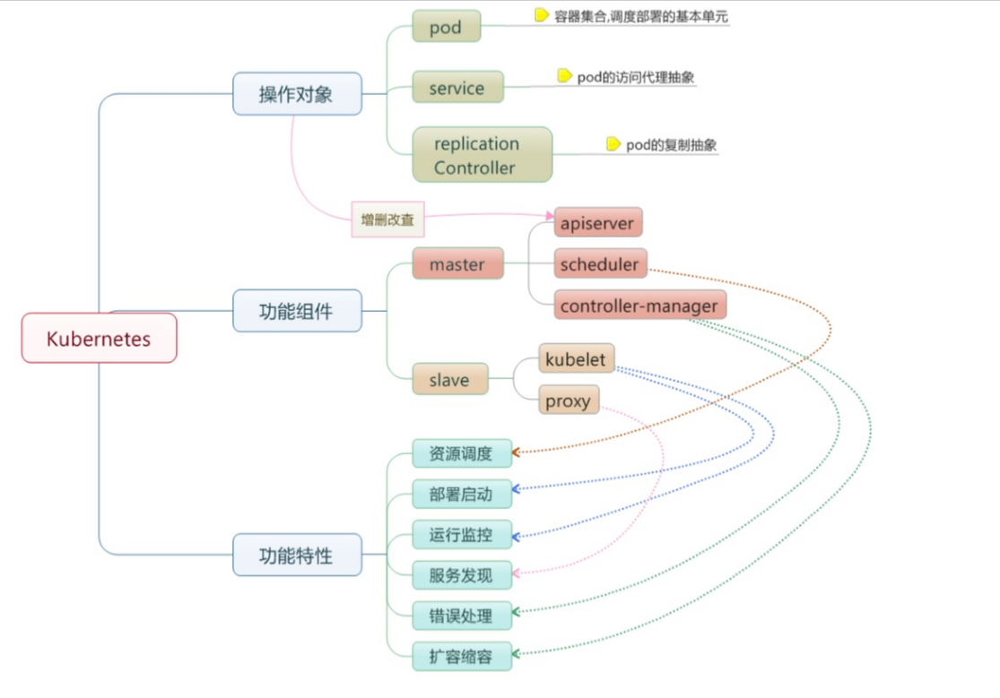

[[TOC]]

# Kubernetes

## 1 项目简介

管理跨多个主机的容器，提供基本的部署，维护以及运行伸缩，主要用 GO 语言实现。

特点：

+ 易学： 轻量级，简短容易理解
+ 便捷：支持 公有云，私有云，混合云 以及多种 云平台
+ 可拓展：  模块化，可插拔 支持钩子  任意组合
+ 自修复： 自动重调度  自动启动  自动复制

##  2 基本概念



+ 节点（node）:：一个节点 就是一个运行Kubernetes 服务的主机
+ 容器组（Pod）：一个Pod 对应 由若干 容器 组成的 容器组，同一个容器组内的容器 共享一个 存储卷（Volunme）
+ 容器组生命周期（pos-states）：包含所有容器状态的集合，包含容器组专题类型，容器组生命周期，事件，重启策略， 以及 replication controllers （复制控制器）
+ 服务 （services）： 一个 Kubernetes 服务 是 容器组逻辑的高级抽象，同时 也对外提供访问容器组的策略。 （可以简单理解：docker、podman 等 便是 对Kubernetes services的实现）
+ 卷（Volumes）：一个卷就是一个目类，容器对其又访问权限
+ 标签 （labels）： 便起身用来连接一组对象的，比如容器组。 标签可以被用来和组织选择子对象。
+ 接口权限 （accessing_the_api）： 端口 IP地址 和 代理   的防火墙规则
+ web界面（ux）：用户可以通过 web 界面操作 Kubernetes
+ 命令行操作 （cli) ：kubectl 命令

## 3 节点

在 Kubernetes 中，节点是实际工作的点，节点可以是 虚拟机或者 物理机，依赖于 一个集群幻剑。每个节点都有一些 必要的服务 以允许容器组，并且他们都可以通过主节点来管理。必要服务包含 ： **docker** **kubelet** 和 **代理服务**

### 3.1 容器状态

同情状态 用来描述 节点当中状态  有以下信息

#### 3.1.1 主机IP

主机IP 需要云平台来查询， kubernetes 把它作为状态的一部分 来保存。如果 kubernetes 没有运行在云平台上， 节点ID 就必需。 IP地址可以变化，并且 可以包含多种类型的 IP 地址，公共IP 私有IP 动态IP ipv6 等

#### 3.1.2 节点周期

通常说 节点 有 ： Pending Running Terminated 三个周期，如果 Kubernetes 发现一个几点 并且 其可用，那么 Kubernetes 就把它标记未 Pending ，然后 在某个 时刻，Kubernetes 会将其标记未 Running 。 节点的介绍周期 为 Terminated 。 一个 已经Terminated 的节点 不会接受和 调度  任何请求，并且已经在 其上运行的容器组 也会被 删除

#### 3.1.3 节点状态

节点状态 主要 用来描述 **Running** 的节点。当前可用的 有  **NodeReachable** (节点可延伸)  和 **NodeReady**  (节点就绪) 以后 可能会添加。

**NodeReachable** 表示 集群可达。

**NodeReady** 表示kubelet返回 Status Ok 并且 HTTP 状态检查健康

### 3.2 节点管理

节点并非 Kubernetes 创建，而是由 云平台创建，或者 就是物理机 虚拟机。

在 Kubernetes 中，节点仅仅是一条记录，节点创建后 Kubernetes 会检查 其是否可用。在 Kubernetes 中，节点 用 如下结构保存：

```json
{
    "id": "10.1.2.3",
    "kind":	"Minion",
    "apiVersion": "v1beta1",
    "resources": {
        "capacity":	{
            "cpu": 1000,
            "memory": 1073741824
        },
    },
    "labels": {	
        "name":	"my-first-k8s-node",
    },
}
```

Kubernetes校验节点可用依赖于ID。在当前的版本中，有两个接口可以用来管理 节点：**节点控制**和	**Kube管理**。

### 3.3 节点控制

在 Kubernetes **主节点**中， **节点 控制器**是用来管理节点的组件。

+ 集群范围内节点同步
+ 单节点生命周期管理

节点控制 有一个同步轮询，主要 **监听**所有云平台的虚拟实例，会根据**节点状态** 创建和删除。 

可以通过`--node_sync_period`标志来控制该轮寻。

如果一个实例已经 创建，节点控制将会为其创建一个结构。

同样的，如果一个节点被删除，节点控制 也会删除该结构。

在**Kubernetes**启动时可用通过`--machines`标记来显示指定节点。同样可以使用`kubectl`来一条一条的添加节点，两者是相同的。

通过设置`--sync_nodes=false`标记来禁止集群之间的节点同步，你也可以使用 `api/kubectl`命令行来增删节点。

## 4 容器组

一个容器组是一 个特定应用的打包集合，包含一个或多个容器。

和运行的容器类似，一个容器组被认为只有很短的运行周期。容器组被调度到一组 节点运行，直到容器的生命周期结束或者其被删除。

### 4.1 容器组设计的初衷

**资源共享和通信** 

容器组主要是为了数据共享和它们之间的通信。

**容器组管理**

容器组是一个运用管理和部署的高层次抽象，同时也是一组容器的接口。容器组是 部署、水平放缩的最小单位。

### 4.2 容器组的生命状态

包括若干状态值：`pending`、`running`、`succeeded`、`failed`。

**pending**
容器组已经被节点接受，但有一个或多个容器还没有运行起来。这将包含某些节点 正在下载镜像的时间，这种情形会依赖于网络情况。
**running**
容器组已经被调度到节点，并且所有的容器都已经启动。至少有一个容器处于运行 状态（或者处于重启状态）。
**succeeded**
所有的容器都正常退出。
**failed**
容器组中所有容器都意外中断了。

### 4.3 容器组生命周期

通常来说，如果容器组被创建了就**不会自动销毁**，除非被某种行为触发，而触发此种情况可能是人为，或者复制控制器所为。唯一例外的是容器组由**succeeded**状态 成功退出，或者在一定时间内重试多次依然失败。

如果某个节点死掉或者不能连接，那么节点控制器将会标记其上的容器组的状态为**failed**。

举例如下：

> 容器组状态	running	，有	1	容器，容器正常退出 
>
> 记录完成事件 
>
> 如果重启策略为： 
>
> 始终：重启容器，容器组保持	running	
>
> 失败时：容器组变为	succeeded	
>
> 从不：容器组变为	succeeded	

> 容器组状态		running	，有1容器，容器异常退出 
>
> 记录失败事件 
>
> 如果重启策略为： 
>
> 始终：重启容器，容器组保持		running	
>
> 失败时：重启容器，容器组保持		running	
>
> 从不：容器组变为		failed	

## 5 基本架构

### 运行原理


可见，Kubernetes	首先是一套分布式系统，由多个节点组成，节点分为两类：一类 是属于管理平面的主节点/控制节点（Master	Node）；一类是属于运行平面的工作 节点（Worker	Node）。
显然，复杂的工作肯定都交给控制节点去做了，工作节点负责提供稳定的操作接口 和能力抽象即可。
从这张图上，我们没有能发现	Kubernetes	中对于控制平面的分布式实现，但是由 于数据后端自身就是一套分布式的数据库	Etcd，因此可以很容易扩展到分布式实 现。

## 6 控制平面

### 主节点服务

主节点上需要提供如下的管理服务：

- `apiserver` 是整个系统的对外接口，提供一套 RESTful 的 [Kubernetes API](https://github.com/kubernetes/kubernetes/tree/master/docs/api-reference)，供客户端和其它组件调用；
- `scheduler` 负责对资源进行调度，分配某个 pod 到某个节点上。是 pluggable 的，意味着很容易选择其它实现方式；
- `controller-manager` 负责管理控制器，包括 endpoint-controller（刷新服务和 pod 的关联信息）和 replication-controller（维护某个 pod 的复制为配置的数值）。

### Etcd

这里                                               即作为数据后端，又作为消息中间件。

通过 Etcd 来存储所有的主节点上的状态信息，很容易实现主节点的分布式扩展。

组件可以自动的去侦测 Etcd 中的数值变化来获得通知，并且获得更新后的数据来执行相应的操作。

## 工作节点

- kubelet 是工作节点执行操作的 agent，负责具体的容器生命周期管理，根据从数据库中获取的信息来管理容器，并上报 pod 运行状态等；
- kube-proxy 是一个简单的网络访问代理，同时也是一个 Load Balancer。它负责将访问到某个服务的请求具体分配给工作节点上的 Pod（同一类标签）。


# Kubernetes 是什么

Kubernetes是容器集群管理系统，是一个开源的平台，可以实现容器集群的自动化部署、自动扩缩容、维护等功能。

通过Kubernetes你可以：

- 快速部署应用
- 快速扩展应用
- 无缝对接新的应用功能
- 节省资源，优化硬件资源的使用

我们的目标是促进完善组件和工具的生态系统，以减轻应用程序在公有云或私有云中运行的负担。

### Kubernetes 特点

- **可移植**: 支持公有云，私有云，混合云，多重云（multi-cloud）
- **可扩展**: 模块化, 插件化, 可挂载, 可组合
- **自动化**: 自动部署，自动重启，自动复制，自动伸缩/扩展

Kubernetes是Google 2014年创建管理的，是Google 10多年大规模容器管理技术Borg的开源版本。

## Why containers?

为什么要使用[容器](https://aucouranton.com/2014/06/13/linux-containers-parallels-lxc-openvz-docker-and-more/)？通过以下两个图对比：


传统的应用部署方式是通过插件或脚本来安装应用。这样做的缺点是应用的运行、配置、管理、所有生存周期将与当前操作系统绑定，这样做并不利于应用的升级更新/回滚等操作，当然也可以通过创建虚机的方式来实现某些功能，但是虚拟机非常重，并不利于可移植性。

新的方式是通过部署容器方式实现，每个容器之间互相隔离，每个容器有自己的文件系统 ，容器之间进程不会相互影响，能区分计算资源。相对于虚拟机，容器能快速部署，由于容器与底层设施、机器文件系统解耦的，所以它能在不同云、不同版本操作系统间进行迁移。

容器占用资源少、部署快，每个应用可以被打包成一个容器镜像，每个应用与容器间成一对一关系也使容器有更大优势，使用容器可以在build或release  的阶段，为应用创建容器镜像，因为每个应用不需要与其余的应用堆栈组合，也不依赖于生产环境基础结构，这使得从研发到测试、生产能提供一致环境。类似地，容器比虚机轻量、更“透明”，这更便于监控和管理。最后，

容器优势总结：

- **快速创建/部署应用：**与VM虚拟机相比，容器镜像的创建更加容易。
- **持续开发、集成和部署：**提供可靠且频繁的容器镜像构建/部署，并使用快速和简单的回滚(由于镜像不可变性)。
- **开发和运行相分离：**在build或者release阶段创建容器镜像，使得应用和基础设施解耦。
- **开发，测试和生产环境一致性：**在本地或外网（生产环境）运行的一致性。
- **云平台或其他操作系统：**可以在 Ubuntu、RHEL、 CoreOS、on-prem、Google Container Engine或其它任何环境中运行。
- **Loosely coupled，分布式，弹性，微服务化：**应用程序分为更小的、独立的部件，可以动态部署和管理。
- **资源隔离**
- **资源利用：**更高效

### 使用Kubernetes能做什么？

可以在物理或虚拟机的Kubernetes集群上运行容器化应用，Kubernetes能提供一个以“**容器为中心的基础架构**”，满足在生产环境中运行应用的一些常见需求，如：

- [多个进程（作为容器运行）协同工作。](http://docs.kubernetes.org.cn/312.html)（Pod）
- 存储系统挂载
- Distributing secrets
- 应用健康检测
- [应用实例的复制](http://docs.kubernetes.org.cn/314.html)
- Pod自动伸缩/扩展
- Naming and discovering
- 负载均衡
- 滚动更新
- 资源监控
- 日志访问
- 调试应用程序
- [提供认证和授权](http://docs.kubernetes.org.cn/51.html)

#### Kubernetes不是什么？

Kubernetes并不是传统的PaaS（平台即服务）系统。

- Kubernetes不限制支持应用的类型，不限制应用框架。不限制受支持的语言runtimes (例如, Java, Python, Ruby)，满足[12-factor applications](https://12factor.net/) 。不区分 “apps” 或者“services”。 Kubernetes支持不同负载应用，包括有状态、无状态、数据处理类型的应用。只要这个应用可以在容器里运行，那么就能很好的运行在Kubernetes上。
- Kubernetes不提供中间件（如message buses）、数据处理框架（如Spark）、数据库(如Mysql)或者集群存储系统(如Ceph)作为内置服务。但这些应用都可以运行在Kubernetes上面。
- Kubernetes不部署源码不编译应用。持续集成的 (CI)工作流方面，不同的用户有不同的需求和偏好的区域，因此，我们提供分层的 CI工作流，但并不定义它应该如何工作。
- Kubernetes允许用户选择自己的日志、监控和报警系统。
- Kubernetes不提供或授权一个全面的应用程序配置 语言/系统（例如，[jsonnet](https://github.com/google/jsonnet)）。
- Kubernetes不提供任何机器配置、维护、管理或者自修复系统。

另一方面，大量的Paas系统都可以运行在Kubernetes上，比如Openshift、Deis、Gondor。可以构建自己的Paas平台，与自己选择的CI系统集成。

由于Kubernetes运行在应用级别而不是硬件级，因此提供了普通的Paas平台提供的一些通用功能，比如部署，扩展，负载均衡，日志，监控等。这些默认功能是可选的。

另外，Kubernetes不仅仅是一个“编排系统”；它消除了编排的需要。“编排”的定义是指执行一个预定的工作流：先执行A，之B，然C。相反，Kubernetes由一组独立的可组合控制进程组成。怎么样从A到C并不重要，达到目的就好。当然集中控制也是必不可少，方法更像排舞的过程。这使得系统更加易用、强大、弹性和可扩展。

#### *Kubernetes*是什么意思？K8S？

**Kubernetes**的名字来自希腊语，意思是“*舵手”* 或 “*领航员”*。*K8s*是将8个字母“ubernete”替换为“8”的缩写。