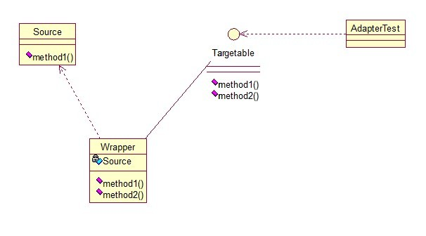

#### B6适配器模式

适配器模式将某个类的接口转换成客户端期望的另一个接口表示，目的是消除由于接口不匹配所造成的类的兼容性问题。主要分为三类：类的适配器模式、对象的适配器模式、接口的适配器模式。首先，我们来看看类的适配器模式，先看类图：

核心思想就是：有一个Source类，拥有一个方法，待适配，目标接口时Targetable，通过Adapter类，将Source的功能扩展到Targetable里，看代码：

```java
public class Source {  

    public void method1() {  
        System.out.println("this is original method!");  
    }  
}  
[java] view plaincopy
public interface Targetable {  

    /* 与原类中的方法相同 */  
    public void method1();  

    /* 新类的方法 */  
    public void method2();  
}  
[java] view plaincopy
public class Adapter extends Source implements Targetable {  

    @Override  
    public void method2() {  
        System.out.println("this is the targetable method!");  
    }  
}  
```

Adapter类继承Source类，实现Targetable接口，下面是测试类：

```java
 [java] view plaincopy
 public class AdapterTest {  

     public static void main(String[] args) {  
         Targetable target = new Adapter();  
         target.method1();  
         target.method2();  
     }  
 }  
```

输出：

this is original method!
this is the targetable method!

这样Targetable接口的实现类就具有了Source类的功能。
对象的适配器模式

基本思路和类的适配器模式相同，只是将Adapter类作修改，这次不继承Source类，而是持有Source类的实例，以达到解决兼容性的问题。看图：

只需要修改Adapter类的源码即可：

```java
 public class Wrapper implements Targetable {  

     private Source source;  

     public Wrapper(Source source){  
         super();  
         this.source = source;  
     }  
     @Override  
     public void method2() {  
         System.out.println("this is the targetable method!");  
     }  

     @Override  
     public void method1() {  
         source.method1();  
     }  
 }  
```

测试类：

```java
 public class AdapterTest {  

     public static void main(String[] args) {  
         Source source = new Source();  
         Targetable target = new Wrapper(source);  
         target.method1();  
         target.method2();  
     }  
 }  
```

输出与第一种一样，只是适配的方法不同而已。

第三种适配器模式是接口的适配器模式，接口的适配器是这样的：有时我们写的一个接口中有多个抽象方法，当我们写该接口的实现类时，必须实现该接口的所有方法，这明显有时比较浪费，因为并不是所有的方法都是我们需要的，有时只需要某一些，此处为了解决这个问题，我们引入了接口的适配器模式，借助于一个抽象类，该抽象类实现了该接口，实现了所有的方法，而我们不和原始的接口打交道，只和该抽象类取得联系，所以我们写一个类，继承该抽象类，重写我们需要的方法就行。看一下类图：

这个很好理解，在实际开发中，我们也常会遇到这种接口中定义了太多的方法，以致于有时我们在一些实现类中并不是都需要。看代码：

```java
 public interface Sourceable {  

     public void method1();  
     public void method2();  
 }  
```

抽象类Wrapper2：

```java
 public abstract class Wrapper2 implements Sourceable{  

     public void method1(){}  
     public void method2(){}  
 }  

 public class SourceSub1 extends Wrapper2 {  
     public void method1(){  
         System.out.println("the sourceable interface's first Sub1!");  
     }  
 }  


 public class SourceSub2 extends Wrapper2 {  
     public void method2(){  
         System.out.println("the sourceable interface's second Sub2!");  
     }  
 }  

 public class WrapperTest {  

     public static void main(String[] args) {  
         Sourceable source1 = new SourceSub1();  
         Sourceable source2 = new SourceSub2();  

         source1.method1();  
         source1.method2();  
         source2.method1();  
         source2.method2();  
     }  
 }  
```

测试输出：

the sourceable interface’s first Sub1!
the sourceable interface’s second Sub2!

达到了我们的效果！

讲了这么多，总结一下三种适配器模式的应用场景：

类的适配器模式：当希望将一个类转换成满足另一个新接口的类时，可以使用类的适配器模式，创建一个新类，继承原有的类，实现新的接口即可。

对象的适配器模式：当希望将一个对象转换成满足另一个新接口的对象时，可以创建一个Wrapper类，持有原类的一个实例，在Wrapper类的方法中，调用实例的方法就行。

接口的适配器模式：当不希望实现一个接口中所有的方法时，可以创建一个抽象类Wrapper，实现所有方法，我们写别的类的时候，继承抽象类即可。
