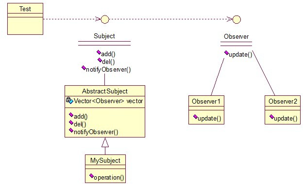

#### C15、观察者模式（Observer） ####
包括这个模式在内的接下来的四个模式，都是类和类之间的关系，不涉及到继承，学的时候应该 记得归纳，记得本文最开始的那个图。观察者模式很好理解，类似于邮件订阅和RSS订阅，当我们浏览一些博客或wiki时，经常会看到RSS图标，就这的意思是，当你订阅了该文章，如果后续有更新，会及时通知你。其实，简单来讲就一句话：当一个对象变化时，其它依赖该对象的对象都会收到通知，并且随着变化！对象之间是一种一对多的关系。先来看看关系图：

我解释下这些类的作用：MySubject类就是我们的主对象，Observer1和Observer2是依赖于MySubject的对象，当MySubject变化时，Observer1和Observer2必然变化。AbstractSubject类中定义着需要监控的对象列表，可以对其进行修改：增加或删除被监控对象，且当MySubject变化时，负责通知在列表内存在的对象。我们看实现代码：

一个Observer接口：

	[java] view plaincopy
	public interface Observer {
	public void update();
	}
两个实现类：
	
	[java] view plaincopy
	public class Observer1 implements Observer {
	
	@Override  
	public void update() {  
	    System.out.println("observer1 has received!");  
	}  
	
	}
	[java] view plaincopy
	public class Observer2 implements Observer {
	
	@Override  
	public void update() {  
	    System.out.println("observer2 has received!");  
	}  
	
	}
	Subject接口及实现类：
	
	[java] view plaincopy
	public interface Subject {
	
	/*增加观察者*/  
	public void add(Observer observer);  
	
	/*删除观察者*/  
	public void del(Observer observer);  
	
	/*通知所有的观察者*/  
	public void notifyObservers();  
	
	/*自身的操作*/  
	public void operation();  
	
	}
	[java] view plaincopy
	public abstract class AbstractSubject implements Subject {
	
	private Vector<Observer> vector = new Vector<Observer>();  
	@Override  
	public void add(Observer observer) {  
	    vector.add(observer);  
	}  
	
	@Override  
	public void del(Observer observer) {  
	    vector.remove(observer);  
	}  
	
	@Override  
	public void notifyObservers() {  
	    Enumeration<Observer> enumo = vector.elements();  
	    while(enumo.hasMoreElements()){  
	        enumo.nextElement().update();  
	    }  
	}  
	
	}
	[java] view plaincopy
	public class MySubject extends AbstractSubject {
	
	@Override  
	public void operation() {  
	    System.out.println("update self!");  
	    notifyObservers();  
	}  
	
	}

测试类：

	[java] view plaincopy
	public class ObserverTest {
	
	public static void main(String[] args) {  
	    Subject sub = new MySubject();  
	    sub.add(new Observer1());  
	    sub.add(new Observer2());  
	
	    sub.operation();  
	}  
	
	}
输出：

update self!
observer1 has received!
observer2 has received!

这些东西，其实不难，只是有些抽象，不太容易整体理解，建议读者：根据关系图，新建项目，自己写代码（或者参考我的代码）,按照总体思路走一遍，这样才能体会它的思想，理解起来容易！ 