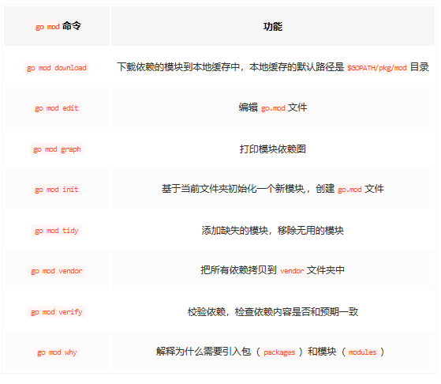

# 环境搭建

2024-01-30

[[TOC]]

## 1 参考资源

[Go语言基本环境变量与依赖管理](https://juejin.cn/post/6860126287043362824)

## 2 安装方式

### 2.1 直接安装

直接二进制 [下载](https://studygolang.com/dl) 

### 2.2 管理器安装

goup 管理SDK

GVM
[使用 GVM 工具管理 Go 版本](https://zhuanlan.zhihu.com/p/158922313)

export GVM_ROOT="$HOME/.gvm/scripts/gvm"

由于墙的问题， gvm 不好用

## 3 运行环境

环境变量 

```shell
go env # 查看 全部的环境变量
# 在日常开发中，我们需要重点关注GOPROXY、GOROOT、GOPATH和GOBIN，其他配置项可以在需要的时候再查询文档进行配置。
```

::: code-group

```shell
set GO111MODULE=
set GOARCH=amd64
set GOBIN=
set GOCACHE=C:\Users\GL\AppData\Local\go-build
set GOENV=C:\Users\GL\AppData\Roaming\go\env
set GOEXE=.exe
set GOFLAGS=
set GOHOSTARCH=amd64
set GOHOSTOS=windows
set GOINSECURE=
set GONOPROXY=
set GONOSUMDB=
set GOOS=windows
set GOPATH=C:\Users\GL\go
set GOPRIVATE=
set GOPROXY=http://mirrors.aliyun.com/goproxy/
set GOROOT=E:\SoftwareDevelopment\go1.14.2
set GOSUMDB=sum.golang.org
set GOTMPDIR=
set GOTOOLDIR=E:\SoftwareDevelopment\go1.14.2\pkg\tool\windows_amd64
set GCCGO=gccgo
set AR=ar
set CC=gcc
set CXX=g++
set CGO_ENABLED=1
set GOMOD=
set CGO_CFLAGS=-g -O2
set CGO_CPPFLAGS=
set CGO_CXXFLAGS=-g -O2
set CGO_FFLAGS=-g -O2
set CGO_LDFLAGS=-g -O2
set PKG_CONFIG=pkg-config
set GOGCCFLAGS=-m64 -mthreads -fno-caret-diagnostics -Qunused-arguments -fmessage-length=0 -fdebug-prefix-map=C:\Users\GL\AppData\Local\Temp\go-build670381262=/tmp/go-build -gno-record-gcc-switches
```

```shell
GO111MODULE=""
GOARCH="amd64"
GOBIN=""
GOCACHE="/home/{user}/.cache/go-build"
GOENV="/home/{user}/.config/go/env"
GOEXE=""
GOEXPERIMENT=""
GOFLAGS=""
GOHOSTARCH="amd64"
GOHOSTOS="linux"
GOINSECURE=""
GOMODCACHE="/home/{user}/go/pkg/mod"
GONOPROXY=""
GONOSUMDB=""
GOOS="linux"
GOPATH="/home/{user}/go"
GOPRIVATE=""
GOPROXY="https://goproxy.cn,direct"
GOROOT="/home/{user}/go/go1.18"
GOSUMDB="sum.golang.org"
GOTMPDIR=""
GOTOOLDIR="/home/{user}/go/go1.18/pkg/tool/linux_amd64"
GOVCS=""
GOVERSION="go1.18.10"
GCCGO="gccgo"
GOAMD64="v1"
AR="ar"
CC="gcc"
CXX="g++"
CGO_ENABLED="1"
GOMOD="/home/{user}/codes/Golang/GoCoder/go.mod"
GOWORK=""
CGO_CFLAGS="-g -O2"
CGO_CPPFLAGS=""
CGO_CXXFLAGS="-g -O2"
CGO_FFLAGS="-g -O2"
CGO_LDFLAGS="-g -O2"
PKG_CONFIG="pkg-config"
GOGCCFLAGS="-fPIC -m64 -pthread -fmessage-length=0 -fdebug-prefix-map=/tmp/go-build1096042679=/tmp/go-build -gno-record-gcc-switches"
```

:::

GOROOT

```shell
# GOROOT 即设置 
path=xxx/go/bin
```

GOPATH

```shell
# gopath 默认在用户home 目录下 即 set GOPATH=~\go，
# GOPATH 可以简单理解为工作目录，GOPATH变量可以设置多个值，多个值之间使用特定的分隔符隔开，例如在Windows系统，分隔符是英文的分号;
# 而且 go get xxx 的下载目录也是在 %GOPATH%\src\ 下面
go get https://github.com/golang/xxx
# 下载的依赖包会下载在GOPATH指定的第一个值对应的目录中，也就是$Users/$User/go目录下。
```

GOBIN

```shell
# GOBIN用于指定go install目标保存路径，目的是避免将所有工作空间的bin路径添加到PATH环境变量中（因此在使用版本控制时，尽量忽略bin、pkg，建议直接在src，或者具体的子包下创建代码仓库）
go instasll https://github.com/golang/xxx
# go install  是 先去本地 `%GOPATH%\src\` 下找 ` github.com/golang/xxx` 没有的话 才去，对应路径下载
```

## 4 Golang依赖管理

`Golang`从`1.11`版本之后引入了`Module`作为依赖管理工具，从`1.13`或者之后的版本，`Module`作为官方默认的依赖管理工具，对应的命令是`go mod [Command]`。`Module`功能的启用与否由环境变量中的`GO111MODULE`决定，而`GO111MODULE`有三个可选值：

- `GO111MODULE=off`，禁用`Module`功能，则编译的时候会从`GOPATH`和`vendor`文件夹中查找依赖包。
- `GO111MODULE=on`，启用`Module`功能，则编译的时候会忽略`GOPATH`和`vendor`文件夹，编译所需的依赖由`go.mod`文件描述，从本地缓存`$GOPATH/pkg/mod`目录中加载。
- `GO111MODULE=auto`，自动判断是否启用`Module`功能，**此选项是默认值**，当项目在`$GOPATH/src`外且项目根目录有`go.mod`文件时，则启用`Module`功能。

`Module`的出现，就是为了弱化`GOPATH`的概念，使用`Module`去管理项目的依赖，那么可以基本忽略`GOPATH`的原有的功能。



### 4.1 go mod

[go进阶1-go mod使用入门](https://zhuanlan.zhihu.com/p/467754629)

[镜像列表](https://github.com/eryajf/Thanks-Mirror#go)

```shell
go env -w GO111MODULE=auto
go env -w GOPROXY=https://goproxy.cn,direct   //使用七牛云的
```

## 5 编辑环境

推荐使用 VSCoudium

安装 插件 go go-outliner

安装过程中 依赖插件 可能会下载失败 **原因是由于代理问题**

解决： 环境变量 **set GOPROXY=http://mirrors.aliyun.com/goproxy/**   具体代理可选