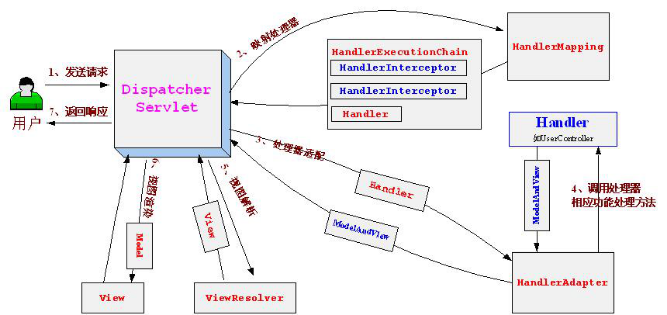

2018/3/6 星期二 下午 13:49:01

# Spring MVC 框架

表现层的轻量级框架，是spring在mvc的一个子产品。大体有两种模式：
一、MVC  ，二、服务到工作者

EzsyUi  echarts

## 流程

核心架构的具体流程步骤如下：


1. 首先用户发送请求——>DispatcherServlet，前端控制器收到请求后自己不进行处理，而是委托给其他的解析器进行处理，作为统一访问点，进行全局的流程控制；
2.   DispatcherServlet——>HandlerMapping， HandlerMapping将会把请求映射为HandlerExecutionChain对象（包含一个Handler处理器（页面控制器）对象、多个HandlerInterceptor拦截器）对象，通过这种策略模式，很容易添加新的映射策略；
3. DispatcherServlet——>HandlerAdapter，HandlerAdapter将会把处理器包装为适配器，从而支持多种类型的处理器，即适配器设计模式的应用，从而很容易支持很多类型的处理器；
4. HandlerAdapter——>处理器功能处理方法的调用，HandlerAdapter将会根据适配的结果调用真正的处理器的功能处理方法，完成功能处理；并返回一个ModelAndView对象（包含模型数据、逻辑视图名）；
5. ModelAndView的逻辑视图名——> ViewResolver， ViewResolver将把逻辑视图名解析为具体的View，通过这种策略模式，很容易更换其他视图技术；
6. View——>渲染，View会根据传进来的Model模型数据进行渲染，此处的Model实际是一个Map数据结构，因此很容易支持其他视图技术；
7. 返回控制权给DispatcherServlet，由DispatcherServlet返回响应给用户，到此一个流程结束。

#### 关于get和post提交 中文乱码

web.xml设置  并导入过滤器EncodingFilter

```xml
     <!-- 设置中文过滤器 -->
    <filter>
   <filter-name>encodingFilter</filter-name>
   <filter-class>com.test.SpringMVC.fiter.EncodingFilter</filter-class>
   <init-param>
    <param-name>encoding</param-name>
    <param-value>utf-8</param-value>
   </init-param>
  </filter>

  <filter-mapping>
   <filter-name>encodingFilter</filter-name>
   <url-pattern>/*</url-pattern>
  </filter-mapping>
```

## xml配置

配置  了解

## 注解配置

由于配置文档的方式太多的配置，3.0后就加入了注解，并只是用注解了。

RequestMapping   和 controller

#### 配置文件

```xml
 <!-- 开启自动扫描 -->
  <context:component-scan base-package="com.test.SpringMVC">
   <!-- 组件过滤   type碰到扫描类型  annotation 注解     -->
   <context:include-filter type="annotation" expression="org.springframework.stereotype.Controller"/>
   <!-- <context:exclude-filter type="annotation" expression=""/> -->
  </context:component-scan>   

  <!-- 开启springmvc注解支持 -->
  <mvc:annotation-driven/>

  <!-- 视图解析器 -->
  <bean id="viewResolver" class="org.springframework.web.servlet.view.InternalResourceViewResolver">
   <property name="suffix" value=".jsp"></property>
   <property name="prefix" value="/"></property>
   <property name="viewClass" value="org.springframework.web.servlet.view.JstlView"></property>
  </bean>
```

### A Controller页面控制器 的 **参数**

+ 405  提交方式不被支持
+ 400 参数不匹配

命名空间：一、分类。二、保证方法上的映射标签不重复。

#### 一、参数是表单提交项。。。

```java
 @Controller    //交由容器管理
 @RequestMapping(value="/yy")
 public class LoginController{
  @RequestMapping(value="/xx"，method={RequestMethod.POST},params={"userName"})
  //method={RequestMethod.POST}  设置提交方式
  //params={"userName","password=123"}   参数必须要求有userName    “！userName”不能有   password参数必须是123
   //value=必填 可省   /xx/yy 来得到具体的方法   /yy*(必须不能是/yy.../..) /yy**(前面有/yy就可以) /*
  public ModelAndView 方法名(参数){} 
 }
 @RquestParam("logiName"，default="张三")String userName //形参与实参的参数名不同时  默认值  张三  
```

#### 二、**参数是对象。。。。**

```java
 @RequestMapp(value="/login2")
 public ModelAndView 方法名(UserBean bean){} 

 //还可以用对象作为参数  但要求是  对象的属性名 与实参参数的表单提交项名字必须相同
```

#### 三、参数是Request  等。。。

```java
 @RequestMapp(value="/login1")
 public ModelAndView 方法名(HttpServletRequest req，RequestResponse response,reqRequestSession session){} 
 //参数顺序可以不同  个数不同 还可以添加其他的 参数
```

#### 四、参数是map集合。。。

```java
 @RequestMapp(value="/login3")
 public String 方法名(Map map){} \
 //返回值  就是跳转的逻辑字段名  向map设置值 相当与就是往 Request里设置值   
 //默认会把参数返回去
```

#### 五、PrintWriter输出流作为参数。。。（用于ajax   但不方便    ）

#### 六、cookie为参数

```java
 @RequestMapp(value="/login5")
 public String 方法名(@CookieValue(value="JSESSIONID") String jsessionid){} 
 //需要操作cookie时  
```

#### 七、Http请求头 作为参数。。。 统计浏览器的使用情况

```java
 @RequestMapp(value="/login6")
 public String 方法名(@RequestHeader(value="User-Agent") String userAgent){} 
 //请求头里的都是可以  显示出来
```

#### 八、restful风格获取数据    以后将

### B。。。页面控制器 **返回类型**

#### ModelAndView

没有设跳转值时  还是以请求路径作为跳转

#### void

将请求路径(/xx/yy.jsp)作为 跳转页面

#### String

反回的字符串 就是  跳转的路径   为空  就同上

支持重定向（return "forward：/xx/yy  "）  和   请求派发(redirect:/xx/yy)

#### map

还是把请求路径作为跳转页面   往map设值  还是同往Request里设值。

## 表单提交项在springMVC中类型转换

### 自动转换的数据类型

#### 1.基本数据类型

包装数据类型、基础数据和数组   会自动完成数据类型的转换

#### 2.简单对象数据类型

把基本数据类型 的封装 的对象  自动默认装 进对象   ，并且名字一样

#### 3.List

必须绑定在bean对象 上  。    必须是  

```java
List li =  New  ArrayList<bean2>（）
```

表单项 必须是 ：

 name="li[n]bean2的属性"  
若List为String 或者包装类泛型：

 name="li[2]"

#### 4.Set

基本同List 但要规定个数     Set set = New HashSet();

在构造器中set.add();添加几次就是几个

表单项 必须是 ：

 name="set[n]bean2的属性"

#### 5.Map

还是要绑定到java对象上去。  Map map = new HashMap（）；  没有数量限制  

表单项 必须是 ：

 name="map[键]bean2的属性"

#### 6. 复合数据类型  （对象中还有对象）

表单项 必须是 ：

 name="bean对该对象的引用.属性名"

### 不能自动转换的

#### 日期数据类型的格式多种

控制为单一种格式，前端控制 正则
**自己写类型转换器**

```java
 class Text extends PropertyEditor{
  public void setAsText (String tet){
   // 改变格式的代码；
   this.setValue(**);
  }
 }
```

+ 属性编辑器（传统方式）：只是针对当前类有效
  
  @InitBinder  //针对该方法所在类才有效
  protected void 方法名随意（WebDataBinder binder）{
   binder.registerCustomEditor(Data.class,
   new CustomDataEditor(new SimleDataFormat（"yyyy-MM-dd"）,true))
  
   binder.registerCustomEditor(Data.class,
   new Text())
  
  }

+ 类型转换器（大家都能用）
  
  class 类名 implements Convert<String , Data>{
  
   public Data 实现的方法 (String tet){
    改变格式的代码；
    return data；
   }
  
  }
  
  ### 

Spring—mvc xml 配置

```xml
 <!-- 向spring容器中的转换服务工具类中，添加新的转换规则 -->
 <bean id="converters" class="org.springframework.context.support.ConversionServiceFactoryBean">
  <property name="converters">
   <set>
    <bean class="org.framestudy.springmvc02.converter.GolbalUtilDateConverter"></bean>
   </set>

  </property>

 </bean>
```

## 文件上传

同理  需要配置  commons-io   和 commons-fileupload 包

enctype="u"

 @RequestParam  必须写

#### 文件上传解析器

<!-- 文件上传解析器  必须为此id -->

<bean id="multipartResolver"  class="org.springframework.web.multipart.commons.CommonsMultipartResolver">
   <!-- 单次文件大小限制  byte -1就没有限制  10*1024*1024 代表10M  -->
   <property name="maxUploadSize" value="10*1024*1024"></property>
   <!-- 单次的单个文件大小   maxInMenorySize：每次读取时 只读取多少字节     -->
   <property name="maxUploadSizePerFile" value="10*1024*1024"></property>
   <!-- 默认字符集 -->
   <property name="defaultEncoding" value="utf-8" ></property>
   <!-- uploadTempDir  表示上传时，的临时文件存放目录，默认采用web容器  的 内存    可以自己修改 -->
  </bean>

#### **单文件上传**

对应的页面控制器 ：

 class File {
  @RequestMapping(value="/yy",method={RequestMethod.POST})
  public String upload(@RequestParam("file01") CommonsMultipartFile file){
   //1.项目内
   //2.本地
   //3.文件服务器
   String dir = "D://files";
   String path = ""; 
   try{
    File fileDir = new File(dir); 
    if(!fileDir.exists() || fileDir.isDirectory()){
       fileDir.mkdir;//创建文件夹
    }
    //File.separator  应对 各个系统  的   斜杠
    path = dir + File.separator + 文件名
    file.getFileItem().write(new File(path));//就完成了临时文件，存储到真实文件的过程
    }
  }
 }

#### 多文件上传

    public String upload( @RequestParam("file") CommonsMultipartFile/MultipartFile[] file){

   String dir = "D://files";
   String path = ""; 
   try{
    File fileDir = new File(dir); 
    if(!fileDir.exists() || fileDir.isDirectory()){
       fileDir.mkdir;//创建文件夹
    }
    //File.separator  应对 各个系统  的   斜杠
    path = dir + File.separator + 文件名
    file.getFileItem().write(new File(path));//就完成了临时文件，存储到真实文件的过程
    }
  }

## 拦截器

+ 类似过滤器
+ 请求来时可以 走时也可以  
+ 有相似的生命周期  
+ 过滤器实现原理是方法回调    拦截器是代理模式  
+ 拦截器是在过滤器第一之后执行的  没有进servlet之前  
+ 只能拦截动态请求
+ 拦截器在应用程序内部完成工作  过滤器是在容器中完成的
+ 可以依赖注入   所以在spring中  优先拦截器

### 定义拦截器

1.实现接口 (HandlerInterceptor)  2.继承

#### 定义拦截器链

spring -mvc xml

```xml
 <mvc:Interceptors>
  <mvc:Interceptor>
   <mvc:mapping  path="拦截的路径">
    <bean class="拦截器的类路径"></bean>
   </mvc:mapping>  
  </mvc:Interceptor>
 </mvc:Interceptors>
```

## 验证

数据格式验证   数据内容验证（一定与后台相关）

#### 格式验证

一般是前端 做 ，但在传输过程中 数据肯能会不安全

spring 的 验证 是 Hibernate 的验证体系

需要做验证的控制器中 方法参数必须为对象   前加注解@  加固定参数参数 BindingResult br 代表验证返回的结果对象

## spirng 的工具类们

### Jackson

整合进了spring 在页面控制器中  不需要再写输出流  

```xml
 <dependency>
     <groupId>com.fasterxml.jackson.core</groupId>
     <artifactId>jackson-databind</artifactId>
     <version>2.9.3</version>
 </dependency>
```

内置转换器  可以不配

@RequestBody（直接从消息体中json获得javaBean 对象）  

@ResponseBody（在消系统中，将javaBean对象以json对象，完全序列化，通过消息体传输给页面）  在页面控制器中使用  通常Jackson 是配合ajax 一起使用的

注意： RequestBody会导致“**延迟加载**    **失败**”     解决  ：1.需要不参与序列化的属性上方使用注解 @JsonIgone  忽略该属性   （不灵活 ） 2. 写过滤器  使用Jackson的核心类，手动完成序列化并且添加对应的 **属性过滤器**

#### 属性过滤器

```java
 class *bean1 { private *Bean2 b}
 @JsonFilter(value="filterbean")
 class *Bean2 {} 

 ObjectMapper om = new ObjectMapper() //jackson 包中的  用于转换对象的
 SImpleFilterProvidertfiler filter = new SImpleFilterProvidertfiler();
 filter.addFilter("filterbean",SimpleBeanPropertyFilter.filterOutAllExcept(,,));//加属性  要序列的
  //SimpleBeanPropertyFilter.serializeAllExceppt(..)//或者  加属性  不要序列的
 om.setFilterProvider(filter);//将过滤规则高速序列化工具

 str = om.writeValueAsAtring(*bean1);
 printwrit.print(str)


 JQuery.params(，true)   序列化一个k/v键值对的对象  常用于数组 的序列化传递   加true 是忽略%号

 $.toJSON()  直接将json对象转为javaBean 传递 
```

## 国际化 语言

#### 配置语言资源解析器

spring mvc xml

```xml
 <!-- 配置语言资源解析类  id 固定为 messageSource 文件类型  propertise -->
 <bean id="messageSource" class="org.springframework.context.support.ResourceBundleMessageSource">
  <properrty name="basename" value="语言文件"/> 
  <property name="useCodeAsDefultMessage" value="true"/>
 </bean>
```

容器在运行后，会把resource 里的文件动态地读取到请求域中（Request）；

 Request.getMssage("键名") 
