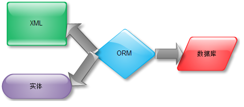

# Hibernate框架 #
2018/2/5 星期一 上午 9:13:39 
## 1.1 概念 ##
概述：ORM全称Object/Relation Mapping,对象/关系数据库映射。是面向对象的框架。而mybatis则是面向sql。

基于orm映射的持戒层框架（全自动）。底层都是jdbc。
#### 为什么用要框架？
1.连接：

- a.连接数量太多；

- b.创建时，由于三次握手，断开，系统性能严重消耗；

- c.jdbc直接连接数据库，就会与数据库的耦合偏高。

2.开发效率：d.真的关系型数据库，会不停提交事务，重复写代码。

MyBatis和hibernate都是轻量级，能独立于容器的。

集中式开发：适用于人员少，功能不复杂，只是增删查改。优势：节点少，节约系统资源。缺点：扩展性不高、可用性不强。并发量：几十。

垂直应用开发架构：功能独立，加功能就新增项目。缺点：建立的数据库连接，核心基本相同，重复代码过多；

分步式服务架构：

#### 企业级应用：
并发支持、事务支持、交互支持、集群支持、安全支持、分步式支持、web支持

## 1.2 解决方案 
#### ejb容器  
会话bean 实体bean 消息服务bean 没用 

- 不能单独测试，只能在容器中（测试麻烦）。
- 数据传输麻烦。
- 推荐面向过程编程

#### pojo（轻量级） ####
不需要放到容器中，可以直接main直接测试。低侵入。免费开源，扩展性高。

## 1.3 Hibernate概论 ##
同为轻量级，采用orm映射，常见的对数据库的操作，封装为方法。
### 1.3.1 ORM ###
1. 数据库表映射类：持久化类被映射到一个数据表 ，当使用一个持久类来创建实例，修改实例属性，删除实例时，系统自动回转换对这个表进行CRUD(增删查)操作。
2. 数据表的行映射对象（实例）：持久化类会生成很多实例，每个实例就对应数据表中的一个特定行的操作。每个持久化对象对应数据表的一行记录。
3. 数据表中的列映射对象的属性：当在应用中修改某个持久化对象的指定属性时（持久化实例映射到数据行），ORM将会转换成对对应数据表中指定数据行、指定列的操作。
4. 

#### hibernate 认为对象有三类   瞬时 持久 游离  都是相对与Session来说的。
工作原理：
[工作原理](img/hibernate1.png)
##### **瞬态** ：
对象由new操作符创建，且尚未与Hibernate Session关联的对象，被认为处于瞬态。瞬态对象不会被持久化到数据库中，也不会被赋予持久化标示，如果程序中失去了瞬态对象的引用，瞬态对象将被垃圾回收机制销毁。使用Hibernate session可以让其变为持久化状态。

##### **持久化**：
持久化实例在数据库中有对应的记录，并拥有一个持久化标识（identifier 即id），持久化的实例可以是刚保存的。也可以是刚被加载的。无论那种，持久化对象都必须与指定的Hibernate Session关联。Hibernate会检测到处于持久化状态对象的改动，在当前操作执行完成时将对象数据写回数据库。开发者不需要手动执行UPDATE。

##### **游离**：
某个实例曾经处于持久化状态，但随着与之关联的session被关闭，该对象就变成游离状态了。游离对象的引用依旧有效，对象可以继续被修改，只是不会同步到数据库中。如果重新让游离对象与某个session关联，该对象会重新转换为持久化状态。

[工作原理](img/hibernate2.png)