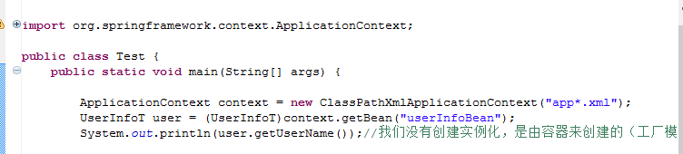

2018/2/28 星期三 上午 9:12:23 

# Spring框架

优点：

1. 低侵入式设计，代码的污染极低（java中看不到,可以轻易替换）

2. Spring容器降低了业务对象替换的复杂性，提高了组件之间的解耦（**最大的优点**，并且降低业务修改的难度）。

3. Spring的AOP支持允许将一些通用任务如：安全，事务，日志等进行集中式处理，从而提供了更好的复用（事务控制。**操作日志的记录**）。

4. Spring的ORM和DAO提供了与第三方持久化框架的良好整合，并简化了底层的数据库访问（除了提供一条龙服务外，还可以自己添加框架）。

5. Spring的高度开发性，并不强制应用完全依赖于Spring,开发者可自由选择Spring框架的部分或全部（同4）。
   
   ## 1、容器（spring IOC）概念
   
   Spring提供了两个核心接口：BeanFactory和ApplicationContext,

其中applicationContext是BeanFactory的子接口。他们的实例都可代表Spring容器，Spring容器是生成Bean实例的工厂，并管理容器中的Bean。

**但一般是把applicationContext的实例作为容器，原因，实例产生的bean 时机不同，BeanFactory是在需要bean时才产生，而applicationContext是在生产容器时，就会产生。**

## 2、IOC配置文件

spring自己有官方文档。  

#### 头部信息

    <?xml version="1.0" encoding="UTF-8"?>
    <beans xmlns="http://www.springframework.org/schema/beans" 
    xmlns:xsi="http://www.w3.org/2001/XMLSchema-instance" 
     xmlns:p="http://www.springframework.org/schema/p" 
    xmlns:aop="http://www.springframework.org/schema/aop" 
     xmlns:tx="http://www.springframework.org/schema/tx" 
     xmlns:mvc="http://www.springframework.org/schema/mvc" 
    xmlns:context="http://www.springframework.org/schema/context" 
    xsi:schemaLocation="http://www.springframework.org/schema/beans
                        http://www.springframework.org/schema/beans/spring-beans-3.0.xsd 
                        http://www.springframework.org/schema/context
                        http://www.springframework.org/schema/context/spring-context-3.0.xsd 
                        http://www.springframework.org/schema/aop
                        http://www.springframework.org/schema/aop/spring-aop-3.0.xsd 
                        http://www.springframework.org/schema/tx
                        http://www.springframework.org/schema/tx/spring-tx-3.0.xsd 
                        http://www.springframework.org/schema/mvc
                        http://www.springframework.org/schema/mvc/spring-mvc-3.0.xsd"> 
            //配置
    </beans>

#### 头部内的配置（即beans间）

    //加载bean    id：可以随便但要贴近类名  class：类的全路径
    <bean id="bean1"    class=  >
        //是通过对象的set方法进行设置的
        <property name="属性名"  value="属性值"  
            ref="属性是对象时用，直接写id  bean2 引用bean2对象为属性值  但不能在有参构造中"  ></property>
    </bean>
    
    <bean id="bean2"    class=  >
        //带参数构造属性赋值
        <constructor-arg  indext="第一个参数就填0"   value="属性值"></constructor-arg>
        <constructor-arg  indext="第n个参数就填n-1"   value=""></constructor-arg>
    </bean>

#### 使用并加载配置

三个ApplicationContext的实现类：

+ FileSystemXmlApplicationContext、作为容器都是一样的，区别：是全路径 

+ ClassPathXmlApplicationContext   相对路径 

+ AnnotataionConfigApplicationContext。   注解配置管理组件

并且默认情况下创建的对象  **是单实例（不是单列，类似map集合通过id为键  对象为值）**

**是每层的基础才用，javabean 是不能。任何有存储功能的对象都不能spring创建 ，应为单实例。**

**接口不能放到容器中管理。接口没有对象，不能被new。**
####依赖注入 di  控制反转（IOC）
#####注入概念
调用者依赖容器设置属性或者注入其他Bean的引用的这种方式，我们通常叫做“**依赖注入**”或“**控制反转（将某种控制丢出去）**”，即springIOC。所谓依赖注入，是指程序运行过程中，如果需要另一个对象协作（调用它的方法，访问它的属性）时，无须在代码中创建被调用者，而是依赖于外部容器的注入。

以前创建对象是程序自己，现在是依靠容器进创建，用两种注入方式返回给程序。

+ 设值注入：IOC容器使用属性的Setter方法来注入被依赖的实例。
+ 构造注入：IOC容器使用构造器来注入被依赖的实例。

**设值注入优点：**

1. 与传统的JavaBean的写法更相识，程序开发人员更容易理解、接受、通过setter方式设定依赖关系显得更加直观、自然。

2. 对于复杂的依赖关系，如果采用构造注入，会导致构造器过于臃肿，难以阅读。Spring在创建Bean实例时，需要同时实例化其依赖的全部实例，因而导致性能下降。而使用设置注入，则可以避免。

3. 尤其是在某些属性可选的情况下，多参数的构造器更加笨重。

**构造也有如下优点：**

1. 构造注入可以在构造器中决定依赖关系的注入顺序，优先依赖的优先注入，常常需要依赖于Datasource的注入。采用构造注入，可以在代码中清晰地决定注入顺序。

2. 对于依赖关系无须变化的Bean,构造注入更有用处。因为没有setter方法，所有的依赖关系全部在构造器中设定，因此，无须担心后续的代码对依赖关系产生破坏。

3. 依赖关系只能在构造器中设定，则只有组件的创建者才能改变组件的依赖关系。对组件的调用者而言，组件内部的依赖关系完全透明，**更符合高内聚的原则**。

***建议采用以设值注入为主，构造注入为辅的注入策略***。对于依赖关系无须变化的注入，尽量采用构造注入；而其他的依赖关系的注入，则考虑采用设值注入。

还有一种  叫**接口注入**  基本没人用。

#### bean范围

默认情况下，在容器中只有一个实例。可以修改。

    <bean id= class= scope="singleton"><>//默认值 

表示每个组件只有一个单独的实例，它的特点：组件实例的整个生命周期，都是有容器负责管理

    scope="prototype" //表示非默认值  原型模式

（类似克隆）。表示在应用程序在发生调用时，容器将按照第一个实例的模型来产生新的实例。它的特点：组件实例由容器负责产生，不负责管理 由jvm负责管理 。

    scope="request" 请求模式 

请求实例与http request相关，一个http request，将在容器中拥有单实例的组件实例存在。组件实例的生命周期 与http request保持一致。

    scope="session" 会话模式

表示组件与http Session相关，每一个Session有一个单实例与之相对，生命周期同。

    scope ="global session" 全局会话模式

通常运用于“服务应用 集群环境下。”。集群做了Session同步，在同一global Session 会话范围内，将产生与之相对的组件实例。  生命周期同

#### 自动注入

前面的注入都是手动。即不需要再去匹配bean组件的属性，而是依照设置的自动注入。

    <bean id= class=  autowire="default" ></bean>
    //默认的   不是自动装配。组件与组件的关系，需要手动完成装配

    autowire=“byName” //按照属性名装配  会按照类中属性名在容器中查找与之相同的id 名  
    没有时是不会报错的 后会空指针  。

    autowire=“byType” //按照属性的类型装配  会取得属性的类型，再回到容器中进行查找，
    与之相同类型的组件   若为接口  则找实现类  若找到一个，正常装配，若找到多个，
    则抛出NoUniquebean。。。。异常  一个都没找到 。。。同上

    autowire=“constructor” //构造注入装配方式  需要我们提供构造器 而不是方法。
    在装配时，按照构造器中参数的顺序依次按照该编byType的方式  完成装配。
**当手动装配和自动装配同时存在时，以手动装配为准。自动装配虽然方便，但结构不清晰。so 若为配置版，推荐手动装配。**

2018/3/1 星期四 上午 9:37:20 

## 3、IOC集合等的配置

很少发生改变的改变的，叫字典数据。可以把这种类单独放在一个类中存储。放在容器中，而不是缓存中。拿出更快

    <bean id= class="字典数据存储类">
        <property name="list">
            <list>
                //bean中包含其他bean，第二个bean别称为，嵌套
                bean，特点由容器负责生命周期，应用程序想要获取它就必须通过get
                <bean id="" class=""></bean>
                <value>  </value>
                <ref  bean="bean 的 id "></ref>
                //此时必须是没有规定泛型时才有三个，
            </list>
        </property>
    
        <property name="list">
            <set>//和list一样  支持三个标签  但不能重复
            </set>
        </property >
    
        <property name="map">
            <map>
                <entry key="" value=""></entry>
                <entry key="" value-ref="其他bean 的 id"></entry>
            </map>
        <property >
    
        <property name="props">//properties 
            <props>
                <props key="" >  值 </props>
            </props>
        <property >
    
        <property name="数组名">//数组  基本同list 但由于类型已定
            <list>
                <value>  </value>
                <value>  </value>
            </list>
        <property >

## 4、IOC注解配置

#### 导入容器管理

1. @Component,
2. @Service, 
3. @Controller.
4. @Repository

这四种注解，将该类交由容器管理，但要开启扫描才能得知这四中注解所描述的java类。

#### 配置扫描

app...xml的操作

    xmlns:context="http://www.springframework.org/schema/context" //先导入包
    
    <context:component-scan base-package="xx.xx"></>
     //在开启spring 容器的自动扫描功能，
    从xx.xx开始扫描包，以及相关的java类 看哪个类使用了 上面四中注解，不定义id 的情况下。
    会以类名的首字小写来作为在容器中的id

#### 配置自动注入

对于要管理的java类的属性

    @Autowired  //只写时  默认byType进行自动注入
    @Qualifier（value="该属性的属性名"） //两者结合才是精准装配

    @Service
    public class SimpleMovieLister {
    
        @Autowired
        @Qualifier（value="movieFinder"）
        private MovieFinder movieFinder;
    
        @Autowired
        @Qualifier（value="movieFinder"）
    public MovieFinder SetMovieFinder（）{}
    
        @Autowired
        public SimpleMovieLister(@Qualifier（value="movieFinder"）MovieFinder movieFinder) {
            this.movieFinder = movieFinder;
        }
    }

以上基本不用 而是@Resource  默认是byName  找不到时再byType 若@Resource（name="byName"）就只会去byName

#### 配置类与注解扫描

定义一个java类  类上Configuration 注解     类代替xml 的作用   为配置类

    @Configuration
    @ComponentScan（basePackage={"xx.xx"}）
    public class MyConfiguration {
    
        @Bean //返回的结果是需要容器管理的bean
        @Scope(value="bean作用域 ： 原型模式等")
        public StringStore stringStore() {
            return new StringStore();
        }
    
        @Bean
        public IntegerStore integerStore() {
            return new IntegerStore();
        }
    
    }

#### 测试类中

    @RunWith(SpringJnuit4**.class)
    @ContextConfiguration(loacation={"classpath:appxxx.xml"})
    @ContextConfiguration(classes={配置类.class})

例子：

    @RunWith(SpringJUnit4ClassRunner.class)
    @ContextConfiguration(locations= {"classpath:applicationContext.xml"})
    public class App {
    @Resource
    BookServiceInter bs = null;
    @Resource
    StudentServiceInter ss = null;

## 5、**AOP**

 功能需求（客户要求）、 非功能性需求 （操作日志 、数据的安全）

AOP就是解决：功能需求和非功能需求的强耦合关系。

**面向切面编程**：每一个非功能性需求都一一对应一个切面，每个切面当需求时，由功能需求对象的代理对象来进行管理。

#### 代理模式

代理对象和真实对象**拥有共同的行为**。！即共同的接口规范。**代理对象有真实对象的引用。**

1. 静态代理：代码中，肉眼可以看到代理类存在的。

2. 动态代理：反之看不到则是。
   
   #### 核心概念
   
   **1.切面：**每一个有业务交叉的，就是一个切面。

**2.连接点：**满足业务插入切面的地点，这个地点可以是方法调用，异常抛出时，甚至是要修改的字段。

**3.通知：**运行在切面上的代码，即为通知。

#### Spring 的AOP

Spring并没有切面类，而是支持的第三方。来完成对AOP的支持。

将一个java类定义成一个切面  @Aspect  例子：

导包：    

    <dependency>
        <groupId>org.aspectj</groupId>
        <artifactId>aspectjrt</artifactId>
        <version>1.8.10</version>
    </dependency>

切面植入包：

    <dependency>
        <groupId>org.aspectj</groupId>
        <artifactId>aspectjweaver</artifactId>
        <version>1.8.10</version>
    </dependency>

开启切面动态代理支持 APPxxx.xml：

    xsi:schemaLocation="http://www.springframework.org/schema/beans
        http://www.springframework.org/schema/beans/spring-beans.xsd
        http://www.springframework.org/schema/context
        http://www.springframework.org/schema/context/spring-context.xsd
        http://www.springframework.org/schema/aop 
        http://www.springframework.org/schema/aop/spring-aop.xsd">
    
    <aop:aspectj-autoproxy/>

定义切面类

    @Component
    @Aspect
    public class Test{
    
    @Pointcut(value="execution(public *  xx.xx.*Imp.*(..))")//精确到方法
    public void exression1(){}
    @Pointcut(value="within(public *  xx.xx.*Imp.)")//精确到类 可定义注解
    public void exression2(){}
    @Pointcut(value="target(或this)(public *  xx.xx.*inter)")//接口的实现类  可定义注解
    public void exression3(){}
    
        //前置通知  运行在目标方法之前 所有的public   xx.xx包下
            所有以imp结尾的类的所有方法 参数数为(..) 即为目标方法。
        @Before(value="execution(public *  xx.xx.*Imp.*(..))")   是aspect 的
        public void before(JoinPoint jp //默认可以有这个参数 代理对象 ){
            //运行在目标方法前
            jp.getTarget();//获取目标对象
            jp.getSigature().getName();//获取目标方法名
            jp.getArgs();//目标方法的参数对象数组
        }
        //后置通知
        @After（value="exression()"）  可以加||   &&   如 exression1() && exression2()
    
        //后置返回通知  操作日志一般在此
        @AfterReturning（value/pointcut="exression()",returning="retVal"//返回结果）
        public void afterReturning(JoinPoint jp ,object  retVal){
            //运行在后置通知后
            retVal即为目标方法返回的数据对象。
        }
        //后置返回异常通知
        @AfterThrowing(value/pointcut="exression()",throwing="th")
        public void afterReturning(JoinPoint jp ,Throwable  th){
            //运行在目标方法抛出异常后  后置通知 后
            retVal即为目标方法返回的数据对象。
        }
    
        //环绕通知  唯一可以修改参数  修改返回的  但少用
        @Around(value="exression()")
        public Object aroundExample(ProcedingJoinPoint jp){
            jp.getTarget();//获取目标对象
            jp.getSigature().getName();//获取目标方法名
            Object[] args = jp.getArgs();//目标方法的参数对象数组
            //修改参数
            args[0] = ...
            //修改返回
            Object obj =  jp.proceed(args); //原方法的返回 
            obj  set ...
            return obj;
        }
    
    } 

## 6、spring自定义注解

#### 6.1创建自定义注解

    @Target(ElementType.METHOD)
    @Retention(RetentionPolicy.RUNTIME) 
    @Documented
    @Inherited
    public @interface MyLog {
    
        String requestUrl() default ""; //可以多个
    
    }

#### 6.2 切面

    public class MyLogAspect {
    
        //切入点
        @Pointcut(value = "@annotation(com.sam.annotation.MyLog)")
        private void pointcut() {}
    
    @AfterReturning(value = "pointcut() && @annotation(myLog)", returning = "result")
        public Object afterReturning(JoinPoint joinPoint, MyLog myLog, Object result) {
    
    //        HttpServletRequest request = ((ServletRequestAttributes) RequestContextHolder.getRequestAttributes()).getRequest();
    //        HttpSession session = request.getSession();
    
            System.out.println("++++执行了afterReturning方法++++");
    
            System.out.println("执行结果：" + result);
    
            return result;
        }

#### 6.3 使用自定义注解

    @RestController
    @RequestMapping(value = "/index")
    public class IndexController {
    
        @MyLog(requestUrl = "/index请求"  //根据类中的 来进行写多少个)
        @RequestMapping(method = RequestMethod.GET)
        public String index() {
            return "index";
        }
    }