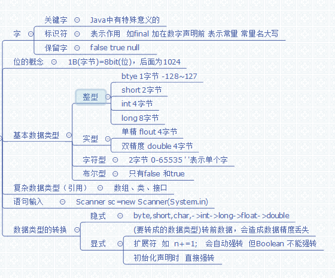

# 第二章:数据类型 
## 2.1 java中的字 ###
#### 关键字 ####
java中有特殊含义的!

常见的50个关键字:
<table>
<tr><td>abstract</td><td>用于修饰抽象类或抽象方法</td>
<td>assert</td><td></td>
<td>boolean</td><td>布尔数据类型</td>
<td>break</td><td>表示switch选择结束,或者循环结束</td>
<td>byte</td><td>数据类型</td></tr>

<tr><td>case</td><td>switch中选项前</td>
<td>catch</td><td>try catch中抓错</td>
<td>char</td><td>基本数据类型,对Unicode</td>
<td>class</td><td>用于修饰类</td>
<td>const</td><td></td></tr>

<tr><td>continue</td><td>结束本次循环</td>
<td>default</td><td>用于接口中实现方法</td>
<td>do</td><td>do whil循环</td>
<td>double</td><td>基本数据类型双精度</td>
<td>else</td><td>if判断中都不满足时执行</td></tr>

<tr><td>enum</td><td></td>
<td>extends</td><td>表示继承</td>
<td>final</td><td>修饰常量或者最终类</td>
<td>finally</td><td>用于try中不管是否有异常,都会执行</td>
<td>float</td><td>基本数据类型</td></tr>

<tr><td>for</td><td>循环</td>
<td>implement</td><td>实现接口</td>
<td>import</td><td>导包时</td>
<td>instanceof</td><td>二元操作符，测试左边对象是否是右边类的实例</td>
<td>interface</td><td>表接口</td></tr>

<tr><td>long</td><td>基本数据类型</td>
<td>native</td><td></td>
<td>new</td><td>用于创建对象</td>
<td>package</td><td></td>
<td>protected</td><td></td></tr>

<tr><td>public</td><td>访问权限,最大同包内</td>
<td>return</td><td>返回</td>
<td>short</td><td>基本数据类型</td>
<td>static</td><td>静态</td>
<td>strictfp</td><td></td></tr>

<tr><td>supper</td><td>表示父类</td>
<td>switch</td><td>条件选择</td>
<td>synchronize</td><td>同步锁</td>
<td>this</td><td>表当前对象</td>
<td>throw</td><td>抛出(new对象时修饰)</td></tr>

<tr><td>throws</td><td>上抛异常</td>
<td>transient</td><td></td>
<td>try</td><td>抓异常</td>
<td>void</td><td>无返回类型</td>
<td>volatile</td><td></td></tr>

<tr><td>while</td><td>循环</td>
<td>int</td><td>基本数据类型</td>
<td>private</td><td>访问权限自由本类</td>
<td>if</td><td>判断语句</td>
<td>goto</td><td></td></tr>
</table>
#### 标识符 ####
起表示作用.;如final加在数字的声明前,就表示常量  一般常量大写.
#### 保留字 ####
false true null
## 2.2 位的概念 ###
8bit(位)=1B(字节)  1B=1024kb  ....  

一位就是0或1   所以byte  就是1字节
## 2.3 基本数据类型
#### 整形(即没有小数点) ####
- byte(一字节):-128~127
- short(两字节):(-2^15)~(2^15-1)
- **注意**:byte 和short类型在java中不存在常量表示法;但可以用对应取值内的int值替换.如(int)127
- int(四字节):(-2^31)~(2^31-1)
- long(八字节):(-2^63)~(2^63-1)  声明后"L"
-  java中没有无符号的byte...,和c语言不同所以不能unsigned int m;
#### 实形(有小数点) ####
- float(单精度,四字节 ):保留8位有效数字,即1234.12345678->1234.12341111,只能保证前面8位数字是准确的.声明后加"f"
- double(双精度,四字节):保留16位有效数字
- 注意:两者对比大小时要注意精度.

		double x = 0.4;float y = 0.4f; x小于y  //因为x中存的是0.4000..到第16位.而y到第八位后就可能不是0了.
		1.2及一下的  是float大于 double
#### 字符型	
char(两字节):对应Unicode码  0~65535 一一对应

	char a = 'a'; 同char a = 97;  char a = '\u0061'; //16进制需要前面加u
	int i = 97;
	char a0 = (char) i;
	char a1 = 'a';
	int i0 = a0;
	int i1 = a1;
	int i2 = 'a';//此时输出 i0 i1 i2 都是97  a0 a1都是a    有时或许要强转
#### 布尔数据类型 ####
就只有 false 和 true
##  2.4 复杂数据类型 ###
#### 数组 ###
数组是一些类型相同的变量组成的集合,称这些相同的变量为数组的元素或单元;划分出一块内存空间用于存放数据,而这个内存空间的地址就是数组名的指向;
#####声明
	一维声明: 数据类型 []  数组名  或者 数据类型 数组名 []
	二维声明:数据类型 [] [] 数组名  或者 数据类型 数组名 [][]
数组的长度length 是数组的属性;
#### 类 ####
String 
#### 接口  ####
## 2.5 数据类型的转换 ###
#### 隐式转换 
即小类型数据向大类型数据转换.

	byte,short,char->int  
	//只要在运算过程中,都是会自动执行这个转为int. 没有int数据类型参与运算也会转为int
	int->long->float->double
	如:  long n = 2;   float f = 2l; doutble d = n;
#### 显示转换(可能造成进度丢失)和运算符转换 ####
常用的强转一般:  (要转换为的数据类型)待转数据   如: 

	int a = (int)2L;
还有比如String 转 数字等,需要的是包装的构造器,自动包装拆包;

运算符强转:

	short s = 1;  
	s= s + 1;//编译错误  
	short s1 = 1;  
	s1 += 1; //此时就会强转为short; 类似的
三目运算:

    byte b = 10;   
    short s = 20;   
    int i = (b == 10) ? b : s;   
    int i1 = 10;   
    String str = "Hello";   
    Object obj = (i1 == 10) ? i1 : str;  // 在这里变量i进行了自动装箱操作  
	//在三目运算符中，会按照算术类型中的提升原则将两端操作提升至统一类型，
	//如果两端有一个操作数是引用类型，则整个表达式结果用Object型表示。
int 转Sting

	int i = 12345;  
	String s = "";  
	s = i + "";  //会产生两个String对象
	s = String.valueOf(i); 	//直接使用String的静态方法。
string转int

    String s = "12345";  
    int i ;  
    i=Integer.parseInt(s);  //直接使用静态方法，不会产生多余的对象，但会抛出异常。
    i=Integer.valueOf(s).intValue();  //相当于new Integer(Integer.parseInt(s))也会抛出异常，但是会多产生一个对象。
## 汇总图 ##
