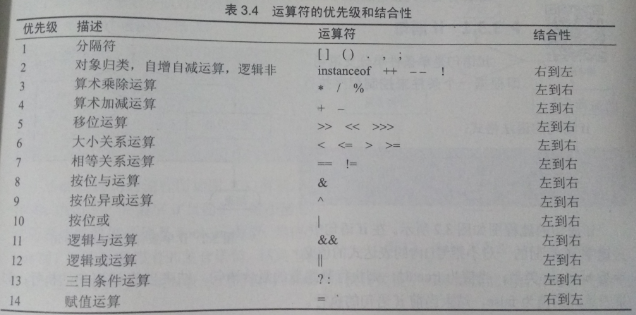
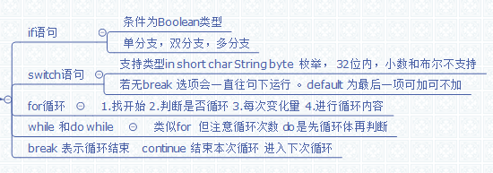

# 第三章:运算符和语句

## 3.1 运算符

#### (一) 算术运算符

加减运算符:+ -  两个二目运算符;操作的元是整形或浮点形,优先级是4级;

乘 除 求余运算符:* / %也是二目运算;操作的元是整形或浮点形,优先级是3级;

#### (二)自增自减

x++(--x):单目运算;操作的元是整形或浮点形的 变量;

#### (三)算术混合运算的精度

1.表达式中有双精度,按双进运算:

    5.0/2+10  返回的结果是double类型的

2.表达式中最高为单精度,返回就为单精度:

    5.0f/2+10  返回就为float

3.表达式中最高是long性,返回long

    12L+200+'a'  返回就是long型

4.表达中最高精度低于int ,按int类型计算

    (byte)10+'a'    和  5/2  返回结果都是int型

**注意**Java中不允许将超出byte,short,char 的值赋值给byte,short,char .

    byte b = (byte)20+'a'
    byte b = (byte)20+'a' //就会报错

#### (四)关系运算符和关系表达式

关系运算符是二目运算符,返回结果为boolean

    <,>,>=,<=   这类的优先级是6
    ==,!=   优先级是7

#### (五)逻辑运算符与逻辑表达式

由于&|有位运算符的意思,一般不会运用到;

&& , ||为二目运算符  表且    和  或  ,!为单目运算,表 非;

其中:'!'的优先级为2;'&&'优先级为11;'||'的优先级是12 

#### (六)赋值运算符和表达式

'='为二目运算符,优先级较低14;从右到左;

#### (七)位运算符

**按为与运算:'&'**二目,即整数型数据,变为对应的二进制,比较 ,对应位上都是1,这结果的对应位是1,否则是0.

**按为或运算:'|'**二目,即整数型数据,变为对应的二进制,比较 ,对应位上都是0,这结果的对应位是0,否则是1.

**按位非运算:'~'**单目,相当于取对应数的二进制的反,1变0,0变1,若操作boolean时,就是似'!'

**按位异或:'^'**二目,两个数据的二进制,比较,同位数是否相同,同则0,否则1.

    a^a=0     a^0=a;
    c=a^b  则  a=b^c  //^的逆运算还是^
    a^b^b==a

#### (八)instanceof运算符

二目运算;左边为对象,右边为类,判断是否是该类的子类,优先级2

## 3.2 语句

1. 方法调用语句

2. 表达式语句 加';结尾的'

3. 复合语句  用'{}'包含的

4. 空语句  即一个';'组成的语句

5. 流程控制语句

6. package语句和import语句:与类对象有关
   
   ### 流程控制语句
   
   #### if语句及分支语句
   
    if (表达式) {
    若干语句
    }
   if语句为单条件单分支语句.
   
    if(表达式){
    若干语句
    }else{
    若干语句
    }
   if-else为单条件双分支语句.
   
    if (表达式){
    若干语句
    }else if (表达式){  //else if 可多个
    若干语句
    }else{ 
    若干语句
    }  
   多条件多分支语句.并且整个语句只会在运行满足要求的路径运行一次后结束.
   
   #### switch开关语句
   
   switch是单条件多分支的开关语句;
   
    switch (表达式) {//可以为byte  short int char(不支持包装类)  枚举  和String(java7支持)
    //类型支持同上并数据类型相同 且不能与后面的常量相同  且常量可以不写
   
        case 常量值1: 
            若干语句 //当表达式的值与常量值相同时运行  完成后向下执行
   
    //不加break 会继续向下执行语句,且不会去判断是否与常量相等    加break后直接调到  '}  '处
   
            break;  
            *n
        case 常量值n:
            若干语句
            break;
        default :  //到这里就会执行
            若干语句
   
    }
   
   #### for循环语句
   
    for (表达式1; 表达式2; 表达式3;) {//表达式2的返回类型必须为boolean.
   
        需要循环的若干语句
   
    }
   执行过程:

7. 运行表达式1,完成初始化

8. 执行表达式2,返回true,进入3步,否进入4步

9. 运行一次循环体中的语句,然后再运行表达式3,后进入第2步

10. 结束for循环.
    
    #### while循环语句
    
     while (表达式) {//返回值为boolean
     循环体的语句
     } 
    执行过程:

11. 计算表达式,true时运行第二步,false运行第三步,

12. 执行循环体语句一次

13. 结束while循环
    
    #### do-while循环
    
     do    {
     循环体的语句
     }while (表达式);
    执行过程:

14. 先执行一次循环体的语句

15. 计算表达式,true时运行第一步,false运行第三步,

16. 结束while循环

#### **break和continue:**

在循环中的意思,break马上停止循环, continue是马上结束本次循环进入下次循环

## 汇总图

