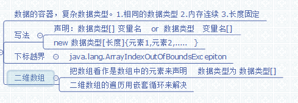

# 第四章：数组

**概念:**数据的容器,

1. 相同数据类型
2. 内存地址连续
3. 长度固定
4. 数组的元素初始化为0
5. length为数组的属性 (String是length()方法)

数组的创建声明请看<第二章数据类型>;

**下标(索引)**:从1开始到数组长度-1,连续

数组的赋值:

```java
//第一种
int [] arr = new int[长度] ;
arr[0] = 1 ....
//第二种
int arr2 = new int[]{1,2,3...}  //不写长度
//第三种
int arr3 = {1,1,12,2...}
```

其中第二和第三种只能在数组声明时使用.

**二维数组:**即是将一维数组看做元素,且这些元素长度可以不同.但是所有的类型必须相同!

#### 有关于数组的遍历

有三种:

```java
int arr = new int[10];
//第一种:循环遍历,常用for循环
for (int i = 0 ; i < arr.lenth ; i++ ) {
    arr[i];
}
//第二种:foreach
for ( int n : arr) {
    n;
}
//第三种:迭代器 Iterator
List list = Arrays.asList(array);
Iterator ite = list.interator();
while (its.hasNext()) {
    its.next(); //itm.remove()  删除当前的元素  对元素集合
}
```

**总的说:**循环只能遍历数组和List集合,迭代器遍历数组要转成集合

## 汇总图

