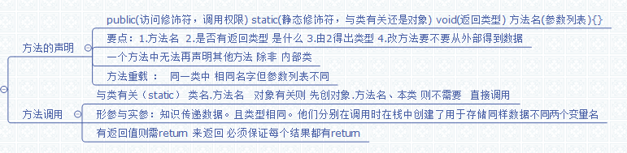

# 第五章：方法(函数)

#### 方法的要素

1. 访问修饰符
2. 是否是静态  是则加static
3. 返回类型 无返回类型这是void
4. 方法名
5. 参数  需要参数 就要在 写出数据类型 和参数名多个用','隔开.不要就不写
6. 方法体中;若有返回类型,必须加  return 数据;  无则选加return  但此时会立刻结束方法

关于参数列表:1.顺序  2.参数名可以不同 但数据类型得相同.

在定义方法时参数列表为形式参数,被调用时传的参数为实际参数.

形参规定调用时传递的数据类型和顺序,实参才是值.

#### 方法调用

**静态的:**直接   类名.方法名(参数)  ,如果是调用本类的方法,可以不写类名;
**非静态:**需要实例对象调用。

#### 方法重载

同一类中,可以有同一方法名,但方法的参数列表不能相同:

1. 参数个数不同
2. 参数类型不同
3. 参数类型的顺序不同.

## 汇总图

