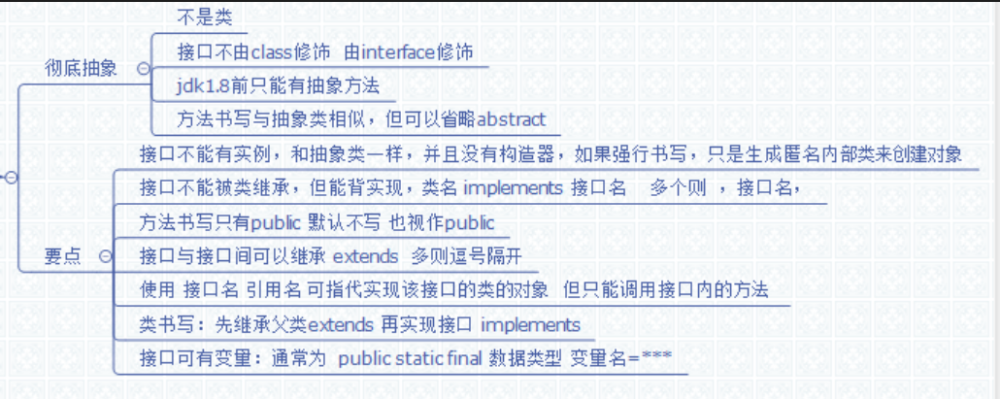

# 第十章:接口 #
彻底抽象,对已有的内容进行扩展,类似抽象类。

特点:

1.	不是类
2.	由interface修饰
3.	在jdk1.8以前,只能有抽象方法
4.	和抽象类的方法类似,abstract修饰,但默认就是,可以不写,并且只能public
5.	常量(只有常量):只能是static修饰的,并且只能public
6.	接口不能有实例,和抽象类一样,强行创建实例,会生成匿名内部类的对象实例
7.	接口不能被继承,但能被类进行类似继承(extends)的实现(implements)
8.	接口可以多实现,类只能单一继承.书写格式 extends ___ implements ____,____
9.	使用接口作应用,只能调用该接口的方法.
## 10.1 接口的实现 ##
	class 类名 implement 接口名
再重写接口的方法

接口的细节说明:望文生义,文档注释
## 10.2 接口回调 ##
		接口名 引用  = 接口的实现类对象	
接口无法调用非接口内的方法

	接口名 引用 = new 接口名(){
	重写接口方法(即实现接口的匿名内部类的类体)
	
	}
## 10.3 理解接口 ##
为什么用接口?

1.	即可可以抽象出重要的行为标准,该行为标准用接口方法来表示
2.	接口回调后,即体现该类根据接口里的行为标准给出的具体行为.
3.	开闭原则:即对扩展开方,对修改关闭
## 10.4 接口参数 ##
接口方法参数应该希望类型为double,这样可以向里传byte int long double了

若参数为一个接口,我们就可以将任何实现该接口的实现类传进去.
## 汇总图 ##
