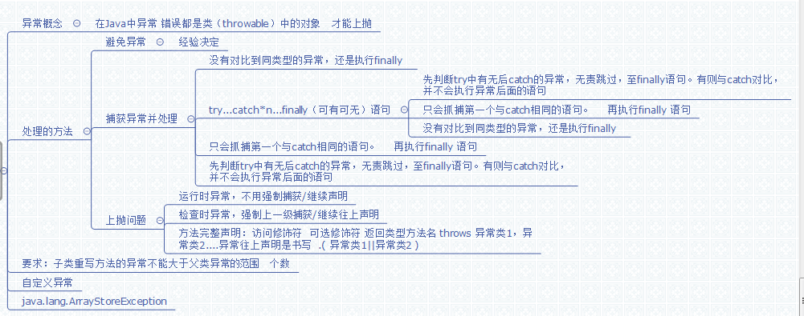

# 第十一章:异常处理 #
## 11.0 异常类 ##
万物皆对象.异常也是类
	
	Object 的子类Throwable
	Throwable的两个子类 Error(错误) 和 Exception(异常)
	Exception 的两个子类 RunTimeException(运行时异常) 
		和 CheckedException(非运行时异常)
当程序被异常终止时,实际上是JVM抛出了一个异常,但没有处理.过程:

谁调用(异常位置)->main->jvm(产生异常对象)->jvm无法处理,原路返回

## 11.2 try-catch语句 ##
	try{
	 可能发生异常的语句
	}catch (异常类名 引用) { //可以有0到多个 当上面语句的异常与异常类相同时执行
	
	} finally{ //可以有0或1个 并且只要进入了try 本段必会执行
	
	}
详解:

1.	避免异常(经验,如获取数据就判断是否是空或者 "")
2.	捕获异常并处理
3.	抛出(往上)
4.	catch后()内可以用父类,但父类必须能被抛,即只有Throwable及两个子类可以本抛出
5.	在try 中,抓住了异常后,不会再执行异常后面的代码.原因:异常出现后,立即执行catch,并忽略后面的代码,
## 11.3 异常分类 ##
即RunTimeException(运行时异常) 和 CheckedException(非运行时异常)

运行时异常,不会强制处理,只有非运行时异常才会,并且try应该只用于非运行时异常,因为耗用大量的资源.
## 汇总图 ##

