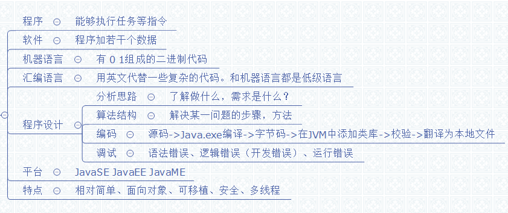
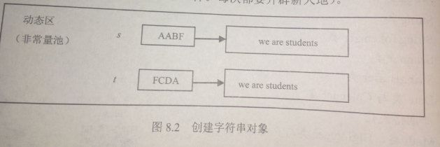
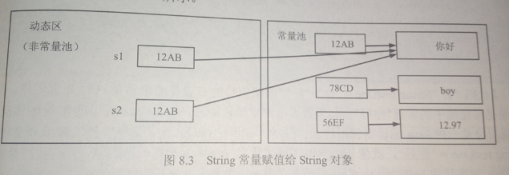
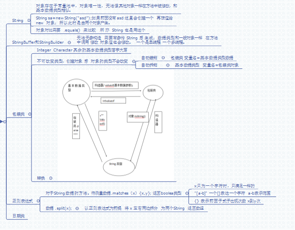

# 第十二章：常用类 #
## 12.1 String类 ##
### 12.1.1 构造String ###
#### 常量对象 ####
String常量也是对象,java把用户程序中的String常量放入常量池中,因为String常量是对象,所以也有自己的引用和实体,常量池在**堆**中,例如 "java","3.14"

	String a = "java";  //此时"java"就是常量  a是指向常量的引用

**常量池:**常量池中的数据在程序运行期间再也不允许改变.

#### String对象 ####
用户无法输出String对象的引用!!!**对象的创建**:

	String b = new String("java");
	//此时若上文中没有"java"常量,则先会产生一个"java"常量对象,后在产生String 对象  共两个
	
	char [] c = {'j','a',v'','a'};
	String C = new String(c);
	
	char [] d = {'1','2','3','4','5','6','7'};
	String D = new String(d,2,4);  //2索引  4多少个
	等同于:
	String D = new String("3456");
**此时对象在动态区(非常量池)!**

#### 引用String常量 ####
	String s1 , s2 ;
	s1 = "你好"
	s2 = s1;

由于用户无法知道常量池中"你好"的地址引用,实际是把s1的引用给s2
### 12.1.2字符串的并置 ###
即字符串的加法:
	
	String o = "java"
	String a = "jav";
	String b = "a";
	String ab1 = a+b;
	String ab2 =  a+b;
	String ab3 = "jav"+"a";
	String ab4 = a +"a";
	//此时  
	一.ab1和ab2是两个不同的 String 对象
	二.o 和 ab3 指向的是同一个 String常量对象
**结论:全是String常量引用的"+"  生成的才是常量.只要有String对象引用参与"+"就会参数不同的String对象**
	
此时常量池中产生了三个对象:"jav","a","java";若先有"java",就不会创建新的.
### 12.1.3String类的常用方法 ###
#### public int length() ####
返回String的长度
#### public boolean equals (String s) ####
比较字符序列(值)是否相同
#### public boolean startsWith(String s) ####
判断String是否是有参数String开头
#### public int compareTo(String s) ####
判断字符串大小(Unicode码),首开始,同 0 , 大 正 ,小 负,
#### public boolean contains(String s) ####
判断是否有参数String,"java" 有"a"
#### public int indexOf/lastIndexOf( String s) ####
返回第一次或最后一次,出现参数String的索引.无则返回-1
#### public String substring(int n)/(int start ,int end) ####
返回String新对象,从索引 ,到最后,或者到end-1
#### public String trim() ####
去掉前后空格,返回新对象
### 12.1.4 字符串和基本数据类型的相互转换 ###
	String n = "123";
	int x =Integer.parseInt(n);
通过包装类转换,还有byte short long float double 都是一样的.

包装类的valueOf(..),转为String,新能高.但常用  +""

main方法中的args[]  其实可以接受用户的键盘输入.在java虚拟机上运行java文件 后输入.
### 12.1.5 字符串与字符数组,字节数组 ###
#### 字符串与字符数组 ####
	char[] a = new char{不小于(end-start)}
	String对象 .getChar(int start,int end ,a,int n)
	//n:数组哪个位置开始放,start开始处索引,end结束处索引(不包含)
	
	char[] b = String对象.toCharArray();

#### 字符串与字节数组 ####
**创建String对象**:String(byte[] ,int off ,ing lenth),从off下标开始,取length个,构造对象

**String转byte[]**:byte根据机器的编码集而定,汉字两个字节

	String对象.getBytes();默认编码集
	String对象.getBytes(String 编码集名);设置编码集(要try)

可以将String与数组配合加上算法,加密.
### 12.1.6**正则表达式** 
#### 正则判断 ###
String.matches(正则字符串)

	[] //一个字符
	{}前面一个字符出现的次数
	+ ->{1,}  //一次到多次
	* ->{0,} //零次到多次
	? ->{0,1} //零到一次
	[^3] 不能是3 
	^[3]以3开头
	[2]|[3]2或3

pattern类
####拆分 ###
split(正则)  返回String数组
## 12.2 StringTokenizer类 ##
构造器:

	StringTokenizer st = new StringTokenizer(String s)
	//将String默认按空格符,换行符,回车符,tab符,进纸符进行分割
	StringTokenizer st = new StringTokenizer(String s,"指定的符号")
	//按指定的符号分割,且可以多个:如"#$"即按照#或者$分割

StringTokenizer的用法类似与迭代器

	st.nextToken();当前第一个 用循环
	st.countTokens();当前个数
	st.hasMoreTokens();是否有下个
## 12.3 Scanner类 ##
用法类似于StringTokenizer
## 12.4 StringBuffer和StringBuilder  ##
两者方法基本相同,但前者线程安全(运行慢),后者单线程(反应快).但都是对象.不在常量池中.

	构造器:
	StringBuffer();//默认产生一个存放16个字符的对象
	StringBuffer(int size);//生成可以从存放size个字符的对象,超过时,容量会自动增加
	StringBuffer(String s);产生一个存有s的对象,容量是s的长度加16
###  常用方法 ###
	StringBuffer sb = newStringBuffer();
	sb.length();返回当前对象的字符串长度
	sb.capacity();;当前对象的容量
#### append方法 ####
	sb.append(String s);(int n);(Object o);...
	//都是将参数转化为String对象,加在sb对象的字符序列中,返回sb引用
#### public char charAt(int n)  和 public void setCharAt(int n ,char ch) ####
1.	得到sb对象上n(索引)位置上的字符.
	.	改变...为ch
#### StringBuffer insert (int index,String str) ####
	sb.insdext(,)
将指定的字符串加到对应的index位置上
#### public StringBuffer reverse() ####
将字符序列倒序;返回引用
#### StringBuffer delete(int start,int end ) ####
删除下标start到end-1的字符序列.deleteCharAt(int index);删除当前下标的
#### StringBuffer replace(int start,int end ,String s)  ####
将下标start到end-1的字符序列替换为s.
## 12.5 日期类 ##
#### data类 ####

	Data da =new Data();//返回当前的时间,并格式为外国的
	
	long l = System.currentTimeMillis();
	Data da =new Data(long l);//句1970年 ,还是外国格式
	
	SimpleDateFormat df = new SimpleDateFormat("yyyy-MM-dd HH:mm:ss");//设置日期格式
	df.format(da);

**格式化日期 String-->Date 或者 Data-->String**

```java
SimpleDateFormat sdf = new SimpleDateFormat("yyyy-MM-dd"); 
Date date = sdf.parse("2009-11-04");//String-->Date 
String sdate = sdf.format(date );// Data-->String 
```
## 汇总图 ##
