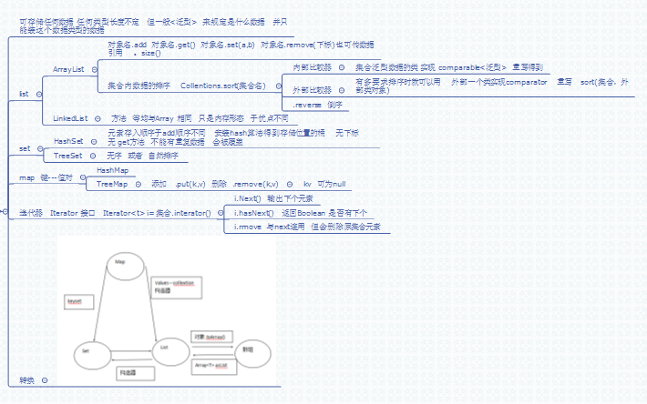

# 第十三章:集合(上) #
做集合基本运用与介绍
## 13.1 集合定义 ##
可存储任何类型,长度不定的集合.
常用:List Set Map
## 13.2 List ##
List(抽象类):两个子类 ArrayList  和 LinkedList

1.	ArrayList按照数组的存储方式来创建的(即内存连续),LinkedList是按照链接的方式创建的(双向链表)
	.	ArrayList查询相对快,修改相对慢.LinkedList反之.
#### 方法 ####
	添加单个数据:add(数据)
	添加单个数据到指定位置:.add(数据,索引位置)
	
	取出数据:get(索引),,返回Object
	修改指定下标:set(下标,数据)
	
	删除指定下标:remove(下标)
	删除指定数据:remove(数据)
	//有时数据类型的数据,就不清楚是按下标还是数据删除了.
	先把数据保存到变量引用中,参入
	
	得到长度:.size();
#### 排序方法 ####
```java
Collections.sort(要排序的集合引用)
//内部比较器,泛型类实现Comparable接口,
重写compareTo方法

Collections.sort(要排序的集合引用,比较器对象)
//比较器类实现Comparator接口,重写compare方法

//返回正数  就要换位置  
```
**注意:Collections是工具类,Collection是集合的父接口**
## 13.2 Set ##
Set(与List同父接口Collection)两个子类:HashSet 和 TreeSet,数据不能从发,并且若新数据同,**是不会添加进来的**.

**HashSet**:按照Hash算法表排序,与添加顺序无关.无get方法,无下标

**TreeSet**:按照自然顺序排列,与添加顺序无关,可以为空.
## 13.3 Map ##
Map与Collection同级接口.是键值对.

键是set集合,不能重复,若键同,值不同,会覆盖老的值.k和v可以为空

	put(k,v)  //添加
	remove(k); //删除
## 汇总图
