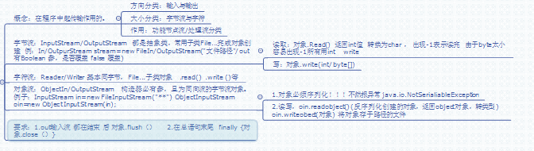

# 第十四章:I/O流

## 14.1 Properties类

    Properties pp = new Properties();
    pp.setProperty(k,v);//k v 为String    
    pp.getProperty(k);//通过k获取v
    pp.remove(k);//删除k对应的v
    pp.setProperty(k(old),v(new));修改k对应的V
    pp.stort(new FileOutOfStream("路径.文件名.properties"),"编码集"(可不写))
    pp.load(new FileInputStream("同上"),)

## 14.2 File类

```java
File (String filename);
File (String 文件路径,String filename)
File (File 文件目录,String filename);

获取文件属性方法:
对象.getName();
.canRead();
.canWrite();
.isFile(); //判断是否是一个普通文件,而不是目录
...
对象.mkdir(); //创建一个目录,成功则返回true
```

## 14.3 流分类

在程序中传输数据;

#### **方向分**

输入和输出  **输出流都要踹一下 .flush()   所有的流都要关**  

#### 大小分

字节(byte)和字符流(2byte)

#### 功能分

节点流和高级流

## 14.4 字节流

InputStream 和 OutputStream   都是抽象类,用子类完成.

```java
InputStream a = new FileInputStream("路径");
a.Read();//返回是int byte大小  可能是-1 就会停止,
OutputStream b = new FileOutputStream("路径',boolean);//true接后面写,false直接覆盖
b.wreite(int n ) ;
b.wreite("汉字输出".getBytes("UTF-8"))
a.write(byte[])
```

## 14.5 字符流

Reader 和 Writer 都是抽象类,用子类完成.

例如 FileReader/Writer("地址")

## 14.6 缓冲流

BufferedReader  和 BufferedWriter

```java
FileReader fr = new FileReader("");
BufferedReader br = new BufferedReader(fr);

FileReader称为底层流
BufferedReader称为上层流
关时,先上层,
```

## 14.7 随机流

RandomAccessFile,不是字节输入输出流的子类;但它既可以做输入也可做输出.即当对一个文件进行读写操作时,只需要一个对象

```java
RandomAccessFile ra = new RandomAccessFile(String name,String mode);
//文件名name决定流的源,流的目的地,mode决定流的访问权利.

RandomAccessFile ra = new RandomAccessFile(File file,String mode);
//file决定流的源,流的目的地,mode决定流的访问权利.
```

**RandomAccessFile指向文件时,不刷新文件**

## 14.8 数组流

流的源和目的地除了文件外还有计算机内存,数组流是将数组作为源和目的地.

字节数组流:ByteArrayOutputStream  ByteArrayInputStream

    ByteArrayInputStream(byte[] bys);
    ByteArrayInputStream(byte[] bys,int offset,int length);
    //从offset开始  length个
    
    ByteArrayOutputStream();//默认32个缓存区
    ByteArrayOutputStream(int size);

字符数组流:CharArrayReader 和 CharArrayWriter

## 14.9 数据流

DateInputStream 和 DateOutputStream 读取数值时,不必关系这个数值应该多少个字节;即每个数据长度不需要关心;

    DateInputStream di = new DateInputStream(InputStream is);
    DateOutputStream do = new DateOutputStream(OutputStream os);

## 14.10 对象流

**用流传输的对象必须实现Serializable**

ObjectInputStream 和 ObjectOutputStream

    ObjectInputStream di = new ObjectInputStream(InputStream is);
    ObjectOutputStream do = new ObjectOutputStream(OutputStream os);
    
    .writerObject(对象引用);
    .readObject();

## 汇总图

