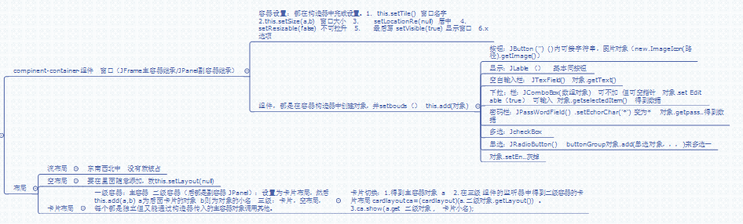

# 第十五章:图形界面 #
## 15.1 Java Swing概述 ##
GUI图形用户界面:用户和程序之间可以方便的进行交互.Java的java.awt包提供了许多用来设计GUI的组件类.和java.swing包

#### 容器类(Container) ####
#### 组件类(Component) ####
java.swing包中的JComponent类就是java.awt包中Container类的直接子类;是java.awt包中Component的间接子类.

-	java把Component类的子类和间接子类创建的对象称为一个组件.
-	java把Container类的子类或间接子类创建的对象称为一个容器.
-	可以向容器中添加组件 ,Container类提供了一个public方法add(),
-	容器的removeAll(),移除全部组件.
-	容器本身也是一个组件,隐藏可以把容器添加到另外一个容器中.
-	每当容器添加新的组件或移除组件时,应当让容器调用validate()方法.以保证容器中的组件能正确显示出来.

#### 结构 ####

	Component类的子类:Container类
	Container类的子类: JComponent类 和 Window类
	
	JComponent类子类:JButton ,JTextField,JTextArea,JTree,JPanel

	Window类:Frame(JFrame),Dialog(JDialog)
## 15.2 窗口 ##
Java提供的JFrame类就是底层容器,即通常的窗口,不允许将窗口添加到其他容器中,因为默认会出现在屏幕上.

	JFrame();// 创建一个JFrame对象,无标题的窗口.
	JFrame(String name);//创建一个name的标题窗口.
	
	setBounds(int a ,int b, int width , int height);
	setSize( int width , int height);
	setLocation(int a ,int b);
	//设置窗口位置(a,b),离左a,离上b,width 窗口的宽,height,窗口的高.

	setVisble(boolean a);//设置窗口是否可见,默认不可见
	setResizable(bookean a);//实在窗口是否可调整大小,默认可以

	dispose();//撤销当前窗口,并释放当前窗口有用的资源.
	setDefaultCloseOperation(int 常量);
	//即点击了关闭图标的效果,EXEIT_ON_CLOSE  结束窗口所在的程序.
### 菜单条,菜单,菜单项 ###
JMenuber,创建菜单条.容器的set方法添加.

JMenu,创建菜单,对象就是一个菜单.

JMenuItem,的对象就是一个菜单项;
## 15.3 常用组件和布局 ###
### 常用组件 ###
1.	JTextField 文本框(单行文本)
2.	JTextArea 多行文本
3.	JButton 按钮
4.	JLable 标签
5.	JCheckBox 复选框
6.	JRadioButton 单选按钮 
7.	JComboBox 下拉列表
8.	JPasswordField 密码框
### 常用容器 ###
主要:JPanel,组件可以添加到里面,在把JPanel加如进窗口.默认布局为FlowLayout布局.
### 布局 ###
**主要:**NULL布局,即指定位置.

	容器对象.setLayout(null);
#### **卡片布局** ####
	//创建一个容器作为显示框.
	JPanel con = new JPanel();
	
	//创建CardLayout对象
	CardLayout card = new CardLayout();

	//设置容器为卡片布局	
	con.setLayout(card);
	con.add(String id , Component b);//添加要显,容器或组件.
	con.show(id);//即显示id所对应的;

结构:主容器(相当于相框,默认布局)为一级,设置卡片布局的容器为二级,被添加进卡片的容器为三级.

一级容器有二级容器的对象引用,二级容器有三级容器的对象引用.运用时,只需把一级容器对象,传给后面即可,**还有,方法的参数,为final**
## 15.4 事件处理 ##
### 事件的处理模式 ###
#### 事件源 ####
能够产生事件的**对象**称为事件源,如文本框,按钮等
#### 监听器 ####
需要一个对事件源进行监听,以便对发生的事件做出处理.事件源通过调用相应的方法将某个对象注册为自己的监视器.如

	.addActionListener(事件监听器对象);
#### 处理事件的接口 ####
监视器是一个对象,为了处理事件源发生的事件,监视器对象会自动调用一个方法来处理事件.这方法,就是接口的方法,重写.
### 事件 ###
#### ActionEvent事件 ###
用户按了回车,Java运行环境就会产生一个该对象.即触发改事件.

文本框,按钮,菜单项,密码框,和单选按钮都可以触发的事件.
#### ItemEvent事件 ###
选择框和下拉框可以触发的事件.

用户选择某个选项就会触发该事件.
#### DocumentEvent事件 ####
改变文本区的内容时,产生事件.
#### MouseEvent事件 ####
在事件源上操作鼠标,就会产生事件.
#### 焦点事件 ####
组件用  ( .addFocusListener(焦点事件对象);)注册测监听器.

从无输入焦点变为有输入焦点.
#### 键盘事件 ####
当一个组件处于激活状态下,用键盘,产生事件.
#### 窗口事件 ####
JFrame是Window的子类,凡是Window的子类对象都可以发生WindowEvent.
### 适配器 ###
单一原则.这里,就是将实现事件接口的类,添加到事件监听器中.
## 汇总图 ##

