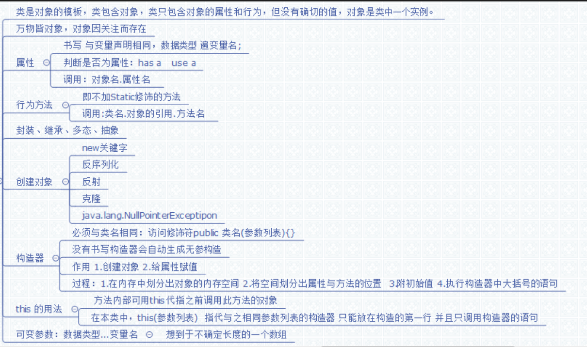

# 第六章：类与面向对象思想

## 6.1 编程语言的阶段

+ ooa面向对象分析

+ ood设计

+ oop编程
  
  #### 面向机器语言
  
  即使用机器语言编程,就是面向机器语言.通俗的低级语言都是面向机器语言编程;
  
  #### 面向过程语言
  
  例如c语言就是面向过程编程。关系问题域是如何解决,重点是步骤。
  
  #### 面向对象语言
  
  面向对象编程；万物接对象，对象应关注而存在。讨论该事件中出现的事务有那些分类；

将具有共点（属性、行为）的对象抽取出类的概念；据不同的观点（属性和行为不同）来区别不同类型；

**类与对象的关系：**

- 类是对象的模板

- 类包括对象

- 类包含属性和行为，只是没有准确的值；

- 对象则是该类中的一个实例
  
  #### 面向对象的特性（java语言的特点）

- **封装性**

- **多态性**

- **继承性**

- **抽象**（可以有，也可以认为是继承中的）
  
  ## 6.2 类
  
  类是java语言中重要的“数据类型”.类包含两个部分:类声明和类体:
  
    class 类名 { //类型声明   class关键字
    类体的内容
    }
  
  #### (一)类声明
  
  必须class关键字修饰,;类名首字大写(驼峰命名法)
  
  #### (二)类体
  
  类的目的是抽象出一类事物共有的属性和行为,并用一定的语法格式来描述所抽象出的属性和行为.类声明后的“{”“}”以及他们间的内容为类体;

- 变量的声明(属性):用来存储属性的值

- 方法的定义(行为):方法可以对类中的属性进行操作,即给出算法
  
  #### (三)成员变量
  
  一.成员变量的数据类型:可以是java语言中任意的数据类型;

二.成员变量的有效范围:只要是在该类中,都有效.有效性与先后位置无关.

#### (四)方法

一.方法头:访问修饰符     返回类型   方法名 () {} 构成;     返回类型可以是java中任意的数据类型.()中有参数就添加。

二.方法体:{}内的就是方法体.方法中声明的变量和方法参数被称为局部变量;和类的成员变量不同,局部变量只在方法内有效。

三.区别成员变量和局部变量:如果成员变量和局部变量名字相同,那么成员变量会被隐藏.即该成员变量在这个方法中短暂失效.若想用,需要"this"关键字.调用.

四.局部变量没有默认值:成员变量有默认值,局部变量没有默认值;

## 6.3 构造方法和对象的创建

#### (一)构造方法(构造器)

构造方法是类中特殊的方法;类中构造方法名字必须与类名完全相同,而且没有返回类型.若类中没有书写构造方法,则自动会默认有一个无参数的方法.

若写了一个或者多个构造器,将不会提供无惨的构造;

#### (二)创建对象

对象的创建有四种:

1. new关键字 + 构造器
2. 反序列化
3. 反射 (用得非常多)
4. 克隆

保存对象:

    类名 引用名 = 创建的对象.

对象的内存模型:

1  声明时的内存模型:引用,并没有数据;此时为空对象,不能使用

    Students stu ;   //此时stu内是没有数据.只有一个指向内存空间的引用.

2  为对象分配变量后的内存模型

    new Students () ;
    //第一步:为Students中的属性划分内存在空间,然后执行{}中的语句,初始化,.若没有为成员变量赋值,
    则会对之默认值.基本类型,外的引用类型为null;
    
    //完成一后,计算出一个引用的值(内存地址,和相关信息)
    stu = new Students();

完成后,为成员变量赋值的数据只能由stud这个实例来管理,调用.

**关于栈(stack)和堆(heap):**都是java用来存放数据的地方.对象的引用存在栈中,对象的实体在堆中,没有归属的数据都是在栈中,如:基本数据类型的局部变量.**栈**的优点:存取速度笔堆快,缺点:存在栈中的数据大型与生存周期必须是确定的,缺乏灵活性.
**堆**的优点:可以动态分配 内存大小,生存周期也不必事先告诉编译器.而**java垃圾回收机制(system.gc(0)),**回收掉不再使用的数据.(即没有引用指向的堆中的对象).
####(三) 对象的使用 ####
抽象的目的是产生类,而类的目的是创建具有属性行为的对象.对象可以调用属性,和方法.即(对象引用.属性/方法名)使用.

#### (四)对象的引用和实体

- 避免使用空对象:程序出现异常(NullPointerException),由于对象以动态得被分配实体,所以java编译器不对空对象做检测.

- 结论:一个类声明两个对象,如果有相同的引用,二者有完全相同的变量(实体)
  
  Students stu1 = new Students () ;
  Students stu2 = stu1;
  //此时stu1 stu2的引用指向的是同一个对象实例,一改则全改
  
  ### 参数传值
  
  参数都是传值.意思就是方法中的参数变量值的调用的指定值的拷贝,对参数修改不会对原始数据更改,**如果是对象,**由于是对象的引用,还是指向同一个对象实例.
  
  int a = 10;
  Test.add(int a){
     a += 1 ;//此时a就是11  但方法外的a还是10  ;
  }
  
  ### 可变参数
  
  方法名 (数据类型 ... 变量名){//此时形参变量名指代的是一个数组,由于不知道
  
  }
  //而实参则是,一个个的数据类型的数据.
  
  ## 6.4 对象的组合
  
  一个类的成员变量可以是java的任何类型,所以也可以是一个类.
  
  class Teat1{
  
  }
  class Test2{
  Test1  t1;
  int num;
  }
  
  ## 6.5 实例成员和类成员
  
  类体中包含成员变量声明和方法的定义;而成员变量有可以细分为**实例变量**和**类变量**
  方法细分为**实例方法**和**类方法**

类变量:又叫静态变量,即被static修饰的.反之就是实例变量.

区别:

1. 不同对象的实例变量不同.
2. 所有对象共享类变量
3. 通过类名直接访问类变量

类方法基本同变量,是否被static修饰

区别:

1. 对象可以调用实例方法和类方法

2. 类名调用只能是类方法
   
   ## 6.6 方法重载
   
   java中有两种多态的表现:重载和重写(继承中)

同一类中,可以有同一方法名,但方法的参数列表不能相同:

1. 参数个数不同

2. 参数类型不同

3. 参数类型的顺序不同.
   
   ## 6.7 关键字this
   
   this常用与实例方法中,指代当前调用本方法的对象.

this(参数),表示本类的其他的构造器;一般用着构造其中,只是指调用其他构造器的语句.且只能放在构造器中第一句的位置.所以只能调用一次;

## 6.8 包和import

略

## 6.9 访问权限

所谓访问权限:是能否通过'.'来调用自己的变量或方法.

1. public (本工程类都可访问)

2. protectted (本包+外包的子类  不能修饰类)

3. 什么都不写 (本包内)

4. private (用于属性私有化,只在本类中能调用  不能修饰类)
   
   ## 6.10 基本数据类型的包装类
   
   int对Integer  char对Character  其他的都是首字大写
   
   ## 5.11 对象数组
   
   把对象实例看做是数组的元素.

## 汇总图

