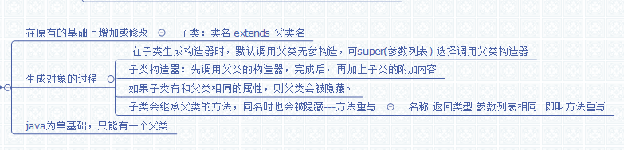

# 第七章：继承 #
在原有的继承上修改或增加,从而得到新的类;Object类是所有类的父类.每个类出Object外都**只有一个父类**,可以**有多个子类**
	
	class 子类名 extends 父类名 {

	}
## 7.1 子类的继承性 ##
子类实例有一部分是自己声明和定义的,也有一部分来着父类的继承.

创建子类对象时,不会产生父类对象.只是在创建子类对象时,将父类的内存加载到子类中来.

**new 构造器()  创建对象过程的说明:**

1.	在内存中划分出对象区域
2.	在划分出父类成员变量的内存区域,并初始化赋值
3.	划分出该类自己定义的成员变量内存区域,并初始化赋值
4.	执行本构造器的语句

#### 子类和父类在同一包中的继承 ####
子类不会继承父类的private修饰的属性和行为为自己的.
#### 子类和父类不在同一包中的继承 ####
只继承public和protected修饰的属性和行为.
#### 对protected的说明 ####
1.	对与子类D直接声明的protected属性和变量,只要和它在同一包中就可以调用.
2.	对应子类D从父类继承的protected,要追溯到这些**protected所在的祖先类**,若A类和此祖先类同包,则可以在A类中调用D类的继承protected;
## 7.2 成员变量的隐藏和方法重写 ##
在编写子类时,仍然可以声明成员变量,而且所声明的成员变量名字可以和父类继承来的成员变量名相同(数据类型可以不同),此时子类会隐藏所继承过来的成员变量.

**注:**子类继承的方法只能操作子类继承和隐藏的成员变量.子类新定义的方法可以操作继承和新声明的成员变量,无法操作隐藏的成员变量(需要用到supper关键字,操作隐藏成员变量)

那么向上转型后呢?

	public class Test extends Test0 {
	int a = 2;
	int getAA() {
		return a;
	}
	public static void main(String[] args) {
		Test0 t = new Test();
		System.out.println(t.getA());//此时是1  若重写getA后调用的就是重写后的就是2
	}
	}
	class Test0 {
	int a = 1;
	int getA() {
		return a;
	}
	}
#### 方法重写 ####
重写可以隐藏继承的方法(方法重写也称为方法覆盖)**(不能重写父类的构造方法)**

**重写规则:**指子类定义一个方法,这个方法的**类型**和父类方法类型一致或者是父类方法类型的子类,并且**方法名字**,参数的**个数和类型**相同,并且访问修饰符,不能比父类的范围小

**重写目的:**子类通过重写可以吧父类的状态和行为改为自己的状态和行为.
## 7.3 supper关键字 ##
子类一旦隐藏了继承的成员变量,那么子类的实例就不再拥有该变量.该变量由supper关键字所有.
方法也是一样.   supper.变量名  或 方法名  来调用.

supper(参数),同this类似,(默认调supper())只能一次且与this(参)也都是必须在第一行.指该调用构造器的语句.
## 7.4 final关键字 ##
修饰类   该类就不能被继承 即不能有子类;

修饰方法  那么该方法就不能被子类重写

修饰常量 若成员变量或类变量被final修饰  就是常量, 不能被修改.
## 7.5 向上转型 ##
即子类的实例  被父类的引用指向.

而此时向上转型后得到的对象有的属性和方法只是,父类**继承过去的变量,隐藏的变量,继承或重写的方法**,而子类自己新增的变量,方法无法被调用.(即精度丢失)

1.	不要将父类创建的对象和子类向上转型的对象混淆
2.	可以将已经向上转型的对象在向下转型为子类对象,此时该实例具备完整的属性和功能.
3.	不能将父类创建的实例引用给子类.
4.	如果子类重写了父类的静态方法,那么上转型后,调用的还是父类的静态方法.

## 汇总图 ##
