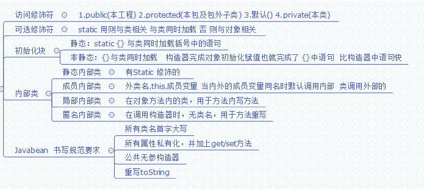

# 第八章：封装及类的高级概念 #
1.	访问修饰符
	.	可选修饰符static
	.	初始化块 静态初始化块  非静态初始化块
	.	在类中能否有两个类
	.	内部类

## 8.1 访问修饰符 ##
第六章  访问权限

#### 标准javabean规范: ####

1.	类的所有属性(除常量)全部私有化  private ,并加上get/set方法
   .	公共无参构造
   .	重写toString
   .	实现序列化接口  Serializable
## 8.2 可选修饰符static ##
被static修饰的只与类有关.一般情况下,static的不私有化.

在类加载时,与类一起被加载.所以静态方法不能直接调用没有被static修饰的方法或属性.
## 8.3 初始化块 ##
静态块  与类一起加载,故而只运行一次.

非静态块 每次创建对象时都运行一次.
## 8.4 一个类文件可以多个类 ##
类文件中有多个类,那么编译后class,就会有多少个文件,类名为文件名.而且这个类文件中只能有一个类被public修饰.
## 8.5 内部类 ##
在一个类的内部出现的类
#### (一)静态内部类 ####
```java
class Outter {
    private static int age = 12;
    static class Inner {
        public void print() {
            System.out.println(age);
        }
    }
}
```
内部类和外部类同时加载.内部类只能调用外部静态的属性和方法,否则需要实例来调用.反之也是一样

内部类生成class文件名:外部类名$内部类名.class

非内部类不可以是static类
#### (二)成员内部类 ####
```java
class Outter {
    private int age = 12;
      
    class Inner {
        private int age = 13;
        public void print() {
            int age = 14;
            System.out.println("局部变量：" + age);//14
            System.out.println("内部类变量：" + this.age);//13
            System.out.println("外部类变量：" + Outter.this.age);//12
        }
    }
}
```
内部类调用外部类属性方法,**用外部类名.this.xx**  应为内部类存在时,外部类已经有了实例.而且此时,内部类是可以调用外部类private属性方法的.

外部类调用内部类的属性方法时,必须先创建内部类的实例,才能调用.如果成员内部类Inner用private修饰，则只能在外部类的内部访问，如果用public修饰，则任何地方都能访问；如果用protected修饰，则只能在同一个包下或者继承外部类的情况下访问；如果是默认访问权限，则只能在同一个包下访问。

内部类生成class文件名:外部类名$内部类名.class
#### (三)局部内部类 ####
	class Outter {
	 
	    private int age = 12;
	      
	    public void Print(final int x) {    //这里局部变量x必须设置为final类型！
	        class Inner {
	            public void inPrint() {
	                System.out.println(x);
	                System.out.println(age);
	            }
	        }
	        new Inner().inPrint();
	    }
	}
本例中我们将内部类移到了外部类的方法中，然后在外部类的方法中再生成一个内部类对象去调用内部类方法。如果此时我们需要往外部类的方法中传入参数，那么外部类的方法**形参必须使用final定义。**

换句话说，在方法中定义的内部类只能访问方法中final类型的局部变量，这是因为在方法中定义的局部变量相当于一个常量，它的生命周期超出方法运行的生命周期，由于局部变量被设置为final，所以不能再内部类中改变局部变量的值。（这里看到网上有不同的解释，还没有彻底搞清楚==）

内部类生成class文件名:外部类名$  数字(可能同名) 内部类名.class
#### (四)匿名内部类 ####
匿名内部类主要用于监听器;或者接口实现,为前面类的子类或或实现类.

	new Outter() {  
	        public void onClick(View v) {
	              
	        }
	    }

匿名内部类是唯一一种**没有构造器的类**。正因为其没有构造器，所以匿名内部类的使用范围非常有限，大部分匿名内部类用于接口回调。匿名内部类在编译的时候由系统自动起名为Outter$1.class。一般来说，匿名内部类用于继承其他类或是实现接口，并不需要增加额外的方法，只是对继承方法的实现或是重写。
## 汇总图 ##
