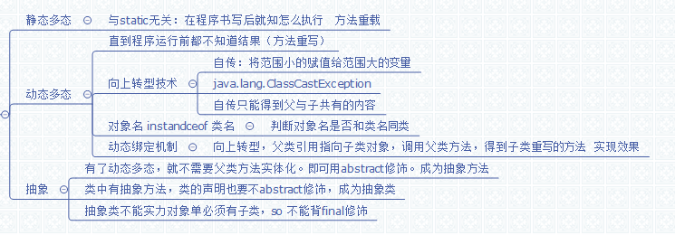

# 第九章：多态

## 9.1 静态多态

与static无关:

在程序书写完成后就知道怎么执行.例如**方法重载**,应为要传值,就知道是哪个方法

## 9.2 动态多态

当书写完成后直到运行前都不知道怎么执行,例如**方法重写**,.但是动态多态不等于方法重写.

需要3种技术支持:

1. 向上转型技术  第七章 向上转型
2. instanceof  第三章 instanceof运算符
3. 动态绑定机制

#### 向上转型

注意类型.是否是子类转父类.范围小的转范围大的
不然ClassCastException

#### instanceof

判断是否该实例属于某类

#### 动态绑定机制

要求 向上转型过程.父类引用指向子类的对象.然后调用父类方法,子类重写的,来实现效果.

## 9.3 抽象

abstract修饰的类或方法;

1. abstract类中可以有abstract方法(普通类不能有abstract方法)
2. abstract类不能用new 创建实例
3. abstract类的子类(若非abstract类为一个abstract类的子类,则必须重写abstract方法.abstract子类,可从写,也可继承)
4. abstract类对象向作为上转型对象
   
   ## 汇总图
   
   