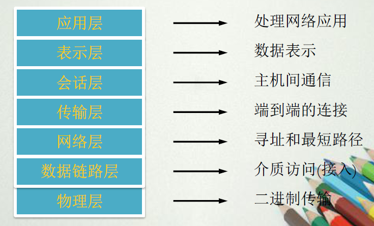
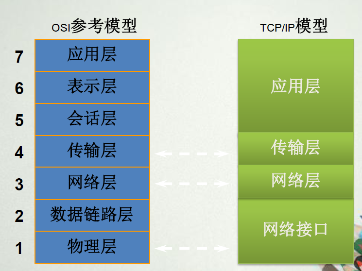
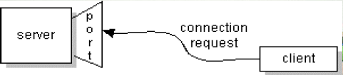
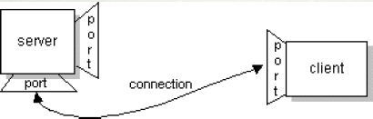
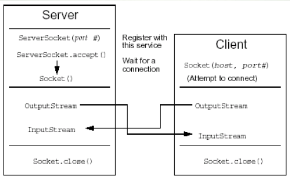
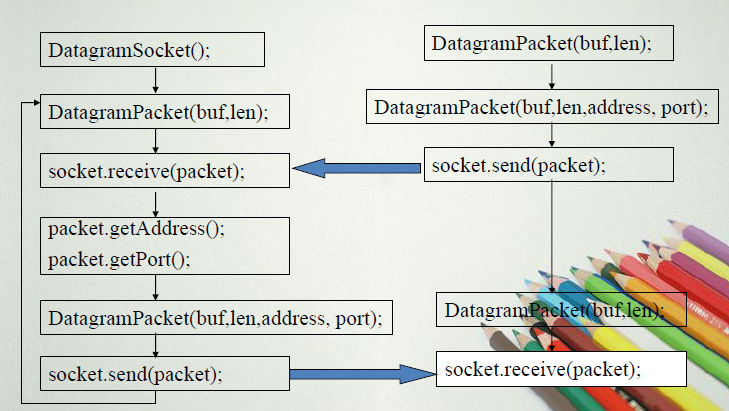

[[Java/JavaOO/Java高级篇之第20章网络编程|Java高级篇之第20章网络编程]]#第二十章:Java网络编程

##网络基础知识

**网络编程的目的：**直接或间接地通过网络协议与其他计算机进行通讯。

    网络编程中有两个主要的问题：
    1.如何准确地定位网络上一台或多台主机。
    2.找到主机后如何可靠高效地进行数据传输。

目前较为流行的网络编程模型是客户端/服务器（C/S）结构。

即通信双方一方作为服务器等待客户提出请求并予以相应。客户则在需要服务时向服务器提出申请。

　　服务器始终运行，监听网络端口，一旦有客户请求，就会启动一个服务线程来响应该客户，同时自己继续监听服务窗口，使后来的客户也能及时得到服务。

###IP地址

IP网络中每台主机都必须有一个唯一的IP地址，IP地址是一个逻辑地址。

英特网上的IP地址具有全球唯一性。

32位，四个字节，常用点分十进制的格式表示。

例如：192.168.0.200

    如何获得自己电脑的IP地址呢？
    
    WINDOWS+R→cmd→ipconfig→例：IPv4 地址 . . . . . . . . . . . . : 192.168.1.3

###协议

为进行网络中的数据交换（通信）而建立的规则、标准或约定。（=语义+语法+规则）。

不同层具有各自不同的协议。

###ISO/OSI模型

网络体系结构解决异质性问题采用的是分层的方法——把复杂的网络互联问题划分为若干个较小的、单一的问题，在不同层上予以解决。

    OSI(Open System Interconnection)参考模型将网络的不同功能划分为7层：
    
    应用层：处理网络应用
    
    表示层：数据表示
    
    会话层：主机间通信
    
    传输层：端到端的连接
    
    网络层：寻址和最短路径
    
    数据链路层：介质访问（接入）
    
    物理层：二进制传输



**通信实体的对等层之间不允许直接通信，各层之间是严格的单向依赖**，上层（Service user）使用下层提供的服务，下层（Service provider）向上层提供服务

**对等层通信的实质：**对等层实体之间虚拟通信，下层向上层提供服务，实际通信在最底层完成。

可见书上的详解

    OSI各层所使用的协议：
    
    应用层：Telnet、FTP、HTTP、DNS、SMTP、POP3
    
    传输层：TCP、UDP
    
    TCP：面向连接的可靠的传输协议。
    
    UDP：是无连接的，不可靠的传输协议。
    
    网络层：IP、ICMP、IGMP

###端口

    在互联网上传输的数据都包含有用来识别目的地的IP地址和端口号。

IP地址用来标识网络上的**计算机**，而端口号用来指明该计算机上的**应用程序**。

**端口**是一种抽象的软件结构（包括一些数据结构和I/O缓冲区）。

端口用一个整数型标识符来表示，即端口号。

端口号跟协议相关，TCP/IP传输层的两个协议TCP和UDP是完全独立的两个软件模块，因此各自的端口号也相互独立，端口通常称为协议端口（protocol port），简称端口。

端口使用一个16位的数字来表示，它的范围是0~65535，1024以下的端口号保留给预定义的服务。例如，**http使用80端口**。

###两类传输协议：TCP,UDP

####TCP

TCP是Transfer Control Protocol（传输控制协议）的简称，是一种面向连接的保证可靠传输的协议。

在TCP/IP协议中：

**IP层**主要负责网络主机的定位，数据传输的路由，由IP地址可以唯一确定Internet上的一台主机。

**TCP层**提供面向应用的可靠的或非可靠的数据传输机制，这是网络编程的主要对象，一般不需要关心IP层是如何处理数据的。

通过TCP协议传输，得到的是一个顺序的无差错的数据流。

    什么意思呢？
    --
    发送方和接收方的成对的两个socket之间必须建立连接，以便在TCP协议的基础上进行通信。

*当一个socket（通常都是server socket）等待建立连接时，另一个socket可以要求进行连接，一旦这两个socket连接起来，它们就可以进行双向数据传输，双方都可以进行发送或接收操作。*

    TCP是一个基于连接的协议，它能够提供两台计算机之间的可靠的数据流。
    
    HTTP、FTP、Telnet等应用都需要这种可靠的通信通道。

####UDP

UDP是User Datagram Protocol的简称，是一种无连接的协议。

UDP是从一台计算机向另一台计算机发送称为**数据报**的独立数据包的协议，**该协议并不保证数据报是否能正确地到达目的地，它是一个非面向连接的协议。**

每个数据报都是一个独立的信息，包括完整的源地址或目的地址，**它在网络上以任何可能的路径传往目的地，因此能否到达目的地，到达时间以及内容的正确性都是不能保证的。**

####TCP和UDP的比较

    一：
    
    使用UDP时，每个数据报中都给出了完整的地址信息，因此无需建立发送方和接收方的连接。
    
    对于TCP协议，由于它是一个面向连接的协议，在socket之间进行数据传输之前必然要建立连接，
    所以在TCP中多了一个连接建立的时间。
    
    二：
    
    使用UDP传输数据时是有大小限制的，每个被传输的数据报必须限定在64KB之内。
    
    TCP没有这方面的限制，一旦连接建立起来双方的socket就可以按统一的格式传输大量的数据。
    
    三：
    
    UDP是一个不可靠的协议，发送方所发送的数据报并不一定以相同的次序到达接收方。
    
    TCP是一个可靠的协议，它确保接收方完全正确地获取发送方所发送的全部数据。

*可靠的传输是要付出代价的，对数据内容正确性的检验必然占用计算机的处理时间和网络的带宽。因此TCP传输的效率不如UDP高。*

    TCP在网路通信上有极强的生命力，例如远程连接（Telnet）和文件传输（FTP）都需要不定长度的
    数据被可靠地传输。
    
    相比之下UDP操作简单，而且仅需要较少的监护，因此通常用于局域网高可靠性的分散系统中
    client/server应用程序。

###TCP/IP模型

    TCP/IP模型包括四个层次：
    
    　　应用层
    
    　　传输层
    
    　　网络层
    
    　　网络接口
    
    　　TCP/IP与OSI参考模型的对应关系：



详细内容见书

###JDK中的网络类

通过**java.net**包中的类，java程序能够使用TCP或UDP协议在互联网上进行通讯。

Java通过**扩展已有的流式输入/输出接口**和**增加在网络上建立输入/输出对象特性**这两个方法支持TCP/IP。

Java支持TCP和UDP协议族。

TCP用于网络的可靠的流式输入/输出。

UDP支持更简单的、快速的、点对点的数据报模式。

###简述URL

URL(Uniform Resource Locator)是统一资源定位符的简称，它表示Internet上某一资源的地址。

####URL组成

    一个URL包括两个主要部分：
    
    协议标识符：HTTP, FTP, File等。
    
    资源名字：主机名，文件名，端口号，引用。

####创建URL

在Java程序中，可以创建表示URL地址的URL对象。

URL对象表示一个绝对的URL地址，但URL对象可用绝对URL、相对URL和部分URL构建。

    例：
        try {
            URL myURL = new URL("http://www.google.com.tw/");
        } catch (MalformedURLException e) {
            //处理异常
        }

####获得URL对象的各个属性

    URL类中有各种用于获取属性的方法：
    
        getProtocol
    
        getHost
    
        getPort
    
        getFile
    
        getRef
    
    例：
    public class TestPrivate2 {
        public static void main(String[] args) {
            try {
                URL myURL = new URL(
                        "http://java.sun.com:80/docs/books/tutorial/index.html#DOWN");
                String protocal = myURL.getProtocol();
                String host = myURL.getHost();
                String file = myURL.getFile();
                int port = myURL.getPort();
                String ref = myURL.getRef();
                System.out.println(protocal + ", " + host + ", " + file + ", "
                        + port + ", " + ref);
            } catch (MalformedURLException e) {
            }
        }
    }

####InetAddress类中的工厂方法

对于InetAddress，三个方法:getLocalHost()、getByName()以及getAllByName()可以用来创建InetAddress的实例。

    getLocalHost()仅返回象征本地主机的InetAddress对象。
    
    本机地址还为localhost,127.0.0.1，这三个地址都是一回事。
    
    getByName()方法返回一个传给它的主机名的InetAddress。
    
    如果这些方法不能解析主机名，它们引发一个UnknownHostException异常。
    
    在Internet上，用一个名称来代表多个机器是常有的事。
    
    getAllByName()工厂方法返回代表由一个特殊名称分解的所有地址的InetAddresses类数组。
    
    在不能把名称分解成至少一个地址时，它将引发一个UnknownHostException异常。
    
    例：
    public class InetAddressTest01 {
        public static void main(String[] args) throws Exception {
            InetAddress address = InetAddress.getLocalHost();
            System.out.println(address);
            // 输出：机器名/IP地址
            // 如username-PC/10.4.16.131
            // 通过域名得到IP地址
            address = InetAddress.getByName("www.sohu.com");
            System.out.println(address);
            // 输出：域名/IP地址
        }
    }

上述大多数内容需要了解

###使用TCP/IP的套接字（Socket）进行通信

####套接字Socket的引入
为了能够方便地开发网络应用软件，由美国伯克利大学在Unix上推出了一种应用程序访问通信协议的操作系统用调用**socket（套接字）**。

socket的出现，使程序员可以很方便地访问TCP/IP，从而开发各种网络应用的程序。

随着Unix的应用推广，套接字在编写网络软件中得到了极大的普及。后来，套接字又被引进了Windows等操作系统中。Java语言也引入了套接字编程模型。

####什么是Socket？

    Socket是连接运行在网络上的两个程序间的双向通讯的端点。

####使用Socket进行网络通信的过程

服务器程序将一个套接字绑定到一个特定的端口，并通过此套接字等待和监听客户的连接请求。

客户程序根据服务器程序所在的主机名和端口号发出连接请求。



如果一切正常，服务器接受连接请求。并获得一个新的绑定到不同端口地址的套接字。（不可能有两个程序同时占用一个端口）。

　　客户和服务器通过读写套接字进行通讯。



使用ServerSocket和Socket实现服务器端和客户端的Socket通信。



其中：

　　左边ServerSocket类的构造方法可以传入一个端口值来构建对象。

　　**accept()**方法监听向这个socket的连接并接收连接。它将会阻塞直到连接被建立好。连接建立好后它会返回一个Socket对象。

　　连接建立好后，服务器端和客户端的输入流和输出流就互为彼此，即一端的输出流是另一端的输入流。

####总结：使用ServerSocket和Socket实现服务器端和客户端的Socket通信

    (1)建立Socket连接
    
    (2)获得输入/输出流
    
    (3)读/写数据
    
    (4)关闭输入/输出流
    
    (5)关闭Socket

例1：通信程序测试

```java
    //服务器端
    public class TcpServer {
        public static void main(String[] args) throws Exception {
            // 创建服务器端的socket对象
            ServerSocket ss = new ServerSocket(5000);
            // 监听连接
            Socket socket = ss.accept();
            // 直到连接建立好之后代码才会往下执行
            System.out.println("Connected Successfully!");
        }
    }

    //客户端
    public class TcpClient {
        public static void main(String[] args) throws Exception {
            Socket socket = new Socket("127.0.0.1", 5000);
        }
    }
```

先运行服务器端，再运行客户端，可以看到，运行客户端之后输出服务器端的后续代码。表明连接建立后才会往下执行。

例2：一个比较简陋的通信程序：

```java
    //服务器端
    public class TcpServer {
        public static void main(String[] args) throws Exception {
            // 创建服务器端的socket对象
            ServerSocket ss = new ServerSocket(5000);
            // 监听连接
            Socket socket = ss.accept();
            // 直到连接建立好之后代码才会往下执行
            System.out.println("Connected Successfully!");
            // 获得服务器端的输入流，从客户端接收信息
            InputStream is = socket.getInputStream();
            // 服务器端的输出流，向客户端发送信息
            OutputStream os = socket.getOutputStream();
            byte[] buffer = new byte[200];
            int length = 0;
            length = is.read(buffer);
            String str = new String(buffer, 0, length);
            System.out.println(str);
            // 服务器端的输出
            os.write("Welcome".getBytes());
            // 关闭资源
            is.close();
            os.close();
            socket.close();
        }
    }

    //客户端
    public class TcpClient {
        public static void main(String[] args) throws Exception {
            Socket socket = new Socket("127.0.0.1", 5000);
            // 客户端的输出流
            OutputStream os = socket.getOutputStream();
            // 将信息写入流,把这个信息传递给服务器
            os.write("hello world".getBytes());
            // 从服务器端接收信息
            InputStream is = socket.getInputStream();
            byte[] buffer = new byte[200];
            int length = is.read(buffer);
            String str = new String(buffer, 0, length);
            System.out.println(str);
            // 关闭资源
            is.close();
            os.close();
            socket.close();
        }
    }
```

先运行服务器，再运行客户端。之后可以在服务器和客户端的控制台上进行输入操作，另一端将会收到输入的信息并输出。

例3：另一个比较简陋的通信程序：

```java
    //服务器端
    public class Server {
        public Server() {
            try {
                ServerSocket server = new ServerSocket(9527);
                while (true) {
                    Socket socket = server.accept();
                    InetAddress intAddress = socket.getInetAddress();
                    System.out.println(intAddress.getHostAddress());
                    System.out.println(intAddress.getAddress());
                    System.out.println(intAddress.getHostName());
                    // 服务器接收客户端的信息（输入）
                    InputStream input = socket.getInputStream();
                    byte[] b = new byte[1024];
                    input.read(b);
                    String clientInfo = new String(b);
                    System.out.println("接收到客户端信息：" + clientInfo);
                    // 服务器发送信息返回给客户端（输出）
                    OutputStream out = socket.getOutputStream();
                    String resultInfo = "你好，我收到你的信息了，哈哈";
                    out.write(resultInfo.getBytes());
                    out.flush();
                    // 关闭流
                    input.close();
                    out.close();
                    socket.close();
                }
            } catch (IOException e) {
                e.printStackTrace();
            }
        }
        public static void main(String[] args) {
            new Server();
        }
    }

    //客户端
    public class Client {
        public Client() {
            try {
                String message = JOptionPane.showInputDialog("请输入信息:");
                Socket socket = new Socket("127.0.0.1", 9527);
                // 客户端给服务器发送信息（输出）
                OutputStream out = socket.getOutputStream();
                out.write(message.getBytes());
                out.flush();
                // 客户端接收服务器返回的信息(输入)
                byte[] b = new byte[1024];
                InputStream in = socket.getInputStream();
                in.read(b);
                String returnInfo = new String(b);
                System.out.println("收到服务器的返回：" + returnInfo);
                // 关闭流
                out.close();
                in.close();
                socket.close();
            } catch (UnknownHostException e) {
                e.printStackTrace();
            } catch (IOException e) {
                e.printStackTrace();
            }
        }
        public static void main(String[] args) {
            new Client();
        }
    }
```

例4：服务器与客户端持续交互(了解)

```java
    //客户端
    public class ClientDemo {
        private Socket clientSocket;
        public ClientDemo() {
        }
        // 构造方法只负责构造对象
        public ClientDemo(String hostAddress, int port) {
            try {
                clientSocket = new Socket(hostAddress, port);
            } catch (UnknownHostException e) {
                e.printStackTrace();
            } catch (IOException e) {
                e.printStackTrace();
            }
        }
        // 将原构造方法中的与服务器通信的逻辑提取出来，放入自定义方法中
        public void request(String requestInfo) {
            if (null != clientSocket) {
                OutputStream out = null;
                InputStream in = null;
                try {
                    out = clientSocket.getOutputStream();
                    byte[] infoByte = requestInfo.getBytes();
                    System.out.println("客户端发出信息：" + requestInfo);
                    out.write(infoByte);
                    out.flush();
                    byte[] responseInfo = new byte[1024];
                    in = clientSocket.getInputStream();
                    in.read(responseInfo);
                    String response = new String(responseInfo);
                    System.out.println("客户端收到服务器的返回信息: " + response);
                } catch (IOException e) {
                    e.printStackTrace();
                } finally {
                    try {
                        if (null != out) {
                            out.close();
                        }
                        if (null != clientSocket) {
                            clientSocket.close();
                        }
                    } catch (IOException e) {
                        e.printStackTrace();
                    }
                }
            }
        }
        public static void main(String[] args) {
            boolean continueFlag = true;
            while (continueFlag) {
                ClientDemo client = new ClientDemo("127.0.0.1", 3434);
                String info = JOptionPane.showInputDialog("输入信息");
                client.request(info);
                int choice = JOptionPane.showConfirmDialog(
                        new JFrame().getContentPane(), "请问还想继续吗？");
                if (choice != 0) {
                    continueFlag = false;
                    System.exit(0);
                }
            }
        }
    }

    //服务器端main
    public class ServerDemo {
        private ServerSocket serverSocket;
        public ServerDemo() {
        }
        // 构造方法只负责构造对象
        public ServerDemo(int port) {
            try {
                serverSocket = new ServerSocket(port);
                while (true) {
                    // 监听客户端的请求
                    System.out.println("服务器启动，开始监听请求...");
                    Socket socket = serverSocket.accept();
                    new ServerThread(socket);
                }
            } catch (IOException e) {
                e.printStackTrace();
            }
        }
        public static void main(String[] args) {
            ServerDemo server = new ServerDemo(3434);
        }
    }

    //服务器端多线程内容
    public class ServerThread extends Thread {
        public Socket socket;
        public ServerThread() {
        }
        public ServerThread(Socket socket) {
            this.socket = socket;
            this.start();
        }
        public void run() {
            this.receive();
        }
        // 接收消息
        public void receive() {
            if (null != socket) {
                InputStream in = null;
                OutputStream out = null;
                try {
                    in = socket.getInputStream();
                    byte[] readInfo = new byte[1024];
                    in.read(readInfo);
                    String requestInfo = new String(readInfo);
                    System.out.println("服务器接收到客户端信息: " + requestInfo);
                    out = socket.getOutputStream();
                    String responseInfo = JOptionPane.showInputDialog("输入返回信息");
                    System.out.println("服务器将返回信息：" + responseInfo);
                    out.write(responseInfo.getBytes());
                    out.flush();
                } catch (IOException e) {
                    e.printStackTrace();
                } finally {
                    try {
                        if (null != out) {
                            out.close();
                        }
                        if (null != in) {
                            in.close();
                        }
                        if (null != socket) {
                            socket.close();
                        }
                    } catch (IOException e) {
                        e.printStackTrace();
                    }
                }
            }
        }
    }
```

####使用线程实现服务器端与客户端的双向通信

用两个线程，一个线程专门用于处理服务器端的读，另一个线程专门用于处理服务器端的写。客户端同理。

程序共有六个类，服务器端和其输入输出线程：

```java
    //服务器main方法
    public class MainServer {
        public static void main(String[] args) throws Exception {
            ServerSocket serverSocket = new ServerSocket(6000);
            while (true) {
                // 一直处于监听状态,这样可以处理多个用户
                Socket socket = serverSocket.accept();
                // 启动读写线程
                new ServerInputThread(socket).start();
                new ServerOutputThread(socket).start();
            }
        }
    }
    //输入流处理
    public class ServerInputThread extends Thread {
        private Socket socket;
        public ServerInputThread(Socket socket) {
            super();
            this.socket = socket;
        }
        @Override
        public void run() {
            try {
                // 获得输入流
                InputStream is = socket.getInputStream();
                while (true) {
                    byte[] buffer = new byte[1024];
                    int length = is.read(buffer);
                    String str = new String(buffer, 0, length);
                    System.out.println(str);
                }
            } catch (IOException e) {
                e.printStackTrace();
            }
        }
    }

    //输出流处理
    public class ServerOutputThread extends Thread {
        private Socket socket;
        public ServerOutputThread(Socket socket) {
            super();
            this.socket = socket;
        }
        @Override
        public void run() {
            try {
                OutputStream os = socket.getOutputStream();
                while (true) {
                    BufferedReader reader = new BufferedReader(
                            new InputStreamReader(System.in));
                    String line = reader.readLine();
                    os.write(line.getBytes());
                }
            } catch (IOException e) {
                e.printStackTrace();
            }
        }
    }

    //客户端main
    public class MainClient {
        public static void main(String[] args) throws Exception {
            Socket socket = new Socket("127.0.0.1", 6000);
            new ClientInputThread(socket).start();
            new ClientOutputThread(socket).start();
        }
    }

    //输入流处理
    public class ClientInputThread extends Thread {
        private Socket socket;
        public ClientInputThread(Socket socket) {
            super();
            this.socket = socket;
        }
        @Override
        public void run() {
            try {
                // 获得输入流
                InputStream is = socket.getInputStream();
                while (true) {
                    byte[] buffer = new byte[1024];
                    int length = is.read(buffer);
                    String str = new String(buffer, 0, length);
                    System.out.println(str);
                }
            } catch (IOException e) {
                e.printStackTrace();
            }
        }
    }

    //输出流处理
    public class ClientOutputThread extends Thread {
        private Socket socket;
        public ClientOutputThread(Socket socket) {
            super();
            this.socket = socket;
        }
        @Override
        public void run() {
            try {
                OutputStream os = socket.getOutputStream();
                while (true) {
                    BufferedReader reader = new BufferedReader(
                            new InputStreamReader(System.in));
                    String line = reader.readLine();
                    os.write(line.getBytes());
                }
            } catch (IOException e) {
                e.printStackTrace();
            }
        }
    }
```

###使用无连接的数据报（UDP）进行通信

    什么是Datagram？    

**数据报**是网上传输的独立数据包，数据报是否能正确地到达目的地，到达的时间，顺序，内容的正确性均没有保障。

Java中使用Datagram与DatagramPacket类。

DatagramSocket类利用UDP协议来实现客户与服务器的Socket。

    send()发送数据报。
    
    receive()接收数据报。



可以用写信寄信的例子来类比UDP通信。

此时DatagramPacket就相当于一个包装了信封的信件。填好地址和接收人之后，就可以寄出去。

简单的UDP通讯实例

```java
    public class UdpUnit1 {
        public static void main(String[] args) throws Exception {
            DatagramSocket datagramSocket = new DatagramSocket();
            // 构造数据报的包
            String str = "Hello World";
            // 用了public DatagramPacket(byte buf[], int length,InetAddress address,
            // int port)形式
            DatagramPacket packet = new DatagramPacket(str.getBytes(),
                    str.length(), InetAddress.getByName("localhost"), 7000);
            // 发送数据包
            datagramSocket.send(packet);
            // 接收数据包
            byte[] buffer = new byte[1024];
            DatagramPacket packet2 = new DatagramPacket(buffer, 100);
            datagramSocket.receive(packet2);
            // 输出接收到的数据
            System.out.println(new String(buffer, 0, packet2.getLength()));
            datagramSocket.close();
        }
    }

    public class UdpUnit2 {
        public static void main(String[] args) throws Exception {
            DatagramSocket socket = new DatagramSocket(7000);
            // 收信息
            byte[] buffer = new byte[1024];
            DatagramPacket packet = new DatagramPacket(buffer, 1024);
            // 接收
            socket.receive(packet);
            // 输出
            System.out.println(new String(buffer, 0, packet.getLength()));
            // 返回信息
            String str = "Welcome！";
            DatagramPacket packet2 = new DatagramPacket(str.getBytes(),
                    str.length(), packet.getAddress(), packet.getPort());
            // 这里填入发送方的信息
            socket.send(packet2);
            socket.close();
        }
    }
```

运行时首先运行UdpUnit2，因为它开始时是在等待接收；然后运行UdpUnit1，它向UdpUnit2发送了“Hello World”的信息，UdpUnit2接收到信息后，返回“Welcome！”。