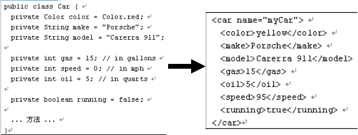
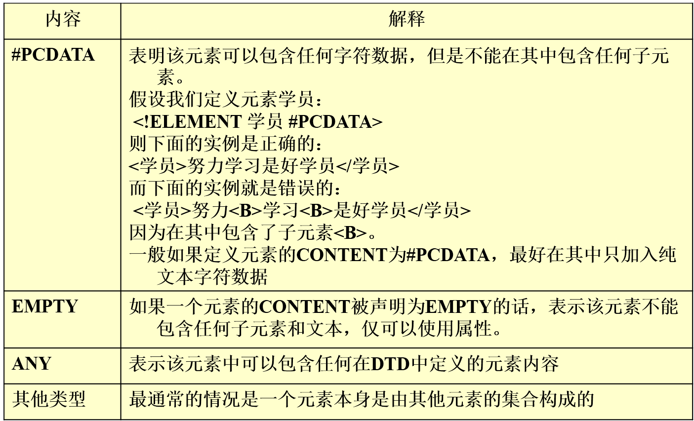

# Java XML 解析技术

## XML技术概述

### 在使用XML前遇到了哪些问题，为什么要使用xml？

我们要提到两个问题：

    问题一：各平台之间的程序很难直接交流

解决：JAVA跨平台(解决部分)

    问题二：各程序之间很难直接交换数据，怎样在两个应用程序之间无二义性地传递数据呢？ 

解决：用普通文本    如：speed = 65

那我们如何解决Java中不能解决的那一部分问题呢？--xml

**XML**很适合传输数据，解决跨平台传输对象数据


使用上图这种方式就可以避免硬件造成的数据丢失问题。

这种格式的内容使用xml

### 什么是XML

XML（可扩展标记语言，eXtended Markup Language）是一种元标记语言，用户可以定义自己需要的标记。

XML描述的是结构、内容和语义，它不描述页面元素的格式化。

对比：HTML侧重于如何表现信息，内容描述与显示整合为一体。

如：

```xml
    <?xml version="1.0"?>
    <Student> 
            <Name>ZhangSan</Name> 
            <ID>001</ID> 
    </Student>
```

文档的后缀名是xml，每个文档有且仅有一个根元素。所谓根元素就是包含了其他所有元素的元素（Student）。

XML文档必须是格式良好的（Well-formed）。如果XML文档不是格式良好的，就不能被应用程序和浏览器正确识别和解析。

一个XML文档由两个部分组成：一个部分是序言，包括XML文档声明、注释、空白；另一个部分是文档元素，这两个部分是必须的。此外，我们还可以选择性地包含注释、处理指令和空白。

例如：该图中讲解了一个xml文档的组成部分

图2


#### XML文档声明

每一个XML文档都以一个XML声明开始，用以指明所用的XML的版本。XML声明一般是XML文档的第一行

    XML声明有version 、encoding和standalone特性。

这些特性由等号分开的名称-数值对。位于等号左边的是特姓名，而其值位于等号的右边，并用双引号或单引号括起来。

    图中可见：version特性表明这个文档符合XML 1.0规范，目前1.0是唯一可用的版本。

XML声明还可以有standalone特性，这告诉我们文档是否在这一个文件里，还是需要从外部导入文件。

    standalone="yes"
    standalone="no"

```xml
    <?xml version="1.0" encoding="UTF-8"  standalone="yes"?>
```

encoding 属性指定了编码格式，默认情况下是utf-8，这个属性要放在standalone属性前面。

注意本文文件保存时候默认的编码格式是ANSI，需要利用记事本把它手动改为UTF-8保存。

#### XML文档注释

XML文档注释以“`<!--”开始，以“-->`”结束

    如：`<!--第一行是XML声明-->`

在XML文档被XML处理程序解析时，这些注释内容会全部被忽略不显示。当我们希望XML文档中的某些内容被解析器忽略时，可以使用注释的方式。

注释是不能嵌套的

#### 处理指令（PI）

**处理指令**（Processing Instruction）被用来为XML处理程序提供信息，以“`<?处理指令名称 处理指令信息?>`”的格式呈现，通常它用来传递信息给解析器的下游程序。

```xml
    <?xml:stylesheet type="text/xsl" href="example.xsl"?> 
```

上面的指令指明了与其所属文档配套使用的样式表的类型为XSL（eXtensible Style sheet Language），文件名称为example.xsl，并且与该XML文档同在一个目录下。

#### XML空白

XML空白是指由一个或者更多的空格符、制表符、回车符、换行符等组成的字符或者字符串。通常，为了使XML文档显示起来更直观，在开始标记、结束标记、注释、处理指令等地方添加空白是必要的。

####XML元素

元素是XML文档信息内容的载体，是基本的逻辑单元。

数据之间的逻辑关系和层次结构也通过元素来体现。

    一个元素通常这样组成：一个开始标记，然后是元素内容，最后是结束标记

##### 开始和结束标记

为自定义标记取名称时，可以采用中文或者英文，但是名称必须以一个字母或者下划线开始。开始标记的名称必须与结束标记的名称一致，包括所有字母的大小写。

按照XML规范的要求，每个格式良好的XML文档必须有一个根元素，所有其它的元素都必须嵌套在它里面。根元素的起始标记要放在所有其他元素的起始标记之前，而根元素的结束标记要放在所有其他元素的结束标记之后。

```xml
    <?xml version="1.0" encoding="GB2312" ?>
    <book>
    客户端网页编程
    </book>
```

每个XML文档至少有一个XML元素；大小写不同的标记含义不同，如TITLE不同于title；结束标记必须带反斜杠，如/TITLE，当只有一个标记时可以写为HR/嵌套必须完整。

```xml
    <CONTACT> 
    <NAME>TOM CRUISE</NAME> 
    <EMAIL>tom@usa.com</EMAIL> 
    </CONTACT> 
```

除以上规则外，XML元素标记还必须遵循下面的命名规则：  
    1.名字中可以包含字母、数字以及其它字母；  
    2.名字不能以数字或下划线开头；  
    3.名字不能以字母xml(或XML或Xml..)开头；  
    4.名字中不能包含空格和冒号。  

##### 元素内容

XML元素内容可以是字符数据、嵌套的元素、实体引用、CDATA。

**字符数据**

元素内容可以是字符数据。但是内容中不能包含小于号（<）、连字符（&）、或者字符串（`]]>`）。

```xml
    <book>客户端网页编程</book>
```

**嵌套元素**

元素内容可以是嵌套的元素，单层或者多层的嵌套都可以。

```xml
    <book>
        <chapter>第一章</chapter>
        <chapter>第二章</chapter>
    </book>
```

**实体**

实体叫ENTITY，实体的作用是避免重复输入。作用相当于宏或者变量。

XML中内置的5种实体：

图3


```xml
    如：<ORDER VALUE = "He said, "Don't jump out of the window!""> 
    应该写为：
    <ORDER VALUE = "He said, "Don&apos;t jump out of the window!"">
```

自定义实体语法：

```
    <!DOCTYPE 根元素[

    <!ENTITY 实体名 "实体内容">

    ]>

    引用已定义的实体：

        &实体名;
```

例子：

```xml
    <?xml version="1.0" encoding="utf-8"?>

    <!DOCTYPE test[
    <!--实体声明-->
    <!ENTITY comA "Company A">

    <!ENTITY addA "Some Place">        

    ]>
    <test>

            <!--直接写进去的方法-->
            <company>
                    <name>Company A</name>
                    <address>Some Place</address>        
            </company>

            <!--用实体的方法-->
            <company>
                    <name>&comA;</name>
                    <address>&addA;</address>        
            </company>
    </test>
```

上述是先将“Company A”定义到comA中，下面使用&comA时会自动转换

**值得注意的是，如果实体声明不在XML文件中，而是在文件外部，我们必须用“%”来代替“&”。**

**CDATA**

    用于把整段文本解释为纯字符数据而不是标记的情况。

包含大量的<、>、&、或者"字符。CDATA节中的所有字符都会被当做元素字符数据的常量部分，而不是XML标记。

    <SAMPLE>
        <![CDATA[<DOCUMENT>
        <NAME>TOM CRUISE</NAME>
        <EMAIL>tom@usa.com</EMAIL>
        </DOCUMENT>]]> 
    </SAMPLE>

它以“`<![CDATA[”开始并以“]]>`”结束，需要注意的是，唯一不许出现在CDATA段中的文本是CDATA的结束界定符“]]>”。

例：

```xml
    <?xml version="1.0" encoding="utf-8"?>
    <root>
            <![CDATA[

            <hello>
                    <world>


                这里放任何内容都是合法的

            ]]> 

            <subRoot>

            </subRoot>
    </root>
```

##### 元素属性

属性（特性）是由等号分开的名称-数值对。

位于等号左边的是特姓名，而其值位于等号的右边，并用双引号或单引号括起来。

自定义的元素也可以有一个或多个属性，其属性值使用单引号或者双引号括起来。

如果属性值中有双引号则使用单引号，反之亦然。

属性的形式为：属性名= "属性值"，比如gender="male"。

多个属性值之间用空格隔开（一个或多个空格都可以）。

在一个元素上，相同的属性只能出现一次。

**属性值不能包含<, >, &。**

例：

```xml
    <?xml version="1.0"?>
    <展示厅>电器产品
          <电视机 数量="8">SONY</电视机>
          <笔记本 数量="10">IBM</笔记本>
    </展示厅>
```

**文档类型定义——DOCTYPE**

文档类型声明，紧跟XML声明之后，包含所有实体声明。

```xml
    <?xml version="1.0" encoding="UTF-8"?>
    <!DOCTYPE poem [
        <!ELEMENT poem (author, title, content)>
        <!ELEMENT author (#PCDATA)>
        <!ELEMENT title (#PCDATA)>
        <!ELEMENT content (#PCDATA)>
    ]>
    <!--为元素poem定义了三个子元素author title content，
    这三个元素必须要出现并且必须按照这个顺序
    少元素不行，多元素也不行，写错了会有提示
    -->
    <!--指明author,title,content里面的内容是字符串类型-->
    <poem>
        <author>王维</author>
        <title>鹿柴</title>
        <content>空山不见人，但闻人语声。返景入深林，复照青苔上。</content>
    </poem>
```

### 结构完整的XML文档

要求：

    XML文档必须是格式良好的（Well-formed）。
    如果XML文档不是格式良好的，就不能被应用程序和浏览器正确识别和解析。
    
    遵循如下规则的XML文档称为结构完整
        语法规范：
            1.必须有XML声明语句
                `<?xml version="1.0" encoding="gb2312"?>`
            2.必须有且仅有一个根元素
            3.标记大小写敏感
            4.属性值用引号
            5.标记成对
            6.空标记关闭
            7.元素正确嵌套
    
        元素语法
            1.名称中可以包含字母、数字或者其它字符
            2.名称不能以数字和"_"（下划线）开头
            3.不能以XML/xml/Xml/…开头
            4.名称中不能含空格
            5.名称中不能含冒号(注：冒号留给命名空间使用)

##XML技术体系概述

    文档描述与校验技术：
    DTD和Schema都是用于定义XML结构，并且用于校验我们书写的XML文档是否符合要求的技术。

### DTD

    什么是DTD呢？为什么要使用DTD呢？

文档类型定义——Document Type Definition。

由于我们可以随意的按照我们自行的要求去书写xml文档的标签和内容，那这样的话就只能我们自己阅读和查看，为了做到让业界人士都能一眼看得懂，看得更加明白，我们使用DTD来约束xml的标记。

    如何要求的呢？

DTD它是一套标记的语法规则，它定义了元素、子元素、属性及其取值，规定了用户在DTD关联的XML文档中可以使用什么标记、各个标记出现的顺序以及标记的层次关系，并定义了实体

对于一个DTD的定义，最关键的在于它内部的元素和属性的定义。一个DTD文档实际上就是元素定义的集合，而元素可能包含属性，也可能不包含属性

图4


看下列例子对不对

    testUse.dtd文档
    <?xml version="1.0" encoding="UTF-8"?>
    <!ELEMENT students (student*)>
    <!ELEMENT student ((name|userName),age,address,phone)>
    <!ELEMENT name (#PCDATA)>
    <!ELEMENT username (#PCDATA)>
    <!ELEMENT age (#PCDATA)>
    <!ELEMENT address (#PCDATA)>
    <!ELEMENT phone (#PCDATA)>
    
    test.xml
    <?xml version="1.0" encoding="UTF-8"?>
    <!DOCTYPE students SYSTEM "testUse.dtd">
    <students>
        <student>
            <name>wujin</name>
            <age xusui="31">30</age>
            <address>bao'An</address>
            <phone>0755</phone>
        </student>
        <student>
            <name>heh</name>
            <age xusui="12">20</age>
            <address>a</address>
            <phone>000</phone>
        </student>
    </students>

看起来错了，但是发现年龄那儿出错了，原因是在dtd中没有给age定义属性

当然其中出现了类似（#PCDATA）的内容

图5

####DTD用来描述XML文档的结构
    一个DTD文档包含：

    元素（ELEMENT）的定义规则；
    
    元素之间的关系规则；
    
    属性（ATTLIST）的定义规则；

那属性如何定义呢？

首先，格式如下：

图6

当然，下列分别展示属性类型和约束

属性类型：

图7

约束：

图8

这样再回头看刚刚那个例子

只需要在dtd中

```xml
    <?xml version="1.0" encoding="UTF-8"?>
    <!ELEMENT students (student*)>
    <!ELEMENT student ((name|userName),age,address,phone)>
    <!ELEMENT name (#PCDATA)>
    <!ELEMENT username (#PCDATA)>
    <!ELEMENT age (#PCDATA)>
    <!ELEMENT address (#PCDATA)>
    <!ELEMENT phone (#PCDATA)>

    <!ATTLIST age 
        xusui CDATA #IMPLIED>
```

四个属性分别表示：

    必须包含：#REQUIRED 可以忽略：#IMPLIED  
    固定值#FIXED value  默认值：Default value

如：

```xml
    <!ELEMENT FAMILY (PERSON+)>
    　　<!ELEMENT PERSON EMPTY>
    　　<!ATTLIST PERSON
    　　　relID ID #REQUIRED
    　　　parentID IDREFS #IMPLIED
    　　　name CDATA #REQUIRED
    　　>

    <FAMILY>
    　　<PERSON relID="P_1" name="Joe"/>
    　　<PERSON relID="P_2" name="NiEr"/>
    　　<PERSON relID="P_3" name="MoZi"/>
    　　<PERSON relID="P_4" parentID="P_1 P_5" name="Violet"/>
    </FAMILY>
```

    可使用的实体（ENTITY）或符号（NOTATION）规则。

####DTD文档与XML文档实例的关系

    有了DTD，每个XML文件可以携带一个自身格式的描述。
    
    有了DTD，不同组织的人可以使用一个通用DTD来交换数据。
    
    应用程序可以使用一个标准DTD校验从外部世界接收来的XML数据是否有效。
    
    可以使用DTD校验自己的XML数据。

效验时会自动在eclipse编辑器中出现错误提示

####如何生成DTD文档

    DTD文档有三种应用形式:
        1.内部DTD文档
        <!DOCTYPE 根元素[定义内容]>
    
        2.外部DTD文档
        <!DOCTYPE 根元素 SYSTEM "DTD文件路径">
    
        3.内外部DTD文档结合
        <!DOCTYPE 根元素 SYSTEM "DTD文件路径" [定义内容]>

内部DTD格式
图9

#####内部DTD 

    一个内部DTD的例子：
    
    上半部分是DTD，下面是XML文档，文档要符合DTD。
    
    <?xml version="1.0" encoding="UTF-8" ?>
    <!DOCTYPE 家庭 [
    　<!ELEMENT 家庭 (人+,家电*)>
    　<!ELEMENT人 EMPTY>
    　<!ELEMENT 家电 EMPTY>
    　<!ATTLIST 人
    　　名字 CDATA #REQUIRED
    　　性别 (男|女) #REQUIRED
    　　年龄 CDATA #REQUIRED
    　　爱好 CDATA #IMPLIED
    　>
    　<!ATTLIST 家电
    　　　名称 CDATA #REQUIRED
    　　　数量 CDATA #REQUIRED
    　　　说明 CDATA #IMPLIED
    　>
    ]> 
    <家庭>
        <人 名字＝"郭大路" 性别="男" 年龄="25"/>
        <人 名字="李寻欢" 性别="男" 年龄="38" 爱好="作个教育家和伟人"/>
        <家电 名称="彩电" 数量="3"/>
    </家庭>

#####外部DTD

    除了上面展示的例子外

例：

    testUse.dtd
    <?xml version="1.0" encoding="UTF-8"?>
    <!ELEMENT home (people+,thing*)>
    <!ELEMENT people EMPTY>
    <!ELEMENT thing EMPTY>
    <!ATTLIST people
        name CDATA #REQUIRED
        sex (男|女) #REQUIRED
        age CDATA #REQUIRED
        hobby CDATA #IMPLIED
    　　>
    <!ATTLIST thing
        name CDATA #REQUIRED
    　　　num CDATA #REQUIRED
    　　　mean CDATA #IMPLIED
    　　>
    
    test.xml
    <?xml version="1.0" encoding="UTF-8"?>
    <!DOCTYPE home SYSTEM "testUse.dtd">
    <home>
        <people age="18" name="zhangsan" sex="男"/>
        <people age="20" name="李四" sex="女"/>
        <thing name="冰箱" num="2" mean="冰冻"/>
    </home>

#####内外部DTD结合

    DTD的内容也可以有些放在外部，有些放在内部，如下：
    
    文件名：dtd_2.dtd
    
    <?xml version="1.0" encoding="UTF-8"?>
    <!ELEMENT author (#PCDATA)>
    <!ELEMENT title (#PCDATA)>
    
    XML文档：
    
    <?xml version="1.0" encoding="UTF-8"?>
    <!DOCTYPE poem SYSTEM "dtd_2.dtd"[
    <!ELEMENT poem (author, title, content)>
    <!ELEMENT content (#PCDATA)>
    ]>
    <poem>
        <author>王维</author>
        <title>鹿柴</title>
        <content>空山不见人，但闻人语声。返景入深林，复照青苔上。</content>
    </poem>

详细了解可见：
[http://www.cnblogs.com/mengdd/archive/2013/05/30/3107361.html](http://www.cnblogs.com/mengdd/archive/2013/05/30/3107361.html)

Schema和DTD的内容类似

详细可见：
[http://www.cnblogs.com/mengdd/archive/2013/06/01/3112578.html](http://www.cnblogs.com/mengdd/archive/2013/06/01/3112578.html)

    文档转换技术（XSL /XSLT） 
    
    文档查询技术（XPath/XQuery）
    
    文档解析技术（XML DOM/SAX）
    
    文档链接和定位技术（XLink/XPointer）

只需要了解**解析**技术即可

###XML解析技术

    编程语言怎么样才能识别XML文件中的数据把它变成自己有用的信息呢？

这里就要用到了XML处理器概念，支持XML的编程语言都提供了相对应的XML处理器。

XML处理器更常用的名称是解析器，通俗地说，在Java里，XML解析器就是一系列用来识别XML文档的API的集合。

    XML解析器有两种形式，即：
        1.进行验证的处理器――检查XML文档的有效性和格式规范。
        2.不进行验证的处理器――检查XML文档的格式规范。

为了能够处理XML文档，几乎所有的应用程序都需要一个XML解析器。

解析器从文档中提取实际的数据，然后创建一系列的事件或者是新的数据结构。解析器也能够检查文档否严格的遵守了XML规范，而这是处理XML文档之前就必须进行的工作。

另外，解析器还应该能够判断一个文档是否遵守DTD/Schema标准，如果该文档有一个DTD/Schema的话。

先讲讲XML的解析器

    XML解析器使用的两种基本API是：
        1.文档对象模型（DOM），一种基于树结构的API。
        2.XML简单API（SAX），一种事件驱动的API。

####DOM

DOM（Document Object Model）表示文档对象模型

整个XML文档被作为对象的体系结构排列进行解析和存储，因此客户端应用程序就可以随机访问这些对象

DOM的一个显著特点就是整个文档必须在内存中解析和存储，**对于那些需要对文档不同部分进行重复、随机访问的应用程序。DOM非常有用**，**但对于大型文档则会造成内存紧张。**

    <?xml version="1.0"?>
    <Department>
    <Student>
    <Name>约瑟夫</Name>
    <E-mail>joe@yahoo.com</E-mail>
    </Student>
    <Student>
    <Name>玛丽</Name>
    <E-mail>mary@yahoo.com</E-mail>
    </Student>
    </Department>

图10

树上的每个项目称为节点，每个最终节点通常称为叶

    DOM最适用于下列情形：
        1.在结构上修改XML文档时。
        例如，以特定的顺序对元素进行排序或将某些元素从树中的一个位置移至另一个位置。
        2.在内存中与其他应用程序共享文档时。

#### SAX

SAX是XML的简单应用程序编程接口。

SAX提供一种用于解析XML文档的事件驱动模型，在识别不同的XML语法结构时，SAX解析器使用回调机制来通知客户端应用程序，而不是将整个文档都存储在内存中。即使是处理大型文档也不会占用大量内存。

具有SAX的XML处理器并不创建数据结构，而是扫描输入XML文档，并生成元素开始、元素结束等事件，在发生事件时，解析器会通知应用程序。

    由于SAX不创建显式数据结构，因此它比DOM的效率更高。SAX适用于下列情形：
        1.在解析大型文档时，不必将整个文件加载到内存中，因此占用的内存比DOM少。
        2.在只需一个信息子集时，SAX忽略不需要的数据，而DOM无法做到这一点。
    
    SAX应用程序一般包含的三个组件，即：
        1.应用程序。
        2.文档处理程序是编写用于处理文档内容的代码。
        3.解析器是符合SAX标准的XML解析器。

**注意：**Sax并不把全部XML内容保存在自己的内存里，而是由Sax框架不断调用处理程序实现。由框架推送内容，处理程序通过回调函数处理所有内容。所以称为**推模式**。

    以下列出了SAX的一些缺点：
        1.必须按到达顺序处理数据，不能对文档进行随机访问。
        2.SAX是只读的，它是设计用来读取XML文档而不是写入它们。
        3.文档只能遍历一次。

####DOM和SAX解析技术的实现

**JAXP（Java API for XML）**：JAXP是对应用程序隐藏了特定解析器的接口，它提供了访问DOM和SAX实现的抽象层机制。

**JDOM ：**
基于树型结构，利用纯JAVA的技术对XML文档操作 
把SAX和DOM的功能有效地结合起来 
用Java语言读、写、操作XML的优化API

**DOM4J：**
采用了Java集合框架并完全支持DOM，SAX和JAXP
性能优异、功能强大和易于使用 
大量使用接口，灵活性高

##### DOM4J

Dom4j是一个易用的、开源的库，用于XML、XPath和XSLT。它应用于Java平台，采用了Java集合框架并完全支持DOM、SAX和JAXP。在Java开发社区里，DOM4J的使用最为广泛。

利用DOM4J创建XML，分为两种方式讲

```java
    public class Dom4JTest1 {
        public static void main(String[] args) throws Exception {
            //dom4j读取xml文档的方式一：
            // 第一种方式：创建文档，并创建根元素

            //第一步：创建文档和根节点
            // 创建文档:使用了一个DocumentHelper类
            Document document = DocumentHelper.createDocument();
            // 使用DocumentHelper类创建根节点并添加进文档
            Element root = DocumentHelper.createElement("student");
            document.setRootElement(root);
            // 为根节点添加属性name:键，zhangsan为值
            root.addAttribute("name", "zhangsan");
            //添加指定的属性hello、world
            Element helloElement = root.addElement("hello");
            //给一个子节点创建一个子节点
            Element helloElement1 = helloElement.addElement("hello1");

            Element worldElement = root.addElement("world");
            worldElement.addAttribute("user", "test");


            //分别给他们进行设值
            helloElement.setText("hello Text");
            worldElement.setText("world text");
            //对该子节点赋值
            helloElement1.setText("test");
            //如果要输出到控制台
    //        XMLWriter xmlWriter = new XMLWriter();
    //        xmlWriter.write(document);
            //如果要创建新的xml文档
            //写出输出流的格式，先空4格，再换行
            OutputFormat format = new OutputFormat("    ", true);
            //输出到指定的xml文档中
            //第一种
            XMLWriter xmlWriter2 = new XMLWriter(new FileOutputStream("a.xml"), format);
            xmlWriter2.write(document);

            // 另一种输出方式，记得要调用flush()方法,否则输出的文件中显示空白
    //        XMLWriter xmlWriter3 = new XMLWriter(new FileWriter("student.xml"),format);
    //        xmlWriter3.write(document);
    //        xmlWriter3.flush();


    //------------------漂亮的分割线------------------------        


            // 第二种方式:创建文档并设置文档的根元素节点
    //        Element root2 = DocumentHelper.createElement("student");
    //        Document document2 = DocumentHelper.createDocument(root2);
    //        // 添加属性name:键，zhangsan为值
    //        root2.addAttribute("name", "zhangsan");
    //        // 添加子节点:add之后就返回这个元素
    //        //root2为要添加到的位置
    //        Element helloElement = root2.addElement("hello");
    //        Element worldElement = root2.addElement("world");
    //        //分别给他们进行设值
    //        helloElement.setText("hello Text");
    //        worldElement.setText("world text");
    //        // 输出
    //        // 输出到控制台
    ////        XMLWriter xmlWriter = new XMLWriter();
    ////        xmlWriter.write(document2);
    //        // 输出到文件
    //        // 格式
    //        // 设置缩进为4个空格，并且另起一行为true
    //        OutputFormat format = new OutputFormat("    ", true);
    ////        
    //        XMLWriter xmlWriter2 = new XMLWriter(new FileOutputStream("student.xml"), format);
    //        xmlWriter2.write(document2);
            // 另一种输出方式，记得要调用flush()方法,否则输出的文件中显示空白
    //        XMLWriter xmlWriter3 = new XMLWriter(new FileWriter("student2.xml"),
    //                format);
    //        xmlWriter3.write(document2);
    //        xmlWriter3.flush();
            // close()方法也可以
        }
    }

利用DOM4J读取XML

    public class Test {
        public static void main(String[] args) throws DocumentException {
            // 首先解析需要使用dom4j的SAXReader解析xml文件
            SAXReader reader = new SAXReader();
            // 根据路径来读取xml的内容，并存入Document对象中
            Document document = reader.read(new File("test.xml"));
            // 获得根元素
            Element element = document.getRootElement();

            // 将根元素的子元素存到list集合中

            // 遍历集合，将根元素的子元素拿出来遍历

            // element2是每一个子元素，attribute("name")通过给定一个属性名称，得到Attribute
            // 通过Attribute的getName()方法，得到属性名称
            // 通过attributeValue(str)，加入相应的属性名称，则得到该属性值
            // 还有element2.attributes()方式，是返回所有的该元素的属性对象

            // 和element.elements("student")当前效果相同
            List<Element> list = element.elements();
            for (Element element2 : list) {
                String str = element2.attribute("name").getName();
                String str1 = element2.attributeValue(str);
                System.out.println(str + "=" + str1);
            }

            // 得到指定的第一个子元素的属性，attribute(0)表示属性的第一个，若没有第二个强行使用，则null指针异常
            // 得到attribute(0)以后，通过getName()得到属性名称
            // 通过attributeValue(str)，在其中填入相应的属性名称，则查询值
            // String str = element.element("student").attribute(0).getName();
            //
            // String str1 = element.element("student").attributeValue(str);
            // System.out.println(str);
            // System.out.println(str1);

            // System.out.println(element.getName());

            // 如果该元素下面有多个子元素，则建议使用elements
            // elements("student")，表示查出所有和student有关的子元素信息，并存入集合

            // 如果该元素下只有一个子元素，则建议使用element
            // element("name")，表示查询第一个为name的元素

            // 如果已经得到某一个元素，想要得到其值，则使用getText()

            // List<Element>list = element.elements("student");
            // for (Element element2 : list) {
            // String str = element2.element("name").getText();
            // System.out.println(str);
            //
            // String str1 = element2.element("age").getText();
            // System.out.println(str1);
            // }


            // ---------------漂亮的分割线----------------------
            // System.out.println("用DOMReader-----------------------");
            // DocumentBuilderFactory dbf = DocumentBuilderFactory.newInstance();
            // DocumentBuilder db = dbf.newDocumentBuilder();
            // // 注意要用完整类名
            // org.w3c.dom.Document document2 = db.parse(new File("students.xml "));
            // DOMReader domReader = new DOMReader();
            // // 将JAXP的Document转换为dom4j的Document
            // Document document3 = domReader.read(document2);
            // Element rootElement = document3.getRootElement();
            // System.out.println("Root: " + rootElement.getName());
        }
    }
```

### 命名空间

当我们建立XML应用的时候，会为具体的行业应用创建特定的DTD，规定可用的元素。有时会出现下面的情况--两个同名的元素在不同的地方可能会有不同的含义。

**命名空间（Namespace）**--对于每一套特定应用的DTD，给它一个独一无二的标志来代表，如果在XML文件中使用DTD中定义的元素，需将DTD的标志和元素名、属性连在一起使用，相当于指明了元素来自什么地方，这样就不会和其他同名元素混淆了。

在XML中，采用现成的、在全球范围唯一的“域名”作为命名空间，即用URL作为XML的命名空间。

xmlns:[前缀]= "[命名空间URI]"

如：
    第一文档sample01.dtd

```
    <! ELEMENT 书籍 (著作+)>
    <! ELEMENT 著作 (书名, 作者*, 出版社, 出版年月, 页数, 价格)>
    <! ELEMENT 书名 (正书名, 副书名)>
    <! ELEMENT 作者 (国籍, 姓名)>
    <! ELEMENT 出版社 (#PCDATA)>
    <! ELEMENT 出版年月 (#PCDATA)>
    <! ELEMENT 页数 (#PCDATA)>
    <! ELEMENT 价格 (#PCDATA)>
    <! ELEMENT 正书名 (#PCDATA)>
    <! ELEMENT 副书名 (#PCDATA)>
    <! ELEMENT 国籍 (#PCDATA)>
    <! ELEMENT 姓名 (#PCDATA)>

    第二个文档sample02.dtd
    <! ELEMENT 著作 (书名, 作者, 出版社, 出版年月)>
    <! ELEMENT 书名 (#PCDATA)>
    <! ELEMENT 作者 (#PCDATA)>
    <! ELEMENT 出版社 (#PCDATA)>
    <! ELEMENT 出版年月 (#PCDATA)>
```

两个文档的元素不要混淆了

```xml
    <?xml version="1.0" encoding="GB2312" ?>
    <书籍 xmlns="sample01.dtd" xmlns:ref="sample02.dtd">
        <著作>
    <书名>
            <正书名>客户端网页编程</正书名>
            <副书名>成都朗沃信息技术有限公司</副书名>
    </书名>
    <作者>肖继潮</作者>
    <出版社>机械工业出版社</出版社>
    <出版年月>2005年</出版年月>
    <页数>500</页数>
    <价格>50</价格>
    </著作>
    <ref:参考文献>
          <ref:书名>JavaScript权威指南</ref:书名>
           <ref:作者>老外</ref:作者>
          <ref:出版社>Apress</ref:出版社>
           <ref:出版年月>2004</ref:出版年月>
    </ref:参考文献>
    </书籍>
```