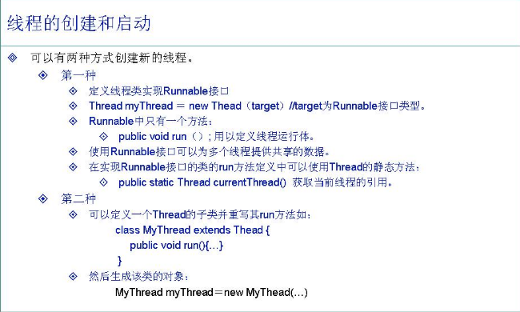
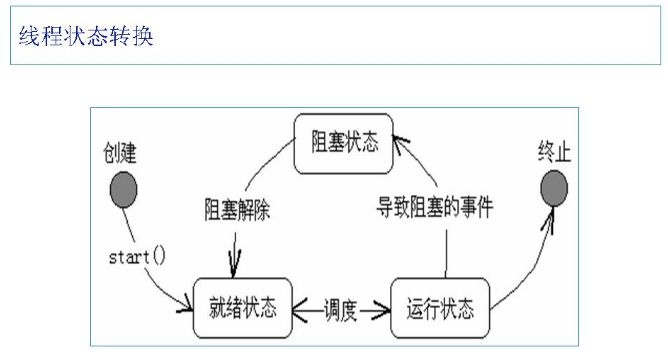
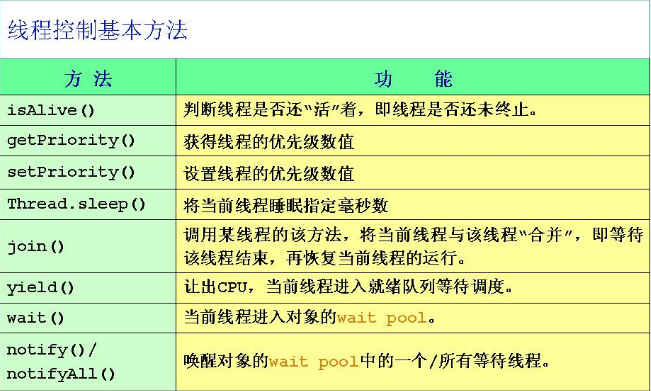
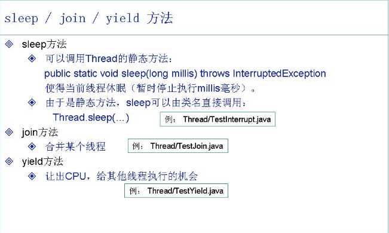
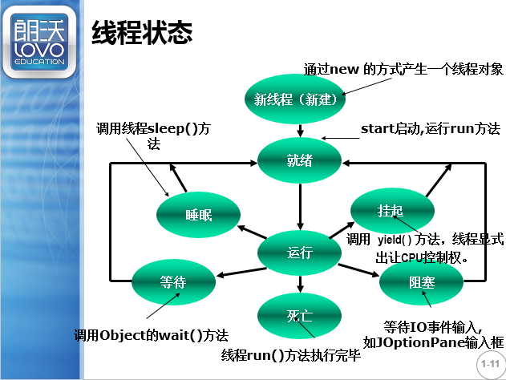
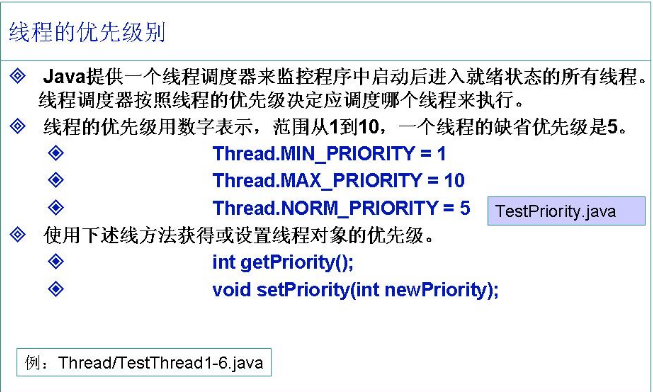

# 第十九章 多线程编程

## 19.1 多线程的概念

1. 认识进程.线程
2. 线程的生命周期
3. 如何使用多线程及难点,同步

大家都知道我们的电脑在运行过程中都是基于进程、线程展开的

    首先来了解下什么是线程、什么是进程？

**进程**：是指一种“自包容”的运行程序，有自己的地址空间  
**线程**：是进程内部单一的一个顺序控制流

    既然有进程，为什么又出现了线程呢？

操作系统运行多个进程以运行多个任务时，要在进程之间进行切换，这种切换的系统开销很大，对系统性能有很大影响。  
为了提升性能，现代操作系统在多进程操作的基础上，将任务的划分下降到了程序级别，使得一个程序在同一时间内可以运行多个任务。**每一个任务称为一个线程**，能够在一个程序内运行多线程的程序称为多线程程序。

    进程与线程之间有什么关系或者区别呢？

**关系**：线程存在于进程之中

**区别**：
 

**相同**：
与进程相同，通过多个线程完成多项任务也是通过CPU在任务之间切换实现的。

    如何很好的理解什么是多线程呢？

大家都知道，现在的windows的电脑都是多程序运行的，在使用电脑过程中，我们感觉电脑好像是同时在运行所有的程序，其实不然，由于我们现在电脑的CPU的运算速度很快，在启动很多程序时，每个程序都需要消耗内存资源和占用CPU的内存，而我们的CPU每秒可以达到上亿次的计算，将上亿次的计算的结果分配给启动的程序，相当于把时间分成很多时间片，分配给不同的线程，使用所有的程序都可以运行，对于我们人来说，感觉起来就好像同时都在运行一样。
但在某个特定时间内，电脑只是在对一个程序进行运算，或者说：对于单个CPU的操作系统来说，在某一时刻实际上只可能有一个线程在运行。但是，通过线程切换任务的系统开销比进程切换小得多。通过基于线程的多任务系统比基于进程的多任务系统性能要好得多。当然双核或者多核的电脑多线程支持更好（非绝对）。

##19.2 掌握线程的实现方式

### 19.2.1线程的实现

 

实现多线程的两种方式：
 

**还有线程池  java util包下**

    如何理解代码中的多线程呢？

我们先来看看以前写的单线程代码JavaOO16/src/test1/T.java

下列代码执行流程

    public class T{
        public static void main(String[] args) {
            m1();
        }
    
        public static  void m1() {
            m2();
            m3();
        }
    
        public static void m2() {}
        public static void m3() {}
    }

从中我们了解到单线程只有一个主线程为main主线程

**线程**：代码的不同运行路径

简单的来看待多线程，就是代码中的运行的路径，有几个分支就是几个线程

进程的另一种说法：有人说进程可以执行，其实不然，进程是一个静态的概念，什么是进程，机器上的.class文件、.exe文件，这个就是进程，程序在执行时，先讲程序代码放在代码区中，程序并没有执行，进程只是准备开始，只是产生了进程，并没有开始运行。最根本的是进程中的main方法启动了，从最根本的讲我们的计算机上运行的都是线程。

每一个Thread对象一个新的线程：

    JavaOO16/src/多线程创建的两种方式/TestThread1.java  
    JavaOO16/src/多线程创建的两种方式/TestThread11.java

由上述两个代码发现，最好采用实现接口的方式：原因是，Java是单继承，继承了Thread就不能继承其它类了

上述了解了怎么启动新的线程

### 19.2.2生命周期

简单的说

在new线程时还仅仅是对象，调用start()方法，并不是调用后就启动了，而是在就绪状态，为什么呢？

——凭什么你线程启动了我就得运行你呢？万一CPU正在执行其它线程呢？就好比一个公共厕所一样,准备好了并不是马上运行，而是CPU选择性的选中你，开始运行你，等待一段时间，就又让你返回到就绪状态；运行完了就终止了；还有种情况就是运行中有情况发生就需要等待——阻塞状态，类似于没有纸了，就需要等待有人送纸过来，没有送过来就不能继续，等待状态。

对于人来说，感觉像是start()后就运行了，真实情况并不是这样的。

    怎么控制线程转换和线程中的其它问题呢？

先来了解下控制线程的一些方法

注意isAlive()活着是除了终止活着没有启动就是活的

优先级越高，获得CPU运算的时间越多，但不是全部占完

通过观察下列代码来了解sleep和join、yield

    JavaOO16/src/sleepTest/TestInterrupt.java  
    JavaOO16/src/joinTest/TestJoin.java  
    JavaOO16/src/yieldTest/TestYield.java

**sleep:**阻塞->变为准备就绪,休眠(会自动醒来,主线程会等)

**join:**在无参时,让主线程等该线程终止,有参,时间完了才.

**yeild:**当前对象使用该方法是,将CPU控制权限交出.

了解了sleep和join、yield三个方法后，我们再来看看线程的每个状态

详细在wait.docx;

### 19.2.3

了解了常用的几个方法后，我们来了解下线程的优先级

话不多说，直接看代码：JavaOO16/src/优先级/TestPriority.java

了解了上述代码的内容后，再观察几个简单的程序

    JavaOO16/src/easy/TestThread（2-6）.java

## 19.3 线程同步

死锁(有一方牺牲掉.)

    什么是线程同步呢？

有时两个或多个线程可能会试图同时访问一个资源  
例如，一个线程可能尝试从一个文件中读取数据，而另一个线程则尝试在同一文件中修改数据，在此情况下，数据可能会变得不一致  
为了确保在任何时间点一个共享的资源只被一个线程使用，使用了**“同步”**

    如何使用同步呢？

使用同步关键字**synchronized**来进行标识

    什么是线程同步呢？

协同步调，按预定的先后次序进行运行。如：在银行取钱，同时两个人在柜台上和ATM上取走了钱，造成金额不正确的问题

    没有同步的情况：JavaOO16/src/线程同步/TestSyncNo.java
    同步后的情况：JavaOO16/src/线程同步/TestSyncTrue.java

/**

* 静态synchronized ()｛｝中貌似可以放任何 在内存中有地址的数据（对象，
* 类模版，数组，枚举都可以）  但不能为空
* 而且都是启动了 同步锁 语句块，问题是是否是同一个同步锁。
* ()内传入了一个已经存在的内存地址并且不会改变时，就会把该语句块看作
* 时同一把锁，这也说明如果是新创建了一个对象（new关键字时）时 ，产生了两
* 个新对象，新地址，不会达到同步锁的效果，所以新对象.getClass()也是一样的，
* 新创了两个对象，地址不同了，虽然类模版是同一个。
* 如果在语句块中改变了（）内的数据，这个锁可能就不会达到效果，也就反面验证以上结论！
* 类似于synchronized是一个门，()是一个门卫，一个线程进去后如果门卫就换了，
* 新门卫肯定不认识后面的线程，就会让它进去！（之前理解错了，以为是类似对象比较）
* 而非静态synchronized ()｛｝中相较于以上就多一个this  当该语句块没结束
* 时this一直不会改变，所以只要不是新对象调用就不会出现没同意锁的问题
  */
