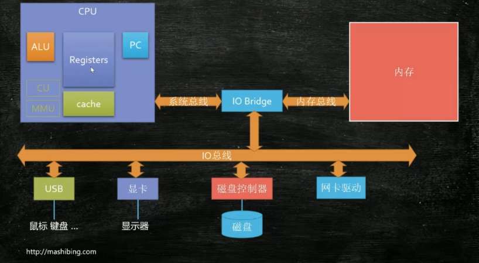
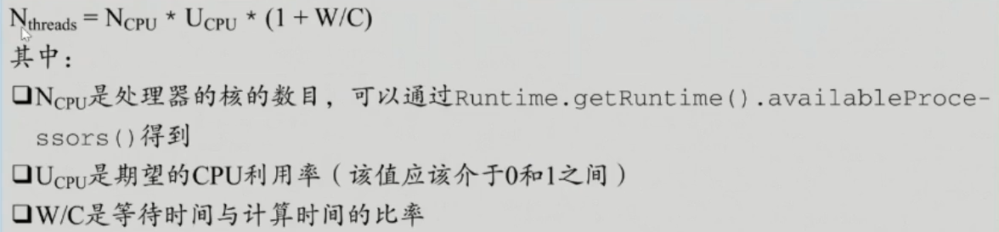
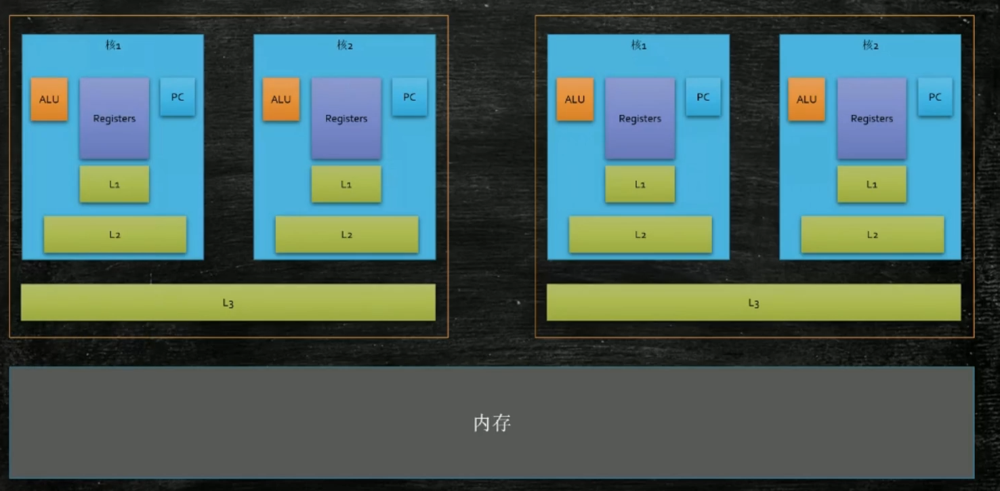
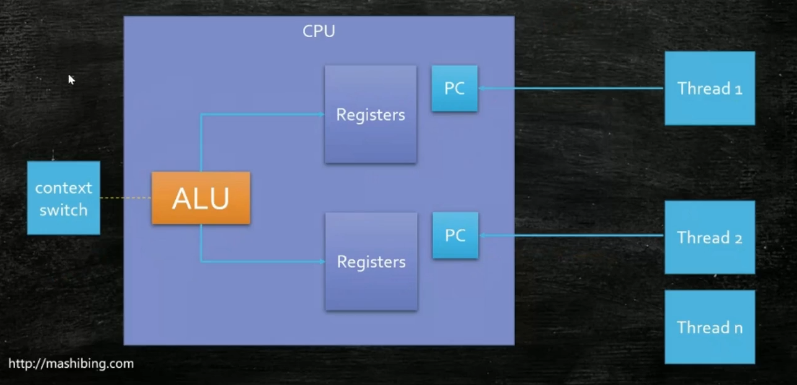
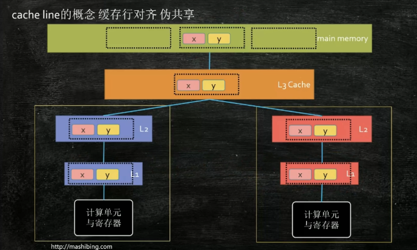
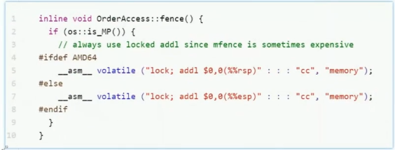

[[TOC]]

缓存一致性

https://my.oschina.net/u/4893843/blog/5541241

## 三大核心



+ ALU ： 数学逻辑单元执行计算  
  + 电路实现： 与 或  异或 或非 最后 用二进制实现 加法器， 然后 - / * 都可以用加法进行实现
+ Registers：寄存器 用于存储需要计算的数据，还是二进制
+ PC：指令集 即 指令执行到什么 地址

## 程序的执行

**控制 数据 地址**

从磁盘读取经到内存中（内存映射）。

如何区分 二进制 是 数据还是指令？ 总线

总线类型：控制线 地址线 数据线 （从哪条线读来的，就是什么）

## 什么的进程什么是线程

一个程序是可以运行多个的，即读取的执行文件到 不同的内存中

同一个进程内部需要多个任务并发执行的需求时： 

+ 可以多进程（但是所有进程是单独的内存，所有得有一个机制，进程与进程的内存同步互通，导致如果独立的进程直接不安全）
+ 引入线程（曾叫轻量级进程）只有计算单元独立，空间共享

进程是静态的概念：程序进入内存，分配对应的资源， 内存空间  同时产生一个主线程

线程的动态概念：可执行的计算单元 即指令 （协程 用户级别的线程）

一个 ALU 同一个时间只能执行一个线程。

## 线程切换

保存A线程的内容状态，然后切换的B线程

线程数量越多，执行效率？活线程的切换耗时

单核CPU多线程有么有意义？当一个线程需要等待的时候，切换到另外可以执行的线程

对于程序，多少设置线程合适？（线程池核心大小？）



`CPU数量*期望CPU的利用率*(1+线程等待律/线程执行律)` 理论 实际要用压测

# CPU级别的并发控制

CPU的速度 内存的速度 100：1  离ALU近

速度指：ALU访问寄存器的速度比访问内存的速度

目前 增加了 一个缓存（CPU到内存之间），LRU LFU 算法进行判断 什么内存数据到缓存 寄存器太贵

多个缓存 即 L1 L2 L3

两颗CPU：



### 超线程

ALP 通常运行一个线程，但是有两套 寄存器 和 指令集



### 缓存行

一次性读取的数据块

当要访问数据的时候，将数据分成一块一块的，这一块即缓存行，

程序的局部性：空间局部性（数据的连续） 时间局部性（指令的连续）

缓存行大：命中大，读取低。反之

一个缓存行的大小：实践：64byte（64*8bit）

Disruptor

## 实现

四种CPU级别的锁 通过系统底层 提供各个锁的 API，然后 再 JVM 调用封装成各个锁

### 关中断

### 缓存一直性协议

硬件自带的，为了保证 缓存L1 L2 ... 等保证缓存行 数据的一致



由于缓存的存在，必须有一种协议来通知进行一致，为了各个缓存块之间的数据一致性

intel : MESI  modify e share i

Disruptor

### 系统屏障

指令不一定是顺序执行的

CPU乱序执行，在等待费时的指令的时候执行后续，不一定按照顺序执行 为了提观效率 

#### **线程的as-if-serial**

单线程：两条语句 未必是顺序执行

单线程的重排序：必须保证最终一致性， 即 单线程下，后续指令不影响前面的指令

看上去是序列化的

#### 哪些指令可以互换顺序

hanppens-before 原则 （JVM规定重排序必须遵守的规则）不允许换顺序

+ 程序次序规则：同一个线程内，按照代码出现的顺序，前面的代码先行与后面的代码，准确的是 控制流顺序，因为要考虑到分支 和 循环结构
+ 管理锁定规则：一个unlock 操作先行发生于后面（时间上） 对同一个锁的lock操作
+ **volatile 变量规则**：对一个 volatile 变量的 些操作先行发生于后面对这个变量的读操作
+ 线程启动规则： thread 的 start  方法先行 发生于这个线程的内的每一个操作
+ 线程终止规则：线程的所有方法，先行 于 线程的终止，thread join isAlive
+ 线程中断规则：
+ 对象终结规则：对象初始化 先于 finallize
+ 传递性：A操作B 。。。

```java
{
    int num = 18;
    new xx() {
        new Thread(() -> {
            this.num
        }).start()
    }
}
```

 (this 溢出，不要在构造方法中开启线程)

#### 双重校验锁（Double check lock）

```java
if (INSTANCE == null) {
    synchronized (Object.class) {
        if (INSTANCE == null) {
            // 1. 分配内存空间，初始化默认值
            // 2. 构建函数执行
            // 3. 引用
            INSTANCE = new xx();
        }
    }
}
```

如果此时，两个线程 第一个线程new的时候 发生的 指令重排，然后跳转 第二个线程，此时是 半初始化

+ 禁止编译器乱序
+ 使用内存屏障阻止指令乱序

内存屏障是特殊的指令：看到这种指令，前面的必须执行完，才能执行后续

hotspot bytecodeinterpreter.cpp 实现 汇编语言



lock 用于多处理器中执行指令对于共享内存的独占使用，后面必须加一个指令，这个指令是空指令

#### Jvm 中的内存屏障 (虚拟实现)

四种 Load x Store

最终实现 系统底层的操作，不一定是 系统屏障， 不同的JVM实现

[关于缓存一致性协议、MESI、StoreBuffer、InvalidateQueue、内存屏障、Lock指令和JMM的那点事](https://my.oschina.net/u/4893843/blog/5541241)

#### volatile

1. 可见性  被修改后马上 其他线程可见
2. 禁止指令重排 （编译后，会在 前后 写操作增加一个 LoadLoad屏障，在 读后 LoadLoad  和 LoadStore   ）

### 总线和缓存锁

## 并发控制
