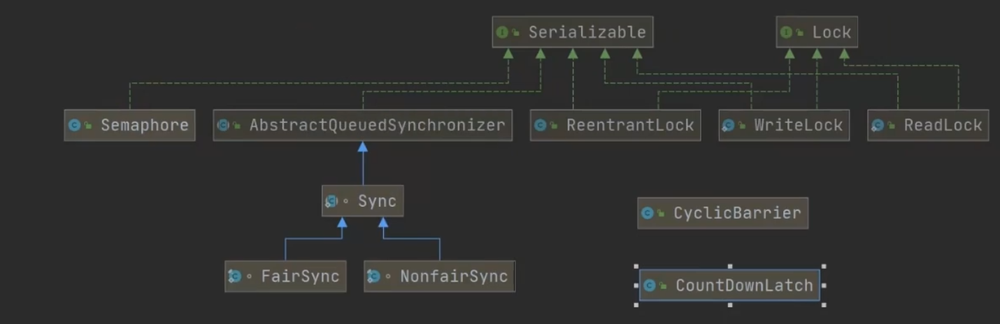
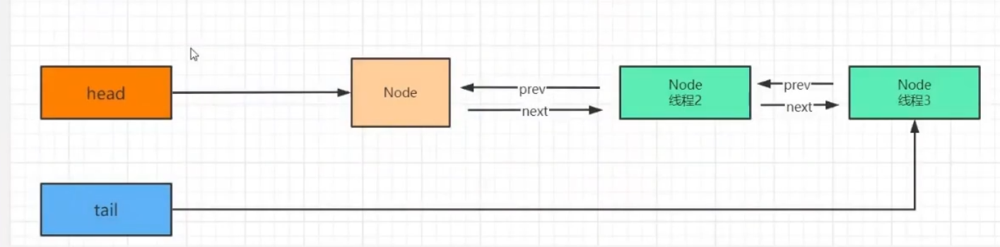
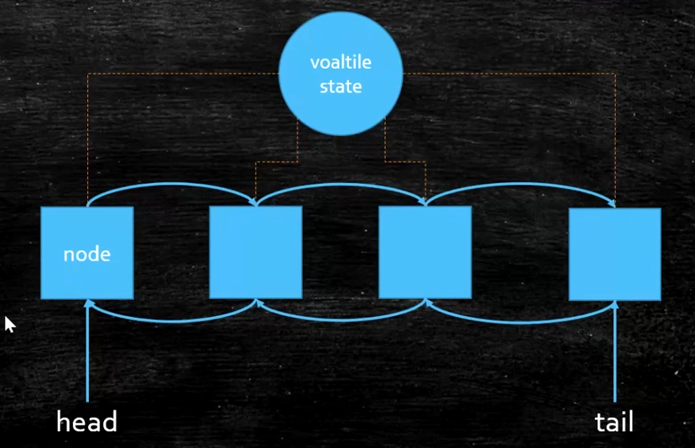

[[TOC]]

# 什么是AQS

JDK提供的一个Java 类 **AbstractQueuedSynchronizer**  **抽象同步队列**

Q：解决什么问题？

A：解决数据安全问题

Q：什么是数据安全问题？

A：多线程之间的共享资源竞争，多线程

Q：造成数据安全问题的原因？

A：

1. 可见性： Java 内存模型（在各个线程中 对应 寄存器修改后的环境，直接同步到 所有缓存），解决 ： volatile synchronized Lock
2. 有序性： 指令重排，解决： volatile Lock
3. 原子性：一段代码，在一个时间内只能由一个线程执行，解决：AtomicInteger synchronized Lock

## 流程

AQS 中 有head tail

1. 创建线程1对应的 node1, nextWaiter 为空
2. initializeSyncQueue 初始化队列， 创建一个空属性 Node 给head tail
3. AQS 中的 tail 不为空， oldTail, 设置给node1 prev
4. 再CAS操作AQS 的tail 设置为 node1
5. 如果成功 node1 设置给 oldTail next, 并返回 node1 即当前 tail
6. acquireQueued 从 AQS 的tail 获取 prev
7. node的prev是 AQS head 时
8. 尝试获取： 当前线程 是 AQS 的当前线程
9. 当前的 node 设置为head,清除 prev thread 引用
10. 上一个 node 清除引用， 待GC
11. 如果ThreadA的锁还没有释放的情况下，ThreadB和ThreadC来争抢锁肯定是会失败，那么失败以后会调用shouldParkAfterFailedAcquire方法
    https://blog.csdn.net/qq_38331606/article/details/84621377

## Lock ReentrantLock

加锁操作，将并行操作 变成 串行

Lock.lock

1. 排他性，互斥性 state
2. 存储 没有抢占到锁线程， 数组 集合 队列...
3. 阻塞 没有抢占到锁线程 wait()  LockSupport.park()（当前线程阻塞）

Lock.unlock

1. 释放锁 state...
2. 唤醒阻塞的线程 notify notifyAll LockSupport.unpark()当前线程唤醒）

重复锁，即 lock.lock() 后又调用了也给 lock.lock() ，不会死锁



1. **AbstractQueuedSynchronizer**  -> Sync -> FairSync （锁）
2. ReentrantLock WriteLock ReadLock Semaphore CountDownLatch CyclicBarrier （具体实现，基于AQS Sync  的实现）

# 源码

```java
public class ReentrantLock implements Lock, java.io.Serializable {
    private final Sync sync;
    public void lock() {
        sync.acquire(1);
    }
    public void unlock() {
        sync.release(1);
    }
    ......
}
```

### lock

```java
// sync.acquire(1);
    public final void acquire(int arg) {
        if (!tryAcquire(arg) && // 线程1  尝试获取锁，如果获取到直接结束，如果没有锁
            acquireQueued(addWaiter(Node.EXCLUSIVE), arg)) // 
            selfInterrupt();
    }
    final boolean nonfairTryAcquire(int acquires) {
            final Thread current = Thread.currentThread(); // 当前线程
            int c = getState();
            if (c == 0) { // 为未加
                if (compareAndSetState(0, acquires)) {// 比较是否为0 然后设置为acquires
                    setExclusiveOwnerThread(current); // 设置锁的拥有者 返回
                    return true;
                }
            }
            else if (current == getExclusiveOwnerThread()) {// 当前线程 为 锁的拥有者，即重复
                int nextc = c + acquires;
                if (nextc < 0) // overflow
                    throw new Error("Maximum lock count exceeded");
                setState(nextc);
                return true;
            }
            return false;
    }
// 存储没有抢占到锁的线程
    private Node addWaiter(Node mode) {
        Node node = new Node(mode); //当前线程（线程2）包装到 Node 

        for (;;) {
            Node oldTail = tail;
            if (oldTail != null) { // 尾巴不为空
                node.setPrevRelaxed(oldTail);// 上一节点的尾巴设置为
                if (compareAndSetTail(oldTail, node)) {// 如果oldTail 还是尾巴，就把 node设置为
                    oldTail.next = node;
                    return node;
                }
            } else {
                initializeSyncQueue();
            }
        }
    }
    private final void initializeSyncQueue() {
        Node h;
        // 链表中 head 是一个空node， 
        if (HEAD.compareAndSet(this, null, (h = new Node())))
            tail = h;
    }
// 阻塞实现
    final boolean acquireQueued(final Node node, int arg) {
        boolean interrupted = false;
        try {
            for (;;) {
                final Node p = node.predecessor(); // 当前线程节点的前一个节点
                if (p == head && tryAcquire(arg)) { // 如果是 head huoqu
                    setHead(node);
                    p.next = null; // help GC
                    return interrupted;
                }
                // 获取锁失败后 是否应该阻塞，即新线程 判断是否应该跳过前面某些线程，而这些线程为放弃状态
                if (shouldParkAfterFailedAcquire(p, node)) 
                    interrupted |= parkAndCheckInterrupt(); // 所有的线程 阻塞在这个方法里面，等待唤醒，唤醒后 继续 走到 tryAcqurie
            }
        } catch (Throwable t) {
            cancelAcquire(node);
            if (interrupted)
                selfInterrupt();
            throw t;
        }
    }
    private static boolean shouldParkAfterFailedAcquire(Node pred, Node node) {
        int ws = pred.waitStatus;
        if (ws == Node.SIGNAL) // 阻塞状态
            /*
             * This node has already set status asking a release
             * to signal it, so it can safely park.
             */
            return true;
        if (ws > 0) { // 放弃状态 会被GC掉，当前节点可以往前面继续寻找
            /*
             * Predecessor was cancelled. Skip over predecessors and
             * indicate retry.
             */
            do {
                node.prev = pred = pred.prev;
            } while (pred.waitStatus > 0);
            pred.next = node;
        } else { // 更新为 -1 阻塞状态
            /*
             * waitStatus must be 0 or PROPAGATE.  Indicate that we
             * need a signal, but don't park yet.  Caller will need to
             * retry to make sure it cannot acquire before parking.
             */
            pred.compareAndSetWaitStatus(ws, Node.SIGNAL);
        }
        return false;
    }
```





### unlock

```java
//  sync.release(1);
    public final boolean release(int arg) {
        if (tryRelease(arg)) {// 尝试施放锁
            Node h = head;
            if (h != null && h.waitStatus != 0)// 还有为阻塞状态
                unparkSuccessor(h); 
            return true;
        }
        return false;
    }
        protected final boolean tryRelease(int releases) { // 尝试施放锁
            int c = getState() - releases; // 状态 -1 
            if (Thread.currentThread() != getExclusiveOwnerThread()) // 当前线程 不是锁的拥有者
                throw new IllegalMonitorStateException();
            boolean free = false;
            if (c == 0) {// 锁施放了
                free = true;
                setExclusiveOwnerThread(null);
            }
            setState(c); // 重复锁的实现 多次后 state 不是1
            return free;
        }
    private void unparkSuccessor(Node node) {
        /*
         * If status is negative (i.e., possibly needing signal) try
         * to clear in anticipation of signalling.  It is OK if this
         * fails or if status is changed by waiting thread.
         */
        int ws = node.waitStatus;
        if (ws < 0)
            node.compareAndSetWaitStatus(ws, 0);

        /*
         * Thread to unpark is held in successor, which is normally
         * just the next node.  But if cancelled or apparently null,
         * traverse backwards from tail to find the actual
         * non-cancelled successor.
         */
        // 如果 第一个节点放弃了，就会从尾节点往前找 最前面的，没有放弃的
        Node s = node.next;
        if (s == null || s.waitStatus > 0) { // 该节点以及放弃
            s = null;
            for (Node p = tail; p != node && p != null; p = p.prev)
                if (p.waitStatus <= 0)
                    s = p;
        }
        if (s != null)
            LockSupport.unpark(s.thread);
    }
```

# 分布式锁

锁中作为中间键

排他 存储 阻塞没有抢占到的请求

是放锁 唤醒线程
