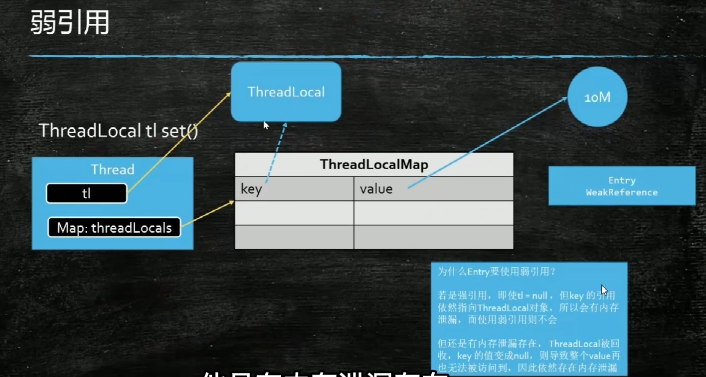

[[TOC]]

[7000+字图文并茂解带你深入理解java锁升级的每个细节 - 华为云开发者联盟的个人空间 - OSCHINA - 中文开源技术交流社区](https://my.oschina.net/u/4526289/blog/5549618)

# 各种锁

## 悲观锁 乐观锁 自旋锁

悲观：坏事一定会发生，预防

乐观： 坏事不太会发生，事后补偿 出现了问题 再处理

自旋锁 ： 乐观锁的一种锁 

即一种补偿，我的修改A  后 与  原本的A不同时，用新A 重新走 这个修改

ABA  问题，：加版本，

## 读写锁 排他锁 共享锁

排他锁：只能有一个线程能访问

共享锁：可以允许多个线程访问 （）

读写锁：

读锁：读的时候允许，允许同时读

写锁：写的时候，不允许其他操作

### 统一锁 分段锁

统一锁：大粒度的锁 （A等B，B等A，死锁，解决就用 统一锁）

分度锁：一段一段的小粒度的锁（链表的读写，某一段锁，其他段不锁）

# 线程池

1、corePoolSize（线程池基本大小）：当向线程池提交一个任务时，若线程池已创建的线程数小于corePoolSize，即便此时存在空闲线程，也会通过创建一个新线程来执行该任务，直到已创建的线程数大于或等于corePoolSize时，（除了利用提交新任务来创建和启动线程（按需构造），也可以通过 prestartCoreThread() 或 prestartAllCoreThreads() 方法来提前启动线程池中的基本线程。）

2、maximumPoolSize（线程池最大大小）：线程池所允许的最大线程个数。当队列满了，且已创建的线程数小于maximumPoolSize，则线程池会创建新的线程来执行任务。另外，对于无界队列，可忽略该参数。

3、keepAliveTime（线程存活保持时间）当线程池中线程数大于核心线程数时，线程的空闲时间如果超过线程存活时间，那么这个线程就会被销毁，直到线程池中的线程数小于等于核心线程数。

4、时间单位

5、workQueue（任务队列）：用于传输和保存等待执行任务的阻塞队列。

6、threadFactory（线程工厂）：用于创建新线程。threadFactory创建的线程也是采用new Thread()方式，threadFactory创建的线程名都具有统一的风格：pool-m-thread-n（m为线程池的编号，n为线程池内的线程编号）。

7、handler（线程饱和策略）：当线程池和队列都满了，再加入线程会执行此策略。

# 纤程协程

进程 分配资源

线程 运行的单元

纤程协程：程序内部 自己实现 线程调度器， 轻量级别创建线程，从而生成的程序线程 和 系统的线程不是 1：1

1. 系统线程的切换 创建 等性能
2. 协程在程序中，并不是休眠状态，而是永远 消耗 CPU 的

Java线程池的分析和使用

http://ifeve.com/java-threadpool/

[Java 并发编程(一)：摩拳擦掌](https://mp.weixin.qq.com/s/ksUUHbt6Nfchy1E00ANg_w)

[Java 并发编程(二)：线程安全性](https://mp.weixin.qq.com/s/HRAabyY-cLcAK_v9x0pMXw)

[Java 并发编程(三)：如何保证共享变量的可见性？](https://mp.weixin.qq.com/s/gTAJdfylc19QwDws5I-2FQ)

### 线程状态

获取状态： t.getState()

1. new 即 创建线程
2. Readable 执行了 start()
   1. Ready 
   2. Running 运行状态
3. TimedWaiting Thread.sleep(time) 等和时间挂钩的
4. Waiting o.wait() t.join LockSupport.park()
5. Blocked synchronied 阻塞状态
6. Teminated 线程业务结束

### 锁的概念

锁是 锁的对象，拿到锁了后才能 最新业务代码

### ThreadLocal



虽然 key 是若引用，当 ThreadLocal 没有强引用指向的时候，就会被回收，但是 Value 不是弱引用。 所以当线程中 不会再使用这个value时 要 tl.remove()

https://juejin.cn/post/7097754858593189901

## 基于CAS 的新锁 AQS

### ReentrantLock 瑞恩吹

基本上同 synchronized

 tryLock ，尝试获取锁 如果一定时间内获取不到 可以 做其他操作

lockInterruptibly，可以被打断的加锁，t.Interrupt 打断

还可以指定公平锁

```java
ReentrantLock lock = new ReentrantLock();
// 创建一个条件 类似线程的队列
Condition condition1 = lock.newCondition();
Condition condition2 = lock.newCondition();
 condition1.signal(); // notify 唤醒一个线程 synchronized o.notify 不能唤醒某些条件的线程
condition2.await(); // wait

condition2.signal();// 唤醒 condition2.await() 的线程
condition1.await();
```

### CyclicBarrier 塞克立刻摆瑞呀 循环栅栏

```java
CyclicBarrier barrier = new CyclicBarrier(20, new Runable(() -> {}))
barrier.await();
// 线程满了 20 就会继续执行，停止等待
```

### Phaser 非日儿 阶段

分阶段执行，所有线程到了某阶段 才继续往下

phaser.arriveAndAwaitAdvance() 阶段等待

phaser.arriveAndDeregister 线程不继续

### ReadWriteLock 读写锁

读 共享锁 与 写 排他锁

读的线程 允许 其他读的线程读，但不允许 写的线程操作，写的线程操作 不允许其他线程操作

```java
ReadWriteLock lock = new ReentrantReadWriteLock();
lock.redlock; lock.writeLock;
```

### Semaphore 色魔佛 信号灯

```java
Smaphore s = new Smaphore(1); // 支持公平与非公平
s.acquire(); // 1 变0  当前线程得到，其他线程不能
s.release(); // 0 变1 
// 用于限流， 同时的 线程
```

### Exchanger 交换器

两个线程之间交换数据

到 exchange() 阻塞

### LockSupport

主要是对锁的支持 LockSupport.park