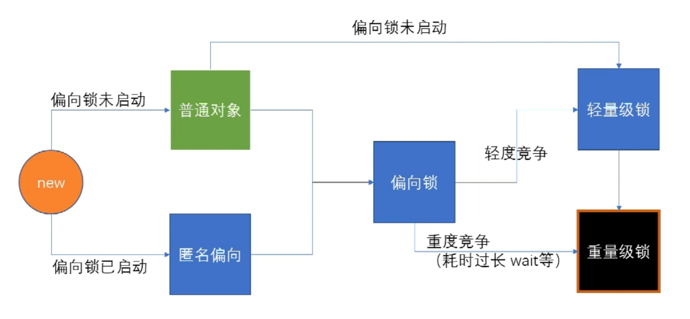

### CAS

compare and swap 比较并交换

内存中 的数据 1， 被A线程 修改为+1 ，然后写回去，保证正常

1. 枷锁
2. CAS，有点补偿的意思 自旋锁，读取值，计算，**然后再读，比较**，对写，不对 再进行读计算

但是 有ABA 问题，加版本号

```java
AtomicInteger#incrementAndGet 最终底层JVM 汇编实现：lock cmpxchg（再读，比较时，加锁）
```

### 用户态和内核态

所有的指令 操作系统级别都可以执行，但是有些指令 用户级别是不能直接进行执行的，需要通过操作系统。

JDK  早期，synchronized 为重量级锁，必须通过内核申请 用户态到内核态的转换。

### markword

synchroniezd 的实现 标识被记录到markword。
image-20220504012814892 未找到
[image-20220504012814892](./assets/image-20220504012814892.png)

link 017 

### Synchronized 锁升级

sheng ku lai si



Synchronized 使用对象时，普通对象 走向偏向锁。轻量级锁（自旋锁）

偏向锁 轻量级锁 即 用户级别的，即内核态

偏向锁：第一线程来时 把线程ID 写到 mark word中，因为大多都一个线程进行的，没有强烈的锁竞争

自旋锁：当有少量竞争时。开始竞争，每个线程 在自己的线程栈中，标记 LR lock Record 。竞争到了的线程，就回将 LR 写到 markword中。其余的线程 开始 CAS

重量级锁：底层 调用的操作系统

#### 锁重入

synchronized 是可重入锁，父类与子类 都使用时

重入次数必须记录，因为要解锁几次。

偏向锁-> 记录到线程栈  LR+1

当有锁的时候，markword 主要位置放 线程ID了，而hashCode 则放在对应的线程栈 LR 执行的数据中，重入的时候，新建的 LR 不存，偏向锁类似，重量级 放在JVM实现存储。

#### 自旋锁升级为重量级锁

竞争加剧：有线程超过10次自旋，或者自旋线程超过CPU核心的一半，1.6 之后 自动

自旋是消耗CPU资源的。如果锁的时间长，或者自旋线程多，CPU 被大量消耗。

重量级锁内部有等待队列，等待的线程 会被 放在 waitSet 队列中。

#### 偏向锁启动与未启动

偏向锁 与 自旋锁的效率：在明确知道会有多线程竞争的情况下，偏向锁肯定会涉及锁撤销，应该直接使用自旋锁。例如 JVM 启动过程中。
