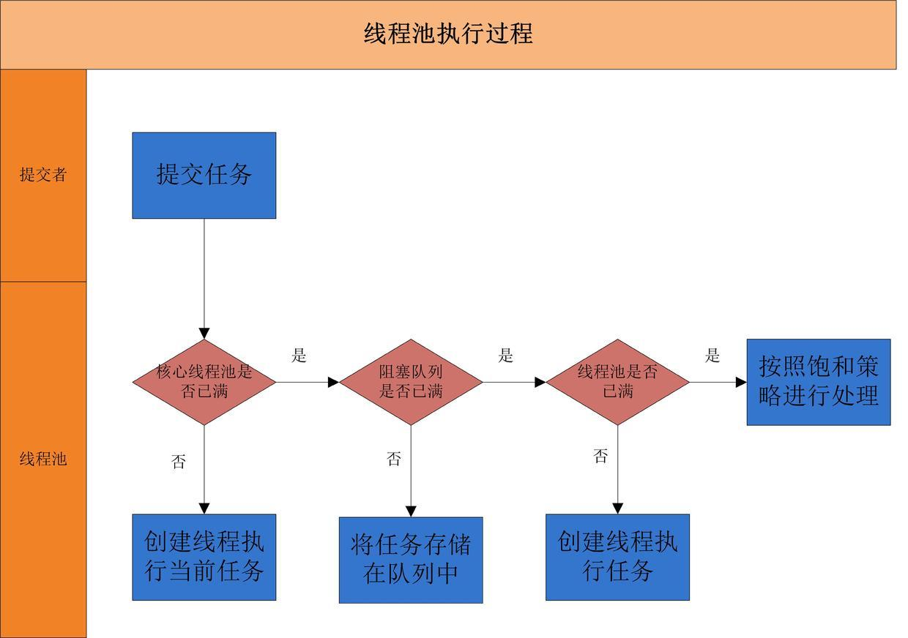

# ThreadPoolExecutor 线程池

主要的博客：[基础概要](https://juejin.im/post/5aeec0106fb9a07ab379574f) [线程池源码阅读](http://www.ideabuffer.cn/2017/04/04/深入理解Java线程池%EF%BC%9AThreadPoolExecutor/#addWorker%E6%96%B9%E6%B3%95)

## 创建

     * @param corePoolSize
     *         线程池维护线程的最少数量
     * @param maximumPoolSize
     *         线程池维护线程的最大数量
     * @param keepAliveTime
     *          线程池维护线程所允许的空闲时间
     * @param unit
     *         线程池维护线程所允许的空闲时间的单位
     * @param  new ArrayBlockingQueue<Runnable>(workQueueNum)
     *         线程池所使用的缓冲任务队列
     * @param threadFactory
     *         线程工厂,为空时，调用默认工厂
     * @param rejectedExecutionHandler 
     *         线程拒绝策略，为空时，调用默认handler

## 使用

 

     * 线程池理解：<br>
     * 第一步：    <br>
     * 线程池开始的步骤，及线程池对象调用execute(Runable)或者submit(Runable)时，<br>
     * 会先，判断是否达到最小维护数量。没有即创建Runable线程对象，到最小线程池中。<br>
     * 知道满足要求，开始执行第二步。<br>
     * 第二步：<br>
     * 将线程对象添加到workQueue列队中。<br>
     * 第三步：<br>

 

`execute()`

```java
    public void execute(Runnable command) {
        if (command == null)
            throw new NullPointerException();
        /*
         * Proceed in 3 steps:
         *
         * 1. If fewer than corePoolSize threads are running, try to
         * start a new thread with the given command as its first
         * task.  The call to addWorker atomically checks runState and
         * workerCount, and so prevents false alarms that would add
         * threads when it shouldn't, by returning false.
         *
         * 2. If a task can be successfully queued, then we still need
         * to double-check whether we should have added a thread
         * (because existing ones died since last checking) or that
         * the pool shut down since entry into this method. So we
         * recheck state and if necessary roll back the enqueuing if
         * stopped, or start a new thread if there are none.
         *
         * 3. If we cannot queue task, then we try to add a new
         * thread.  If it fails, we know we are shut down or saturated
         * and so reject the task.
         */
        // 上面原注解已经很明白：
        // 这里 c的初始默认值 是 -1 << 29 即-536870912
        int c = ctl.get();
        // 如果没有达到最小 继续往里面添加 线程任务对象
        if (workerCountOf(c) < corePoolSize) {
            // 执行 线程任务
            if (addWorker(command, true))
                return;
            c = ctl.get();
        }
        // isRunning(c) 是 c 值 小于 0<<29 
        // 并且可以排队
        if (isRunning(c) && workQueue.offer(command)) {
            int recheck = ctl.get();
            if (! isRunning(recheck) && remove(command))
                reject(command);
            else if (workerCountOf(recheck) == 0)
                addWorker(null, false);
        }
        else if (!addWorker(command, false))
            reject(command);
    }
```
