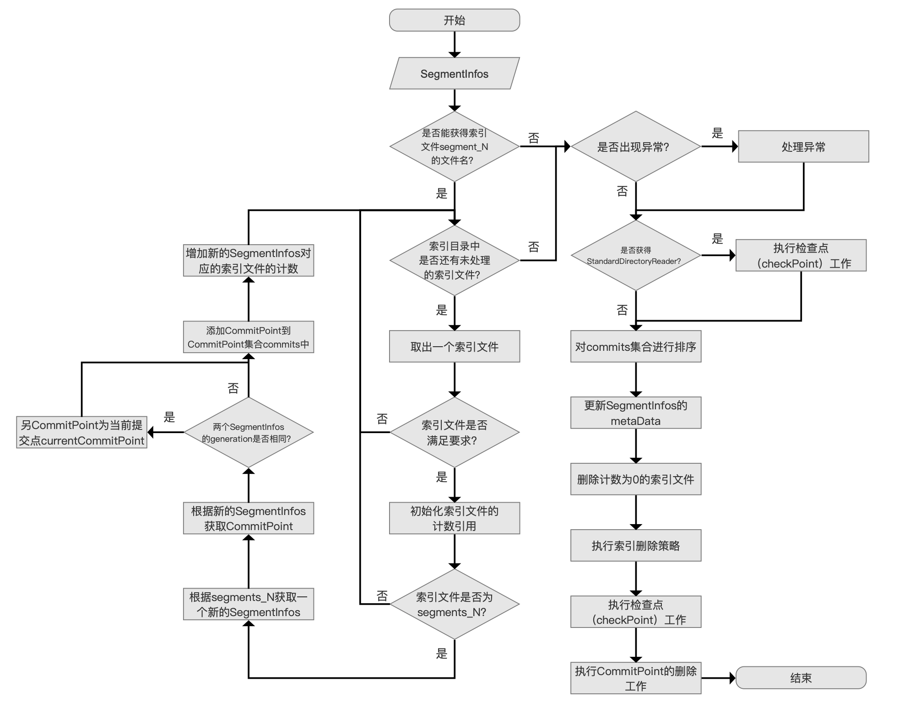
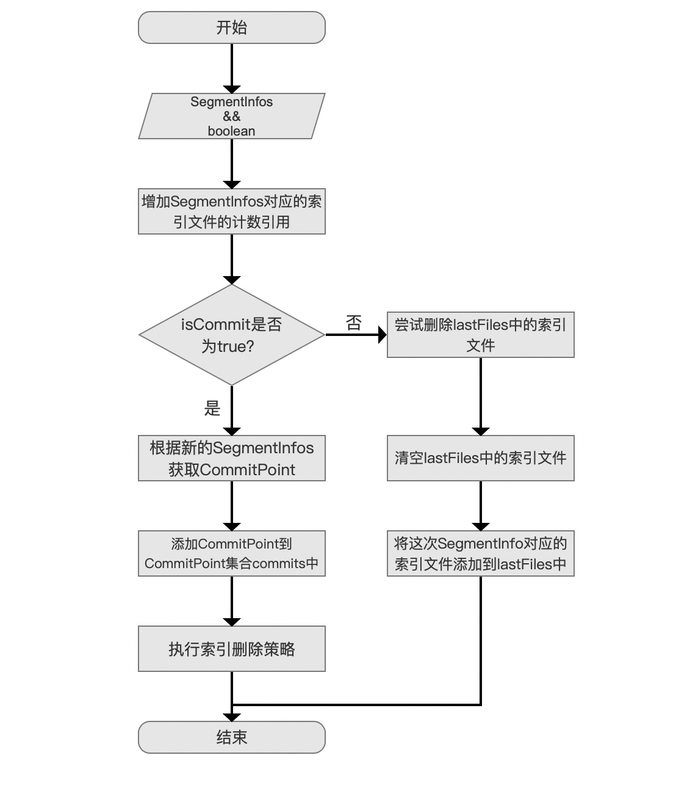

2023年3月26日

## 参考资料

[构造IndexWriter对象（七）](https://amazingkoala.com.cn/Lucene/Index/2019/1202/%E6%9E%84%E9%80%A0IndexWriter%E5%AF%B9%E8%B1%A1%EF%BC%88%E4%B8%83%EF%BC%89/)

[构造IndexWriter对象（八）](https://www.amazingkoala.com.cn/Lucene/Index/)

[构造IndexWriter对象（九）](https://www.amazingkoala.com.cn/Lucene/Index/)

[构造IndexWriter对象（十）](https://www.amazingkoala.com.cn/Lucene/Index/)

## 流程图

IndexWriter indexWriter = new IndexWriter(fsDirectory, config);


紧接 [04 IndexWriter 构造流程1](./04 IndexWriter 构造流程1.md) 中流程。

## 9 生成对象IndexFileDeleter

IndexFileDeleter用来追踪SegmentInfos是否还"活着（live）

在[04 IndexWriter 构造流程1](./04 IndexWriter 构造流程1.md) 4.3.4 中 SegmentInfos对象跟索引文件segments_N的关系

SegmentInfos对象是索引文件segments_N和索引文件.si在内存中的表示

当执行索引删除策略时，例如默认的索引删除策略[KeepOnlyLastCommitDeletionPolicy](https://www.amazingkoala.com.cn/Lucene/Index/2019/0909/92.html)，`新的提交生成后`（即生成新的segments_N文件）`需要删除上一次提交`，即需要删除上一次提交对应的所有索引信息，而用来描述所有索引信息的正是SegmentInfos，删除SegmentInfos的真正目的是`为了删除对应在索引目录中的索引文件`，但这些索引文件如果正在被其他`SegmentInfos引用`，那么就不能被删除，`IndexFileDeleter真正的工作就是判断索引目录中的索引文件是否允许被删除`。

**IndexFileDeleter如何判断索引目录中的索引文件是否允许被删除**

  使用引用计数的方式。

有点像 Java GC 的一个算法。



```java
// Sync'd is silly here, but IFD asserts we sync'd on the IW instance:
      synchronized (this) {
        deleter =
            new IndexFileDeleter(
                files,
                directoryOrig,
                directory,
                config.getIndexDeletionPolicy(),
                segmentInfos,
                infoStream,
                this,
                indexExists,
                reader != null);

        // We incRef all files when we return an NRT reader from IW, so all files must exist even in
        // the NRT case:
        assert create || filesExist(segmentInfos);
      }
```

### 9.1 SegmentInfos 段明细

构造 IndexFileDeleter最重要的一个对象就是SegmentInfos。

由 IndexCommit生成 或者 旧索引文件生成。

### 9.2 能获取 segment_N 的文件名

前面大致已经清楚，能获取 到 segmnet_N 说明是修改。

> SegmentInfos.getSegmentsFileName()

### 9.3 索引目录中是否还有未处理的索引文件

```java
    if (currentSegmentsFile != null) {
      Matcher m = IndexFileNames.CODEC_FILE_PATTERN.matcher("");
      for (String fileName : files) {
        m.reset(fileName);
        if (!fileName.endsWith("write.lock")
            && (m.matches()
                || fileName.startsWith(IndexFileNames.SEGMENTS)
                || fileName.startsWith(IndexFileNames.PENDING_SEGMENTS))) {

          // Add this file to refCounts with initial count 0:
          getRefCount(fileName);

          if (fileName.startsWith(IndexFileNames.SEGMENTS)) {

            // This is a commit (segments or segments_N), and
            // it's valid (<= the max gen).  Load it, then
            // incref all files it refers to:
            if (infoStream.isEnabled("IFD")) {
              infoStream.message("IFD", "init: load commit \"" + fileName + "\"");
            }
            SegmentInfos sis = SegmentInfos.readCommit(directoryOrig, fileName);

            final CommitPoint commitPoint = new CommitPoint(commitsToDelete, directoryOrig, sis);
            if (sis.getGeneration() == segmentInfos.getGeneration()) {
              currentCommitPoint = commitPoint;
            }
            commits.add(commitPoint);
            incRef(sis, true);

            if (lastSegmentInfos == null
                || sis.getGeneration() > lastSegmentInfos.getGeneration()) {
              lastSegmentInfos = sis;
            }
          }
        }
      }
    }
```

处理逻辑：

1. 依次遍历 构造函数的中 files ,即 String[] files = directory.listAll();

2. 目录下排除 write.lock 

3. 文件满足 正则CODEC_FILE_PATTERN 或者 segments 开头 pending_segments 开头

4. 通过文件名 创建对应的 RefCount 索引文件计数器

5. 只处理 segments_N 文件

6. 根据 segments_N 获取对应的 infos，以及对应 CommitPoint

7. 构造参数的segments_N info 与 当前索引目录中的 segments_N info 是否是同一代？如果是，就将 创建的 CommitPoint 设置给中心

8. 将创建的 CommitPoint 添加到集合

9. incRef(sis, true); 增加索引文件的计数 RefCount

索引目录中可能存在`多个segments_N`文件，那么这些文件都需要被处理，其中只有一个segments_N对应的SegmentInfos为构造IndexFileDeleter对象的参数，`SegmentInfos`流程点的segmentInfos。

> **为什么索引目录中会存在多个segments_N文件**？
> 
> 原因主要取决于上一个IndexWriter对象使用了哪种索引删除策略IndexDeletionPolicy
> 
> 比如使用了索引删除策略NoDeletionPolicy，那么每次提交都会保留，又比如使用了默认的索引删除策略KeepOnlyLastCommitDeletionPolicy，那么只会保留最后一次提交。

### 9.4 不能获取 segment_N 或者 未处理的索引文件 以及被 RefCount 标记

异常判断 ： 

currentCommitPoint 没有被设置 但是本地 segmentInfos的 currentSegmentsFile 却获取segment_N，

再次尝试获取 segment_N 文件。如果异常说明 是 有问题  网络文件系统的场景，抛出 CorruptIndexException

如果 获取到了，重新执行 currentCommitPoint RefCount 相关操作。

### 9.5 能否获取 StandarDiectoryReader 标准目录 checkpoint

获取到的情况

```java
if (isReaderInit) {
  // Incoming SegmentInfos may have NRT changes not yet visible in the latest commit, so we have
  // to protect its files from deletion too:
  checkpoint(segmentInfos, false);
}
```



#### 9.5.1 增加计数

```java
// Incref the files:
incRef(segmentInfos, isCommit);
```

```java
void incRef(SegmentInfos segmentInfos, boolean isCommit) throws IOException {
  assert locked();
  // If this is a commit point, also incRef the
  // segments_N file:
  for (final String fileName : segmentInfos.files(isCommit)) {
    incRef(fileName);
  }
}
```

增加SegmentInfos对应的索引文件的计数引用

在后面的流程中，可能会执行索引文件的删除，如果某些索引文件被SegmentInfos引用，那么这些索引文件不应该被删除，防止被删除的方法就是增加SegmentInfos对应的索引文件的计数引用。

#### 9.5.2 isCommit 为 True的处理逻辑

执行 commit 操作时，也会调用这里  checkpoint，故 参数为 true。

```java
if (isCommit) {
  // Append to our commits list:
  commits.add(new CommitPoint(commitsToDelete, directoryOrig, segmentInfos));

  // Tell policy so it can remove commits:
  assert assertCommitsAreNotDeleted(commits);
  policy.onCommit(commits);

  // Decref files for commits that were deleted by the policy:
  deleteCommits();
}
```

1. 根据 segmentInfos 构建新的 CommitPoint , 提交端点
2. 添加到集合 policy
3. 执行索引删除策略

#### 9.5.3 isCommit 为 Flase的处理逻辑

lastFiles是一个IndexFileDeleter类的成员变量，它用来存放上次执行checkPoint的SegmentInfos中对应的索引文件

```java
// DecRef old files from the last checkpoint, if any:
try {
  decRef(lastFiles);
} finally {
  lastFiles.clear();
}

// Save files so we can decr on next checkpoint/commit:
lastFiles.addAll(segmentInfos.files(false));
```

当isCommit为false时，

先尝试删除lastFiles中的索引文件，

删除的方式就是减少每一个索引文件的计数引用，如果`计数值为0`，

那么该索引文件就要被删除，否则不删除，

最后清空lastFiles中的索引文件后，

将这次SegmentInfos对应的索引文件添加到lastFiles中。

9.5.1 增加计数，9.5.3 减少计数，其实 是对 SegmentInfos 中 ，所有的 明细 SegmentInfo 中的 files  判断的。

如果 新增了 段，就会调用 9.5.1 ，如果删除了段 就会调用 9.5.3 中相关逻辑

#### 9.5.4 为什么要通过checkPoint来实现索引文件的删除

Lucene通过IndexWriter对象中的**成员变量SegmentInfos**来描述当前IndexWriter对应的索引信息，索引信息的变化通过SegmentInfos对象来反应。

但是SegmentInfos对象并不真正的拥有索引文件的数据，它拥有只是这些索引文件的文件名。

所以当SegmentInfos对应的信息发生变化时，

例如某个段中包含的所有文档满足某个删除操作，该段的信息会从SegmentInfos中移除

（段的信息即SegmentCommitInfo，见文章[上一章](./04 IndexWriter 构造流程1.md)关于流程点`获得回滚（rollback）信息`的介绍）

那么这个段对应的索引文件也应该要删除

其它段同时引用这些索引文件，那么就不会被删除

一个 IndexFileDeleter 包含了一个 `Map<String, RefCount> refCounts``， 一个文件名 一个 计数器。

SegmentInfos 只要有 变动就会触发 对应的操作，增加计数 或者 减少计数。

SegmentInfos 一些属性 version、counter、generation、segments，其中 segments 就是

对应 目录下 某一个 段的 索引文件名称集合（SegmentInfo） 的集合

#### 9.5.5 为什么获得StandardDirectoryReader后，需要增加segmentInfos对应的索引文件的计数

传入的SegmentInfos可能有NRT更改在最近的提交中还不可见，所以我们必须保护它的文件不被删除:

即在一次 获得了一个NRT的Reader 后，通过该reader获得一个IndexCommit。segment_N 是不可见的。N 对应的 其他所有文件 有被删除的可能。所以才保护

### 9.6 commits 排序

例如 9.5.2 中添加 后

```java
CollectionUtil.timSort(commits);
```

将对应的segments_N对应的SegmentInfos生成CommitPoint，

并且添加到CommitPoint集合commits中，

添加的过程是无序的，

如果构造中的IndexWriter对象使用的是默认的索引删除策略KeepOnlyLastCommitDeletionPolicy，

那么就无法正确的处理 了，所以需要按照从旧到新的提交顺序来排序。

### 9.7 更新SegmentInfos的metaData

```java
// refCounts only includes "normal" filenames (does not include write.lock)
// 只包含正常文件，不包含 write.lock
    inflateGens(segmentInfos, relevantFiles, infoStream);
```

需要更新SegmentInfos的metaData：

+ generation：该值该值是一个`迭代编号`（generation number），用来命名下一次commit()生成的segments_N的N值

+ nextWriteDelGen：该值是一个迭代编号，用来命名一个段的下一次生成的索引文件".liv"

+ nextWriteFieldInfosGen：该值是一个迭代编号，用来命名一个段的下一次生成的索引文件".fnm"

+ nextWriteDocValuesGen：该值是一个迭代编号，用来命名一个段的下一次生成的索引文件".dvm&&.dvd"

在更新操作中（updateNumericDocValue）：

执行完一次，就会生成一个 _n_M.fnm 文件 _n_M_Lucencexxx.dvm&&.dvd

其中 n 为对应的索引文件名称，M 为 对该索引文件 的 第几次操作。

同理 在 删除操作中（deleteDocuments）：

生成的 _n_M.liv 同理

但是 9.5 中执行没有？

### 9.8 删除计数为0的索引文件

deleteFiles(toDelete);

根据索引目录中的segments_N文件，找到对应的所有索引文件，然后增加了这些索引文件的计数，所以他们是不会被删除

segments_N对应的索引文件，那么此时索引目录中还剩下两种类型的索引文件：

- “不优雅”的索引文件：这些文件的计数肯定为0
- 通过NRT生成的索引文件：这些索引文件是有效的索引信息，不能被删除，这也是解释为什么我们需要执行图17中用蓝色标注的流程点，在这两个流程点中，通过NRT生成的索引文件会被增加计数，故不会被删除

### 9.9 执行索引删除策略

policy.onInit(commits);

前一个 indexWriter 执行Close后，

### 9.10 执行检查点

> Always protect the incoming segmentInfos since  sometime it may not be the most recent commit
> 
> 始终保护传入的segmentinfo，因为有时它可能不是最近的提交

checkpoint(segmentInfos, false);

9.5 中执行了一次 不关isCommit 是 True。

PersistentSnapshotDeletionPolicy snapshot() 对最新的提交生成一个 快照，文件 snapshot_0 = sengment_2


执行删除操作，文档0跟文档1都满足该删除条件，提交后 生成的 segnment_3 就不会保包含 0 1 文档的信息


| 段名/索引文件    | _0.cfs | _0.cfe | _0.si | _1.cfs | _1.cfe | _1.si | _2.cfs | _2.cfe | _2.si |
| ---------- | ------ | ------ | ----- | ------ | ------ | ----- | ------ | ------ | ----- |
| segments_1 | 1      | 1      | 1     | 0      | 0      | 0     | 0      | 0      | 0     |
| segments_2 | 1      | 1      | 1     | 1      | 1      | 1     | 0      | 0      | 0     |
| segments_3 | 0      | 0      | 0     | 0      | 0      | 0     | 1      | 1      | 1     |
| 计数和值       | 2      | 2      | 2     | 1      | 1      | 1     | 1      | 1      | 1     |

之前已经梳理过 检查点逻辑。 如果 文件名 对应的 计数器为0，就应该被删除。

如果正常逻辑 KeepOnlyLastCommitDeletionPolicy 策略下 保留最新的，直接执行 删除策略，被删除的 是_1 执行计数-1，

但是 如果使用的 snapshot_0 作为构造参数 新的 indexWriter ，就不应该被删除。所以就需要 检查点的操作。
