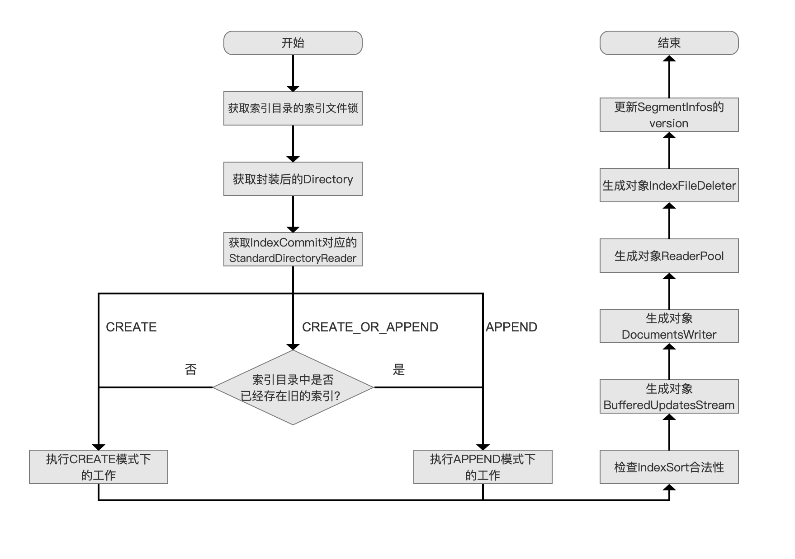
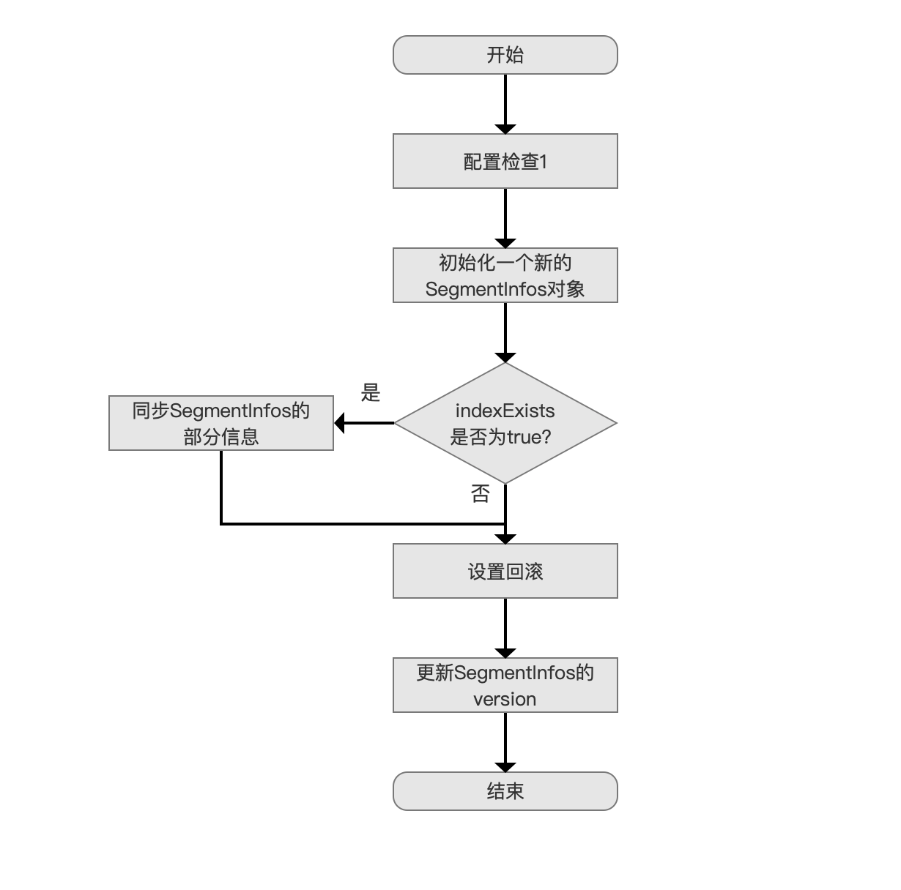
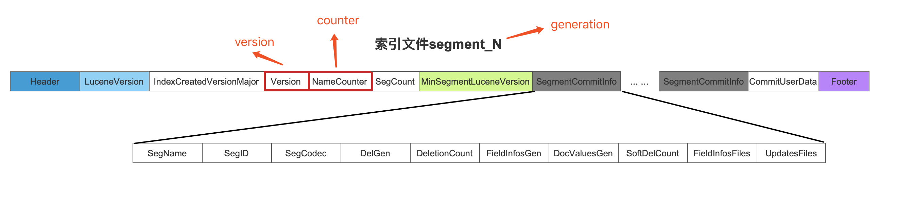
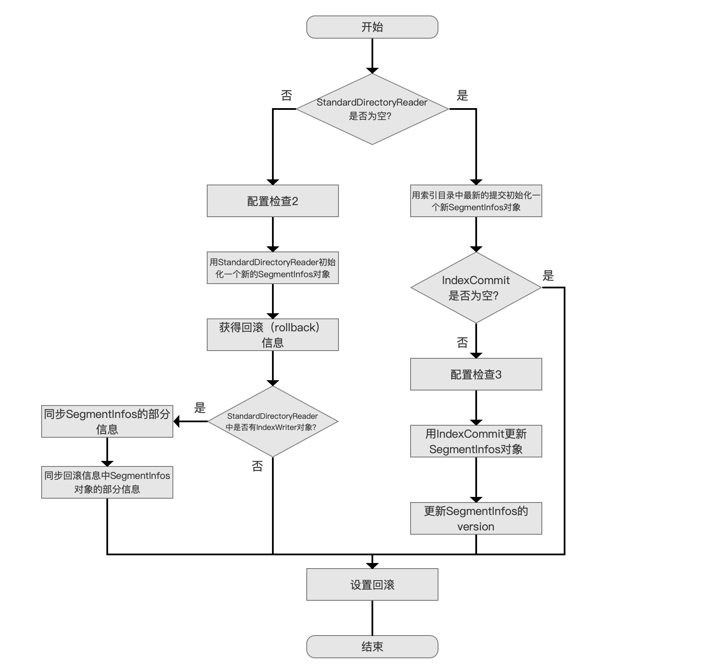
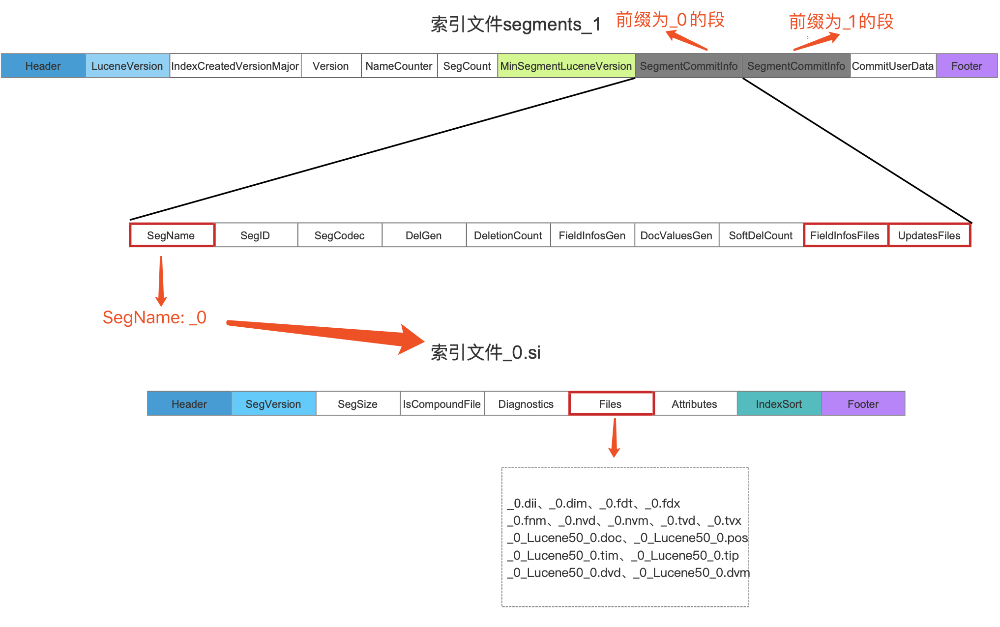

# 参考资料

[构造IndexWriter对象（三）](https://www.amazingkoala.com.cn/Lucene/Index/)

[构造IndexWriter对象（四）](https://www.amazingkoala.com.cn/Lucene/Index/)

[构造IndexWriter对象（五）](https://www.amazingkoala.com.cn/Lucene/Index/)

[构造IndexWriter对象（六）](https://www.amazingkoala.com.cn/Lucene/Index/)

# 流程图

> IndexWriter indexWriter = new IndexWriter(fsDirectory, config);



# 1 获取索引文件锁

> writeLock = d.obtainLock(WRITE_LOCK_NAME);

# 2 获取封装的实现的Directory

这里应该不是直接使用 FSDirectory 实现，而是 使用 FilterDirectory 实现 LockValidatingDirectoryWrapper 进行包装。

> directory = new LockValidatingDirectoryWrapper(d, writeLock);

# 3 获取IndexCommit对应的StandardDirectoryReader

IndexCommit 由配置提供，IndexCommit中包含的索引信息

9.5 的时机在后面一步

```java
      // Set up our initial SegmentInfos:
      IndexCommit commit = config.getIndexCommit();

      // Set up our initial SegmentInfos:
      StandardDirectoryReader reader;
      if (commit == null) {
        reader = null;
      } else {
        reader = commit.getReader();
      }
```

# 4 不同的OpenMode执行对应的工作

判断是否存在旧索引

## 4.1 CREATE的流程



```java
if (create) {
        // 1 配置检查
        if (config.getIndexCommit() != null) {
          // We cannot both open from a commit point and create:
          if (mode == OpenMode.CREATE) {
            throw new IllegalArgumentException(
                "cannot use IndexWriterConfig.setIndexCommit() with OpenMode.CREATE");
          } else {
            throw new IllegalArgumentException(
                "cannot use IndexWriterConfig.setIndexCommit() when index has no commit");
          }
        }

        // 2 初始化新对象
        final SegmentInfos sis = new SegmentInfos(config.getIndexCreatedVersionMajor());
        if (indexExists) {
          // 3 获取最后异常 提交中的信息
          final SegmentInfos previous = SegmentInfos.readLatestCommit(directory);
          sis.updateGenerationVersionAndCounter(previous);
        }
        segmentInfos = sis;
        rollbackSegments = segmentInfos.createBackupSegmentInfos();

        // Record that we have a change (zero out all
        // segments) pending:
        // 跟新segmentInfos版本
        changed();

      }
```

在结束9.5有些不同 并没有设置回滚信息

### 4.1.1 配置检查

由于之前已经判断了，是否存在旧索引

IndexCommit的目的是读取已经有的索引信息，但是 openmodel 是 create 覆盖新建，所以报错

不存在索引，OpenMode为CREATE_OR_APPEND。说明是 新建，但是 设置了 IndexCommit，所以报错

### 4.1.2 初始化 SegmentInfos

SegmentInfos对象是索引文件segments_N以及索引文件.si在内存中的描述

### 4.1.3 同步SegmentInfos的部分信息

如果存在旧索引，旧需要同步。

SegmentInfos中的三个信息，即version、counter、generation

+ version：该值用来描述SegmentInfos发生改变的次数，即索引信息发生改变的次数

+ counter：它跟下划线“_”作为一个组合值，用来描述下一次生成（commit、flush操作）的新段对应的索引文件的前缀值，"_n"n即为counter值，该值为一个从0开始的递增值

+ generation：用来描述执行提交操作后生成的segments_N文件的N值，

上述三个信息在索引文件segments_N中的位置如下所示：



新生成的索引文件不会跟旧的索引文件有一样的名字，即不会覆盖旧的索引文件，那么其他线程可以正常通过IndexCommit读取旧索引执行搜索。

## 4.2 APPEND的流程



## 4.3 StandardDirectoryReader 不为空

StandardDirectoryReader 是通过 IndexCommit 获取的 （commit.getReader()）。

所以：

+ IndexCommit 为空

+ IndexCommit 不为空，单没获取到 Reader

IndexCommit 实现有 `ReaderCommit `获取StandardDirectoryReader。

IndexCommit 构建是通过 StandardDirectoryReader getIndexCommit 实现

```java
  public IndexCommit getIndexCommit() throws IOException {
    ensureOpen();
    return new ReaderCommit(this, segmentInfos, directory);
  }
```

CommitPoint `IndexFileDeleter`生成。

SnapshotCommitPoint 包装类型。

### 4.3.2 Reader 检查2

Reader 的一些检查

### 4.3.3 StandardDirectoryReader初始化一个新的SegmentInfos对象

主要获取 SegmentInfos 中的 版本 什么的

> segmentInfos = reader.segmentInfos.clone();

### 4.3.4 获得回滚（rollback）信息

> lastCommit = SegmentInfos.readCommit(directoryOrig, segmentInfos.getSegmentsFileName());



新的 segments_n 文件，是包含 前一次的 SegmentInfos 数据。

SegmentInfos 数据是包含 SegName: _n-1 , 即 对应所有 前一次的所有文件前缀。

> SegmentInfos now -> segments_n 文件 -> SegmentInfos 0 - n
> 
> SegmentInfos -> segName: _n -> _n.si
> 
> _n.si -> files -> _n.xxx

我们通过IndexCommit可以获得SegmentInfos信息，

但是该对象只是`描述了它对应的索引文件`有哪些，并不具有这些索引文件真正的数据，

故可能在获得IndexCommit之后，索引又发生了变化，

例如又出现了新的提交，那么根据默认的索引删除策略，segments_1文件就会被删除，

当执行回滚操作时就无法获得真正的索引数据。如果出现在这个情况，那么在当前流程点会抛出如下的异常

### 4.3.4 同步SegmentInfos以及回滚信息中SegmentInfos中的部分信息

就是将 新的操作信息，同步到 4.3.3 创建的 SegmentInfos 中，前提是必须得有 IndexWriter

```java
        if (reader.writer != null) {

          // The old writer better be closed (we have the write lock now!):
          assert reader.writer.closed;

          // In case the old writer wrote further segments (which we are now dropping),
          // update SIS metadata so we remain write-once:
          segmentInfos.updateGenerationVersionAndCounter(reader.writer.segmentInfos);
          lastCommit.updateGenerationVersionAndCounter(reader.writer.segmentInfos);
        }
```

DirectoryReader.open 是可以不有 IndexWriter 参数的。

old Writer指的就是StandardDirectoryReader中的IndexWriter对象，上述注释的意思是为了能处理old writer可能生成的新提交（一个或多个），并且该提交是需要丢弃的。

### 4.3.5 设置回滚

下一次commit前出现任何的错误，都可以回到当前设置的回滚状态，如果某次提交成功了，那么rollbackSegment会被重新设置该次提交。

> rollbackSegments = lastCommit.createBackupSegmentInfos();

## 4.4 StandardDirectoryReader 为空

### 4.4.2 用索引目录中最新的提交初始化一个新SegmentInfos对象

同4.3.3 

> segmentInfos = SegmentInfos.readCommit(directoryOrig, lastSegmentsFile);

### 4.4.3 indexCommit 是否为空

> IndexCommit commit = config.getIndexCommit();

1. 用户没设置 IndexCommit

2. 用户设置了 IndexCommit，但是 IndexCommit 中没有设置 Reader

```java
        if (commit != null) {
          // Swap out all segments, but, keep metadata in
          // SegmentInfos, like version & generation, to
          // preserve write-once.  This is important if
          // readers are open against the future commit
          // points.
          if (commit.getDirectory() != directoryOrig) {
            throw new IllegalArgumentException(
                "IndexCommit's directory doesn't match my directory, expected="
                    + directoryOrig
                    + ", got="
                    + commit.getDirectory());
          }
```

如果IndexCommit不为空，那么IndexCommit必定是CommitPoint或者SnapshotCommitPoint对象

其中commit即IndexCommit对象、directoryOrg为IndexWriter的工作目录，这个配置检查意味着要求当前构造的IndexWriter的工作目录必须和IndexCommit对应的索引信息所在的目录`必须一致`

### 4.4.4 用IndexCommit更新SegmentInfos对象

```java
SegmentInfos oldInfos =
             SegmentInfos.readCommit(directoryOrig, commit.getSegmentsFileName());
segmentInfos.replace(oldInfos);
```

通过IndexCommit读取对应的索引信息，然后更新到上文中已经完成初始化的SegmentInfos对象中。

对一个已经初始化的SegmentInfos进行更新操作必然需要更新version

### 4.4.5 设置回滚

rollbackSegments = segmentInfos.createBackupSegmentInfos();

# 5 检查IndexSort合法性

validateIndexSort();

如果设置了就会操作

获取 segmentInfos 所有的段对象，

每个段对象中的 indexSort 是否存在

设置的 indexSort 和 段中的 字段是否小于？

如果是 就报错。

9.5 中已经没有Lucene 的版本判断了。

# 6 生成对象BufferedUpdatesStream

> bufferedUpdatesStream = new BufferedUpdatesStream(infoStream);

BufferedUpdatesStream用来追踪（track）FrozenBufferedUpdates，主要负责执行FrozenBufferedUpdates的两个工作：

- 获得nextGen：它用来描述FrozenBufferedUpdates中的删除信息应该作用哪些段，见[文档提交之flush（六）](https://www.amazingkoala.com.cn/Lucene/Index/2019/0805/79.html)文章中的介绍

- 作用（apply）删除信息

# 7 生成对象DocumentsWriter

> docWriter =  
>     new DocumentsWriter(  
>         flushNotifications,  
>         segmentInfos.getIndexCreatedVersionMajor(),  
>         pendingNumDocs,  
>         enableTestPoints,  
>         this::newSegmentName,  
>         config,  
>         directoryOrig,  
>         directory,  
>         globalFieldNumberMap);

  DocumentsWriter对象主要负责下面的三个工作：

- 文档的增删改：用户通过IndexWriter对象执行文档的增删改的任务，实际都是IndexWriter通过调用DocumentsWriter对象来实现的，文档的增删改的详细过程可以看[文档的增删改](https://www.amazingkoala.com.cn/Lucene/Index/2019/0626/68.html)的系列文章
- 将DWPT生成（flush）为一个段：该工作即图4中的流程`执行DWPT的doFlush()`
- 执行主动flush以后的收尾工作：该内容见[文档提交之flush（六）](https://www.amazingkoala.com.cn/Lucene/Index/2019/0805/79.html)中关于[DocumentsWriterFlushControl.finishFullFlush( )](https://github.com/LuXugang/Lucene-7.5.0/blob/master/solr-7.5.0/lucene/core/src/java/org/apache/lucene/index/DocumentsWriterFlushControl.java)的方法的介绍

# 8 生成对象ReaderPool

> readerPool =  
>     new ReaderPool(  
>         directory,  
>         directoryOrig,  
>         segmentInfos,  
>         globalFieldNumberMap,  
>         bufferedUpdatesStream::getCompletedDelGen,  
>         infoStream,  
>         conf.getSoftDeletesField(),  
>         reader);

存放reader的池子
