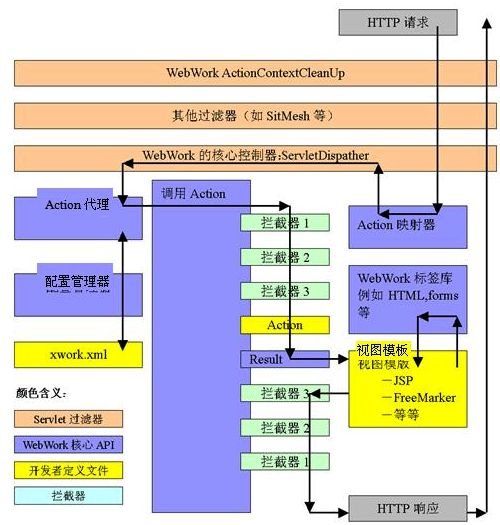

[[TOC]]

# 第二章： Struts 2 基础

2019年3月24日 - 2019年4月12日

## 2.1 Struts 1与 Struts 2的差别

Struts 1的 缺陷：

+ Struts 1只支持 JSP 表现层技术，目前许多的 Java EE 应用步一定使用 JSP
+ 对 Servlet API 严重耦合，一旦脱离Web服务器，Action 测试异常困难
+ Struts 1 的Action 必须继承 Action 基类，实现处理方法时，又必须使用大量 Struts 1的API。对于重构困难巨大。

Struts 2的优势：

+ Struts 2视图技术支持更广 （JSP、FreeMarker、Velocity）
+ Struts 2的Action 无需与ServletAPI 耦合。使得测试更加容易，提供代码重用率。就像一个普通的 POJO
+ Struts 2 更好的模块化与扩展性。而且Struts 2还使用了插件机制，开发者可以在不修改任何的前提下，开发Struts 2插件，扩展功能。

## 2.2 框架结构

图中：**WebWork的核心控制器为 StrutsPrepareAndExecuteFilter**

 

可见，Struts 2使用了大量拦截器组成的拦截器链，过滤用户的请求。

### 2.2.1 流程

1. 客户端发送一个HTTP请求
2. web容器收到请求后，会将请求传递给一个标准的`ActionContextCleanUP`过滤器来清除属性，不让他后续的过滤器清除，延长Action中属性（包括自定义属性）的生命周期，以便在页面中进行访问
3. ActionContextCleanUP 过后，经过其他过滤器，如`SitMesh`等，然后传递给核心控制器 `StrutsPrepareAndExecuteFilter`
4. `StrutsPrepareAndExecuteFilter` 调用ActionMapper确定请求那个 Action，才将控制交由 `ActionProxy`代理
5. `ActionProxy` 代理 调用 配置管理器 `ConfigurationManager` 从配置文件中读取信息，创建`ActionInvocation`对象
6. `ActionInvocation`在调用 Action之前 依次调用 所用配置拦截器链，一旦 `Action`执行结果返回字符串，`ActionInvocation`就会根据结果字符串 查找到 对应的`Result`
7. `Result`会调用 视图模板 （JSP FreeMarker 等）来显示，并在客户端Http响应之前，以相反的拦截器链顺序执行。
8. 响应回`StrutsPrepareAndExecuteFilter`，在依次经过 web.xml配置的过滤器，最终发送到客户端

### 2.2.2 控制器

Struts 2的控制器 ： `StrutsPrepareAndExecuteFilter` 与 业务控制器`Action`

与 Spring MVC 不同的是，配置的是过滤器到 web.xml 

```xml
  <filter>
  	<filter-name>struts2</filter-name>
  	<filter-class>org.apache.struts2.dispatcher.filter.StrutsPrepareAndExecuteFilter</filter-class>
  </filter>
  <filter-mapping>
  	<filter-name>struts2</filter-name>
  	<url-pattern>/struts/*</url-pattern>
  </filter-mapping>
```

Action: 不继承 不实现，只有一个 execute() 业务方法返回String。返回的结果 作为处理结果 映射到任何视图上，或者 action 上。

### 2.2.3 配置文件

配置文件有两个， Struts.xml 用于配置 Action 相关信息，Struts.properties 配置Struts2 的全局属性。

```xml
<!DOCTYPE struts PUBLIC
        "-//Apache Software Foundation//DTD Struts Configuration 2.0//EN"
        "http://struts.apache.org/dtds/struts-2.0.dtd">
<struts>
	<constant name="" value=""></constant>
	<!-- struts2的action必须放在一个指定的包空间下定义 -->
	<package name="default" extends="struts-default">
		<!-- 定义处理请求URL为login.action的Action -->
		<action name=""
			class="">
			<!-- 定义处理结果字符串和资源之间的映射关系 -->
			<result name="success">/success.jsp</result>
			<result name="error">/error.jsp</result>
		</action>
	</package>
</struts>
```

```properties
# 指定默认 编码集
struts.i18n.encoding = UTF-8
# 设置当struts.xml文件改动时，是否重新加载.
struts.configuration.xml.reload = true
# 被FilterDispatcher使用，指定浏览器是否缓存静态内容，测试阶段设置为false，发布阶段设置为true.
struts.serve.static.browserCache=true
```

### 2.2.4 标签库

struts 2 的标签库非常完善，可以直接替代 JSTL，而且支持OGNL 表达式。

## 2.3 第一个实例 hello struts 2

web.xml

```xml
  <filter>
  	<filter-name>struts2</filter-name>
  	<filter-class>org.apache.struts2.dispatcher.filter.StrutsPrepareAndExecuteFilter</filter-class>
  	<init-param> 
        <param-name>config</param-name> 
        <param-value>struts-default.xml,struts-plugin.xml,struts.xml</param-value>
    </init-param>
  </filter>
  <filter-mapping>
  	<filter-name>struts2</filter-name>
  	<url-pattern>/*</url-pattern>
  </filter-mapping>
```

action

```java
public class TestAction {
	public TestAction() {
	}

	private String userName;

	private int age;

	private String gender;

	///get set... toString

	public String execute() throws Exception {
		System.out.println(this.userName);
		System.out.println(this.age);
		System.out.println(this.gender);

		return "ok";
	}
}
```

struts.xml

```xml
<struts>
	<!-- 可以调试 -->
	<constant name="struts.devMode" value="true"></constant>
	
	<!-- struts2的action必须放在一个指定的包空间下定义    这里默认包-->
	<package name="default" extends="struts-default">
		<!-- 注册action  当访问 为 test.action  就是这个 -->
		<action name="test"
			class="struts2.base.demo.actions.TestAction">
			<!-- 定义处理结果字符串和资源之间的映射关系 -->
			<result name="ok">/success.jsp</result>
			<result name="error">/error.jsp</result>
		</action>
	</package>
</struts>
```

jsp

```xml
<%@ page language="java" contentType="text/html; charset=utf-8"
	pageEncoding="utf-8"%>
<!DOCTYPE html PUBLIC"-//W3C//DTD HTML 4.01 Transitional//EN" "http://www.w3.org/TR/html4/loose.dtd">
<html>
<head>第一个struts 2 </head>
<body>
	<h2>Hello World!</h2>
	<form method="post" action="./test.action">
		名称 ：<input type="text" name="userName"/><hr/> 
		年龄 ：<input type="text" name="age"/><hr/> 
		性别 ：<input type="text" name="gender"/><hr/>
		<input type="submit" value="提交"/> 
	</form>
</body>
</html>

```

struts.properties

```properties
# 指定默认 编码集
struts.i18n.encoding = UTF-8
# 设置当struts.xml文件改动时，是否重新加载.
struts.configuration.xml.reload = true
# 被FilterDispatcher使用，指定浏览器是否缓存静态内容，测试阶段设置为false，发布阶段设置为true.
struts.serve.static.browserCache=false
```

有个疑问：web.xml 中配置 过滤路径 为  /path/*   jsp 跳转, 怎么填都无法 跳转到正确页面

### 2.3.1 映射解

>主过滤器映射路径： /*   (例如 http://192.168.0.200:8080/Struts2Base)
>
>Struts.xml配置 : /value.jsp  (action 返回 string 对应的 jsp，或者其他)
>
>action请求 ： ./test.action (例如 http://192.168.0.200:8080/Struts2Base/test.action)

其他路径：

>主过滤器映射路径： /path/*   (例如 http://192.168.0.200:8080/Struts2Base/path/*)
>
>Struts.xml配置 :  ../success.jsp  (action 返回 string 对应的 jsp，或者其他)
>
>action请求 ： ./path/test.action (例如 http://192.168.0.200:8080/Struts2Base/path/test.action)

可以得知，当前的路径是，相对于 action 请求的路径前缀的 （http://192.168.0.200:8080/Struts2Base/path/）。而 struts.xml 是 的路径，是根据这个前缀 来寻找 对应jsp 在项目中的位置。故而需要 "../ "到达项目根目录，再去寻找。

当然这些 都在在我们 配置 struts.xml 的package 的 name属性时为 default。

--------------

问题来了，上面的问题无法复现！/path/* 下 struts.xml 不需要 ../