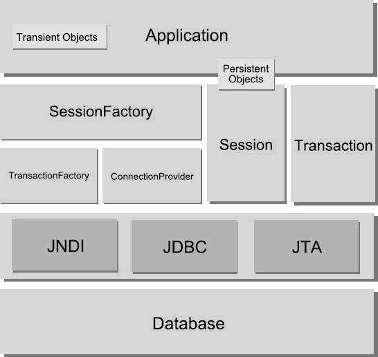

[[TOC]]

# 第五章 Hibernate 入门

2019年6月5日 - 2019年6月20日

## 5.1 概述

Hibernate 是一个 开源的 ORM（Object Relational Mapping 对象关系映射） 框架。

解决对象与 关系形数据库之间的 映射的问题，并对 JDBC 进行最大限度的对象封装，是程序员可以通过面向对象的编程思维操作数据库。

### 5.1.1 ORM 起源

主流开发语言， 基本都有面向对象的思想，对象都在内存中，无法永久保存。而在关系形数据库中，与对象 创建一个对应关系。产生了 ORM。

ORM 框架优势：

+ 通过面向对象的思维对数据库访问。
+ 简单易用，提高开发效率，
+ 降低访问数据的频率，提高性能
+ 相对独立，变动时不会影响上层实现

**所有的 ORM 工具 都遵循相同的映射思路：**

+ 表与类的映射：数据库中的 表被映射到一个持久类上，当对持久类进行操作时，系统会自动 转换为对数据库的表进行增加 、删除、修改 等操作。POJO
+ 表中的行 与 对象映射：每个实例对应表中的一个条数据；
+ 表中的列 与 对象的属性映射： 

#### 5.1.1.1 ORM 框架 产品

+ JPA -- JPA 本身是一个 ORM 规范，并不是 ORM产品，JPA 实体 与 Hibernate 的 POJO  非常类似，甚至 JPA 实体可以完全作为 Hibernate 的 POJO 直接 使用 。 JPA 的优势 是 Java EE 的规范，通用性强
+ Hibernate --  作为  JBoss 的持久层 解决方案。
+ MyBatis （iBatis） -- 不是纯粹的 面向对象操作
+ TopLink -- Oracle 产品；  主要作为 JPA 实现。 GlassFish 服务器 JPA 实现 就是 TopLink

### 5.1.2 Hibernate 框架

优势：

+ 开源、免费
+ 轻量级封装
+ 具有可扩展性，API 开发
+ 性能 稳定，有保障。

结构图：



| 模块名             | 功能描述                                                     |
| ------------------ | ------------------------------------------------------------ |
| SessionFactory     | 单个数据库映射关系经过编译后的内存镜像，线程安全。用于产生 Session 的工厂，本身 应用到 ConnectionProvider ，该对象可以在进程和集群的级别上，为 在事务之间 可以重用的数据 提供二级缓存。 |
| Session            | 应用程序 与 持久层 之间交互操作的一个单线程对象，是 Hibernate 持久化操作的关键对象。所有的持久化 对象必须在session 的管理 下 才能进行 持久化操作。该对象 生命周期很短，隐含 JDBC 连接， 也是Transaction 的工厂。 Seesion 对象 有一个一级缓存， 实现执行 Flush 之前，所有的 持久化操作的数据 都缓存在 Session 中 |
| Transaction        | 提供 持久化中的原子操作，具有数据库的概念。代表一次原子操作，具有数据事务的概念。但通过抽象，将应用程序 从底层的具体 JDBC、JTA 和 CORBA 事务中 隔离。某些情况下，一个Session 包含 多个 Transaction对象。虽然事务操作时可选的，但是持久化操作 都应该在事务管理下进行，即使是只读。 |
| Persistent Object  | 持久化对象，与 Session 关联，处于持久化状态。系统创建的 POJO 实例一旦与设定 Session关联，并对应数据表的指定记录，那该对象 就处于 持久化状态，这一系列的对象 都被称为 持久化对象， 程序中对 持久化对象的修改 都将自动转换为 持久层的修改。持久化对象 完全 可以 是一个普通的 对象 POJO，而 唯一 特殊的 就是 他们 正与 Session 关联。 |
| Transient Object   | 瞬态对象，没有 与 Session 关联，尚未持久化的对象。系统 进行 new 关键字 进行创建的 Java 实例，由于 没有 Session 关联，处于 瞬态。瞬态 实例 可能 是 在被应用 程序 实例化后，尚未进行持久化的对象，。如果一个曾经 持久化的实例，但因为 Session的关闭而 装换为 脱管状态。 |
| ConnectionProvider | 数据库连接提供者。用于生成 与 数据库 建立 连接的 JDBC 对象。生成 JDBC 连接的 工厂。同时 具备 连接池的作用。通过抽象将底层 DataSource 和 DrivenManager 隔离开，这个对象 无需应用程序 直接访问，仅在程序需要扩展时 使用。 |
| TransactionFactory | 生成 Transaction 对象的工厂，实现 对事务的封装。无需程序访问。 |

### 5.1.3 Hibernate API

应用程序 通过 API 访问数据库，API  分为：

+  提供 访问数据的操作（CRUD）的接口，接口 包括 Session Transaction 和 Query 接口
+ 用于 配置Hibernate 的接口，如 Configuration 接口
+ 使 程序 接受 Hibernate 内部发生事件的 回调接口，例如 ：Interceptor、Lifecycle、Validateble
+ 用于 扩展 Hibernate 功能的接口，如 UserType、 CompositeUserType、IdentifierGenerator

Hibernate 内部封装了JDBC 、JTA（Java Transaction API）、JNDI （Java Naming and Directory Interface）。JDBC 提供 底层数据访问操作，只要用户 提供 数据库驱动。

主要 的 5个常用接口： 

1. Configuration  
2. SessionFactoy 
3. Session  
4. Transaction  
5. Query（HQL 查询 ） Criteria（QBC 检索方式）

## 5.2 持久化对象

Hibernate 的 配置文件 ：

+ 配置文件 用于配置 Hibernate 和 数据库之间的 连接信息。
+ 映射文件（注解） 表 表列 与 实际的 类 属性对应关系。

POJO 约定：

+ 实现 `Serializable`.
+ 持久化类 不能 为 `final`
+ 持久化类需要提供 `公共 无参构造器`
+ 持久化类 需要提供 一个 标识属性，即 `主键`
+ 属性 get/set

映射文件：

+ 映射文件 需要 与 对应 持久化 类 放在同一个目录（没有的化需要配置 包路径）
+ 结尾 名称 `XX.hbm.xml`
+ 一个 `Class` 标签 一个 类

## 5.3 Hibernate 配置文件

配置文件 分为三种：

1. `hibernate.cfg.xml` 采用 xml文件形式。常用
2. `hibernate.properties`键值对
3. 上面两种 配合使用。

常用配置属性：

| 属性                              | 描述                                                         |
| --------------------------------- | ------------------------------------------------------------ |
| hibernate.dialect                 | 数据库方言。针对不同 的数据 进行 优化                        |
| hibernate.connection.driver_class | 数据库驱动                                                   |
| hibernate.connercion.datasource   |                                                              |
| hibernate.connercion.url          |                                                              |
| hibernate.connercion.username     |                                                              |
| hibernate.connercion.password     |                                                              |
| hibernate.connercion.pool_size    | 数据库连接池最大                                             |
| hibernate.show_sql                | 是否出                                                       |
| hibernate.format_sql              | 是否格式化输出                                               |
| hibernate.hbm2ddl.auto            | 是否 根据 映射文件，自动创建数据库表。属性 可以为 ： create  creat-drop update 。第一个 每次 启动都会创建表，第二个，关闭 sessionFactory 时自动删除表。第三个 常用，不会 删除原来的 |

数据库方言 在 `hibernate-core`包下面，`org.hibernate.xx`

### 5.3.1 xml 配置文件

```xml
<?xml version='1.0' encoding='UTF-8'?>
<!DOCTYPE hibernate-configuration PUBLIC
"-//Hibernate/Hibernate Configuration DTD 3.0//EN"
"http://hibernate.sourceforge.net/hibernate-configuration-3.0.dtd">
<hibernate-configuration>
	<session-factory>
		<!--显示执行的SQL语句 -->
		<property name="show_sql">true</property>
		
		<!--连接字符串 -->
		<property name="connection.url">jdbc:postgresql://localhost:5433</property>
		
		<!--连接数据库的用户名 -->
		<property name="connection.username">postgres</property>
		
		<!--数据库用户密码 -->
		<property name="connection.password">123456</property>
		
		<!-- 数据库 -->
		<property name="connercion.datasource">testdb</property>
		
		<!--数据库驱动 -->
		<property name="connection.driver_class">org.postgresql.Driver</property>
		
		<!-- 格式化输出 SQL -->
		<property name="format-sql">true</property>
		
		<!-- 自动 更新表 -->
		<property name="hbm2ddl.auto">update</property>
		
		<!--选择使用的方言 -->
		<property name="dialect">org.hibernate.dialect.PostgreSQLDialect</property>
		
		<!--映射文件 -->
		<mapping resource="hibernate/hibernate/base/bean/BeansMapping.hbm.xml" />
	</session-factory>
</hibernate-configuration>
```

### 5.3.2 hibernate.propreties

```properties
hibernate.dialect=

hibernate.connection.driver_class

hibernate.connercion.datasource

hibernate.connercion.url

hibernate.connercion.username

hibernate.connercion.password

hibernate.connercion.pool_size

hibernate.show_sql

hibernate.format_sql

hibernate.hbm2ddl.auto
```

## 5.4 Hibernate 映射文件

### 5.4.1 映射文件结构

```xml
<?xml version="1.0"?> 
<!DOCTYPE hibernate-mapping PUBLIC 
    "-//Hibernate/Hibernate Mapping DTD 3.0//EN" 
    "http://www.hibernate.org/dtd/hibernate-mapping-3.0.dtd">

<hibernate-mapping >

	<class name="hibernate.hibernate.base.bean.StudentsBean"
		table="students">
		<id name="id" column="stu_id">
			<generator class="int"></generator>
		</id>
		<property name="name" column="stu_name" type="string"
			not-null="true"></property>
		<property name="age" column="stu_age" type="int"
			not-null="true"></property>
		<property name="gender" column="stu_gender" type="int"
			not-null="true"></property>
	</class>

</hibernate-mapping>
```

`hibernate-mapping` 属性：

| 属性            | 描述                                                |
| --------------- | --------------------------------------------------- |
| auto-import     | 是否 允许 在查询条件中使用 非全限定的类名 默认 true |
| default-cascade | Hibernate  的默认级联 风格。默认值 none             |
| default-access  | 默认访问策略   默认值 property                      |
| default-lazy    | 延迟加载策略 默认 true                              |
| package         | 映射的 包名，默认 当前包下                          |
| catalog         | 所映射的 数据库 Catalog 名称                        |
| schema          | 所映射的 数据库 schema 名称                         |

hibernate.default_catalog=" 数据库名",hibernate.default_schema="指定的用户名  一般为dbo"

`class`属性：

| 属性                |                                         |
| ------------------- | --------------------------------------- |
| name                | 持久化的类名                            |
| table               | 表名                                    |
| discriminator-value | 区分不同子类的值                        |
| mutable             | 自动持久化类的实例是否可变，默认 突true |
| proxy               | 延迟装载时的 代理，可以时该类自己名字   |

### 5.4.2 映射主键

`id`标签的属性：

| 属性          | 描述                                                         |
| ------------- | ------------------------------------------------------------ |
| name          | 属性名                                                       |
| type          | 数据类型，可以为 Hibernate 内置类型，或者 Java类型 （Java时需要包名） |
| column        | 映射 表中的列名                                              |
| unsaved-value | 指定刚 创建 未保存的某个实例的 标识属性值                    |
| access        | 指定访问标识属性的访问策略                                   |

Hibernate 提供了 主键 生成器，以便可以生成 唯一逻辑主键

主键生成器：

| 类型名    | 描述                                                         |
| --------- | ------------------------------------------------------------ |
| increment | 获取数据库中所有主键的最大值，再 加一。得到唯一              |
| identity  | 自动增长。MS SQL、MySQL、DB2等 可以设置表中某个字段的数值自动增长。类型需要为 long int short 及其包装类 |
| sequence  | 序列。 Oracle DB2 等数据库，可以创建一个序列，然后从序列中获取当前序号作为主键值 |
| hilo      | "高低位"高效算法产生值，long int short                       |
| seqhilo   | 类似于 Hilo，但是指点的 sequence 的高位值                    |
| uuid      | 采用 128位 UUID 生成字符串类型的主键                         |
| GUID      | GUID 字符串                                                  |
| native    | 由 Hibernate 选择数据库的支持。identity sequence hilo 中选择。Oracle sequence 。MySQL identity |
| assigend  | 指派值                                                       |
| foreign   | 通过 关联的持久化对象 主键赋值                               |

使用：

```xml
<id name="id" column="ID">
	<generator class="native"
</id>
```

如果 需要使用 多个数据库，或者 分布式部署的情况下，使用 UUID 为好。

### 5.4.3 集合映射属性

Hibernate 要求，使用集合 必须 为 `List`、`Set`、`Map`等接口。因为在 Hibernate 实际操作中，使用的自己的实现类。

| 集合元素        | 类中 属性 类型       | 特征                               |
| --------------- | -------------------- | ---------------------------------- |
| list            | java.util.List       |                                    |
| set             | java.util.Set        |                                    |
| map             | java.util.Map        |                                    |
| array           | 数值                 |                                    |
| primitive-array | 基本数据类型的数组   |                                    |
| bag             | java.util.Collection | 无序集合                           |
| idbag           | java.util.Collection | 无序集合，但可以为集合增加逻辑次序 |

## 5.5 使用

### 5.5.1 创建session工厂

hibernate4.35之前sessionFactory获取方式

```java
// 创建配置对象
Configuration config = new Configuration().configure();
// 创建服务注册对象（hibernate4.35之后该方法就不能再获取到实体信息了）
StandardServiceRegistry serviceRegistry = new StandardServiceRegistryBuilder()
        .applySettings(config.getProperties()).build();
// 创建会话工厂对象
sessionFactory = config.buildSessionFactory(serviceRegistry);
// 创建会话
session = sessionFactory.openSession();
// 开启事务
transaction = session.beginTransaction();　　　
```

hibernate4.35之后sessionFactory获取方式

```java
// 创建会话工厂对象
sessionFactory = new Configuration().configure().buildSessionFactory();
// 创建会话
session = sessionFactory.openSession();
// 开启事务
transaction = session.beginTransaction();
```

### 5.5.2 写入数据

```java
public void testHibernate() {
//		final Configuration conf = new Configuration();
//		conf.configure("hibernate.cfg.xml");
//		
//		final StandardServiceRegistryBuilder builder = new StandardServiceRegistryBuilder();
//		
//		builder.applySettings(conf.getProperties());
		
		System.out.println("开始创建 session 工厂");
		SessionFactory sessionFac = null;
		try {
			sessionFac = new Configuration().configure("hibernate.cfg.xml").buildSessionFactory();
//			sessionFac = conf.buildSessionFactory(builder.build());
		} catch (Exception e) {
			e.printStackTrace();
		}
		if (sessionFac == null) {
			System.out.println("创建 sessionFac 失败");
			return;
		}
		final Session session = sessionFac.openSession();
		// 开始 事务
		Transaction tran = session.beginTransaction();
		StudentsBean bean = new StudentsBean();
		bean.setAge(1);
		bean.setId(1);
		bean.setName("哈儿");
		bean.setGender(1);
		try {
			session.save(bean);
			tran.commit();
		} catch (Exception e) {
			e.printStackTrace();
			tran.rollback();
		} finally {
			session.close();
		}
		System.out.println(111);
	}
```

### 5.5.3 HQL查询

Hibernate 查询方式多种 ： HQL SQL 等。

其中 HQL 是完全面向对象的查询语言。特点：

+ 支持继承、多态等特征
+ 支持各种条件查询、连接查询和子查询
+ 支持分页、分组查询
+ 支持各种 聚合函数 和自定义函数
+ 支持动态绑定查询参数

Query 进行HQL 查询步骤：

1. 获取 HIbernate Session 对象
2. 编写 HQL 
3. 以 HQL作为参数，调用 Session CreateQuery方法
4. 如果 HQL 包含参数， 调用 Query 的SetXXX赋值
5. 调用 Query 的 list 方法 返回结果


**在Hibernate4中，利用原生SQL语句查询时**，
1、可使用Session.createSQLQuery(sql)建立Qurey（org.hibernate.Query），
2、可使用Query.setParameter(int index, Object obj)，对sql语句中的参数根据位置进行参数值动态绑定;
**升级到Hibernate5后**
1、org.hibernate.Query被标记为@Deprecated
2、Session().createSQLQuery(sql)返回类型为org.hibernate.query.Query;
3、并且Session().createSQLQuery也已经被标记为@Deprecated；
4、可使用Session().createNativeQuery(sql)代替createSQLQuery。
5、createNativeQuery返回的Query,不可通过setParameter(int index, Object obj) 根据位置进行参数值动态绑定；只可以通过setParameter(String paramname, Object obj) 按参数名称绑定。
6、createNativeQuery（sql）中的sql语句中的查询占位符
只可使用命名参数方式进行编写。

```java
//正确例子：
Query query=session.createNativeQuery(“from User user where user.name=:name ”); 
query.setParameter(name,“A”); 

//错误例子：
Query query=session.createNativeQuery(“from User user where user.name=? ”); 
query.setParameter(0,“A”); 

```

```java
		Session session = null;
		try {
			session = sessionFac.openSession();
			session.beginTransaction();
            
            // 此时 的 Query 为 org.hibernate.query.Query<R>
			Query<StudentsBean> quer = session.createNativeQuery("select * from students  bean where stu_id = :id", StudentsBean.class);
			Query<StudentsBean> query = session.createQuery("from StudentsBean where id = :id", StudentsBean.class);
			query.setParameter("id", 1);
			quer.setParameter("id", 1);
			System.out.println(query.list());
		} catch (Exception e) {
			e.printStackTrace();
		}
		if (session != null)
		session.close();
	}
```

### 5.5.4 使用Criteria 进行 查询

Criteria是一种比hql更面向对象的查询方式。

上节中使用  HQL 的 缺点也出现了，使用 String 类型的 字面量，不太符号面向对象，更容易错误。

Criteria 就出现了。更加地面向对象。


Hibernate-specific标准特性将移植作为JPA javax.persistence.criteria.CriteriaQuery扩展。

关于org . hibernate的详细信息。Criteria API，查看遗留Hibernate Criteria查询。

可以说Criteria标准化查询差不多都转到使用Jpa包了

```java
		Session session = null;
		try {
			session = sessionFac.openSession();
			// 5.2 过后 (since 5.2) for Session, use the JPA Criteria
			final CriteriaQuery<StudentsBean> criteriaQuery = session.getCriteriaBuilder().createQuery(StudentsBean.class);
			criteriaQuery.from(StudentsBean.class);
			Query<StudentsBean> query = session.createQuery(criteriaQuery);
			System.out.println(query.getResultList());
			// 之前 创建方式
			Criteria cri = session.createCriteria(StudentsBean.class);
			System.out.println(cri.list());
			
		} catch (Exception e) {
			e.printStackTrace();
		}
		if (session != null)
		session.close();
```

## 5.6 POJO 状态

三种状态 ： 

+ **瞬间状态**： 刚刚 使用 new 创建，没有被持久化，也没有与 Hibernate Session 关联，不存在与 该 Session 缓存中。如果 程序中 失去了全部 该对象的引用，就会被GC
+ **持久状态**：已经被持久化，加入到Session 缓存中，并且与 数据库 中 表对应，并且 拥有 持久化标识。Hibernate 会检测持久化对象的变化，并在 Session 关闭 或者 Transaction 提交的时候进行 数据更新。
+ **脱管状态**：已经 被 持久化，但不再处于Session 缓存中。如果 对象曾经处于 持久化状态，但 与之关联的 Session 关闭后，该对象 就变成 脱管状态；如果 该对象 重新 与 某个 Session 发生关联，这个对象 就会装换 成 持久化状态。

Session 调用 close clear 方法时，所有 与 该 Session 关联的对象 都会被影响。

| 状态       | 影响方法名     | 影响结果                                                     |
| ---------- | -------------- | ------------------------------------------------------------ |
| 持久化对象 | save()         | 该方法保存持久化对象，数据库中 新曾数据                      |
|            | saveOrUpdate() | 根据 id 属性，与 映射文件中标签 unsaved-value值 决定 新增还是 修改 |
|            | load()         | 根据标识符属性加载对象，没找到 就抛出异常                    |
|            | get            | 根据标识符属性加载对象，没找到 就 返回 null                  |
|            | update         | 对脱管装态的对象重写完成持久化，并 更新到数据库中            |
| 瞬间状态   | delete         | 删除一天数据，在删除时，先 用 get 或者 load 获取 对应的 持久化对象，然后再删除 |
| 脱管状态   | close          | 关闭 Session ，清空 Session 中的数据                         |
|            | evict          | 清除 Session缓存中的一个对象                                 |
|            | clear          | 清除 Session 中 所有缓存对象                                 |

