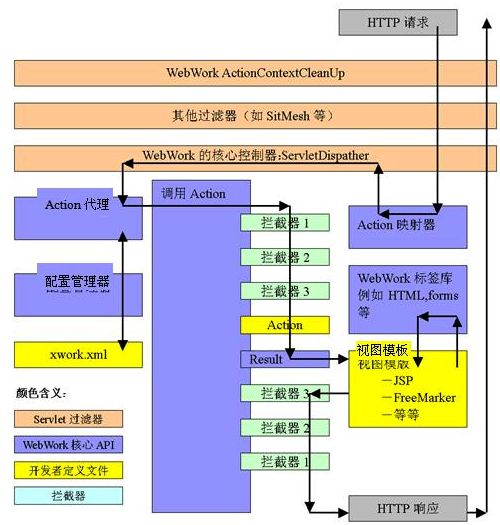

[[TOC]]

# 第八章 Spring 初级

2019年7月31日 - 

Spring 为企业级开发提供的功能：

+ 依赖注入
+ AOP 声明式面向切面编程
+ 多种 持久层框架 兼容
+ 独立的 Web MVC 框架

Spring 是一个轻量级的 IOC（控制反转） AOP（面向切面）的容器框架，特点：

1. 轻量：从大小 与 开销 都是轻量。而且 spring 是非侵入式的，不需要依赖其他的 jar 包
2. 控制反转：Spring 通过 一种 称为 **控制反转** 的技术促进松耦合。当 使用了 控制反转，一个对象依赖的其他对象 都会通过被动的方式传递进来，而不是这个对象自己创建 或者 查找依赖对象。因此 IOC 与 JNDI 相反，不是对象从容器中查询依赖，而是容器在对象初始化时 不等对象 请求 就主动 将依赖传递给它。
3. 面向切面：Spring 包含并管理应用**对象的配置**和**生命周期**，
4. 框架 ：Spring 可以将简单的组件配置、组合成为复杂的应用。在spring 中，应用对象被声明式地组合，典型情况下是在一个 xml 文件里。

## 8.1  Spring 的体系结构



### 8.1.1 Spring 核心包

#### **Core 模块：**

Spring 的最基础、最重要的模块，实现了IOC的功能，将类与类之间的依赖从代码中脱离，使用配置的方式进行依赖关系描述。

BeanFactory 接口 是Spring框架的核心接口，实现了容器的许多核心功能。

#### **Context 模块：**

构建与核心模块上，扩展了 BeanFactory 的功能。此外 该模块还提供了许多 Bean **生命周期控制**、**框架事件体系**、**资源加载透明**等多项功能。而且 还提供了许多 企业服务支持， **邮件服务**、**任务调度**、**JNDI定位**、**EJB基础**、**远程访问**等

ApplicationContext接口是Context模块的核心接口。

#### 表达式语言EL 模块

统一表达式语言（unified EL）的一个扩展，主要用于查询 和 管理运行期的对象，支持设置 和 获取对象属性，调用对象方法，操作数组，集合等。还可以 表达式运算 变量定义等功能。使用它 与 spring IOC 容器 交互

### 8.1.2 AOP 模块

AOP 是继  OOP 之后，对编程设计思想 影响最大的技术之一。AOP 是进行横切逻辑编程的思想，开拓思考问题的思路。在 AOP 模块里，Spring 提供了满足 AOP Alliance 的实现 （Spring AOP），还整合了 **AspectJ** 这种 AOP 语言级的框架。Spring 里实现 AOP 编程拥有众多选择。Java 5 引入的 **Java.lang.instrument** 允许在启动时 设置一个代理类 **agent**，从而在 系统启动时 修改 字节码，改变一个类的功能，实现AOP

### 8.1.3 数据访问与集成 模块

Spring  在 DAO 层建立了一套 面向 DAO层的异常体系，同时将各种范围数据的检查型异常 转换为非检查型异常，为整合各种持久层框架提供基础。Spring 还 进行了浅封装，将模式化的代码隐藏起来，使数据访问得到大幅简化。

### 8.1.4 Web 及 远程操作

该模块 建立在 ApplicationContext 上，提供了 Web 应用的各种 工具类， 如通过 Listener 或者 Servlet 初始化 Spring 容器，将Spring 容器 注册到 Web 容器中。其次 该功能 还提供 多项 面向 Web 的功能，如 透明化文件上传，Velocity（周转）、FreeMarker、XSLT的支持。

还可以 整合 MVC 框架 Struts 1/2 、WebWork 、Tapestry web等

## 8.2 IOC 容器

所谓的 IOC 就是通过 容器来控制 业务对象之间的依赖关系，而非传统的在业务代码中管理操控。

实现该功能 主要 依靠 两个接口 **BeanFactory** 与 **ApplicationContext**

Spring 中 将IOC 容器管理的对象 统称为 Bean，但又与传统 javabean 不完全相同。

### 8.2.1 BeanFactory

| 函数                                    | 描述                                        |
| --------------------------------------- | ------------------------------------------- |
| boolean containsBean(String name)       | 判断 容器中 是否包含 id 为 name 的 bean对象 |
| Object getBean(String name)             | 获取对象                                    |
| Object getBean(String name, Class type) | 获取对象                                    |
| Class getType(String name)              | 获取 name 的 类型                           |

### 8.2.3 ApplicationContext

ApplicationContext接口 继承 BeanFactory 接口。还 继承了 其他接口：

+ MessageSource  为应用提供国际化的访问功能
+ ResourceLoader 提供资源（如 URL 和文件系统）的访问支持，更加资源的地址判断资源的类型，并返回 Resource
+ ApplicationEventPublisher 引入事件机制，包括启动事件、关闭事件，让容器在上下文中提供了对应用的事件支持

ApplicationContext 与 BeanFactory 初始化bean有一定区别，ApplicationContext 会在容器初始化后直接 构建实例，BeanFactory 则是 在要调用时，才创建。

### 8.2.4 Bean 生命周期

针对 Bean生命周期的不同时期，Spring 提供了多个 回调方法，以便在不同时期执行特定的操作。

+ Bean自身的方法，如调用 Bean构造方法实例化，调用 setter设置属性，通过 init-method 和 destory-method 属性运行指定方法
+ Bean 级生命周期接口方法，如 BeanNameAware、BeanFactoryAware、InitializingBean 和 DisposableBean 这些接口由Bean直接实现
+ 容器级别生命周期接口方法，如 BeanPostProcessor 接口，其即可实现类为 后处理器，它们独立于bean， 以容器附加装置的形式注册到spring 容器中，当 spring 创建 bean实例时，这些后置处理器 都会发生作用。

流程：

1. 实例化
2. 设置属性值
3. 调用 BeanFactoryAware 的 setBeanFactory() 方法
4. 调用 ApplicationContextAware 的 setApplicationContext()
5. 调用 BeanPostProcessor 的初始化方法
6. 调用 InitializingBean 的 afterPropertiesSet() 方法
7. 通过 init-method 属性配置初始化方法
8. 调用 BeanPostProcessor 的初始化方法
9. spring缓存池同准备就绪 或者 直接传递给调用
10. 调用 DisposableBean 的 afterPropertiesSet 
11. 调用销毁函数

## 8.3 配置 IOC

### 8.3.1 XML 配置文件

基本没什么说的 `<beans>`为根文件 需要 引入命名空间

### 8.3.2 bean标签

也没什么说的

### 8.3.3 配置依赖注入

使用 setter 注入

```xml
<bean id="" class="">
	<proterty name="属性名" value="属性值"></proterty>
</bean>
```

使用构造函数注入

```xml
<bean id="" class="">
	<constructor name="属性名" value="属性值"></constructor>
</bean>
```

### 8.3.4 注入值类型

Spring  支持 注入的值 ： 字面值 、 bean的引用 、集合类型

**字面值：**

即字面量，数值 字符串等

**其他bean的引用：**

在 property 标签内使用 子标签 bean 或者 使用属性 ref

```xml
<bean id="A" class=""></bean>
<!--ref-->
<bean id="" class="">
	<proterty name="属性名" ref="A"></proterty>
    <proterty name="属性名" ><ref bean="A"></ref></proterty>
    </proterty>
</bean>
<!--bean-->
<bean id="" class="">
    <proterty name="属性名" ><bean class=""></bean></proterty>
</bean>
<!--sqEL-->
<bean id="" class="" p:属性名="${A}">
</bean>
```

**集合类型**

Spring 支持 的集合标签 `array list set map props`,依次对应 数组 List Set Map Property

```xml
<bean id="" class="" >
    <property name="属性名">
    	<array>
        	<value>123</value>
            <ref bean=""></ref>
        </array>
    </property>
    
    <property name="属性名">
    	<list>
        	<value>123</value>
            <ref bean=""></ref>
        </list>
    </property>
    
    <property name="属性名">
    	<set>
        	<value>123</value>
            <ref bean=""></ref>
        </set>
    </property>
    
    <property name="属性名">
    	<map>
        	<entry key="" value=""></entry>
            <entry key="" value-refg=""></entry>
        </map>
    </property>
    
    <property name="属性名">
    	<props>
        	<prop key="">xxx</prop>
        </props>
    </property>    
</bean>
```

### 8.3.5 bean 之间的关系

继承，主要是重用配置属性

```xml
<bean id="master" class="">
	<proterty name="属性名" ref="A"></proterty>
    <proterty name="属性名" ><ref bean="A"></ref></proterty>
</bean>

<bean id="selve" parent="master"></bean>
```

依赖

如果有关联关系 可以直接使用 ref

但如果 A 实例 初始化之前必须 先实例化 B，但这两者 没有关联

就需要使用 `depends-on`

```xml
<bean id="A" class=""></bean>

<bean id="" class="" depends-on="A">
</bean>
```

### 8.3.6 Bean的作用域

| 作用域         | 描述                                                         |
| -------------- | ------------------------------------------------------------ |
| singleton      | 一个Bean定义对应唯一个实例                                   |
| prototype      | 一个Bean定义多个实例，每次getBean 都创建                     |
| request        | 一个http请求中，一个bean 对应一个实例，该作用域 仅仅在基于 Web 的 Spring ApplicationContext 有效 |
| session        | 在一个 session中，一个 bean对应一个实例                      |
| global session | 在一个全局的 http session 中，一个 bean定义对应一个实例      |

除了以上 还可以使用 自定义作用域。

单例：

```xml
<bean id="" class="" scope="singleton"></bean> <!-- 默认 -->
```

prototype：

```xml
<bean id="" class="" scope="protorype"></bean> 
```

### 8.3.7 自动装配

Spring 通过 BeanFactory 中的内容，使用 setter 进行自动设置

autowire 的五种类型：

+ no：不自动装配，必须使用 ref ，默认
+ byName： 根据属性名自动装配。
+ byType ：  根据 类型，如果存在多个同类型的bean实例 会抛出异常，并指出不能使用 byType。如果没有匹配到 同类型的 bean，什么都不发生，可以配置 dependency-check=“object” 让spring 抛出异常
+ constructor 与 byType 类似
+ aurodetect:  通过 Bean类的自省机制 来绝对 使用 constructor 还是 byType。 如果有默认无参构造，即使用 byType

```xml
<bean id="" class="" aurowire="byName"></bean> 
```

## 8.4 ehcahce

Hibernate 的二级缓存 为 SessionFactory，但本身没有 **产品级别**的二级缓存，而是使用第三方缓存。

| 名称        | 对应的适配器                                |
| ----------- | ------------------------------------------- |
| EHCache     | org.hibernate.cache.EhCacheProvider         |
| OSCache     | org.hibernate.cache.OSCacheProvider         |
| SwarmCache  | org.hibernate.cache.SwarmCacheProvider      |
| JBossCache2 | org.hibernate.cache.JBossCacheRegionFactory |

+ CHCache : 简单的 轻量级的缓存组件，使用内存或者磁盘缓存，不支持分布式
+ OSCache ： 不仅可以对 持久层数据缓存，还可以缓存表现层的动态网页，如 JSP ，使用 内存 与 磁盘
+ SwarmCache ： 支持 集群的缓存组件，使用 JavaGroups 实现分布式缓存的同步，非常适合 读取频繁，但更新不频繁的数据
+ JBoss Cache ： 支持分布式缓存

二级缓存的策略：

1. 只读策略 （read-only） ： 主要是对持久化对象读取而不需要进行修改的。
2. 读写（read-write） ： 程序需要更新数据。如果 需要序列化事务隔离级别，那么就不能使用该策略。对于 经常被读取，含有少量修改，可以使用，防止脏读
3. 不严格读写（nonstrict-read-write） :  适合频繁读取但极少更新的，它不保证两个事务并发修改同一个缓存数据的一致性。性能上高于上面
4. 事务缓存 （transactional） ： 事务缓存策略提供对缓存数据的全面事务支持，只能用于JTA(spring 全局事务管理) 环境中

支持情况

| 名称        | read-only | read-write | nonstrict-read-write | transactional |
| ----------- | --------- | ---------- | -------------------- | ------------- |
| CHCache     | √         | √          | √                    |               |
| OSCache     | √         | √          | √                    |               |
| SwarmCache  | √         |            | √                    |               |
| JBoss Cache | √         |            |                      | √             |

