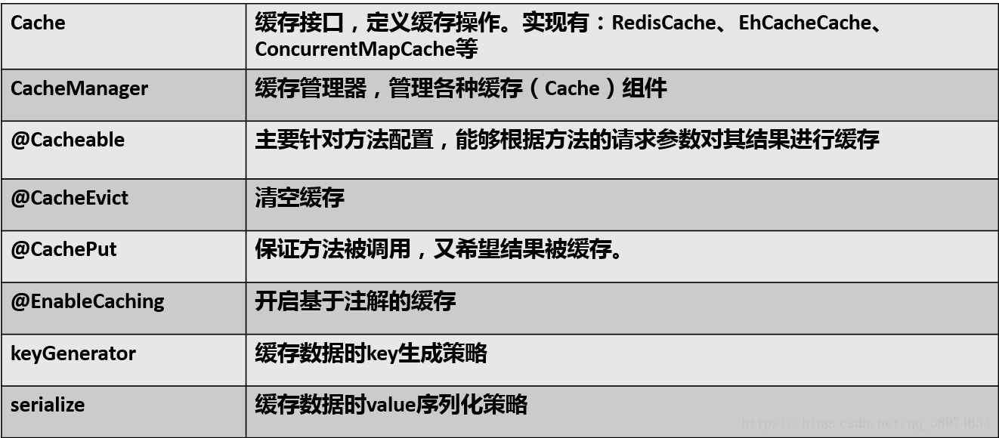
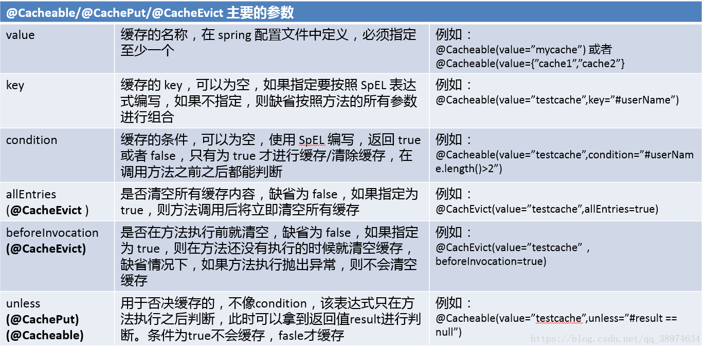
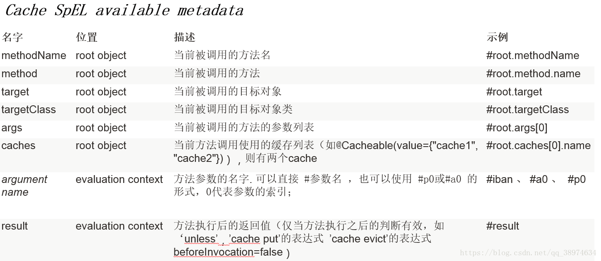

[[TOC]]

# 第 八 章 ： Spring Boot 的数据访问

Spring Data 是 Spring 用来解决数据访问问题的统一解决方案，Spring Data是一个伞形项目，包含大量关系形数据库 和 非关系型数据库的数据访问解决方案。

1. Spring Data JPA （spring-data-jpa）
2. Spring Data MongoDB （spring-data-mongodb）
3. Spring Data Neo4J（spring-data-nro4j）
4. Spring Data Redis（spring-data-redis）
5. Spring Data solr（spring-data-solr）
6. Spring Data Hadoop（spring-data-hadoop）
7. Spring Data GamFire（spring-data-gamfire）
8. Spring Data REST（spring-data-rest-webmvc）
9. Spring Data JDBC Extensions（spring-data-oracle）
10. Spring Data CouchBase（spring-data-couchbase）
11. Spring Data Elasticsearch（spring-data-elasticsearch）
12. Spring Data Cassandra（spring-data-casssndra）
13. Spring Data DynameoDB ...

Spring Data  为我们使用 **统一的API** 来对上述数据库存储技术进行数据访问操作提供支持。

Spring通过 **Spring Data Commons** 项目 来实现的，它是上述各种 Spring Data 项目 的依赖。

**Spring Data Commons** 让我们在使用 各种数据库 访问技术时，都使用基于 Spring 统一的标准， 该标准包含 ： CRUD  查询 排序 分页 等相关操作。

Spring Data Commons 有一个重要概念： **Spring Data Repository** 抽象。可以极大地减少数据访问层的代码。 既然是数据访问统一的标准，

根接口：

```java
package org.springframework.data.repository;
@Indexed
public interface Repository<T, ID> {
}
```

子接口 CRUD 的：

```java
@NoRepositoryBean
public interface CrudRepository<T, ID> extends Repository<T, ID> {
    <S extends T> S save(S var1);

    <S extends T> Iterable<S> saveAll(Iterable<S> var1);

    Optional<T> findById(ID var1);

    boolean existsById(ID var1);

    Iterable<T> findAll();

    Iterable<T> findAllById(Iterable<ID> var1);

    long count();

    void deleteById(ID var1);

    void delete(T var1);

    void deleteAll(Iterable<? extends T> var1);

    void deleteAll();
}
```

CRUD Repository 的子接口, 定义 分页 排序有关的功能 ：

```java
@NoRepositoryBean
public interface PagingAndSortingRepository<T, ID> extends CrudRepository<T, ID> {
    Iterable<T> findAll(Sort var1);

    Page<T> findAll(Pageable var1);
}
```

主要 Spring Data JPA、Spring Data MongoDB、Spring Data REST、Spring Data Redis

## 8.1 Spring Data JPA

### 8.1.1 Spring Data JPA 概念

Hibernate 是数据访问解决技术，使用 ORM 映射技术实现数据访问，ORM 映射即将领域模型类 和 数据库的表进行映射，通过程序操作对象 从而实现 数据操作的能力。

随着 Hibernate的盛行， Hibernate 主导了EJB 3.0 的JPA 规范（基于 ORM 映射的标准规范）。即 只定义标准规则（接口、注解），而不定义实现，软件提供商可以安装标准规范来进行实现。

而JPA的实现有 Hibernate 、 TopLink、OpenJPA

Spring Data JPA 是 Spring Data  的子项目，提供基于JPA的Repository 极大地减少JPA 作为数据访问方案的代码量。

### 8.1.2 Spring 下 使用 Spring Data JPA 

#### **8.1.2.1 注解配置使用 Spring Data JPA**

```java
@Configuration
// 开启 对 Spring Data JPA的 支持，并扫描数据访问层所在包下的数据访问接口
@EnableJpaRepositories("xx.xxx.xx")
public class JpaConfig {
    @Bean
    public EntityManagerFactory entityManagerFactory () {
        
    }
    // 配置 对应的数据源 事务管理等相关bean
}

```

#### 8.1.2.2定义数据访问层

默认 已经有基本的功能

```java
public interface IStudentsDao extends JpaRepository<StudentsPO, Long> {
    
}
```

#### 8.1.2.3定义查询方法

假设 有实体类 Students：private Long id;private String name;private Integer age;private String addr; 有分别与之对应的字段

（1） 根据 属性名 查询

```java
public interface IStudentsDao extends JpaRepository<StudentsPO, Long> {

    // 通过名称查询
    List<StudentsPO> findByName(String  name);

    // 名称相似 查询
    List<StudentsPO> findByNameLike(String  name);

    // 获取 查询的前多少条数据
    List<StudentsPO> findFirst10ByNameLikeAndAddr(String  name);
    List<StudentsPO> findTopBy20NameLikeAndAddr(String  name);
    
}
```

属性查询还有很多关键字

（2）使用 JPA 的 NamedQuery 查询

在对应的 领域对象 StudentsPO 类添加注解

```java
@Entity
@NamedQuery(name = "StudentsPO.findByName",
        query = "select stu from StudentsPO stu where stu.name=?1")
```

此时 接口 中的findByName  就会按照 该query 去查询。

（3） 使用 @Query 查询

```java
public interface IStudentsDao extends JpaRepository<StudentsPO, Long> {

    // 使用参数索引
    @Query("select stu from StudentsPO stu where stu.addr=?!")
    List<StudentsPO> findByAddr(String  addr);
    
    // 使用 命名参数
    @Query("select stu from StudentsPO stu where stu.name= :value")
    List<StudentsPO> findByName(@param("value") String  name);
    
    // 更新查询  事件更新查询
    @Modifying
    @Query(update StudentsPO stu set stu.name=?1)
    int setName(String name);
}
```

(4) Specification 

JPA  提供了 基于规范的查询方式， 即 Criteria（标准） 查询。

```java 
public interface IStudentsDao extends JpaRepository<StudentsPO, Long> ,
									JpaSpecificationExecutor<StudentsPO> {
}
```

然后需要 创建 对应的 Specification

```java
public static Specification<StudentsPO> personFromHefer() {
    return new Specification<StudentsPO>() {
      public Predicate toPredicate(Root<StudentsPO> root, CriteriaQuery<?> query, CriteraBuilder cb) {
          // 对象的 过滤逻辑，具体在 6 Hibernate 进阶 中 QBC 检索 
          return 
      }  
    };
}
```

在注入接口后 `studentsDao.findAll(personFromHefer())` 

（5） 排序与分页

```java
public interface IStudentsDao extends JpaRepository<StudentsPO, Long> {
	List<StudentsPO> findByName(String naem, Sort sort);
    Page<StudentsPO> findByName(String naem, Pageable pageable);
}
```

在注入接口后 `studentsDao.findByName("xx", new Sort(Direction.ASC, "age"))`  `studentsDao.findByName("xx", new PageRequest(0, 10))` 

#### 8.1.2.4 自定义 Repository 的实现

Spring Data 提供 CrudRepository   Spring Data JPA 提供 JpaRepository.。 故而 我们也可以 将常用 操作封装到自己的接口中。

1 自定义接口

```java
@NoRepositoryBean// 指定 当前接口 不是我们领域类的接口（dao接口）
// 继承 包含 排序 分页功能
public interface MyRepository<T, ID>  extends PagingAndSortingRepository<T, ID> {
    // 需要自定义的 功能
    public void doSomething(ID id);
}
```

2 定义接口实现

```java
// SimpleJpaRespository 保证 接口 能完成基本功能 入 findall
public class MyRepositoryImpl extends SimpleJpaRespository implements MyRespository {
    private final EntityMannager entityMannager;
    
    public MyRepositoryImpl (Class<?> class, EntityMannager entityMannager) {
        super(class, entityManager);
        this.entityManager = entityManager;
    }
   	public void doSomething(ID id){
        // 实现  可以调用一些其他方法
    }
}
```

3 自定义 RepositoryFactoryBean   用来 替代默认的

```java
pubic class MyRepositoryFactoryBean  extends JapRepositoryFactoryBean {
    protected Repository
        // 略
}
```

@EnableJpaRepositories(repositoryFactoryBeanClass = MyRepositoryFactoryBean.class)

### 8.1.3 Spring Boot 的支持

#### 8.1.3.1 **JDBC 的自动配置**

**spring-boot-starter-data-jpa** 依赖于 **spring-boot-starter-jdbc**， 而 Spring Boot 对 JDBC 做了一些自动配置。

`org.springframework.boot.autoconfigure.jdbc` 下 **DataSourceProperties** 可知道 配置以 **spring.datasource** 前缀。

Spring Boot 自动开启了 注解事务支持（@EnableTransactionManagement） 还配置了一个 **jdbcTemplate**

还提供一个初试化数据的功能， 放置在类路径下的 schema.sql 文件 会自动 初试化表结构， 类路径下的 data.sql 会自动填充数据。

#### 8.1.3.2 **对JPA的自动配置**

`org.springframework.boot.autoconfigure.orm.jpa` 下可得知 Spring Boot 默认JPA实现是Hibernate；

**HibernateJpaAutoConfiguration** 依赖 **DataSourcesAutoConfiguration**

JapProperties 中 得知 是以 **spring.jpa** 配置参数

JpaBaseConfiguration 中， 

```java
	@Bean
	@ConditionalOnMissingBean
	public PlatformTransactionManager transactionManager() {
		JpaTransactionManager transactionManager = new JpaTransactionManager();
		if (this.transactionManagerCustomizers != null) {
			this.transactionManagerCustomizers.customize(transactionManager);
		}
		return transactionManager;
	}

	@Bean
	@ConditionalOnMissingBean
	public JpaVendorAdapter jpaVendorAdapter() {
		AbstractJpaVendorAdapter adapter = createJpaVendorAdapter();
		adapter.setShowSql(this.properties.isShowSql());
		adapter.setDatabase(this.properties.determineDatabase(this.dataSource));
		adapter.setDatabasePlatform(this.properties.getDatabasePlatform());
		adapter.setGenerateDdl(this.properties.isGenerateDdl());
		return adapter;
	}

	@Bean
	@ConditionalOnMissingBean
	public EntityManagerFactoryBuilder entityManagerFactoryBuilder(JpaVendorAdapter jpaVendorAdapter,
			ObjectProvider<PersistenceUnitManager> persistenceUnitManager,
			ObjectProvider<EntityManagerFactoryBuilderCustomizer> customizers) {
		EntityManagerFactoryBuilder builder = new EntityManagerFactoryBuilder(jpaVendorAdapter,
				this.properties.getProperties(), persistenceUnitManager.getIfAvailable());
		customizers.orderedStream().forEach((customizer) -> customizer.customize(builder));
		return builder;
	}
```

以及 包扫描

```java
	protected String[] getPackagesToScan() {
		List<String> packages = EntityScanPackages.get(this.beanFactory).getPackageNames();
		if (packages.isEmpty() && AutoConfigurationPackages.has(this.beanFactory)) {
			packages = AutoConfigurationPackages.get(this.beanFactory);
		}
		return StringUtils.toStringArray(packages);
	}
```

并且 访问数据时出现会话链接已关闭的错误配置的 `OpenEntityManagerInView`过滤器 注册 到 Spring MVC 拦截器中

```java
	@Configuration
	@ConditionalOnWebApplication(type = Type.SERVLET)
	@ConditionalOnClass(WebMvcConfigurer.class)
	@ConditionalOnMissingBean({ OpenEntityManagerInViewInterceptor.class, OpenEntityManagerInViewFilter.class })
	@ConditionalOnMissingFilterBean(OpenEntityManagerInViewFilter.class)
	@ConditionalOnProperty(prefix = "spring.jpa", name = "open-in-view", havingValue = "true", matchIfMissing = true)
	protected static class JpaWebConfiguration {

		// Defined as a nested config to ensure WebMvcConfigurerAdapter is not read when
		// not on the classpath
		@Configuration
		protected static class JpaWebMvcConfiguration implements WebMvcConfigurer {

			private static final Log logger = LogFactory.getLog(JpaWebMvcConfiguration.class);

			private final JpaProperties jpaProperties;

			protected JpaWebMvcConfiguration(JpaProperties jpaProperties) {
				this.jpaProperties = jpaProperties;
			}

			@Bean
			public OpenEntityManagerInViewInterceptor openEntityManagerInViewInterceptor() {
				if (this.jpaProperties.getOpenInView() == null) {
					logger.warn("spring.jpa.open-in-view is enabled by default. "
							+ "Therefore, database queries may be performed during view "
							+ "rendering. Explicitly configure " + "spring.jpa.open-in-view to disable this warning");
				}
				return new OpenEntityManagerInViewInterceptor();
			}

			@Override
			public void addInterceptors(InterceptorRegistry registry) {
				registry.addWebRequestInterceptor(openEntityManagerInViewInterceptor());
			}

		}

	}
```

#### 8.1.3.3 对Spring Data JPA 的自动配置

**org.springframework.boot.autoconfigure.data.jpa** 下 JpaRepositoriesAutoConfiguration  是依赖 HibernateJpaAutoConfiguration 配置。而且 Spring Boot自动开启了对 Spring Data JPA 的支持，故而不需要 @EnableJpaRepositories 声明。

故而 在Spring Boot下使用 Spring Data JPA，只需要引入 `spring-data-stater-data-jpa` ，然后配置 DataSource 实体类 数据访问层 即可。

## 8.2 Spring Data REST

**概念：**

**Spring Data REST** 是基于 SPring Data 的repository之上，可以将 repository 自动输出为REST资源。 Spring Data REST 支持 将 Spring Data JPA 、 Spring Data MongoDB、Spring Data Neo4J、Spring Data GemFire 、Spring Data Cassandra 自动转换成为 REST

**Spring MVC 中 配置 使用 Spring Data REST：**

Spring Data REST 的配置定义在 **RepositoryRestMvcConfiguration** ，并且以及配置好了

如果使用 有两种方法，一、 配置类直接继承  二、配置类中 Import 导入

### 8.2.1 Spring Boot 的支持

**org.springframework.boot.autoconfigure.data.rest** 中

只需要 引入 依赖 **spring-boot-starter-data-rest** 即可，使用 前缀 **spring.data.rest** 配置

```properties
spring.data.rest.base-path=/rest
```

即可 获取对应id 为1的数据

```http
http://192.168.1.3:8080/rest/studentsPoes/1
```

Spring Data REST 相当于 是直接 从 数据接口处获取数据，所有 返回 为studentsPo

这个节点可以在接口出修改

```java
@RepositoryRestResource(path = "student")
public interface IStudentsDao extends JpaRepository<StudentsPO, Long> {
```

如果使用 特定方法查询 （GET）

接口 方法出添加 

```java
@RestResource(path="xxx", rel = "xxx")
```

GET请求

```http
http://192.168.1.3:8080/rest/studentsPoes/search/xxx  
```

## 8.3 声明式事务

### 8.3.1 Spring 的 事务机制

回顾 《9 Spring 进阶》 中 9.3 

全局事务（jta事务） 与 局部事务

局部事务又分为 编程式事务 与 声明式事务，声明式事务 需要开启代理 cglib 或者 Spring 默认的代理。@Transactionl

而Spring 的事务机制是用统一的机制来处理不同数据访问技术的事务处理。Spring 的事务机制 提供一个接口 `PlatformTransactionManager`，不同的数据访问技术的事务使用对应的接口实现：

| 数据访问技术 | 实现                         |
| ------------ | ---------------------------- |
| JDBC         | DataSourceTransactionManager |
| JPA          | JpaTransactionManager        |
| Hibernate    | HibernateTransactionManager  |
| JDO          | JdoTransactionManager        |
| 分布式事务   | JtaTransactionManager        |

```java
@Bean
public PlatformTransactionManager transactionManager() {
    JpaTransactionManager tra = new JpaTransactionManager();
    tra.setDataSource(dataSource());
    return tra;
}
```

### 8.3.2 声明式事务

Spring 支持使用 声明式事务，使用注解 `@Transactional ` 在方法上表明该方法需要事务支持。这是一个基于 AOP 的实现操作，

@Transactionl 注解 就类似 AOP 面向切面中的自定义 注解，通过 执行中 来进行事务管理。

Spring 容器 需要 `@EnableTransactionManagerment` 开启事务。

### 8.3.3 注解事务行为

`Transactional` 的默认属性：

**propagation ：** 主要定义事务的声明周期

+ **REQUIRED** ：方法A调用时没有事务就新建一个事务，当方法A调用另外一个方法B的时候，方法B将使用同一个事务；B出现异常，整个事务都会回滚。 默认
+ **SUPPORT** ：调用方法时 有事务就用事务，没有就不用
+ **MANDATORY**：强制方法在事务中执行，若无事务 抛出异常
+ **REQUIRES_NEW** ：对于方法A调用B，将产生两个事务，互不相关
+ **NESTED** 与 **REQUIRES_NEW**  类似，但支持JDBC ，不支持 JPA 或者 Hibernate
+ **NOT_SUPPORTED** ： 强制方法不在事务中执行，若有事务，在方法调用结束阶段，事务将被挂起。
+ **NEVER** ： 强制方法不在事务中执行，若有事务 抛出异常

**isolation** ： （隔离）决定了事务的完整性，处理在多事务对 相同数据下的处理机制

+ DEFAULT： 数据源默认隔离级别
+ READ_UNCOMMITTED ： 读未为提交  **产生脏读 不可重复读  幻读**
+ READ_COMMITTED ： 读已提交 产生  **不可重复读 幻读** 读修改 读新增
+ REPEATABLE_READ ：可重复读 产生 **幻读** 不能读修改 只能读新增
+ SERIALIZABLE ： 序列化

**timeout** ： 事务过期时间 默人当前数据库的事务过期事件

**readOnly** ： 指定当前事务是否为只读  默认 false

**rollbackFor** ： 指定哪个或者那些异常可以引起事务回滚

**noRollbackFor** ： 指定哪个或者那些异常  不需要引起事务回滚

### 8.3.4 Spring Data JPA 的事务支持

Transactional 不仅可以注解到方法，还可以注解到 类上，那么 该类中所有的public 都会开启事务。而 方法再使用 会覆盖

Spring Data JPA 中对与查询事务 都是 readOnly = true; 

再 SimpleJpaRepository 中可看到。

### 8.3.5 Spring Boot 的支持

**自动配置的事务管理器**

在使用JDBC 作为数据访问技术的时候，Spring Boot 为我们定义了 PlatformTransactionManager 的实现 **DataSourceTransactionManager** 的Bean，配置`org.springframework.boot.autoconfigure.jdbc.DataSourceTransactionManagerAutoConfiguration`：

```java
		@Bean
		@ConditionalOnMissingBean(PlatformTransactionManager.class)
		public DataSourceTransactionManager transactionManager(DataSourceProperties properties) {
			DataSourceTransactionManager transactionManager = new DataSourceTransactionManager(this.dataSource);
			if (this.transactionManagerCustomizers != null) {
				this.transactionManagerCustomizers.customize(transactionManager);
			}
			return transactionManager;
		}
```

使用 JPA 作为数据访问技术的时候Spring Boot 为我们定义 JpaTransactionManager 的Bean ，配置 `org.springframework.boot.autoconfigure.orm.jpa.JpaBaseConfiguration` ：

```java
	@Bean
	@ConditionalOnMissingBean
	public PlatformTransactionManager transactionManager() {
		JpaTransactionManager transactionManager = new JpaTransactionManager();
		if (this.transactionManagerCustomizers != null) {
			this.transactionManagerCustomizers.customize(transactionManager);
		}
		return transactionManaer;
	}
```

**自动开启注解事务的支持**

Spring Boot 专门用于配置事务的类为： `org.springframework.boot.autoconfigure.transaction.TransactionAutoConfiguration`

此配置 依赖上面两个事务管理器 **DataSourceTransactionManagerAutoConfiguration**  和 **JpaBaseConfiguration**

而此种 也开启了 对声明式事务的支持 ：

// 使用 AdviceMode mode() default AdviceMode.PROXY;  而不是 AdviceMode.ASPECTJ

```java
	@Configuration
	@ConditionalOnBean(PlatformTransactionManager.class)
	@ConditionalOnMissingBean(AbstractTransactionManagementConfiguration.class)
	public static class EnableTransactionManagementConfiguration {

		@Configuration
		@EnableTransactionManagement(proxyTargetClass = false)
		@ConditionalOnProperty(prefix = "spring.aop", name = "proxy-target-class", havingValue = "false",
				matchIfMissing = false)
		public static class JdkDynamicAutoProxyConfiguration {

		}

		@Configuration
		@EnableTransactionManagement(proxyTargetClass = true)
		@ConditionalOnProperty(prefix = "spring.aop", name = "proxy-target-class", havingValue = "true",
				matchIfMissing = true)
		public static class CglibAutoProxyConfiguration {

		}

	}
```

故而 在 Spring Boot 中不需要，显示声明 **EnableTransactionManager**

## 8.4 数据缓存

程序的瓶颈是数据库

### 8.4.1 Spring 缓存支持

Spring 定义了 `org.springframework.cache.CacheManager` 与 `org.springframework.cache.Cache` 接口用来统一实现不同的缓存技术。

CacheManager 为各种缓存技术抽象接口，Cache 接口包含缓存的操作。

不同缓存技术的不同实现：

| CacheManager实现          | 描述                                                      |
| ------------------------- | --------------------------------------------------------- |
| SimpleCacheManager        | 使用简单的 集合 来作为缓存存储，主要用于测试              |
| ConcurrentMapCacheManager | 使用 ConcurrentMap 作为缓存存储                           |
| NoOpCacheManager          | 仅仅测试，不会实际 缓存                                   |
| EhCacheCacheManager       | 使用 EhCache  作为缓存技术                                |
| GuavaCacheManager         | 使用 Guava                                                |
| HazelcastCacheManager     | 使用 Hazelcase                                            |
| JCacheManager             | 支持 JCache 标准的实现作为缓存技术，入 Apache Commons JCS |
| RedisCacheManager         | 使用Redis作为缓存技术                                     |

使用的话，直接 @Bean  注册使用的实现即可。

**声明式缓存注解**

又与 声明式 事务类似，使用 AOP 完成

| 注解        | 解释                                                         |
| ----------- | ------------------------------------------------------------ |
| @Cacheable  | 在执行方法前，会下你查看缓存中是否有数据，如果有，返回缓存数据，没有的话，执行方法，并将方法返回的数据加载到缓存。 |
| @CachePut   | 无论如何，都会将方法返回的值放置到缓存中。                   |
| @CacheEvict | 将一条或者多条数据从缓存中删除                               |
| @Caching    | 可以 同 该注解 组合多个注解策略在一个方法上                  |







value 类似库  key 类似主键

例如 ： 

```java
@CachePut(value="test", key="#testBean.id")
public TestBean find() {
    xxx
    return testBean;
}
```

只要在 对应方法中使用该类型注解，便可以缓缓存

**开启缓存支持** 

@EnableCaching

### 8.4.2 Spring Boot  支持

`org.springframework.boot.autoconfigure.cache.CacheAutoConfiguration` 已经配置好了。默认 使用 **SimpleCacheManager** ，配置前缀为 **spring.cache**

```properties
spring.cache.type = # 可选 generic ehcache hazelcast infinispan jcache redis guava simple none
spring.cache.cache-name= # 程序启动时 创建缓存名称
spring.cache.ehcache.config = # ehcache 配置文件地址
spring.cache.hazelcast.config = # hazelcast 配置文件地址
spring.cache.jcache.config
spring.cache.jcache.provider = # 当多个 jcache 实现在类路径中的时候，指定 jcache 实现
spring.cache.guava.spec = 

```

使用时 直接 依赖 **spring-boot-starter-cache** ， 配置类 开启 缓存支持 即可

### 8.4.3 缓存技术切换

当使用第三方 缓存技术时，还需要 引入依赖

EhCachem，对应的配置文件 ehcache.xml 放在类路径下， 自动扫描。

```xml
<dependency>
	<groupId>net.sf.ehcache</groupId>
    <artifactId>ehcache</artifactId>
</dependency>
```

Guava

```xml
<dependency>
	<groupId>com.google.guava</groupId>
    <artifactId>guava</artifactId>
</dependency>
```

Redis

```xml
<dependency>
	<groupId>org.springframework.boot</groupId>
    <artifactId>spring-boot-starter-redis</artifactId>
</dependency>
```

此时 Spring Boot 会自动配置 Redis 的 缓存，以及 RedisTemplate

## 8.5 非关系型数据库

非关系型数据库：即不使用关系作为数据库管理的系统。 主要特点： 大部分不适用 SQL 语言， 数据存储也不是固定的表 字段。

文档型：MongoDB 

图形关系型： Neo4J

键值对型： Redis

### 8.5.1 MongoDB

Document 的存储型，使用面向对象的思想，每一天数据记录是 一个文档对象。

#### 8.5.1.1 Spring 支持

Spring 支持 MongoDB 依靠 **Spring Data MongoDB** 实现。

**Object/Document 映射注解支持**

| 注解      | 描述                                |
| --------- | ----------------------------------- |
| @Document | 映射领域对象 与 MongoDB  的一个文档 |
| @Id       | 映射当前属性 ID                     |
| @DbRef    | 当前属性将参考其他文档              |
| @Field    | 为文档的属性定义名称                |
| @Version  | 当前属性作为版本                    |

**MongoTemplate**

```java
@Bean
public MongoClient client() {
    MongoClient client = new MongoClient(new ServerAddress("ip",port));
    return client;
}

@Bean
public MongoDbFactory mongoDbFactory() {
    String database = new MongoClitentURI("mongodb://localhost/test").getDatabase();
    return new SimpleMongoDbFactory(client(), database);
}

@Bean
public MongoTemplate mongoTemplate(MongoDbFactory mongoDbFactory) {
    return new MongoTemplate(mongoDbFactory);
}
```

**数据接口**

```java
public interface TestMongoDao extends MonogRepository<xxBean, String> {
    
}
```

开启支持

@EnableMongoRepository

#### 8.5.1.2 Spring Boot 支持

Spring Boot 对 MongoDB 支持位于包 `org.springframework.boot.autoconfigure.mongo`

主要配置数据库链接、MongoTemplate。 使用前缀 **spring.data.mongodb**

```properties
spring.data.mongodb.host = # 默认 localhost
spring.data.mongodb.port = 27017 # 默认
spring.data.mongodb.uri=mongodb://localhost/test # 链接的URL
spring.data.mongodb.database=
spring.data.mongodb.authentication-database=
spring.data.mongodb.grid-fs-database=
spring.data.mongodb.username=
spring.data.mongodb.password=
spring.data.mongodb.repositories.enabled=true  # repository 支是否开启 默认开启
spring.data.mongodb.field-naming-strategy=spring.data.mongodb.autoconfigure.data.mongo
```

具体使用 类似 Spring Data Jpa

### 8.5.2 Redis

Redis 是一个 开源的内存数据存储。

#### 8.5.2.1 Spring 支持

Spring 对 Redis 的支持 也是通过 Spring Data Redis 来实现的。

提供了连接相关的 **ConnectionFactory** 和 数据操作相关的 **RedisTemplate**

根据 Redis 不同的客户端，Spring Data Redis 提供不同的 **ConnectionFactory**

+ JedisConnectionFactory : 使用 Jedis 作为 Redis 客户端
+ JredisConnectionFactory : 使用 Jredis 作为客端
+ LettuceConnectionFactory : 使用 Lettuce 作为客户端
+ SrpConnectionFactory : 使用 Spullara/redis-portocol 作为客户端

```java
@Bean
public RedisConnectionFactory redisConnectionFactory() {
    return new JedisConnectionFactory();
}

@Bean
public RedisTemplate<Object, Object> redisTemplate() {
    RedisTemplate<Object, Object> template = new RedisTemplate<Object, Object>();
    template.setConnectionFactory(redisConnectionFactory());
    return template;
}
```

Spring Data Redis 提供了 **RedisTemplate**  和 **StringRedisTemplate** 作为操作访问数据，StringRedisTemplate 键值 都是 字符串。

定义 Serializer

当我们数据存储到数据库的时候，键值都是通过 Serializer 序列化到数据库的。

RedisTemplate 默认 **JdkSerializationRedisTemplate**

StringRedisTemplate 默认使用 **StringRedisSerializer**

#### 8.5.2.2 Spring Boot 支持

`org.springframework.boot.autoconfigure.data.redis` 这个包下。

默认配置了 **JedisConnectionFactory** **RedisTemplate**  **StringRedisTemplate** 

使用 **spring.redis** 为前缀

```properties
spring.redis.database= # 数据库名称 默认db0
spring.redis.host =  # 地址 默认 localhost
spring.redis.password
spring.redis.port= # 默认 6379
spring.redis.pool.max-idle = 8 # 连接池设置
spring.redis.pool.min-idle=0
spring.redis.pool.max-active = 8
spring.redis.pool.max-watit= -1
spring.redis.sentinel.master
spring.redis.sentinel.nodes
spring.redis.timeout
```

dao 层 需要 注入 对应的 Template

```java
@Repository
public class xxDao {
    @Autowried
    StringRedisTemplate template;
    
    // 使用 @Resource 注解 指定 template ，注入 基于字符串的简单属性操作
    @Resource(name="template")
    RedisTemplate<String, String> valOpsStr;
    
}
```

注入 RedisTemplate 是 可以修改 其 序列化。


