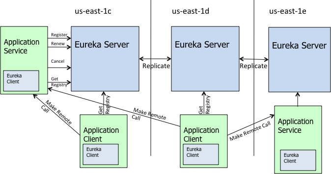

[[TOC]]

# 第三章 服务治理 Spring Cloud Eureka

2019年12月3日 - 2019年12月20日

+ 构建服务注册中心
+ 服务注册于服务发现
+ Eureka 的基础架构
+ Eureka 的服务治理机制
+ Eureka 的配置

## 3.1 服务治理

服务治理 是 微服务中**最核心 最基础**的模块，主要用来实现各个微服务实例的自动化注册于发现。

最开始 服务少的时候，可以通过 静态配置 来完成服务调用。但是 随着发展，系统越来越复杂，服务模块越来越多，静态配置就变得非常难维护。

### 3.1.1 服务注册

在服务治理框架中，通常都会构建一个注册中心，每服务单元想注册中心等级之际提供的服务，将主机与端口、版本号、通信协议等一些附加的信息告知注册中心，注册中心 按照 **服务名** 分类组织服务清单。

### 3.1.2 服务发现

由于在服务治理框架下运作，服务间的调用不再通过指定的具体实例地址实现，而是通过向服务名发起请求调用实现。所有，服务调用方在调用服务提供方接口的时候，并不是知道具体的服务实例位置。因此，调用方需要向服务注册中心咨询服务，并获得所有服务的实例清单。

### 3.1.3 Netflix Eureka

Eureka 包含 服务端 与 客户端组件，并且 服务端 与 客户端均采用 Java编写，所以 Eureka主要用于 通过 Java 实现的分布式系统，或是 与 JVM 兼容语言构建的系统。但是 服务端的服务治理 提供了完备的 RESTful API ,所以 也支持 非 Java 语言构建的微服务 应用 纳入 Eureka 的服务治理系统中。只是 需要自己 使用其他语言平台时，实现 Eureka 客户端。已经有一些实现。 Steeltoe  eureka-js-client

**Eureka服务端**： 常称为 服务注册中心。与他服务注册中心一样，支持高可用配置。 如果 Eureka 以集群模式部署，当集群中有分片出现故障时，Eureka 就转入 自我保护模式。它允许在分片故障期间继续提供服务的发现与注册，当故障分片恢复允许时，集群中的其他分片会把他们的状态 再次同步回来。

**Eureka客户端：** 主要处理 服务发现 与 注册。客户端服务通过注解 和参数配置的方式，前任在客户端 应用程序的代码中，在应用程序运行时， Eureka 客户端 向注册中心 注册自身提供的服务并周期性 发送心跳 来更新它的服务租约。同时 它 也能将 服务端 查询到当前注册的服务信息缓存到本地，周期性 属性服务状态

### 3.1.4 搭建服务中心

```xml
<?xml version="1.0" encoding="UTF-8"?>
<project xmlns="http://maven.apache.org/POM/4.0.0" xmlns:xsi="http://www.w3.org/2001/XMLSchema-instance"
         xsi:schemaLocation="http://maven.apache.org/POM/4.0.0 https://maven.apache.org/xsd/maven-4.0.0.xsd">
    <modelVersion>4.0.0</modelVersion>
    <parent>
        <groupId>org.springframework.boot</groupId>
        <artifactId>spring-boot-starter-parent</artifactId>
        <version>2.1.10.RELEASE</version>
        <relativePath/> <!-- lookup parent from repository -->
    </parent>
    <groupId>com.gl.cloud</groupId>
    <artifactId>eureka-server</artifactId>
    <version>0.0.1-SNAPSHOT</version>
    <name>eureka-server</name>
    <description>Demo project for Spring Boot</description>

    <properties>
        <java.version>1.8</java.version>
        <spring-cloud.version>Greenwich.SR4</spring-cloud.version>
    </properties>

    <dependencies>
        <dependency>
            <groupId>org.springframework.cloud</groupId>
            <artifactId>spring-cloud-starter-netflix-eureka-server</artifactId>
        </dependency>

        <dependency>
            <groupId>org.springframework.boot</groupId>
            <artifactId>spring-boot-starter-test</artifactId>
            <scope>test</scope>
        </dependency>
    </dependencies>

    <dependencyManagement>
        <dependencies>
            <dependency>
                <groupId>org.springframework.cloud</groupId>
                <artifactId>spring-cloud-dependencies</artifactId>
                <version>${spring-cloud.version}</version>
                <type>pom</type>
                <scope>import</scope>
            </dependency>
        </dependencies>
    </dependencyManagement>

    <build>
        <plugins>
            <plugin>
                <groupId>org.springframework.boot</groupId>
                <artifactId>spring-boot-maven-plugin</artifactId>
            </plugin>
        </plugins>
    </build>

</project>
```

```yaml
server:
  port: 8111
eureka:
  instance:
    hostname: localhost
  client:
    # 不 注册自己
    register-with-eureka: false
    # 自己不去 检索服务
    fetch-registry: false
    service-url:
      defaultZone: http://${eureka.instance.hostname}:${server.port}/eureka
#spring.cloud.service-registry.auto-registration.register-management=true
#spring.cloud.service-registry.auto-registration.fail-fast=true
#spring.cloud.service-registry.auto-registration.enabled=true

```

```java
@EnableEurekaServer
@SpringBootApplication
public class EurekaServerApplication {
    public static void main(String[] args) {
        SpringApplication.run(EurekaServerApplication.class, args);
    }
}
```

> #### **EMERGENCY! EUREKA MAY BE  INCORRECTLY CLAIMING INSTANCES ARE UP WHEN THEY'RE NOT. RENEWALS ARE  LESSER THAN THRESHOLD AND HENCE THE INSTANCES ARE NOT BEING EXPIRED JUST  TO BE SAFE.**

Eureka server和client之间每隔30秒会进行一次心跳通信，告诉server，client还活着。由此引出两个名词： 
Renews threshold：server期望在每分钟中收到的心跳次数 
Renews (last min)：上一分钟内收到的心跳次数。

前文说到禁止注册server自己为client，不管server是否禁止，阈值（threshold）是1。client个数为n，阈值为1+2*n（此为一个server且禁止自注册的情况） 

Eurake有一个配置参数**eureka.server.renewalPercentThreshold**，定义了renews 和renews 
threshold的比值，默认值为0.85。当server在15分钟内，比值低于percent，即少了15%的微服务心跳，server会进入自我保护状态，Self-Preservation。在此状态下，server不会删除注册信息，这就有可能导致在调用微服务时，实际上服务并不存在。 
这种保护状态实际上是考虑了client和server之间的心跳是因为网络问题，而非服务本身问题，不能简单的删除注册信息

stackoverflow上，有人给出的建议是： 
1、在生产上可以开自注册，部署两个server 
2、在本机器上测试的时候，可以把比值调低，比如0.49 
3、或者简单粗暴把自我保护模式关闭 `eureka.server.enableSelfPreservation=false`

### 3.1.5 服务提供者

```xml
<?xml version="1.0" encoding="UTF-8"?>
<project xmlns="http://maven.apache.org/POM/4.0.0" xmlns:xsi="http://www.w3.org/2001/XMLSchema-instance"
         xsi:schemaLocation="http://maven.apache.org/POM/4.0.0 https://maven.apache.org/xsd/maven-4.0.0.xsd">
    <modelVersion>4.0.0</modelVersion>
    <parent>
        <groupId>org.springframework.boot</groupId>
        <artifactId>spring-boot-starter-parent</artifactId>
        <version>2.2.1.RELEASE</version>
        <relativePath/> <!-- lookup parent from repository -->
    </parent>
    <groupId>com.gl.cloud</groupId>
    <artifactId>hello-server</artifactId>
    <version>0.0.1-SNAPSHOT</version>
    <name>hello-server</name>
    <description>Demo project for Spring Boot</description>

    <properties>
        <java.version>1.8</java.version>
        <spring-cloud.version>Hoxton.RELEASE</spring-cloud.version>
    </properties>

    <dependencies>
        <dependency>
            <groupId>org.springframework.boot</groupId>
            <artifactId>spring-boot-starter-web</artifactId>
            <exclusions>
                <exclusion>
                    <groupId>org.springframework.boot</groupId>
                    <artifactId>spring-boot-starter-logging</artifactId>
                </exclusion>
            </exclusions>
        </dependency>

        <dependency>
            <groupId>org.springframework.boot</groupId>
            <artifactId>spring-boot-starter-log4j2</artifactId>
        </dependency>

        <dependency>
            <groupId>org.springframework.cloud</groupId>
            <artifactId>spring-cloud-starter-netflix-eureka-client</artifactId>
        </dependency>

        <dependency>
            <groupId>org.springframework.boot</groupId>
            <artifactId>spring-boot-starter-test</artifactId>
            <scope>test</scope>
            <exclusions>
                <exclusion>
                    <groupId>org.junit.vintage</groupId>
                    <artifactId>junit-vintage-engine</artifactId>
                </exclusion>
            </exclusions>
        </dependency>
    </dependencies>

    <dependencyManagement>
        <dependencies>
            <dependency>
                <groupId>org.springframework.cloud</groupId>
                <artifactId>spring-cloud-dependencies</artifactId>
                <version>${spring-cloud.version}</version>
                <type>pom</type>
                <scope>import</scope>
            </dependency>
        </dependencies>
    </dependencyManagement>

    <build>
        <plugins>
            <plugin>
                <groupId>org.springframework.boot</groupId>
                <artifactId>spring-boot-maven-plugin</artifactId>
            </plugin>
        </plugins>
    </build>

</project>

```

```yaml
logging:
  config: classpath:log4j2.xml
server:
  port: 9001
spring:
  application:
    name: hello-server
eureka:
  client:
    service-url:
      defaultZone: http://localhost:8111/eureka

```

```java
@SpringBootApplication
@RestController // 使用rest 开发，
@EnableDiscoveryClient // 默认开启 Dalston及更早版本需要打开
public class HelloServerApplication {

	private static Logger logger = LoggerFactory.getLogger(HelloServerApplication.class);

	public static void main(String[] args) {
		SpringApplication.run(HelloServerApplication.class, args);
	}
	@Bean
	public RestTemplate restTemplate() {
		return new RestTemplate();
	}
	@Autowired
	private RestTemplate restTemplate;
	@Autowired
	private DiscoveryClient client;

	@GetMapping(value = "/hello")
	public  String hello () {
		List<String> services = client.getServices();
//		System.out.println(services.size());
		for (String item : services) {
//			System.out.println(item);
		}
		return  "Hello Cloud!";
	}
}

```

### 3.1.6 高可用注册中心

主要 就是 通过以下，实现多个 **服务治理**中心 实现多可用。

```yaml
eureka:
  client:
    #  注册自己
    register-with-eureka: true
    # 自己去 检索服务
    fetch-registry: true
```

中心一 

```yaml
server:
  port: 8111
eureka:
  instance:
    hostname: localhost
  client:
    #  注册自己
    register-with-eureka: true
    # 自己去 检索服务
    fetch-registry: true
    service-url:
      defaultZone: http://127.0.0.1:8112/eureka
```

中心二：

```yaml
server:
  port: 8111
eureka:
  instance:
    hostname: localhost
  client:
    #  注册自己
    register-with-eureka: true
    # 自己去 检索服务
    fetch-registry: true
    service-url:
      defaultZone: http://127.0.0.1:8112/eureka
```

服务注册

```yaml
logging:
  config: classpath:log4j2.xml
server:
  port: 9001
spring:
  application:
    name: hello-server
eureka:
  client:
    service-url:
      defaultZone: http://localhost:8111/eureka, http://localhost:8112/eureka
management:
  server:
    port: 9011
  endpoints:
    web:
      exposure:
        include: "*"
  endpoint:
    health:
      show-details: ALWAYS
```


### 3.1.7 服务发现与消费

通过前面的实例，完成了 **服务注册中心** 与 **服务实例 **。但是 服务的发现与消费，却不能简单使用

```java
@Controller
public class IndexController {
    @Autowired
    private RestTemplate restTemplate;

    @RequestMapping("/")
    public String index(Model model) {
        String s = restTemplate.getForObject("http://localhost:9001/hello", String.class);
        model.addAttribute("string", s);
        return "hello";
    }
}
```

将 `http://localhost:9001/hello`  写死。

而是使用 `负载均衡器`

Ribbon 是一个基于 HTTP 和 TCP 的客户端负载均衡器，可以在通过客户端中配置的 `ribbonServerList` 服务端列表去轮询访问，以达到 负载均衡。

Ribbon 与 Eureka 联合使用时，Ribbon 的 服务实例清单 `RibbonServerList` 会被 `DiscoveryEnabledNIWSServerList` 重写，扩展为 Eureka 注册中心的服务列表。

引入依赖

```xml
    <dependency>
      <groupId>org.springframework.cloud</groupId>
      <artifactId>spring-cloud-starter-netflix-ribbon</artifactId>
    </dependency>
```

```java
@SpringBootApplication
@EnableWebMvc
//@EnableDiscoveryClient // 开启 Ribbon
public class HelloClientApplication {
    @Bean
    @LoadBalanced
    public RestTemplate restTemplate() {
        return new RestTemplate();
    }
    public static void main(String[] args) {
        SpringApplication.run(HelloClientApplication.class, args);
    }
}
```

> @EnableDiscoveryClient和@EnableEurekaClient一样，能够让注册中心能够发现，扫描到改服务，不同点：@EnableEurekaClient只适用于Eureka作为注册中心，@EnableDiscoveryClient 可以是Eureka或其他（consul、zookeeper等）注册中心 。

```java
@Controller
public class IndexController {
    @Autowired
    private RestTemplate restTemplate;

    @RequestMapping("/")
    public String index(Model model) {
        String s = restTemplate.getForObject("http://HELLO-SERVER/hello", String.class);
        model.addAttribute("string", s);
        return "hello";
    }
}
```

>  [nio-9100-exec-1] c.n.l.DynamicServerListLoadBalancer      :
>
>  DynamicServerListLoadBalancer for client HELLO-SERVER initialized: DynamicServerListLoadBalancer:{NFLoadBalancer:name=HELLO-SERVER,current list of Servers=[192.168.228.1:9001],Load balancer stats=Zone stats: {defaultzone=[Zone:defaultzone;	Instance count:1;	Active connections count: 0;	Circuit breaker tripped count: 0;	Active connections per server: 0.0;]
> },Server stats: [[Server:192.168.228.1:9001;	Zone:defaultZone;	Total Requests:0;	Successive connection failure:0;	Total blackout seconds:0;	Last connection made:Thu Jan 01 08:00:00 CST 1970;	First connection made: Thu Jan 01 08:00:00 CST 1970;	Active Connections:0;	total failure count in last (1000) msecs:0;	average resp time:0.0;	90 percentile resp time:0.0;	95 percentile resp time:0.0;	min resp time:0.0;	max resp time:0.0;	stddev resp time:0.0]
> ]}ServerList:org.springframework.cloud.netflix.ribbon.eureka.DomainExtractingServerList@643e18e4

当 restTemplate 连接时，控制台就显示了 所有 对应名称的 服务

### 3.1.8 Eureka 中 Spring Boot Admin 使用

由于，在Spring 中 会使用，会配置 `spring.boot.admin.client.url=http://127.0.0.1:8080` 来设置 显示信息的服务地址，并通过 `@EnableAdminServer` 开启Web服务，依赖为 `spring-boot-admin-starter-server`

**客户端**

`spring.boot.admin.client.url=http://127.0.0.1:8080` 来注册信息到服务端，对应程序的 数据接口 通过 `management.server.port=8081` 设置，依赖为 `spring-boot-admin-starter-client`

而在 Eureka 中，由于 可以开启 **服务发现** 故而 在客户端 的 `spring.boot.admin.client.url=http://127.0.0.1:8080` 就没有必要存在，服务端数据需要的接口而是直接从注册中心得到：

```yaml
# 注册 服务 发现中心
server:
  port: 8111
eureka:
  instance:
    hostname: localhost
  client:
    # 不 注册自己
    register-with-eureka: false
    # 自己不去 检索服务
    fetch-registry: false
    service-url:
      defaultZone: http://${eureka.instance.hostname}:${server.port}/eureka
```

```yaml
# admin web服务
server:
  port: 9000
eureka:
  client:
    service-url:
      defaultZone: http://localhost:8111/eureka
spring:
  application:
    name: admin-server
management:
  server:
    port: 9010
  endpoints:
    web:
      exposure:
        include: "*"
  endpoint:
    health:
      show-details: ALWAYS
```

```yaml
# 注册到服务的 客户端
logging:
  config: classpath:log4j2.xml
server:
  port: 9001
spring:
  application:
    name: hello-server
eureka:
  client:
    service-url:
      defaultZone: http://localhost:8111/eureka
management:
  server:
    port: 9011
  endpoints:
    web:
      exposure:
        include: "*"
  endpoint:
    health:
      show-details: ALWAYS
```

## 3.2 Eureka 详解

### 3.2.1 机构基础

在前面的实例中三个核心角色： **服务注册中心**、**服务提供者**、**服务消费者**

即为 整个 Eureka 服务治理基础架构的三个核心要素。

### 3.2.2 服务治理机制

#### 3.2.2.1 服务提供者

##### **注册服务**

**服务提供者** 在启动的时候 会通过 发送 REST 请求的方式将自己际注册到 Eureka Server 上，同时带上自身的以下元数据信息。Eureka Server 接收到请求后，将元数据存储到一个双层结构的Map 中，其中第一层的Key是**服务名称**，第二层key 是**具体服务的实例名**。（Ribbon 通过服务名称 得到第二层，然后再通过 轮询等 配置对应的具体实例。）

在服务注册时，`eureka.client.register-with-eureka=true`，默认为 true ，设置 false 将不注册

##### 服务同步

不同的服务提供者，注册到不同的服务中心上，也就是说，他们的信息被不同的服务中心维护。服务中心 由于 互相注册的原因，当 一个服务提供者发送请求到一个服务注册中心时，也会将它的请求转发给其他的 注册中心，实现注册中心的同步

##### 服务续约

在注册服务完成之后，服务提供者会 维护一个 心跳用来持续告诉 Eureka 服务 还存在，以防 Eureka 剔除，将 该服务 从服务列表中排除，这个操作 就称为 服务续约

```properties
# 服务续约 间隔 默认30
eureka.instance.lese-renewal-interval-in-seconds = 30
# 服务失效 时间 默认90
eureka.instance.lese-expiration-duration-in-seconds = 90
```

#### 3.2.2.2 服务消费者

##### 3.2.2.2.1 获取服务

当前启动服务消费者时，它会发送一条 Rest 请求给服务注册中心，用来获取注册的服务清单。为了新年考虑，Eureka Server 会维护一份只读的服务清单来返回给客户端，同时 该清单 30 秒刷新一次。

```properties
# 必须开启  默认开启
eureka.client.fetch-registry=true
# 服务清单缓存时间
eureka.client.registry-fetch-interval-seconds=30
```

##### 3.2.2.2.2 服务调用

获取 服务清单后，就可以通过 具体的 实例实现调用。

对于 访问实例的选择，Eureka 中 有 **Region** 和 **Zone** 的概念，一个 Region 包含 多个 Zone


每个服务客户端需要被注册到一个 Zone 中，所以 每个客户端对应一个 Region 和 一个 Zone。



故而，在进行 服务调用的时候，优先调用 同 Zone 处的 服务提供方，若访问不到，才会去访问其他的Zone。

##### 3.2.2.2.3 服务下线

在系统运行过程中必然会面临**关闭**或者**重启服务 **。

故而 在 客户端程序中，服务实例正常关闭操作时，它会触发 **服务下线** 的Rest 请求给Eureka。

服务中心 就会将该服务 设置为 DOWN，并传播出去

#### 3.2.2.3 服务注册中心

##### 3.2.2.3.1 失效剔除

有些时候，服务实例并不是正常下线，可能 由于 **程序运行故障**、**网络故障** 等原因是的服务不能正常工作。 

为了 从 服务列表中 将者无法提供服务的实例剔除， Eureka 会 在启动的 时候创建一个 定时任务，默认 （60秒） 将清单中的超时（90秒）没有 续约的服务剔除

##### 3.2.2.3.2  自我保护

服务注册 到 Eureka 后，会维护一个心跳连接。

Eueka 在运行的时候，会统计 **心跳失败的比例** 在 15分钟内是否低于 **85%**，如果出现，就会 将当前的实例注册信息 保护起来，让这些 **实例不会过期**，尽可能 抱回者注册信息。

但是 在这个保护期间内，实例出现问题，那么 客户端很容易 拿到实际不存在的服务实例，会出现调用失败的情况，所以 客户端 必须要有容错机制：**请求重试** **断路器**等

```properties
# 关闭 自我保护
eureka.server.enable-self-preservation= false
```


### 3.2.3 源码分析

> 从Spring Cloud Edgware开始，@EnableDiscoveryClient 或@EnableEurekaClient 可省略。只需加上相关依赖，并进行相应配置，即可将微服务注册到服务发现组件上。
>
> @EnableDiscoveryClient和@EnableEurekaClient共同点就是：都是能够让注册中心能够发现，扫描到改服务。
>
> 不同点：@EnableEurekaClient只适用于Eureka作为注册中心，@EnableDiscoveryClient 可以是其他注册中心。

```properties
org.springframework.boot.autoconfigure.EnableAutoConfiguration=\
org.springframework.cloud.netflix.eureka.EurekaDiscoveryClientConfiguration
```

> 服务注册发现功能是否启动，是由配置类EurekaDiscoveryClientConfiguration控制的，在Edgware版本中，如果开启了springboot的自动配置，那么EurekaDiscoveryClientConfiguration就会生效，因此不是靠EnableDiscoveryClient注解来控制了；
>
> 在Dalston版本下，使用注解EnableDiscoveryClient才会使配置类EurekaDiscoveryClientConfiguration生效；

[EnableDiscoveryClient与EnableEurekaClient](https://blog.csdn.net/boling_cavalry/article/details/82668480)

spring-cloud-commons-2.1.4.RELEASE.jar 包下

`org.springframework.cloud.client.discovery.DiscoveryClient` 是 Spring Cloud 的一个接口，它定义了用来**发现服务**的常用抽象方法，通过该接口可以 有效的屏蔽 服务治理的实现细节，只需要 添加一些针对服务治理框架的配置。

spring-cloud-netflix-eureka-client-2.1.4.RELEASE.jar 包下

`org.springframework.cloud.netflix.eureka.EurekaDiscoveryClient.EurekaServiceInstance` 便是对上面接口的实现，从命名得知 是对 **Eureka 发现服务**的封装实现。

```java
public class EurekaDiscoveryClient implements DiscoveryClient {
    public static final String DESCRIPTION = "Spring Cloud Eureka Discovery Client";
    private final EurekaClient eurekaClient;
    private final EurekaClientConfig clientConfig;

```

得知，内部 依赖 `com.netflix.discovery.EurekaClient` 接口， `com.netflix.discovery.shared.LookupService` 接口。对应的实现 即是 `com.netflix.discovery.DiscoveryClient`

```java
    public List<String> getEurekaServerServiceUrls(String myZone) {
        String serviceUrls = (String)this.serviceUrl.get(myZone);
        if (serviceUrls == null || serviceUrls.isEmpty()) {
            serviceUrls = (String)this.serviceUrl.get("defaultZone");
        }
        if (!StringUtils.isEmpty(serviceUrls)) {
            String[] serviceUrlsSplit = StringUtils.commaDelimitedListToStringArray(serviceUrls);
            List<String> eurekaServiceUrls = new ArrayList(serviceUrlsSplit.length);
            String[] var5 = serviceUrlsSplit;
            int var6 = serviceUrlsSplit.length;

            for(int var7 = 0; var7 < var6; ++var7) {
                String eurekaServiceUrl = var5[var7];
                if (!this.endsWithSlash(eurekaServiceUrl)) {
                    eurekaServiceUrl = eurekaServiceUrl + "/";
                }
                eurekaServiceUrls.add(eurekaServiceUrl.trim());
            }
            return eurekaServiceUrls;
        } 
        return new ArrayList();
    }
```

`com.netflix.discovery.DiscoveryClient`  Eureka 发现客户端类中：

```java
    /** @deprecated */
    @Deprecated
    public List<String> getServiceUrlsFromConfig(String instanceZone, boolean preferSameZone) {
        return EndpointUtils.getServiceUrlsFromConfig(this.clientConfig, instanceZone, preferSameZone);
    }
// 已经被标记Deprecated 
    public static List<String> getServiceUrlsFromConfig(EurekaClientConfig clientConfig, String instanceZone, boolean preferSameZone) {
        List<String> orderedUrls = new ArrayList();
        // 加载 Region （地区）
        String region = getRegion(clientConfig);
        // 加载 Zones （区）
        String[] availZones = clientConfig.getAvailabilityZones(clientConfig.getRegion());
        if (availZones == null || availZones.length == 0) {
            availZones = new String[]{"default"};
        }

        logger.debug("The availability zone for the given region {} are {}", region, availZones);
         // 获取地址
        int myZoneOffset = getZoneOffset(instanceZone, preferSameZone, availZones);
        List<String> serviceUrls = clientConfig.getEurekaServerServiceUrls(availZones[myZoneOffset]);
        if (serviceUrls != null) {
            orderedUrls.addAll(serviceUrls);
        }

        int currentOffset = myZoneOffset == availZones.length - 1 ? 0 : myZoneOffset + 1;

        while(currentOffset != myZoneOffset) {
            serviceUrls = clientConfig.getEurekaServerServiceUrls(availZones[currentOffset]);
            if (serviceUrls != null) {
                orderedUrls.addAll(serviceUrls);
            }

            if (currentOffset == availZones.length - 1) {
                currentOffset = 0;
            } else {
                ++currentOffset;
            }
        }

        if (orderedUrls.size() < 1) {
            throw new IllegalArgumentException("DiscoveryClient: invalid serviceUrl specified!");
        } else {
            return orderedUrls;
        }
    }
```

#### **Region：**  

从配置文件中读取 Region ，如果没有配置 就使用默认的。 **eureka.client.region** 定义

```java
    public static String getRegion(EurekaClientConfig clientConfig) {
        String region = clientConfig.getRegion();
        if (region == null) {
            region = "default";
        }

        region = region.trim().toLowerCase();
        return region;
    }
```

#### **Zones：**

 当没有配置 Zone 时，就 返回一个默认的值，为**eureka.client.serviceUrl.defaultZone** 配置。若要配置指定的Zone **eureka.client.availability-zones** 配置，多个 用逗号隔开。

```java
// EurekaClientConfigBean 即为 EurekaClientConfig接口的实现
// private String region = "us-east-1"; 默认值
    public String[] getAvailabilityZones(String region) {
        String value = (String)this.availabilityZones.get(region);
        if (value == null) {
            value = "defaultZone";
        }

        return value.split(",");
    }
```

#### 获取具体地址

对应 Region 和 Zone 后 才正式开始加载 Eureka Server的具体地址。

`org.springframework.cloud.netflix.eureka.EurekaClientConfigBean`配置类中：	

```java
    public List<String> getEurekaServerServiceUrls(String myZone) {
        String serviceUrls = (String)this.serviceUrl.get(myZone);
        if (serviceUrls == null || serviceUrls.isEmpty()) {
            serviceUrls = (String)this.serviceUrl.get("defaultZone");
        }
        if (!StringUtils.isEmpty(serviceUrls)) {
            String[] serviceUrlsSplit = StringUtils.commaDelimitedListToStringArray(serviceUrls);
            List<String> eurekaServiceUrls = new ArrayList(serviceUrlsSplit.length);
            String[] var5 = serviceUrlsSplit;
            int var6 = serviceUrlsSplit.length;

            for(int var7 = 0; var7 < var6; ++var7) {
                String eurekaServiceUrl = var5[var7];
                if (!this.endsWithSlash(eurekaServiceUrl)) {
                    eurekaServiceUrl = eurekaServiceUrl + "/";
                }
                eurekaServiceUrls.add(eurekaServiceUrl.trim());
            }
            return eurekaServiceUrls;
        } 
        return new ArrayList();
    }
```

如果没有配置 **availability-zones:** 或者 **defaultZone** 就 初始化：

```java
public EurekaClientConfigBean() {
 this.serviceUrl.put("defaultZone", "http://localhost:8761/eureka/");
```

当在微服务中使用 Ribbon 来实现服务调用时，对于 Zone 的设置 可以在负载均衡时 实现区域亲和特性：

> Ribbon 的默认策略会优先访问同客户端处于一个Zone 中的服务实例，只有同一个Zone 中没有可用服务端实例的时候才会去访问其他Zone中的实例。

现在就能理解 ：每个服务客户端需要被注册到一个 Zone 中，所以 每个客户端对应一个 Region 和 一个 Zone。

一个 Zone 可以多个 服务客户端，一个 Region  可以多个 Zone


这样在实际中，就可以针对区域进行部署

可以针对 某个 Region 部署多个 Eureka Server ，然后 在针对 对应的 Zone 部署具体服务。

#### 服务注册

`com.netflix.discovery.DiscoveryClient`

```java
    private void initScheduledTasks() {
        int renewalIntervalInSecs;
        int expBackOffBound;
        if (this.clientConfig.shouldFetchRegistry()) {
            renewalIntervalInSecs = this.clientConfig.getRegistryFetchIntervalSeconds();
            expBackOffBound = this.clientConfig.getCacheRefreshExecutorExponentialBackOffBound();
            this.scheduler.schedule(
                new TimedSupervisorTask(
                    "cacheRefresh", 
                    this.scheduler, 
                    this.cacheRefreshExecutor, 
                    renewalIntervalInSecs, 
                    TimeUnit.SECONDS, 
                    expBackOffBound, 
                    new DiscoveryClient.CacheRefreshThread()), 
                (long)renewalIntervalInSecs, TimeUnit.SECONDS);
        }

        if (this.clientConfig.shouldRegisterWithEureka()) {
            renewalIntervalInSecs = this.instanceInfo.getLeaseInfo().getRenewalIntervalInSecs();
            expBackOffBound = this.clientConfig.getHeartbeatExecutorExponentialBackOffBound();
            logger.info("Starting heartbeat executor: renew interval is: {}", renewalIntervalInSecs);
            
            this.scheduler.schedule(
                new TimedSupervisorTask(
                    "heartbeat", 
                    this.scheduler, 
                    this.heartbeatExecutor, 
                    renewalIntervalInSecs, 
                    TimeUnit.SECONDS, 
                    expBackOffBound, 
                    new DiscoveryClient.HeartbeatThread()), 
                (long)renewalIntervalInSecs, TimeUnit.SECONDS);
            
            // 创建的 定时注册任务 实例
            this.instanceInfoReplicator = new InstanceInfoReplicator(this, this.instanceInfo, this.clientConfig.getInstanceInfoReplicationIntervalSeconds(), 2);
            // 注册监听
            this.statusChangeListener = new StatusChangeListener() {
                public String getId() {
                    return "statusChangeListener";
                }

                public void notify(StatusChangeEvent statusChangeEvent) {
                    if (InstanceStatus.DOWN != statusChangeEvent.getStatus() && InstanceStatus.DOWN != statusChangeEvent.getPreviousStatus()) {
                        DiscoveryClient.logger.info("Saw local status change event {}", statusChangeEvent);
                    } else {
                        DiscoveryClient.logger.warn("Saw local status change event {}", statusChangeEvent);
                    }

                    DiscoveryClient.this.instanceInfoReplicator.onDemandUpdate();
                }
            };
            if (this.clientConfig.shouldOnDemandUpdateStatusChange()) {
                this.applicationInfoManager.registerStatusChangeListener(this.statusChangeListener);
            }

            this.instanceInfoReplicator.start(this.clientConfig.getInitialInstanceInfoReplicationIntervalSeconds());
        } else {
            logger.info("Not registering with Eureka server per configuration");
        }

    }
```

注册任务实例 中

```java
    public void run() {
        boolean var6 = false;

        ScheduledFuture next;
        label53: {
            try {
                var6 = true;
                this.discoveryClient.refreshInstanceInfo();
                Long dirtyTimestamp = this.instanceInfo.isDirtyWithTime();
                if (dirtyTimestamp != null) {
                    // 执行 服务注册
                    this.discoveryClient.register();
                    this.instanceInfo.unsetIsDirty(dirtyTimestamp);
                    var6 = false;
                } else {
                    var6 = false;
                }
                break label53;
            } catch (Throwable var7) {
                logger.warn("There was a problem with the instance info replicator", var7);
                var6 = false;
            } finally {
                if (var6) {
                    ScheduledFuture next = this.scheduler.schedule(this, (long)this.replicationIntervalSeconds, TimeUnit.SECONDS);
                    this.scheduledPeriodicRef.set(next);
                }
            }

            next = this.scheduler.schedule(this, (long)this.replicationIntervalSeconds, TimeUnit.SECONDS);
            this.scheduledPeriodicRef.set(next);
            return;
        }

        next = this.scheduler.schedule(this, (long)this.replicationIntervalSeconds, TimeUnit.SECONDS);
        this.scheduledPeriodicRef.set(next);
    }
// DiscouveryClient 中
    boolean register() throws Throwable {
        logger.info("DiscoveryClient_{}: registering service...", this.appPathIdentifier);

        EurekaHttpResponse httpResponse;
        try {
            // 可以得知 注册操作 是通过 Rest 请求进行
            // 以及 注册时，this.instanceInfo 对象 即为 数据对象
            // 将自身 返回给 服务端
            httpResponse = this.eurekaTransport.registrationClient.register(this.instanceInfo);
        } catch (Exception var3) {
            logger.warn("DiscoveryClient_{} - registration failed {}", new Object[]{this.appPathIdentifier, var3.getMessage(), var3});
            throw var3;
        }

        if (logger.isInfoEnabled()) {
            logger.info("DiscoveryClient_{} - registration status: {}", this.appPathIdentifier, httpResponse.getStatusCode());
        }

        return httpResponse.getStatusCode() == Status.NO_CONTENT.getStatusCode();
    }
```

#### 服务获取与服务续约

还是 `com.netflix.discovery.DiscoveryClient` 中


```java
    private void initScheduledTasks() {
        int renewalIntervalInSecs;
        int expBackOffBound;
        // 需要 获取 注册
        if (this.clientConfig.shouldFetchRegistry()) {
            renewalIntervalInSecs = this.clientConfig.getRegistryFetchIntervalSeconds();
            expBackOffBound = this.clientConfig.getCacheRefreshExecutorExponentialBackOffBound();
            this.scheduler.schedule(
                new TimedSupervisorTask(
                    "cacheRefresh",  // 缓存刷新
                    this.scheduler, 
                    this.cacheRefreshExecutor, 
                    renewalIntervalInSecs, 
                    TimeUnit.SECONDS, 
                    expBackOffBound, 
                    new DiscoveryClient.CacheRefreshThread()), 
                (long)renewalIntervalInSecs, TimeUnit.SECONDS);
        }

        // 需要注册 
        if (this.clientConfig.shouldRegisterWithEureka()) {
            renewalIntervalInSecs = this.instanceInfo.getLeaseInfo().getRenewalIntervalInSecs();
            expBackOffBound = this.clientConfig.getHeartbeatExecutorExponentialBackOffBound();
            logger.info("Starting heartbeat executor: renew interval is: {}", renewalIntervalInSecs);
            
            this.scheduler.schedule(
                new TimedSupervisorTask(
                    "heartbeat", // 心跳
                    this.scheduler, 
                    this.heartbeatExecutor, 
                    renewalIntervalInSecs, 
                    TimeUnit.SECONDS, 
                    expBackOffBound, 
                    new DiscoveryClient.HeartbeatThread()), 
                (long)renewalIntervalInSecs, TimeUnit.SECONDS);
```

还有两个定时任务的注册，根据参数 可以得知 为： **服务获取（缓存刷新）** **服务续约（心跳）**

代码中，服务获取 独立于 服务续约和服务注册

**务续约和服务注册**：注册了肯定就需要去进行心跳检查判断维护，故而 在 同一个 判断中。

服务续约参数

```properties
# 服务续约 间隔 默认30
eureka.instance.lese-renewal-interval-in-seconds = 30
# 服务失效 时间 默认90
eureka.instance.lese-expiration-duration-in-seconds = 90
```

**服务获取**

判断参数为：

```properties
eureka.client.fetch-registry=true
# 执行时间
eureka.client.registry-fetch-interval-seconds===30
```

继续看看具体实现：拿 服务续约来说

```java
  this.scheduler.schedule(
                new TimedSupervisorTask(
                    "heartbeat", // 心跳
                    this.scheduler, 
                    this.heartbeatExecutor, 
                    renewalIntervalInSecs, 
                    TimeUnit.SECONDS, 
                    expBackOffBound, 
                    new DiscoveryClient.HeartbeatThread()), // 开启的线程
                (long)renewalIntervalInSecs, TimeUnit.SECONDS);
    private class HeartbeatThread implements Runnable {
        private HeartbeatThread() {
        }

        public void run() {
            if (DiscoveryClient.this.renew()) {
                DiscoveryClient.this.lastSuccessfulHeartbeatTimestamp = System.currentTimeMillis();
            }

        }
    }
    boolean renew() {
        try {
            // 发起请求 获得 反馈
            EurekaHttpResponse<InstanceInfo> httpResponse = this.eurekaTransport.registrationClient.sendHeartBeat(this.instanceInfo.getAppName(), this.instanceInfo.getId(), this.instanceInfo, (InstanceStatus)null);
            
            logger.debug("DiscoveryClient_{} - Heartbeat status: {}", this.appPathIdentifier, httpResponse.getStatusCode());
            // 如果 是 404， 说明 需要 服务续约，
            if (httpResponse.getStatusCode() == Status.NOT_FOUND.getStatusCode()) {
                this.REREGISTER_COUNTER.increment();
                logger.info("DiscoveryClient_{} - Re-registering apps/{}", this.appPathIdentifier, this.instanceInfo.getAppName());
                long timestamp = this.instanceInfo.setIsDirtyWithTime();
                // 再次 将本身 注册到服务端
                boolean success = this.register();
                if (success) {
                    this.instanceInfo.unsetIsDirty(timestamp);
                }

                return success;
            } else {
                return httpResponse.getStatusCode() == Status.OK.getStatusCode();
            }
        } catch (Throwable var5) {
            logger.error("DiscoveryClient_{} - was unable to send heartbeat!", this.appPathIdentifier, var5);
            return false;
        }
    }
```

#### 服务端 服务注册中心的处理

通过前面可以得知，全部都是 使用  Rest 完成。那么 服务中心 怎么处理的呢？

eureka-core 包下 `com.netflix.eureka.resources`就可以知道

`com.netflix.eureka.resources.ApplicationResource`

```java
   @POST
    @Consumes({"application/json", "application/xml"})
    public Response addInstance(InstanceInfo info, @HeaderParam("x-netflix-discovery-replication") String isReplication) {
        logger.debug("Registering instance {} (replication={})", info.getId(), isReplication);
        if (this.isBlank(info.getId())) {
            return Response.status(400).entity("Missing instanceId").build();
        } else if (this.isBlank(info.getHostName())) {
            return Response.status(400).entity("Missing hostname").build();
        } else if (this.isBlank(info.getIPAddr())) {
            return Response.status(400).entity("Missing ip address").build();
        } else if (this.isBlank(info.getAppName())) {
            return Response.status(400).entity("Missing appName").build();
        } else if (!this.appName.equals(info.getAppName())) {
            return Response.status(400).entity("Mismatched appName, expecting " + this.appName + " but was " + info.getAppName()).build();
        } else if (info.getDataCenterInfo() == null) {
            return Response.status(400).entity("Missing dataCenterInfo").build();
        } else if (info.getDataCenterInfo().getName() == null) {
            return Response.status(400).entity("Missing dataCenterInfo Name").build();
        } else {
            // 前面一系列 校验后
            DataCenterInfo dataCenterInfo = info.getDataCenterInfo();
            if (dataCenterInfo instanceof UniqueIdentifier) {
                String dataCenterInfoId = ((UniqueIdentifier)dataCenterInfo).getId();
                if (this.isBlank(dataCenterInfoId)) {
                    boolean experimental = "true".equalsIgnoreCase(this.serverConfig.getExperimental("registration.validation.dataCenterInfoId"));
                    if (experimental) {
                        String entity = "DataCenterInfo of type " + dataCenterInfo.getClass() + " must contain a valid id";
                        return Response.status(400).entity(entity).build();
                    }

                    if (dataCenterInfo instanceof AmazonInfo) {
                        AmazonInfo amazonInfo = (AmazonInfo)dataCenterInfo;
                        String effectiveId = amazonInfo.get(MetaDataKey.instanceId);
                        if (effectiveId == null) {
                            amazonInfo.getMetadata().put(MetaDataKey.instanceId.getName(), info.getId());
                        }
                    } else {
                        logger.warn("Registering DataCenterInfo of type {} without an appropriate id", dataCenterInfo.getClass());
                    }
                }
            }

            this.registry.register(info, "true".equals(isReplication));
            return Response.status(204).build();
        }
    }

void register(InstanceInfo var1, boolean var2);
// 具体实现 org.springframework.cloud.netflix.eureka.server.InstanceRegistry
// 在注册中：先调用 handleRegistration 然后 再调用父类 注册。
    public void register(InstanceInfo info, int leaseDuration, boolean isReplication) {
        this.handleRegistration(info, leaseDuration, isReplication);
        super.register(info, leaseDuration, isReplication);
    }
// 将新服务 注册的事件  传播出去。
    private void handleRegistration(InstanceInfo info, int leaseDuration, boolean isReplication) {
        this.log("register " + info.getAppName() + ", vip " + info.getVIPAddress() + ", leaseDuration " + leaseDuration + ", isReplication " + isReplication);
        this.publishEvent(new EurekaInstanceRegisteredEvent(this, info, leaseDuration, isReplication));
    }
```

在父类注册中：InstanceInfo 实例信息，被存储到一个 Map 中

```java
private final ConcurrentHashMap<String, Map<String, Lease<InstanceInfo>>> registry = new ConcurrentHashMap();
Map<String, Lease<InstanceInfo>> gMap = (Map)this.registry.get(registrant.getAppName());
```

第一层为 registrant.getAppName() **服务名称**

第二层 为 实例ID

服务端 与 客户端的基本类似。

## 3.3 配置详解 

在 Eureka 服务治理中，分为两类 **服务端** **客户端**。

服务端：服务注册中心

客户端：为 提供微服务接口的应用

但是在 配置了 **高可用注册中心后** ，整个系统下的微服务都称为 **客户端**，**服务注册中心** 也是一样，只是高可用环境下的服务注册中心 除了 **客户端** 功能外，还 为集群中 其他 **客户端** 提 服务注册的特殊功能。

所以 Eureka 客户端的配置对象 存在于 所有 Eureka 治理下的应用实例中。

**客户端配置**：

+ 服务注册相关的配置信息，包括服务注册中心的地址、 服务获取的事件间隔、可用区域 等
+ 服务实例相关配置信息，服务实例名称、 IP地址、 端口号、 监控检查路径等

而**服务端 配置** 基本，由于 服务端 基本 都是 一个线程品，修改的意义不大 `org.springframework.cloud.netflix.eureka.server.EurekaServerConfigBean`

### 3.3.1 服务注册列配置

`org.springframework.cloud.netflix.eureka.EurekaClientConfigBean`基本可以了解  **eureka.client** 为前缀

#### 3.3.1.1 指定注册中心

eureka.client.serviceUrl 设置 map，多个 使用 **,** 隔开

```properties
eureka.client.serviceUrl.defaultZone=xxx
```

#### 3.3.1.2 其他配置

**eureka.client** 为前缀

| 参数名                                        | 说明                                                         | 默认值 |
| --------------------------------------------- | ------------------------------------------------------------ | ------ |
| enable                                        | 开启 Eureka 客户端                                           | true   |
| registyFetchIntervalSeconds                   | 从 Eureka 服务端获取注册信息的间隔时间，秒                   | 30     |
| instanceInfoReplicationIntervalSeconds        | 更新 实例信息 到注册中心的间隔                               | 30     |
| initialInstanceInfoReplicationIntervalSeconds | 初始化 实例信息 到注册中心时间间隔                           | 40     |
| eurekaServiceUrlPollIntervalSeconds           | 轮询Eureka 服务端地址更改间隔时间。与 Spring Cloud Config使用时，动态刷新 Eureka 的 ServiceUrl地址，需要注意 该参数 | 300    |
| eurekaServerReadTimeoutSeconds                | 读取 eureka 服务信息的超时时间                               | 8      |
| eurekaServerConnerctTimeoutSeconds            | 连接 Eureka 服务端 超时时间                                  | 5      |
| eurekaServerTotalConnections                  | 从 eureka 客户端 到 所有 eureka 服务端 的连接总数            | 200    |
| eurekaServerTotalConnectionsPerHost           | 从 eureka 客户端 到每个 eureka 服务端主机的 连接总数         | 50     |
| eurekaConnectionIdleTimeoutSeconds            | eureka 服务端 连接的 空闲关闭时间                            | 30     |
| heartbeatExecutorThreadPoolSize               | 心跳连接池的初始化线程数                                     | 2      |
| heartbeatExecutorExponentionalBackOffBound    | 心跳超时 重试 延迟时间的最大乘数值                           | 10     |
| cacheRefreshExecutorThreadPoolSize            | 缓存刷新 线程池的初始化线程数                                | 2      |
| cacheRefreshExecutorExponentionalBackOffBound | 缓存刷新 重试延迟时间的最大乘数值                            | 10     |
| useDnsForFetchingServiceUrls                  | 使用DNS 来获取 Eureka 服务端的 serviceUrl                    | false  |
| registerWithEureka                            | 是否偏好将自身的实例信息注册到 Eureka 服务端                 | true   |
| preferSameZoneEureka                          | 是否偏好使用 处于 同 Zone 的 Eureka 服务端                   | true   |
| filterOnlyUpInstances                         | 获取实例是否过滤，只保留 UP 状态                             | true   |
| fetchRegistry                                 | 是否 从 Eureka 服务端 获取注册信息                           | true   |

### 3.3.2 服务实例类配置

`org.springframework.cloud.netflix.eureka.EurekaInstanceConfigBean`  **eureka.instance** 开头

#### 3.3.2.1 元数据

服务名称、实例名称、实例IP、实例端口等

虽然是 使用 的 EurekaInstanceConfigBean 加载，但是 在之前代码中也看到，是封装为 `com.netflix.appinfo.InstanceInfo`实例给服务端。

**@XStreamAlias("metadata")private volatile Map<String, String> metadata;** 用于存放自定义元数据信息。

```properties
# 系统默认值
eureka.instance.<系统属性>=属性值
# 自定义
eureka.instance.metadataMap.xx=value 
```

#### 3.3.2.2 实例名配置

实例名称，即 InstanceInfo 中 instanceId参数。是 区分 同一 服务中不同实例的唯一标识。

在 Eureka 原生实现中，以 主机名称 作为默认值

Spring Cloud Eureka 中，为了 单主机 多实例。采用了规则

> ${spring.cloud.client.hostname}:${spring.application.name}:${spring.application.instance_id:${server.port}}

但是如果 配置时：

```properties
server.port=0
# 或者
server.port=${random.int[11111,22222]}
```

那么 实例名 就会一样

而使用 随机数

```properties
eureka.instace.instanceId=${spring.application.name}:${random.int}
```

#### 3.3.2.3 端点配置

在 InstanceInfo  类中，还可以看到一些属性：**homePageUrl（系统主页）、 statusPageUrl（状态页 /info）、 healthCheckUrl（健康检查页 /health）** 等。

大部分情况是不需要修改，但是特殊，设置 contex-path 时， 所有 Spring-Boot-Actuator 都会 增加前缀，故而

```properties
management.context-path=/test
eureka.instace.statusPageUrlPath=${management.context-path}
eureka.instace.healthCheckUrlPath=${management.context-path}
```

或者处于安全，修改 端点后

```properties
endpoints.inof.path=/sss
endpoints.health.path=/sss

eureka.instace.statusPageUrlPath=${endpoints.inof.path}
eureka.instace.healthCheckUrlPath=${endpoints.health.path}
```

```properties
eureka.instace.statusPageUrl=https://${eureka.instance.hostname}/info
eureka.instace.healthCheckUrl=https://${eureka.instance.hostname}/health
eureka.instace.homePageUrl=https://${eureka.instance.hostname}/
```

#### 3.3.2.4 健康检查

默认情况下，Eureka 中各个微服务的健康检查不是通过 spring-boot-actuator 模块的 /health 端点来实现的，而是 客户端的心跳机制 判断服务存活。

默认的心跳机制可以判断 客户端 是否正常运行，但无法保证 正常提供服务。太多 微妙的问题，数据库 缓存 消息代理。。。。

如果 调用者 调用了 **心跳机制 存活**，但是 服务 不能正常运行的服务怎么办？

而在 Spring Cloud Eureka 中， 可以通过简单的配置 ，把 Eureka  客户端 的健康检查 给 spring-boot-autuator模块的 /health 端点

操作：

1. 添加 spring-boot-autuator 依赖
2. `eureka.client.healthCheck.enabled=true`
3. 如果 端点 有修改，就按照上节修改

#### 3.3.2.5 其他配置

**eureka.instance**

| 参数名                           | 说明                                                  | 默认值 |
| -------------------------------- | ----------------------------------------------------- | ------ |
| preferIpAddress                  | 是否优先使用IP地址作为主机名称                        | false  |
| leaseRenewlIntervalInSeconds     | Eureka 客户端向服务发送心跳的时间间隔 s               | 30     |
| leaseExpirationDurationInSeconds | Eureka 服务端在收到 最后一次 心跳之后等待的时间上限。 | 90     |
| nonSecurePort                    | 非安全的通信端口                                      | 80     |
| securePort                       | 安全的通信端口                                        | 443    |
| nonSecurePortEnabled             | 是否启用非安全的通信端口                              | true   |
| securePortEnabled                | 是否启用安全的通信端口                                |        |
| appname                          | 服务名。默认 spring.application.name  没有为 unknown  |        |
| hostname                         | 主机名， 默认 操作系统主机名                          |        |

## 3.4 跨平台

主要 是 Server 与 Client 之间的 通信 协议，默认 Jersey 与 XStream 使用 Json 


