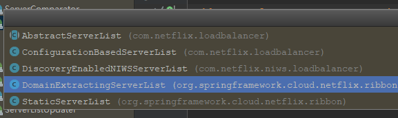
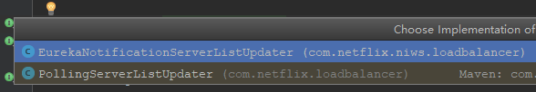
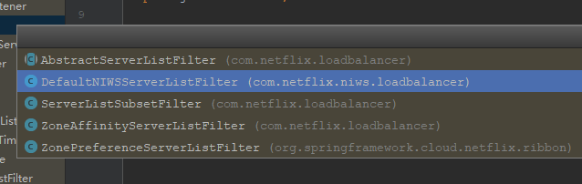
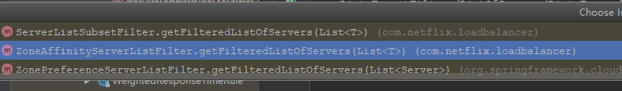

[[TOC]]

# 第四章 客户端负载均衡 Spring Cloud Ribbon

2019年12月20日 

Spring Cloud Ribbon 是基于 HTTP 和 TCP 的客户端负载均衡工具，基于 Eureka Ribbon 实现。

Spring Cloud Ribbon 虽然是工具类框架，但不像 **服务注册中心**、**配置中心** 、**API网关** 独立部署，而是在每一个 微服务和基础设施中。

## 4.1 客户端负载均衡

系统架构中非常重要的负载均衡，因为 直接 与系统的 **高可用**  **网络压力的缓解** 和 **处理能力扩展能力** 密切相关。

常说的 负载均衡一般指的是 **服务端负载均衡**

负载均衡： 硬件负载均衡 和 软件负载均衡

**硬件负载均衡**：主要在服务器节点之间 安装 专门的负载均衡设备 如 F5

**软件负载均衡**：通过服务器上 安装一些具有负载均衡功能 或者 模块的软件 来完成分发工作，如 Nginx

上面两种 逻辑： 请求到达 负载均衡设备 负载均衡设备管理服务清单  再分发


**客户端负载均衡**：

与上面最大的区别 在于 **服务清单所存储的位置**

所有的客户端 节点都 **维护自己要访问的服务端清单**，这些清单来自 **服务注册中心**，如 Eureka 服务端。

`org.springframework.cloud.netflix.ribbon.eureka.RibbonEurekaAutoConfiguration` Eureka

使用：

服务提供者 只需要 启动 多个 服务实例 并 注册到一类注册中心

服务消费者 直接通过 `@LoadBalanced` 注解修饰过的 RestTemplate  调用接口。

## 4.2 RestTemplate 详解

### 4.2.1 GET 请求

```java
String s = restTemplate.getForObject("http://HELLO-SERVER/hello", String.class);
```

getForEntity 的三种重载

一、 `getForEntity(String url, Class type, Object... urlVariables);`

url 中 使用占位符，urlVariables 进行依次替换

二、  `getForEntity(String url, Class type, Map urlVariables);`

更具  url 中属性名，找到 map 中对应 Key 的值

三、  `getForEntity(URL url, Class type);`

将 url  与 urlVariables 绑定。

### 4.2.2 POST 请求

```java
postForObject(String url, @Nullable Object request, Class<T> responseType, Object... uriVariables) 
```

基本 与 GET 类似。三种 重载

postForObject 与 postForEntity 返回对象不同

另外 **postForLocation** 以 POST请求提供资源，返回 新的 URL 。

### 4.2.3 PUT 请求

```java
put(String url, @Nullable Object request, Object... uriVariables) 
```

修改，基本 与 postForObject 类似 ，不过 没有返回

### 4.2.4 DELETE 请求

基本都类似

## 4.3 源码分析

`RestTemplate` 是由Spring 提供的 ，但是 Ribbon 是怎么通过它 实现 客户端负载均衡的呢？

**@LoadBalanced** 主要还是 这个 注解（负载均衡）。

```java
package org.springframework.cloud.client.loadbalancer;
@Target({ElementType.FIELD, ElementType.PARAMETER, ElementType.METHOD})
@Retention(RetentionPolicy.RUNTIME)
@Documented
@Inherited
@Qualifier
public @interface LoadBalanced {
}
```

但是 这里完全 和 Ribbon 没有关系，陷入死胡同？其实不对，既然是注解，那么 就会由 使用注解的配置类，与LoadBalanced 同路径下找到 **LoadBalancerAutoConfiguration**：

```java
@Configuration
// 当类路径下有RestTemplate类。即 该类 存在
@ConditionalOnClass({RestTemplate.class})
// 存在 LoadBalancerClient 对象
@ConditionalOnBean({LoadBalancerClient.class})
@EnableConfigurationProperties({LoadBalancerRetryProperties.class})
public class LoadBalancerAutoConfiguration {...}
```

 类名 就可以知道，需要 提前注册 `LoadBalancerClient`  对象实例。

```java
package org.springframework.cloud.client.loadbalancer;
public interface LoadBalancerClient extends ServiceInstanceChooser {
    // 执行 获取服务消息
    <T> T execute(String serviceId, LoadBalancerRequest<T> request) throws IOException;

    <T> T execute(String serviceId, ServiceInstance serviceInstance, LoadBalancerRequest<T> request) throws IOException;

    // 重构URI，构建成为 ip:port/xxx 类型，  original 应该就是 我们传入的 hostname:port/xxx
    URI reconstructURI(ServiceInstance instance, URI original);
}

public interface ServiceInstanceChooser {
    // 方法名就可以得知  选择对应 服务实例
    ServiceInstance choose(String serviceId);
}
```

由上面得知：

> LoadBalancerAutoConfiguration 负载均衡器的自动配置类，该类加载配置的条件之一就是 需要 注入 **LoadBalancerClient** 的实力。


具体实现就到了 spring cloud ribbon下： 

具体的负载均衡器实现

```java
package org.springframework.cloud.netflix.ribbon;
public class RibbonLoadBalancerClient implements LoadBalancerClient {....}

```

### 4.3.1 负载均衡自动配置类

再继续看 **负载均衡自动配置类**：

```java
    @Configuration
    @ConditionalOnMissingClass({"org.springframework.retry.support.RetryTemplate"})
    static class LoadBalancerInterceptorConfig {
        LoadBalancerInterceptorConfig() {
        }

        @Bean
        public LoadBalancerInterceptor ribbonInterceptor(LoadBalancerClient loadBalancerClient, LoadBalancerRequestFactory requestFactory) {
            // 注入 LoadBalancerInterceptor 拦截器 用于负载均衡
            return new LoadBalancerInterceptor(loadBalancerClient, requestFactory);
        }

        @Bean
        @ConditionalOnMissingBean
        public RestTemplateCustomizer restTemplateCustomizer(final LoadBalancerInterceptor loadBalancerInterceptor) {
            // 实例化 RestTemplateCustomizer 
            // 用于 给restTemplate 添加 拦截器的 编辑器
            return (restTemplate) -> {
                List<ClientHttpRequestInterceptor> list = new ArrayList(restTemplate.getInterceptors());
                list.add(loadBalancerInterceptor);
                restTemplate.setInterceptors(list);
            };
        }
    }
```

向 `List<RestTemplate>`  中 使用 ，编辑器 写入 拦截器

```java
    @Bean
    public SmartInitializingSingleton loadBalancedRestTemplateInitializerDeprecated(final ObjectProvider<List<RestTemplateCustomizer>> restTemplateCustomizers) {
        return () -> {
            restTemplateCustomizers.ifAvailable((customizers) -> {
                Iterator var2 = this.restTemplates.iterator();

                while(var2.hasNext()) {
                    RestTemplate restTemplate = (RestTemplate)var2.next();
                    Iterator var4 = customizers.iterator();

                    while(var4.hasNext()) {
                        RestTemplateCustomizer customizer = (RestTemplateCustomizer)var4.next();
                        customizer.customize(restTemplate);
                    }
                }

            });
        };
    }
```

### 4.3.2 负载均衡拦截器

`LoadBalancerInterceptor`  拦截器，工作原理

```java
public class LoadBalancerInterceptor implements ClientHttpRequestInterceptor {
    private LoadBalancerClient loadBalancer;
    private LoadBalancerRequestFactory requestFactory;

    public LoadBalancerInterceptor(LoadBalancerClient loadBalancer, LoadBalancerRequestFactory requestFactory) {
        this.loadBalancer = loadBalancer;
        this.requestFactory = requestFactory;
    }

    public LoadBalancerInterceptor(LoadBalancerClient loadBalancer) {
        this(loadBalancer, new LoadBalancerRequestFactory(loadBalancer));
    }

    // 拦截逻辑
    public ClientHttpResponse intercept(final HttpRequest request, final byte[] body, final ClientHttpRequestExecution execution) throws IOException {
        // 拿到请求的 host, 由于 host 是使用的 服务名
        URI originalUri = request.getURI();
        String serviceName = originalUri.getHost();
        Assert.state(serviceName != null, "Request URI does not contain a valid hostname: " + originalUri);
        // 所以这里 直接 使用的 服务名
        return (ClientHttpResponse)this.loadBalancer.execute(serviceName, this.requestFactory.createRequest(request, body, execution));
    }
}
```

### 4.3.3 负载均衡客户端实现

**RibbonLoadBalancerClient** 具体 负载逻辑

```java
    public <T> T execute(String serviceId, LoadBalancerRequest<T> request) throws IOException {
        return this.execute(serviceId, (LoadBalancerRequest)request, (Object)null);
    }

// 服务ID  请求 提示
    public <T> T execute(String serviceId, LoadBalancerRequest<T> request, Object hint) throws IOException {
        // 通过 服务 ID 获取到 负载均衡器
        ILoadBalancer loadBalancer = this.getLoadBalancer(serviceId);
        // 获取 到对应的服务
        Server server = this.getServer(loadBalancer, hint);
        if (server == null) {
            throw new IllegalStateException("No instances available for " + serviceId);
        } else {
            RibbonLoadBalancerClient.RibbonServer ribbonServer = new RibbonLoadBalancerClient.RibbonServer(serviceId, server, this.isSecure(server, serviceId), this.serverIntrospector(serviceId).getMetadata(server));
            return this.execute(serviceId, (ServiceInstance)ribbonServer, (LoadBalancerRequest)request);
        }
    }


// 并没有使用 LoadBalancer 接口实现的 choose 而是使用的 负载均衡器
    protected Server getServer(ILoadBalancer loadBalancer, Object hint) {
        return loadBalancer == null ? null : loadBalancer.chooseServer(hint != null ? hint : "default");
    }
```

### 4.3.4 负载均衡器

```java
public interface ILoadBalancer {
    // 向负载均衡器 中维护的实例 表 增加服务实例
    void addServers(List<Server> var1);

    // 通过 策略实现 负载均衡逻辑，选择 具体服务实例
    Server chooseServer(Object var1);

    // 通知 和 标识 负载均衡器 中 某个具体实例 已经停止服务，防止 出现 再调用
    void markServerDown(Server var1);

    /** @deprecated */
    @Deprecated
    List<Server> getServerList(boolean var1);

    // 获取 正常服务列表
    List<Server> getReachableServers();

    // 获取 所有服务列表，正常 与 停用
    List<Server> getAllServers();
}
```


`RibbonCilentConfiguration` 中已经配置好了

```java
    @Bean
    @ConditionalOnMissingBean
    public ILoadBalancer ribbonLoadBalancer(IClientConfig config, ServerList<Server> serverList, ServerListFilter<Server> serverListFilter, IRule rule, IPing ping, ServerListUpdater serverListUpdater) {
        return (ILoadBalancer)(this.propertiesFactory.isSet(ILoadBalancer.class, this.name) ? (ILoadBalancer)this.propertiesFactory.get(ILoadBalancer.class, config, this.name) : new ZoneAwareLoadBalancer(config, rule, ping, serverList, serverListFilter, serverListUpdater));
    }
```

### 4.3.5 负载均衡执行

继续 4.3.3 中 `execute`，将获取到  Server 封装到 `RibbonServer` 中

```java

    public <T> T execute(String serviceId, ServiceInstance serviceInstance, LoadBalancerRequest<T> request) throws IOException {
        Server server = null;
        if (serviceInstance instanceof RibbonLoadBalancerClient.RibbonServer) {
            server = ((RibbonLoadBalancerClient.RibbonServer)serviceInstance).getServer();
        }

        // 得到 服务
        if (server == null) {
            throw new IllegalStateException("No instances available for " + serviceId);
        } else {
            RibbonLoadBalancerContext context = this.clientFactory.getLoadBalancerContext(serviceId);
            RibbonStatsRecorder statsRecorder = new RibbonStatsRecorder(context, server);

            try {
                // 调用，向 具体 服务实例 发送请求
                T returnVal = request.apply(serviceInstance);
                statsRecorder.recordStats(returnVal);
                return returnVal;
            } catch (IOException var8) {
                statsRecorder.recordStats(var8);
                throw var8;
            } catch (Exception var9) {
                statsRecorder.recordStats(var9);
                ReflectionUtils.rethrowRuntimeException(var9);
                return null;
            }
        }
    }
```

### 4.3.6 服务实例调用

```java
public interface LoadBalancerRequest<T> {
    T apply(ServiceInstance instance) throws Exception;
}

```

```java
public interface ServiceInstance {
    default String getInstanceId() {
        return null;
    }

    String getServiceId();

    String getHost();

    int getPort();

    boolean isSecure();

    URI getUri();

    Map<String, String> getMetadata();

    default String getScheme() {
        return null;
    }
}

```

具体实现 就是 `RibbonLoadBalancerClient.RibbonServer`

而 正式 服务调用：

```java
public class AsyncLoadBalancerInterceptor implements AsyncClientHttpRequestInterceptor {
    private LoadBalancerClient loadBalancer;

    public AsyncLoadBalancerInterceptor(LoadBalancerClient loadBalancer) {
        this.loadBalancer = loadBalancer;
    }

    public ListenableFuture<ClientHttpResponse> intercept(
        final HttpRequest request, 
        final byte[] body, 
        final AsyncClientHttpRequestExecution execution) throws IOException {
        
        URI originalUri = request.getURI();
        String serviceName = originalUri.getHost();
        return 
            (ListenableFuture)this.loadBalancer.execute(
            serviceName, 
            new LoadBalancerRequest<ListenableFuture<ClientHttpResponse>>() {
                public ListenableFuture<ClientHttpResponse> apply(
                    // 服务调用
                    final ServiceInstance instance) throws Exception {
                    HttpRequest serviceRequest = 
                        // ServiceRequestWrapper 已经 重写了 getURI，
                        // 调用 LoadBalancerClient  reconstructURI
                        new ServiceRequestWrapper(
                            request, 
                            instance, 
                            AsyncLoadBalancerInterceptor.this.loadBalancer);
                    return execution.executeAsync(serviceRequest, body);
                }
        });
    }
    
}
```

```java
// AsyncClientHttpRequestExecution execution     
private class AsyncRequestExecution implements AsyncClientHttpRequestExecution {
        private Iterator<AsyncClientHttpRequestInterceptor> iterator;

        public AsyncRequestExecution() {
            this.iterator = InterceptingAsyncClientHttpRequest.this.interceptors.iterator();
        }

        public ListenableFuture<ClientHttpResponse> executeAsync(HttpRequest request, byte[] body) throws IOException {
            if (this.iterator.hasNext()) {
                AsyncClientHttpRequestInterceptor interceptor = (AsyncClientHttpRequestInterceptor)this.iterator.next();
                return interceptor.intercept(request, body, this);
            } else {
                // 这里 便是 使用 ServiceRequestWrapper 重写的 函数
                URI uri = request.getURI();
                HttpMethod method = request.getMethod();
                HttpHeaders headers = request.getHeaders();
                Assert.state(method != null, "No standard HTTP method");
                AsyncClientHttpRequest delegate = InterceptingAsyncClientHttpRequest.this.requestFactory.createAsyncRequest(uri, method);
                delegate.getHeaders().putAll(headers);
                if (body.length > 0) {
                    StreamUtils.copy(body, delegate.getBody());
                }

                return delegate.executeAsync();
            }
        }
    }
```

```java
    public URI reconstructURI(ServiceInstance instance, URI original) {
        Assert.notNull(instance, "instance can not be null");
        // 获取 服务ID
        String serviceId = instance.getServiceId();
        // 通过 SpringClientFactory 获取 对应 负载均衡 上下文
        RibbonLoadBalancerContext context = 
            this.clientFactory.getLoadBalancerContext(serviceId);
        URI uri;
        Server server;
        // 构建 服务实例 server
        if (instance instanceof RibbonLoadBalancerClient.RibbonServer) {
            RibbonLoadBalancerClient.RibbonServer ribbonServer = (RibbonLoadBalancerClient.RibbonServer)instance;
            server = ribbonServer.getServer();
            uri = RibbonUtils.updateToSecureConnectionIfNeeded(original, ribbonServer);
        } else {
            server = new Server(instance.getScheme(), instance.getHost(), instance.getPort());
            IClientConfig clientConfig = this.clientFactory.getClientConfig(serviceId);
            ServerIntrospector serverIntrospector = this.serverIntrospector(serviceId);
            uri = RibbonUtils.updateToSecureConnectionIfNeeded(original, clientConfig, serverIntrospector, server);
        }

        return context.reconstructURIWithServer(server, uri);
    }
```

**SpringClientFactory** 用来创建客户端负载均衡器的工厂子类，该工厂类 会为 每一个 不同名的 Ribbon 客户端生成不同的 Spring 上下文。

**RibbonLoadBalancerContext** 是 LoadBalancerContext 的子类，用于存储一些被负载均衡器使用的 上下文结构 和 API

目前 就大致清楚 负载均衡逻辑： **LoadBalancerInterceptor**  拦截请求，将 逻辑服务名为 host 的URI 进行修改，同时 **LoadBalancerClient** 的 实现 **RibbonLoadBalancerClient** 默认的服务站均衡器 **ZoneAwareLoadBalancer**

### 4.3.7 负载均衡器详解 IloadBalancer

查看 `ILoadBalancer` 接口 真正实现：

- ZoneAwareLoadBalancer
- NoOpLoadBalancer
- DynamicServerListLoadBalancer
- BaseLoadBalancer

[1577107882778](./assets/1577107882778.png)

可以 清楚知道；三者关系。那么 Ribbon 默认用是什么 负载均衡器呢？

#### 4.3.7.1 AbstractLoadBalancer

`ILoadBalancer` 的 抽象实现

```java
public abstract class AbstractLoadBalancer implements ILoadBalancer {
    public AbstractLoadBalancer() {
    }

    public Server chooseServer() {
        return this.chooseServer((Object)null);
    }

    // 更具分组 获取对应 分组 服务
    public abstract List<Server> getServerList(AbstractLoadBalancer.ServerGroup var1);

    // 负载均衡器中各个服务实例当前的属性 与 统计信息 的 对象
    public abstract LoadBalancerStats getLoadBalancerStats();

    // 服务分组枚举
    public static enum ServerGroup {
        ALL, // 所有服务实例
        STATUS_UP, // 正常服务实例
        STATUS_NOT_UP; // 停止服务的实例

        private ServerGroup() {
        }
    }
}
```

#### 4.3.7.2 BaseLoadBalancer 

**基础实现** 定义了 关于负载均衡的基础内容


一、两个 服务列表，一个列表 用于存储 **全部服务**，一个用于存储 **正常服务**

```java
    @Monitor(
        name = "LoadBalancer_AllServerList",
        type = DataSourceType.INFORMATIONAL
    )
    protected volatile List<Server> allServerList;
    @Monitor(
        name = "LoadBalancer_UpServerList",
        type = DataSourceType.INFORMATIONAL
    )
    protected volatile List<Server> upServerList;
```

二、用于存储信息的对象。

`protected LoadBalancerStats lbStats;` 

三、用于检查服务是否正常的对象，默认为 null

`protected IPing ping;`

四、检验服务执行策略对象

`protected IPingStrategy pingStrategy;`

五、负载均衡的处理规则

`protected IRule rule;` `chooseServer(Object key)`实现中可以知道，实际的任务选择 交由 IRule 实例的 choose 实现。

六、 启动 ping 任务

在构造中，启动一个 检查 Server服务健康的任务，默认10s间隔执行

```java
    void setupPingTask() {
        if (!this.canSkipPing()) {
            if (this.lbTimer != null) {
                this.lbTimer.cancel();
            }

            this.lbTimer = new ShutdownEnabledTimer("NFLoadBalancer-PingTimer-" + this.name, true);
            this.lbTimer.schedule(new BaseLoadBalancer.PingTask(), 0L, (long)(this.pingIntervalSeconds * 1000));
            this.forceQuickPing();
        }
    }
```

七、基本操作

+ addServer(List newServers)，向负载均衡中添加新的服务实例列表
+ chooseServer(Object key) ，挑选服务实例
+ markServerDown(Server server)，标记服务实例暂停
+ getReachableServers() ， 获取服务实例列表，
+ getAllServers

#### 4.3.7.3 DynamicServerListLoadBalancer

继承于 `BaseLoadBalancer` 。实现了 **服务实例清单 在运行期 动态更新能力**

同时 具备 对 服务实例 清单进行过滤功能，可以选择性 获取 一批服务实例清单。

主要关注以下 属性

```java
public class DynamicServerListLoadBalancer<T extends Server> extends BaseLoadBalancer {
    ...
	volatile ServerList<T> serverListImpl;
    volatile ServerListFilter<T> filter;
    protected final UpdateAction updateAction;
    protected volatile ServerListUpdater serverListUpdater;
    ...
}
```

##### 4.3.7.3.1 ServerList 服务列表获取

```java
public interface ServerList<T extends Server> {
    // 获取 初试化 服务清单
    List<T> getInitialListOfServers();

    // 获取 更新的服务清单
    List<T> getUpdatedListOfServers();
}
```

但是 该接口 却有 多个 实现




`org.springframework.cloud.netflix.ribbon.eureka.EurekaRibbonClientConfiguration`

```java
    @Bean
    @ConditionalOnMissingBean
    public ServerList<?> ribbonServerList(IClientConfig config, Provider<EurekaClient> eurekaClientProvider) {
        if (this.propertiesFactory.isSet(ServerList.class, this.serviceId)) {
            return (ServerList)this.propertiesFactory.get(ServerList.class, config, this.serviceId);
        } else {
            // 默认 配置 该实现
            DiscoveryEnabledNIWSServerList discoveryServerList = new DiscoveryEnabledNIWSServerList(config, eurekaClientProvider);
            // 然后 设置 到 该实例中
            DomainExtractingServerList serverList = new DomainExtractingServerList(discoveryServerList, config, this.approximateZoneFromHostname);
            return serverList;
        }
    }
```

```java
// DiscoveryEnabledNIWSServerList    
public List<DiscoveryEnabledServer> getInitialListOfServers() {
        return this.obtainServersViaDiscovery();
    }

    public List<DiscoveryEnabledServer> getUpdatedListOfServers() {
        return this.obtainServersViaDiscovery();
    }
// 主要 通过 EurekaClient 从服务注册 中心 获取 对应 的具体 服务实例InstanceInfo 列表
   private List<DiscoveryEnabledServer> obtainServersViaDiscovery() {
        List<DiscoveryEnabledServer> serverList = new ArrayList();
        if (this.eurekaClientProvider != null && this.eurekaClientProvider.get() != null) {
            EurekaClient eurekaClient = (EurekaClient)this.eurekaClientProvider.get();
            if (this.vipAddresses != null) {
                String[] var3 = this.vipAddresses.split(",");
                int var4 = var3.length;

                for(int var5 = 0; var5 < var4; ++var5) {
                    String vipAddress = var3[var5];
                    List<InstanceInfo> listOfInstanceInfo = eurekaClient.getInstancesByVipAddress(vipAddress, this.isSecure, this.targetRegion);
                    Iterator var8 = listOfInstanceInfo.iterator();

                    while(var8.hasNext()) {
                        InstanceInfo ii = (InstanceInfo)var8.next();
                        if (ii.getStatus().equals(InstanceStatus.UP)) {
                            if (this.shouldUseOverridePort) {
                                if (logger.isDebugEnabled()) {
                                    logger.debug("Overriding port on client name: " + this.clientName + " to " + this.overridePort);
                                }

                                InstanceInfo copy = new InstanceInfo(ii);
                                if (this.isSecure) {
                                    ii = (new Builder(copy)).setSecurePort(this.overridePort).build();
                                } else {
                                    ii = (new Builder(copy)).setPort(this.overridePort).build();
                                }
                            }

                            DiscoveryEnabledServer des = this.createServer(ii, this.isSecure, this.shouldUseIpAddr);
                            serverList.add(des);
                        }
                    }

                    if (serverList.size() > 0 && this.prioritizeVipAddressBasedServers) {
                        break;
                    }
                }
            }

            return serverList;
        } else {
            logger.warn("EurekaClient has not been initialized yet, returning an empty list");
            return new ArrayList();
        }
    }

```

```java
// DomainExtractingServerList
    public List<DiscoveryEnabledServer> getInitialListOfServers() {
        List<DiscoveryEnabledServer> servers = this.setZones(this.list.getInitialListOfServers());
        return servers;
    }

    public List<DiscoveryEnabledServer> getUpdatedListOfServers() {
        List<DiscoveryEnabledServer> servers = this.setZones(this.list.getUpdatedListOfServers());
        return servers;
    }

// 从注入的属性 也就是 DiscoveryEnabledNIWSServerList实例获取到集合 调用 setZones
// 将 DiscoveryEnabledServer 转换为 DomainExtractingServer
    private List<DiscoveryEnabledServer> setZones(List<DiscoveryEnabledServer> servers) {
        List<DiscoveryEnabledServer> result = new ArrayList();
        boolean isSecure = this.ribbon.isSecure(true);
        boolean shouldUseIpAddr = this.ribbon.isUseIPAddrForServer();
        Iterator var5 = servers.iterator();

        while(var5.hasNext()) {
            DiscoveryEnabledServer server = (DiscoveryEnabledServer)var5.next();
            result.add(new DomainExtractingServer(server, isSecure, shouldUseIpAddr, this.approximateZoneFromHostname));
        }

        return result;
    }
```

##### 4.3.7.3.2 ServerListUpdate 服务列表更新

通过上面分析，Ribbon 与  Eureka 整合，得知 如何 从 Eureka 注册中心 获取服务实例清单。

那么 又是 怎么 **触发** 去获取清单 与 **更新** 本地服务实例清单？

```java
public interface ServerListUpdater {
    // 启动服务更新 传入 具体实现
    void start(ServerListUpdater.UpdateAction var1);

    // 停止更新服务
    void stop();

    // 获取 最近的更新 时间戳
    String getLastUpdate();

    // 获取上一次更新到选择的时间间隔 毫秒
    long getDurationSinceLastUpdateMs();

    // 获取 错过的 更新周期
    int getNumberMissedCycles();

    // 获取 核心 线程数
    int getCoreThreads();

    public interface UpdateAction {
        void doUpdate();
    }
}
```

该接口 实现 也是两个：



根据名称 

`PollingServerListUpdater`  （动态服务器列表更新）

`EurekaNotificationServerListUpdater `（Eureka 通知 服务列表更新）

得知 默认 为 动态

```java
    public synchronized void start(final UpdateAction updateAction) {
        if (this.isActive.compareAndSet(false, true)) {
            Runnable wrapperRunnable = new Runnable() {
                public void run() {
                    if (!PollingServerListUpdater.this.isActive.get()) {
                        if (PollingServerListUpdater.this.scheduledFuture != null) {
                            PollingServerListUpdater.this.scheduledFuture.cancel(true);
                        }

                    } else {
                        try {
                            updateAction.doUpdate();
                            PollingServerListUpdater.this.lastUpdated = System.currentTimeMillis();
                        } catch (Exception var2) {
                            PollingServerListUpdater.logger.warn("Failed one update cycle", var2);
                        }

                    }
                }
            };
            // 对 该线程任务 设置参数 后执行
            this.scheduledFuture = getRefreshExecutor().scheduleWithFixedDelay(
                wrapperRunnable, 
                this.initialDelayMs, 
                this.refreshIntervalMs, 
                TimeUnit.MILLISECONDS);
        } else {
            logger.info("Already active, no-op");
        }

    }
```

##### 4.3.7.3.3 ServerListFilter 服务列表过滤

知道 如何 更新服务后，继续

```java
    public DynamicServerListLoadBalancer() {
        this.isSecure = false;
        this.useTunnel = false;
        this.serverListUpdateInProgress = new AtomicBoolean(false);
        this.updateAction = new UpdateAction() {
            public void doUpdate() {
                DynamicServerListLoadBalancer.this.updateListOfServers();
            }
        };
    }
    @VisibleForTesting
    public void updateListOfServers() {
        List<T> servers = new ArrayList();
        if (this.serverListImpl != null) {
            servers = this.serverListImpl.getUpdatedListOfServers();
            LOGGER.debug("List of Servers for {} obtained from Discovery client: {}", this.getIdentifier(), servers);
            if (this.filter != null) {
                servers = this.filter.getFilteredListOfServers((List)servers);
                LOGGER.debug("Filtered List of Servers for {} obtained from Discovery client: {}", this.getIdentifier(), servers);
            }
        }

        this.updateAllServerList((List)servers);
    }
```


```java
public interface ServerListFilter<T extends Server> {
    List<T> getFilteredListOfServers(List<T> var1);
}
```



方法实现：



全部 都会 来执行 

 `ZoneAffinityServerListFilter`（区域感知）

```java
    public List<T> getFilteredListOfServers(List<T> servers) {
        if (this.zone != null && (this.zoneAffinity || this.zoneExclusive) && servers != null && servers.size() > 0) {
            List<T> filteredServers = Lists.newArrayList(Iterables.filter(servers, this.zoneAffinityPredicate.getServerOnlyPredicate()));
            // 过滤后 没有马上 返回，而是判断 是否启用 区域感知
            if (this.shouldEnableZoneAffinity(filteredServers)) {
                return filteredServers;
            }

            // 默认值 不开启区域感知
            if (this.zoneAffinity) {
                this.overrideCounter.increment();
            }
        }

        return servers;
    }
```

`Iterables.filter(servers, this.zoneAffinityPredicate.getServerOnlyPredicate())` 进行判断过滤的。

服务实例 与消费者的Zone 是否为同一个，进行过滤。

是否需要 **区域感知**

```java
    private boolean shouldEnableZoneAffinity(List<T> filtered) {
        // 不开启 区域感知 与 区域排除
        if (!this.zoneAffinity && !this.zoneExclusive) {
            return false;
        } else if (this.zoneExclusive) {
            return true;
        } else {
            LoadBalancerStats stats = this.getLoadBalancerStats();
            if (stats == null) {
                return this.zoneAffinity;
            } else {
                logger.debug("Determining if zone affinity should be enabled with given server list: {}", filtered);
                ZoneSnapshot snapshot = stats.getZoneSnapshot(filtered);
                double loadPerServer = snapshot.getLoadPerServer();
                int instanceCount = snapshot.getInstanceCount();
                int circuitBreakerTrippedCount = snapshot.getCircuitTrippedCount();
                
                if (
                    // 故障实例数比 小于 默认 0.8
                    (double)circuitBreakerTrippedCount / (double)instanceCount < this.blackOutServerPercentageThreshold.get() && 
                    // 实例 负载 默认 0.6
                    loadPerServer < this.activeReqeustsPerServerThreshold.get() && 
                    // 可用实例数  默认2
                    instanceCount - circuitBreakerTrippedCount >= this.availableServersThreshold.get()) {
                    return true;
                } else {
                    logger.debug("zoneAffinity is overriden. blackOutServerPercentage: {}, activeReqeustsPerServer: {}, availableServers: {}", new Object[]{(double)circuitBreakerTrippedCount / (double)instanceCount, loadPerServer, instanceCount - circuitBreakerTrippedCount});
                    return false;
                }
            }
        }
    }
```

#### 4.3.7.4 ZoneAwareLoadBalancer

对 `DynamicServerListLoadBalancer` 扩展

并没有 重写 **chooseServer**，故而 还是 使用 RoundRobinRule 规则，轮询的方式调用服务实例，没有 Zone 区分。如果，在**获取服务列表**时，`ZoneAffinityServerListFilter`  **并没有过滤掉（不开启 区域感知 与 区域排除）** ， 就会导致 跨 Zone ，性能低下。  

ZoneAwareLoadBalancer 重写了 setServerForZones 方法 

```java
// setServerListForZones 在父类中使用
// 只是 按照 zone 进行分组的
public void setServersList(List lsrv) {
        super.setServersList(lsrv);
        Map<String, List<Server>> serversInZones = new HashMap();
        Iterator var4 = lsrv.iterator();

        while(var4.hasNext()) {
            Server server = (Server)var4.next();
            this.getLoadBalancerStats().getSingleServerStat(server);
            String zone = server.getZone();
            if (zone != null) {
                zone = zone.toLowerCase();
                List<Server> servers = (List)serversInZones.get(zone);
                if (servers == null) {
                    servers = new ArrayList();
                    serversInZones.put(zone, servers);
                }

                ((List)servers).add(server);
            }
        }

        this.setServerListForZones(serversInZones);
    }

    protected void setServerListForZones(Map<String, List<Server>> zoneServersMap) {
        LOGGER.debug("Setting server list for zones: {}", zoneServersMap);
        this.getLoadBalancerStats().updateZoneServerMapping(zoneServersMap);
    }
```

```java

protected void setServerListForZones(Map<String, List<Server>> zoneServersMap) {
    super.setServerListForZones(zoneServersMap);
    if (this.balancers == null) {
        this.balancers = new ConcurrentHashMap();
    }

    Iterator var2 = zoneServersMap.entrySet().iterator();

    // 遍历 zone 与 对应的 服务列表
    Entry existingLBEntry;
    while(var2.hasNext()) {
        existingLBEntry = (Entry)var2.next();
        String zone = ((String)existingLBEntry.getKey()).toLowerCase();
        // 将每个 zone 对应的 列表设置进对应的 负载均衡中，
        // this.getLoadBalancer(zone) 创建，并将创建的 设置到 balancers 中
        this.getLoadBalancer(zone).setServersList((List)existingLBEntry.getValue());
    }

    var2 = this.balancers.entrySet().iterator();
    // 遍历 zone 与 对应的 BaseLoadBalancer
    while(var2.hasNext()) {
        existingLBEntry = (Entry)var2.next();
        // 本次 zone 对应的 BaseLoadBalancer 没有对应的 服务列表时 设置 为空列表
        if (!zoneServersMap.keySet().contains(existingLBEntry.getKey())) {
            ((BaseLoadBalancer)existingLBEntry.getValue()).setServersList(Collections.emptyList());
        }
    }

}

    @VisibleForTesting
    BaseLoadBalancer getLoadBalancer(String zone) {
        zone = zone.toLowerCase();
        BaseLoadBalancer loadBalancer = (BaseLoadBalancer)this.balancers.get(zone);
        if (loadBalancer == null) {
            IRule rule = this.cloneRule(this.getRule());
            loadBalancer = new BaseLoadBalancer(this.getName() + "_" + zone, rule, this.getLoadBalancerStats());
            BaseLoadBalancer prev = (BaseLoadBalancer)this.balancers.putIfAbsent(zone, loadBalancer);
            if (prev != null) {
                loadBalancer = prev;
            }
        }

        return loadBalancer;
    }
```
以上 便是 ZoneAwareLoadBalancer 对负载均衡器的 扩充逻辑

再看看 它的 服务选择逻辑，不再是 BaseLoadBalancer的 轮询

```java
   public Server chooseServer(Object key) {
       // ZoneAwareNIWSDiscoveryLoadBalancer.enabled 默认 开启
       // 以及 负载均衡器 可用区域 大于1  才需要选择
        if (ENABLED.get() && this.getLoadBalancerStats().getAvailableZones().size() > 1) {
            Server server = null;

            try {
                // 负载均衡器 统计器
                LoadBalancerStats lbStats = this.getLoadBalancerStats();
                // 为 当前 负载均衡器中所有的 Zone 创建快照
                Map<String, ZoneSnapshot> zoneSnapshot = ZoneAvoidanceRule.createSnapshot(lbStats);
                logger.debug("Zone snapshots: {}", zoneSnapshot);
                
                if (this.triggeringLoad == null) {
                    this.triggeringLoad = DynamicPropertyFactory.getInstance().getDoubleProperty("ZoneAwareNIWSDiscoveryLoadBalancer." + this.getName() + ".triggeringLoadPerServerThreshold", 0.2D);
                }

                if (this.triggeringBlackoutPercentage == null) {
                    this.triggeringBlackoutPercentage = DynamicPropertyFactory.getInstance().getDoubleProperty("ZoneAwareNIWSDiscoveryLoadBalancer." + this.getName() + ".avoidZoneWithBlackoutPercetage", 0.99999D);
                }

                // 得到 可用 Zone 集合
                // 剔除掉 不合适的 Zone ，服务数  故障率 负载率
                Set<String> availableZones = ZoneAvoidanceRule.getAvailableZones(zoneSnapshot, this.triggeringLoad.get(), this.triggeringBlackoutPercentage.get());
                logger.debug("Available zones: {}", availableZones);
                // 获取的 可用Zone 不为空，并且 个数小于 总个数，就随机选择 Zone 
                // 为什么 是 随机选择Zone  不是应该 选择与 请求对应的 Zone吗？
                if (availableZones != null && availableZones.size() < zoneSnapshot.keySet().size()) {
                    String zone = ZoneAvoidanceRule.randomChooseZone(zoneSnapshot, availableZones);
                    logger.debug("Zone chosen: {}", zone);
                    if (zone != null) {
                        // 通过 zone 创建， 只是针对 zone 做对应 服务选择
                        // IRule 策略过滤
                        BaseLoadBalancer zoneLoadBalancer = this.getLoadBalancer(zone);
                        server = zoneLoadBalancer.chooseServer(key);
                    }
                }
            } catch (Exception var8) {
                logger.error("Error choosing server using zone aware logic for load balancer={}", this.name, var8);
            }

            if (server != null) {
                return server;
            } else {
                // 没有选择到有效的 服务时 
                logger.debug("Zone avoidance logic is not invoked.");
                return super.chooseServer(key);
            }
        } else {
            // 没必要 启用 当前选择器时
            logger.debug("Zone aware logic disabled or there is only one zone");
            return super.chooseServer(key);
        }
    }
```


### 4.3.8 负载均衡策略 IRule

#### 4.3.8.1 负载均衡策略抽象类型 AbstractLoadBalancerRule

```java
public abstract class AbstractLoadBalancerRule implements IRule, IClientConfigAware {
    private ILoadBalancer lb;

    public AbstractLoadBalancerRule() {
    }

    public void setLoadBalancer(ILoadBalancer lb) {
        this.lb = lb;
    }

    public ILoadBalancer getLoadBalancer() {
        return this.lb;
    }
}
```

主要定义 对应于 IloadBalancer 负载均衡器 的依赖

#### 4.3.8.2 随机 RandomRule

从服务实例清单中随机选择一个服务实例的功能

```java
public class RandomRule extends AbstractLoadBalancerRule {

    @SuppressWarnings({"RCN_REDUNDANT_NULLCHECK_OF_NULL_VALUE"})
    public Server choose(ILoadBalancer lb, Object key) {
        if (lb == null) {
            return null;
        } else {
            Server server = null;

            while(server == null) {
                if (Thread.interrupted()) {
                    return null;
                }

                List<Server> upList = lb.getReachableServers();
                List<Server> allList = lb.getAllServers();
                int serverCount = allList.size();
                if (serverCount == 0) {
                    return null;
                }

                // 随机获取
                int index = this.chooseRandomInt(serverCount);
                server = (Server)upList.get(index);
                if (server == null) {
                    Thread.yield();
                } else {
                    if (server.isAlive()) {
                        return server;
                    }

                    server = null;
                    Thread.yield();
                }
            }

            return server;
        }
    }
	......
}
```

#### 4.3.8.3 线性轮询 RoundRobinRule

基本也很简单

```java
    public Server choose(ILoadBalancer lb, Object key) {
        if (lb == null) {
            log.warn("no load balancer");
            return null;
        } else {
            Server server = null;
            int count = 0;
            while(true) {
                if (server == null && count++ < 10) {
                    List<Server> reachableServers = lb.getReachableServers();
                    List<Server> allServers = lb.getAllServers();
                    int upCount = reachableServers.size();
                    int serverCount = allServers.size();
                    if (upCount != 0 && serverCount != 0) {
                        int nextServerIndex = this.incrementAndGetModulo(serverCount);
                        server = (Server)allServers.get(nextServerIndex);
                        if (server == null) {
                            Thread.yield();
                        } else {
                            if (server.isAlive() && server.isReadyToServe()) {
                                return server;
                            }

                            server = null;
                        }
                        continue;
                    }
                    log.warn("No up servers available from load balancer: " + lb);
                    return null;
                }
                if (count >= 10) {
                    log.warn("No available alive servers after 10 tries from load balancer: " + lb);
                }
                return server;
            }
        }
    }
```

#### 4.3.8.4 重试机制 RetryRule

具备重试机制的功能，内部中 还包含了 其他的 IRule ,默认为 **RoundRobinRule** , 具体实现 进行反复重试

```java
    public Server choose(ILoadBalancer lb, Object key) {
        long requestTime = System.currentTimeMillis();
        long deadline = requestTime + this.maxRetryMillis;
        Server answer = null;
        answer = this.subRule.choose(key);
        if ((answer == null || !answer.isAlive()) && System.currentTimeMillis() < deadline) {
            InterruptTask task = new InterruptTask(deadline - System.currentTimeMillis());

            while(!Thread.interrupted()) {
                answer = this.subRule.choose(key);
                if (answer != null && answer.isAlive() || System.currentTimeMillis() >= deadline) {
                    break;
                }

                Thread.yield();
            }

            task.cancel();
        }

        return answer != null && answer.isAlive() ? answer : null;
    }
```

#### 4.3.8.5 权重 WeightedResponseTimeRule

RoundRobinRule 的一个扩展，根据实例的运行情况进行权重计算

实例 初始化时 通过 **this.serverWeightTimer.schedule(new WeightedResponseTimeRule.DynamicServerWeightTask(), 0L, (long)this.serverWeightTaskTimerInterval);** 定时任务计算权重，默认30秒一次

#### 4.3.8.6 剩下的略

## 4.4 配置详解

### 4.4.1  自动化配置

由于Ribbon中定义的接口都有很多实现，并且 也相互依赖。

在 使用 Spring Cloud Ribbon 后，自动化构建以下接口实现

1. IClientConfig：Ribbon 的客户端配置，默认采用 **com.netflix.client.config.DefaultClientConfigImpl**
2. IRule ：Ribbon 的负载均衡策略，默认 **com.netflix.loadbalancer.ZoneAvoidanceRule** 根据区域选出最优
3. IPing ：Ribbon 实例检查策略，默认 **com.netflix.loadbalancer.NoOpPing** 不会去检查每个实例是否可用
4. `ServlerList<Server>`  服务实例清单的维护机制，默认 **com.netflix.loadbalancer.ConfigurationBasedServerList**
5. ServerListFilter(Server) 服务实例清单过滤机制 默认 **org.springframework.cloud.netflix.ribbon.ZonePreferenceServerListFilter**该策略能够优先过滤出u请求调用方处于同区域的服务实例
6. IloadBalancer  负载军均衡器  默认 **com.netflix.loadbalancer.ZoneAwareLoadBalancer**

### 4.4.2 参数配置

Ribbon 的配置 方式有两种， 全局 和 针对指定客户端配置

全局     

```yml
ribbon:
	xxKey：
		xxValue
```

指定

```yaml
server-name:
	ribbon:
        xxKey：
            xxValue
```


## 4.5 重试机制

略