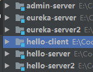

# 第五章 服务容错保护 Spring Cloud Hystrix

2020年8月31日 Spring Cloud Hystrix 实现了断路器 线程隔离等一系列服务保护功能。

## 5.1 示例



增加一个 服务提供者。

服务消费者中添加依赖 

```xml
<dependency>
            <groupId>org.springframework.cloud</groupId>
            <artifactId>spring-cloud-starter-netflix-hystrix</artifactId>
        </dependency>
```

启动类中

```java
@SpringBootApplication
@EnableWebMvc
@EnableDiscoveryClient // 开启 Ribbon
// 开启 断路器功能
@EnableCircuitBreaker
public class HelloClientApplication {
    @Bean
    @LoadBalanced
    public RestTemplate restTemplate() {
        return new RestTemplate();
    }
    public static void main(String[] args) {
        SpringApplication.run(HelloClientApplication.class, args);
    }
}
```

```java
    // 指定回调函数
    @HystrixCommand(fallbackMethod = "index2Error")
    public String index2(Model model) {
        String s = restTemplate.getForObject("http://HELLO-SERVER/hello", String.class);
        model.addAttribute("string", s);
        return "hello";
    }

    public String index2Error(Model model) {
        model.addAttribute("string", "调用错误！");
        return "hello";
    }
```

服务提供端

```java
    @GetMapping(value = "/hello")
    public  String hello () throws InterruptedException {
        List<String> services = client.getServices();
//        System.out.println(services.size());
        for (String item : services) {
//            System.out.println(item);
        }
        Thread.sleep(new Random().nextInt(4000));
        return  "Hello Cloud! I'm two";
    }
```

## 5.2 原理
