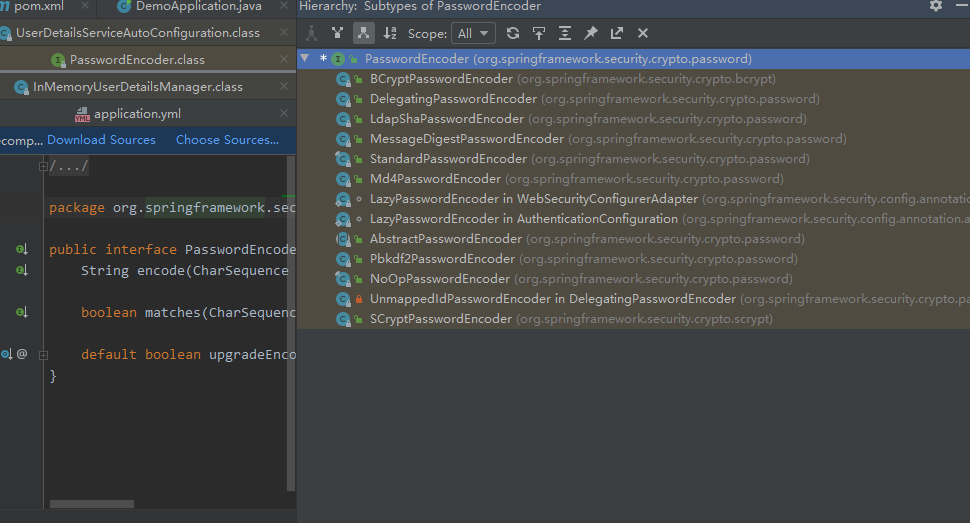
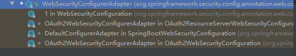

# 4 用户密码安全

明文密码，规则是通过对密码明文添加`{noop}`前缀

## 4.1  md5 sha1 不安全

彩虹表 基本收录了大部分 密码。很容易得到 明文

## 4.2 Spring Security 中的加密

从  `UserDetailsServiceAutoConfiguration` 初始化的User中，可以得知 密码的加密

`PasswordEncoder`

```java
public interface PasswordEncoder {
    // 编码
    String encode(CharSequence var1);

    // 匹配密码
    boolean matches(CharSequence var1, String var2);

    // 升级编码
    default boolean upgradeEncoding(String encodedPassword) {
        return false;
    }
}
```

Spring Security 的具体实现：



### 4.2.1 授权密码编码器 DelegatingPasswordEncoder

看源码得知，该密码编码器并没有实质的 编码实现，主要是通过 内部使用的 `PasswordEncoder passwordEncoderForEncode` 实现的。

```java
public class DelegatingPasswordEncoder implements PasswordEncoder {
    private static final String PREFIX = "{";
    private static final String SUFFIX = "}";
    // 编码器 名称，不能 以{开通  }结尾
    private final String idForEncode;
    private final PasswordEncoder passwordEncoderForEncode;
    private final Map<String, PasswordEncoder> idToPasswordEncoder;
    private PasswordEncoder defaultPasswordEncoderForMatches = new DelegatingPasswordEncoder.UnmappedIdPasswordEncoder();

    //  通过传入的编码器名称，在默认的集合中匹配
    public DelegatingPasswordEncoder(String idForEncode, Map<String, PasswordEncoder> idToPasswordEncoder) {
        if (idForEncode == null) {
            throw new IllegalArgumentException("idForEncode cannot be null");
        } else if (!idToPasswordEncoder.containsKey(idForEncode)) {
            throw new IllegalArgumentException("idForEncode " + idForEncode + "is not found in idToPasswordEncoder " + idToPasswordEncoder);
        } else {
            Iterator var3 = idToPasswordEncoder.keySet().iterator();

            while(var3.hasNext()) {
                String id = (String)var3.next();
                if (id != null) {
                    if (id.contains("{")) {
                        throw new IllegalArgumentException("id " + id + " cannot contain " + "{");
                    }

                    if (id.contains("}")) {
                        throw new IllegalArgumentException("id " + id + " cannot contain " + "}");
                    }
                }
            }

            // 设置对应的编码器
            this.idForEncode = idForEncode;
            this.passwordEncoderForEncode = (PasswordEncoder)idToPasswordEncoder.get(idForEncode);
            this.idToPasswordEncoder = new HashMap(idToPasswordEncoder);
        }
    }

    public void setDefaultPasswordEncoderForMatches(PasswordEncoder defaultPasswordEncoderForMatches) {
        if (defaultPasswordEncoderForMatches == null) {
            throw new IllegalArgumentException("defaultPasswordEncoderForMatches cannot be null");
        } else {
            this.defaultPasswordEncoderForMatches = defaultPasswordEncoderForMatches;
        }
    }

    // 编码方法
    public String encode(CharSequence rawPassword) {
        return "{" + this.idForEncode + "}" + this.passwordEncoderForEncode.encode(rawPassword);
    }

    //  密码匹配，prefixEncodedPassword 有前缀编码的密码，获取到 编码ID，拿到编码器
    // 再与 rawPassword 原始密码 进行匹配
    public boolean matches(CharSequence rawPassword, String prefixEncodedPassword) {
        if (rawPassword == null && prefixEncodedPassword == null) {
            return true;
        } else {
            String id = this.extractId(prefixEncodedPassword);
            PasswordEncoder delegate = (PasswordEncoder)this.idToPasswordEncoder.get(id);
            if (delegate == null) {
                return this.defaultPasswordEncoderForMatches.matches(rawPassword, prefixEncodedPassword);
            } else {
                String encodedPassword = this.extractEncodedPassword(prefixEncodedPassword);
                return delegate.matches(rawPassword, encodedPassword);
            }
        }
    }


}
```

 通过实现，可以看出 ， `{idForEncode}encodePassword` 是用 `{}` 来进行匹配 加密方式，然后授权给对应的 编码器

那么 授权的编码器  实例是怎么来的呢？

` PasswordEncoder delegate = (PasswordEncoder)this.idToPasswordEncoder.get(id);`

打断点得到


### 4.2.2 注册授权编码器

通过 在  `DelegatingPasswordEncoder`  构造器中断点，得到到 `PasswordEncoderFactories`

```java
public class PasswordEncoderFactories {
	@SuppressWarnings("deprecation")
	public static PasswordEncoder createDelegatingPasswordEncoder() {
		// 默认bcrypt
		String encodingId = "bcrypt";
		Map<String, PasswordEncoder> encoders = new HashMap<>();
		encoders.put(encodingId, new BCryptPasswordEncoder());
        
		encoders.put("ldap", new org.springframework.security.crypto.password.LdapShaPasswordEncoder());
        
		encoders.put("MD4", new org.springframework.security.crypto.password.Md4PasswordEncoder());
        
		encoders.put("MD5", new org.springframework.security.crypto.password.MessageDigestPasswordEncoder("MD5"));
        
		encoders.put("noop", org.springframework.security.crypto.password.NoOpPasswordEncoder.getInstance());
        
		encoders.put("pbkdf2", new Pbkdf2PasswordEncoder());
        
		encoders.put("scrypt", new SCryptPasswordEncoder());
        
		encoders.put("SHA-1", new org.springframework.security.crypto.password.MessageDigestPasswordEncoder("SHA-1"));
        
		encoders.put("SHA-256", new org.springframework.security.crypto.password.MessageDigestPasswordEncoder("SHA-256"));
        
		encoders.put("sha256", new org.springframework.security.crypto.password.StandardPasswordEncoder());

		return new DelegatingPasswordEncoder(encodingId, encoders);
	}

	private PasswordEncoderFactories() {}
}
```

得知 默认的 编码 为 `bcrypt`

那么 什么地方调用调用的 工厂类呢？再次通过 断点跟踪，到 `WebSecurityConfigurerAdapter` ， `PasswordEncoder` 实现

发现两个 `LazyPasswordEncoder` 都在 `spring-security-config.jar`  包下

并且实现基本一样

```java
	static class LazyPasswordEncoder implements PasswordEncoder {
		private ApplicationContext applicationContext;
		private PasswordEncoder passwordEncoder;

		LazyPasswordEncoder(ApplicationContext applicationContext) {
			this.applicationContext = applicationContext;
		}

		@Override
		public String encode(CharSequence rawPassword) {
			return getPasswordEncoder().encode(rawPassword);
		}

		@Override
		public boolean matches(CharSequence rawPassword,
			String encodedPassword) {
			return getPasswordEncoder().matches(rawPassword, encodedPassword);
		}

		@Override
		public boolean upgradeEncoding(String encodedPassword) {
			return getPasswordEncoder().upgradeEncoding(encodedPassword);
		}

		private PasswordEncoder getPasswordEncoder() {
			if (this.passwordEncoder != null) {
				return this.passwordEncoder;
			}
			PasswordEncoder passwordEncoder = getBeanOrNull(PasswordEncoder.class);
			if (passwordEncoder == null) {
				passwordEncoder = PasswordEncoderFactories.createDelegatingPasswordEncoder();
			}
			this.passwordEncoder = passwordEncoder;
			return passwordEncoder;
		}

		private <T> T getBeanOrNull(Class<T> type) {
			try {
				return this.applicationContext.getBean(type);
			} catch(NoSuchBeanDefinitionException notFound) {
				return null;
			}
		}

		@Override
		public String toString() {
			return getPasswordEncoder().toString();
		}
	}
```

其中 一个在 `WebSecurityConfigurerAdapter`（Web安全配置适配器）下



通过 `@Configuration` 从而被注册到容器

### 4.2.3 bcrypt 加密算法

`bcrypt` 算法将`salt`随机并混入最终加密后的密码，验证时也无需单独提供之前的`salt`，从而无需单独处理`salt`问题

`$2a$10$4YJ/d8eIE6q4tfWy41RZq.krUzdNzlmYef2FS.TeUmu1Hp3kts41G`

$是分割符，无意义；2a是bcrypt加密版本号；10是cost的值；而后的前22位是salt值；再然后的字符串就是密码的密文了

特点：

由于 每次 是随机生成的盐，明文相同，但是 每次生成的密文 是不同的