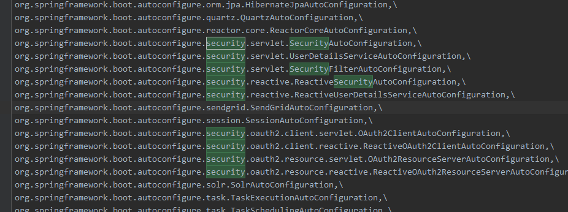

# 5 自动配置

之前 学习 Spring Boot 时，已经知道 大多数 **官方提供的Starter组件** 自动配置 都是在 `spring-boot-autoconfigure` 包下 的 `spring.factories` 中找到




## 5.1 自动配置类 SecurityAutoConfiguration

```java
@Configuration
@ConditionalOnClass(DefaultAuthenticationEventPublisher.class)
@EnableConfigurationProperties(SecurityProperties.class)
// 引入其他三个配置类文件
@Import({ 
    SpringBootWebSecurityConfiguration.class,
    WebSecurityEnablerConfiguration.class,
    SecurityDataConfiguration.class })
public class SecurityAutoConfiguration {

	@Bean
	@ConditionalOnMissingBean(AuthenticationEventPublisher.class)
    // 如不存在 验证事件发布者  就注册 DefaultAuthenticationEventPublisher 为默认
	public DefaultAuthenticationEventPublisher authenticationEventPublisher(
        ApplicationEventPublisher publisher) {
		return new DefaultAuthenticationEventPublisher(publisher);
	}

}
```

## 5.2 配置中心 SpringBootWebSecurityConfiguration

```java
@Configuration
// 上一节 提到的 注册有 lazy password encoder 的适配器
@ConditionalOnClass(WebSecurityConfigurerAdapter.class)
@ConditionalOnMissingBean(WebSecurityConfigurerAdapter.class)
@ConditionalOnWebApplication(type = Type.SERVLET)
public class SpringBootWebSecurityConfiguration {

	@Configuration
    // 按照 顺序 注册 安全配置的核心
	@Order(SecurityProperties.BASIC_AUTH_ORDER)
	static class DefaultConfigurerAdapter extends WebSecurityConfigurerAdapter {

	}

}
```

## 5.3 开启安全 WebSecurityEnablerConfiguration

```Java
@Configuration
@ConditionalOnBean(WebSecurityConfigurerAdapter.class)
@ConditionalOnMissingBean(name = BeanIds.SPRING_SECURITY_FILTER_CHAIN)
@ConditionalOnWebApplication(type = ConditionalOnWebApplication.Type.SERVLET)
// 主要就是 使用 该注解 开启 安全校验，而没有做任何其它事情
@EnableWebSecurity
public class WebSecurityEnablerConfiguration {

}
```

该配置类会在`SpringBootWebSecurityConfiguration` 注入 Spring IoC 容器后启用 `@EnableWebSecurity` 注解。也就是说 `WebSecurityEnablerConfiguration` 目的仅仅就是在某些条件下激活 `@EnableWebSecurity` 注解。即默认开启了

## 5.4 开启安全配置的注解 EnableWebSecurity

```java
@Retention(value = java.lang.annotation.RetentionPolicy.RUNTIME)
@Target(value = { java.lang.annotation.ElementType.TYPE })
@Documented
// 导入 配置文件 与 选择器
@Import({ 
    WebSecurityConfiguration.class,  
    SpringWebMvcImportSelector.class,
    OAuth2ImportSelector.class })
// 开启全局 验证
@EnableGlobalAuthentication
@Configuration
public @interface EnableWebSecurity {

   /**
    * Controls debugging support for Spring Security. Default is false.
    * @return if true, enables debug support with Spring Security
    */
   boolean debug() default false;
}
```

### 5.4.1 WebSecurityConfiguration

```java
@Configuration
public class WebSecurityConfiguration implements ImportAware, BeanClassLoaderAware {
   private WebSecurity webSecurity;

   private Boolean debugEnabled;

   private List<SecurityConfigurer<Filter, WebSecurity>> webSecurityConfigurers;

   private ClassLoader beanClassLoader;

   @Autowired(required = false)
   private ObjectPostProcessor<Object> objectObjectPostProcessor;

    // 注册上下文监听器，
   @Bean
   public static DelegatingApplicationListener delegatingApplicationListener() {
      return new DelegatingApplicationListener();
   }

    // 注册 
   @Bean
   @DependsOn(AbstractSecurityWebApplicationInitializer.DEFAULT_FILTER_NAME)
   public SecurityExpressionHandler<FilterInvocation> webSecurityExpressionHandler() {
      return webSecurity.getExpressionHandler();
   }

   /** 创建 Security 过滤器链
    */
   @Bean(name = 
         AbstractSecurityWebApplicationInitializer.DEFAULT_FILTER_NAME)
   public Filter springSecurityFilterChain() throws Exception {
      boolean hasConfigurers = webSecurityConfigurers != null
            && !webSecurityConfigurers.isEmpty();
      if (!hasConfigurers) {
         WebSecurityConfigurerAdapter adapter = objectObjectPostProcessor
               .postProcess(new WebSecurityConfigurerAdapter() {
               });
         webSecurity.apply(adapter);
      }
      return webSecurity.build();
   }

   /** 设置特权，如 JSP
    */
   @Bean
   @DependsOn(AbstractSecurityWebApplicationInitializer.DEFAULT_FILTER_NAME)
   public WebInvocationPrivilegeEvaluator privilegeEvaluator() throws Exception {
      return webSecurity.getPrivilegeEvaluator();
   }

   /** 设置 过滤器链 代理器
    */
   @Autowired(required = false)
   public void setFilterChainProxySecurityConfigurer(
       ObjectPostProcessor<Object> objectPostProcessor,
       @Value("#{@autowiredWebSecurityConfigurersIgnoreParents.getWebSecurityConfigurers()}") List<SecurityConfigurer<Filter, WebSecurity>> webSecurityConfigurers)
         throws Exception {
       // 设置 webSecurity 
      webSecurity = objectPostProcessor
            .postProcess(new WebSecurity(objectPostProcessor));
      if (debugEnabled != null) {
         webSecurity.debug(debugEnabled);
      }
	
       // 比较器为 下面实现
      Collections.sort(webSecurityConfigurers, AnnotationAwareOrderComparator.INSTANCE);

      Integer previousOrder = null;
      Object previousConfig = null;
      for (SecurityConfigurer<Filter, WebSecurity> config : webSecurityConfigurers) {
         Integer order = AnnotationAwareOrderComparator.lookupOrder(config);
         if (previousOrder != null && previousOrder.equals(order)) {
            throw new IllegalStateException(
                  "@Order on WebSecurityConfigurers must be unique. Order of "
                        + order + " was already used on " + previousConfig + ", so it cannot be used on "
                        + config + " too.");
         }
         previousOrder = order;
         previousConfig = config;
      }
      for (SecurityConfigurer<Filter, WebSecurity> webSecurityConfigurer : webSecurityConfigurers) {
         webSecurity.apply(webSecurityConfigurer);
      }
      this.webSecurityConfigurers = webSecurityConfigurers;
   }

   @Bean
   public static AutowiredWebSecurityConfigurersIgnoreParents autowiredWebSecurityConfigurersIgnoreParents(
         ConfigurableListableBeanFactory beanFactory) {
      return new AutowiredWebSecurityConfigurersIgnoreParents(beanFactory);
   }

   /** 注解 参数 比较器
    */
   private static class AnnotationAwareOrderComparator extends OrderComparator {
      private static final AnnotationAwareOrderComparator INSTANCE = new AnnotationAwareOrderComparator();

      @Override
      protected int getOrder(Object obj) {
         return lookupOrder(obj);
      }

      private static int lookupOrder(Object obj) {
         if (obj instanceof Ordered) {
            return ((Ordered) obj).getOrder();
         }
         if (obj != null) {
            Class<?> clazz = (obj instanceof Class ? (Class<?>) obj : obj.getClass());
            Order order = AnnotationUtils.findAnnotation(clazz, Order.class);
            if (order != null) {
               return order.value();
            }
         }
         return Ordered.LOWEST_PRECEDENCE;
      }
   }

   /*ImportAware 实现，用于 设置 EnableWebSecurity 中开启 debug，默认 false
    */
   public void setImportMetadata(AnnotationMetadata importMetadata) {
      Map<String, Object> enableWebSecurityAttrMap = importMetadata
            .getAnnotationAttributes(EnableWebSecurity.class.getName());
      AnnotationAttributes enableWebSecurityAttrs = AnnotationAttributes
            .fromMap(enableWebSecurityAttrMap);
      debugEnabled = enableWebSecurityAttrs.getBoolean("debug");
      if (webSecurity != null) {
         webSecurity.debug(debugEnabled);
      }
   }

   /*BeanClassLoaderAware 实现， 设置 类加载器
    */
   public void setBeanClassLoader(ClassLoader classLoader) {
      this.beanClassLoader = classLoader;
   }
}
```

### 5.4.2 SpringWebMvcImportSelector

```java
class SpringWebMvcImportSelector implements ImportSelector {

   /*
    * (non-Javadoc)
    *
    * @see org.springframework.context.annotation.ImportSelector#selectImports(org.
    * springframework .core.type.AnnotationMetadata)
    */
   public String[] selectImports(AnnotationMetadata importingClassMetadata) {
      boolean webmvcPresent = ClassUtils.isPresent(
            "org.springframework.web.servlet.DispatcherServlet",
            getClass().getClassLoader());
      return webmvcPresent
            ? new String[] {
 "org.springframework.security.config.annotation.web.configuration.WebMvcSecurityConfiguration" }
            : new String[] {};
   }
}
```

只要 发现 `DispatcherServlet` 就会将  `WebMvcSecurityConfiguration` 引入

### 5.4.3 OAuth2ImportSelector

```java
final class OAuth2ImportSelector implements ImportSelector {

   @Override
   public String[] selectImports(AnnotationMetadata importingClassMetadata) {
      boolean oauth2ClientPresent = ClassUtils.isPresent(
         "org.springframework.security.oauth2.client.registration.ClientRegistration", getClass().getClassLoader());

      return oauth2ClientPresent ?
         new String[] { "org.springframework.security.config.annotation.web.configuration.OAuth2ClientConfiguration" } :
         new String[] {};
   }
}
```

`ClientRegistration` 被引入时，引入 `OAuth2ClientConfiguration` 以提供 `OAuth2` 支持

### 5.4.4 EnableGlobalAuthentication

```java
@Retention(value = java.lang.annotation.RetentionPolicy.RUNTIME)
@Target(value = { java.lang.annotation.ElementType.TYPE })
@Documented
// 引入 
@Import(AuthenticationConfiguration.class)
@Configuration
public @interface EnableGlobalAuthentication {
}
```

## 5.5 过滤器自动配置 SecurityFilterAutoConfiguration

```java
@Configuration
@ConditionalOnWebApplication(type = Type.SERVLET)
@EnableConfigurationProperties(SecurityProperties.class)
@ConditionalOnClass({ 
    AbstractSecurityWebApplicationInitializer.class, 
    SessionCreationPolicy.class })
@AutoConfigureAfter(SecurityAutoConfiguration.class)
public class SecurityFilterAutoConfiguration {

    // 默认过滤器名称
   private static final String DEFAULT_FILTER_NAME = AbstractSecurityWebApplicationInitializer.DEFAULT_FILTER_NAME;

   @Bean
   @ConditionalOnBean(name = DEFAULT_FILTER_NAME)
   public DelegatingFilterProxyRegistrationBean securityFilterChainRegistration(
         SecurityProperties securityProperties) {
       
       //默认 过滤器代理 注册
      DelegatingFilterProxyRegistrationBean registration = 
          new DelegatingFilterProxyRegistrationBean(DEFAULT_FILTER_NAME);
       
       // 设置 过滤器顺序
      registration.setOrder(securityProperties.getFilter().getOrder());
       // 设置 调度器类型
       registration.setDispatcherTypes(
       getDispatcherTypes(securityProperties));
      return registration;
   }

   private EnumSet<DispatcherType> getDispatcherTypes(SecurityProperties securityProperties) {
      if (securityProperties.getFilter().getDispatcherTypes() == null) {
         return null;
      }
      return securityProperties.getFilter().getDispatcherTypes().stream()
            .map((type) -> DispatcherType.valueOf(type.name()))
            .collect(Collectors.collectingAndThen(Collectors.toSet(), EnumSet::copyOf));
   }

}
```