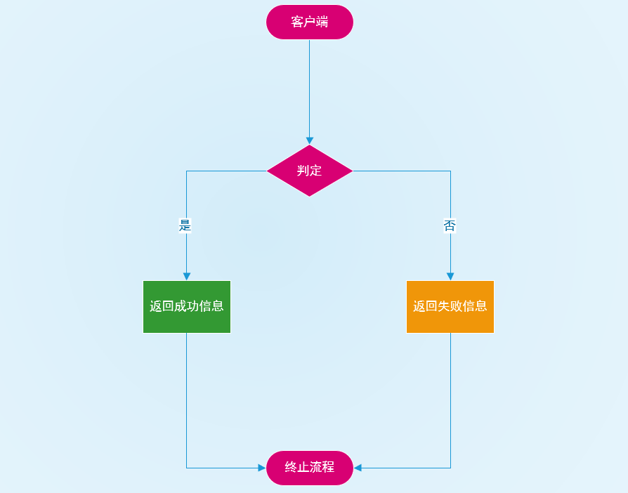

# 8 自定义登录

## 8.1 form 登陆流程



## 8.2 Spring Security 种默认的登陆

默认它提供了三种登录方式：

- `formLogin()`  普通表单登录
- `oauth2Login()` 基于 `OAuth2.0` 认证/授权协议
- `openidLogin()` 基于 `OpenID` 身份认证规范

以上三种方式统统是 `AbstractAuthenticationFilterConfigurer` 实现的，

## 8.3 Http Security 中的 form 表单登录

  启用表单登录通过两种方式一种是通过 `HttpSecurity` 的 `apply(C configurer)` 方法自己构造一个 `AbstractAuthenticationFilterConfigurer` 的实现，这种是比较高级的玩法。 另一种是我们常见的使用 `HttpSecurity` 的 `formLogin()` 方法来自定义 `FormLoginConfigurer` 。我们先搞一下比较常规的第二种。

### 8.3.1 FormLoginConfigurer

该类是 **form** 表单登录的配置类。它提供了一些我们常用的配置方法：

- **`loginPage(String loginPage)`** : 登录 **页面**而并不是接口，对于前后分离模式需要我们进行改造 默认为 `/login`。 
- **`loginProcessingUrl(String loginProcessingUrl)`**  实际表单向后台提交用户信息的 `Action`，再由过滤器`UsernamePasswordAuthenticationFilter` 拦截处理，该 `Action` 其实不会处理任何逻辑。
- **`usernameParameter(String usernameParameter)`** 用来自定义用户参数名，默认 `username` 。
- **`passwordParameter(String passwordParameter)`** 用来自定义用户密码名，默认 `password`
- **`failureUrl(String authenticationFailureUrl)`**  登录失败后会重定向到此路径， 一般前后分离不会使用它。
- **`failureForwardUrl(String forwardUrl)`** 登录失败会转发到此， 一般前后分离用到它。 可定义一个 `Controller` （控制器）来处理返回值,但是要注意 `RequestMethod`。
- **`defaultSuccessUrl(String defaultSuccessUrl, boolean alwaysUse)`**  默认登陆成功后跳转到此 ，如果 `alwaysUse` 为 `true`  只要进行认证流程而且成功，会一直跳转到此。一般推荐默认值 `false` 
- **`successForwardUrl(String forwardUrl)`**  效果等同于上面 `defaultSuccessUrl` 的 `alwaysUse` 为 `true` 但是要注意 `RequestMethod`。
- **`successHandler(AuthenticationSuccessHandler successHandler)`** 自定义认证成功处理器，可替代上面所有的 `success` 方式
- **`failureHandler(AuthenticationFailureHandler authenticationFailureHandler)`** 自定义失败处理器，可替代上面所有的 `failure` 方式
- **`permitAll(boolean permitAll)`**  **form** 表单登录是否放开

知道了这些我们就能来搞个定制化的登录了。

## 8.4 实例

```java
          @Override
          protected void configure(HttpSecurity http) throws Exception {
              http.csrf().disable()
                      .cors()
                      .and()
                      .authorizeRequests().anyRequest().authenticated()
                      .and()
                      .formLogin()
                  // 使用自定义的 LoginController
                      .loginProcessingUrl("/process")
                      .successForwardUrl("/login/success").
                      failureForwardUrl("/login/failure");

          }
```

## 8.5 多登陆方式

 **form 登录的流程** 中的 **用户** 和 **判定** 之间增加一个适配器来适配即可。 我们知道这个所谓的 **判定**就是 `UsernamePasswordAuthenticationFilter` 。

**我们只需要保证 `uri` 为上面配置的`/process` 并且能够通过 `getParameter(String name)` 获取用户名和密码即可** 。

我突然觉得可以模仿 `DelegatingPasswordEncoder` 的搞法， 维护一个注册表执行不同的处理策略。当然我们要实现一个 `GenericFilterBean` 在 `UsernamePasswordAuthenticationFilter` 之前执行。同时制定登录的策略。

### 8.5.1实现登录前置处理过滤器

该过滤器维护了 `LoginPostProcessor` 映射表。 通过前端来判定登录方式进行策略上的预处理，最终还是会交给 `UsernamePasswordAuthenticationFilter` 。通过 `HttpSecurity` 的 `addFilterBefore(preLoginFilter, UsernamePasswordAuthenticationFilter.class)`方法进行前置。

```java

```