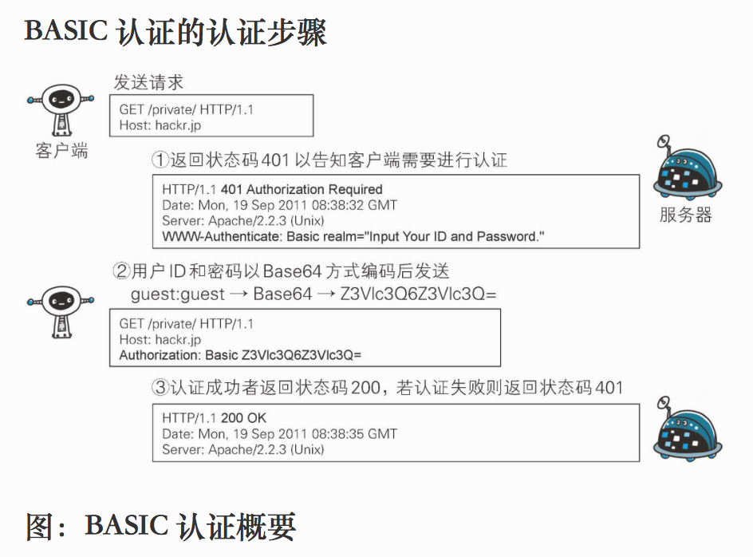
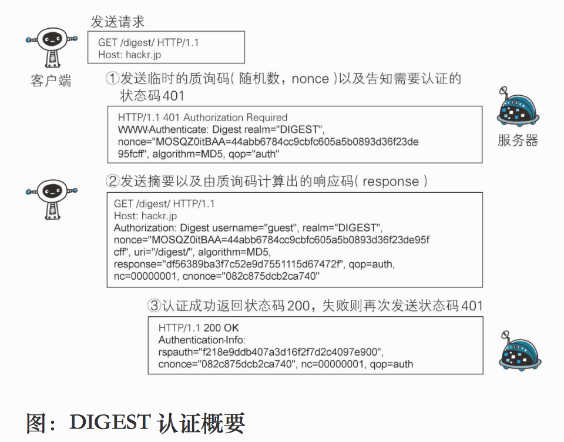

## 2. 常用的 Http 认证方式

 我们要在 **Http** 请求中使用 **Jwt** 我们就必须了解 常见的 **Http** 认证方式。

### 2.1 HTTP Basic Authentication

 **HTTP Basic Authentication** 又叫基础认证，它简单地使用 `Base64` 算法对用户名、密码进行加密，并将加密后的信息放在请求头 **Header** 中，本质上还是明文传输用户名、密码，并不安全，所以最好在 **Https** 环境下使用。其认证流程如下：

 

 客户端发起 **GET** 请求 服务端响应返回 **401 Unauthorized**， `www-Authenticate` 指定认证算法，`realm` 指定安全域。然后客户端一般会弹窗提示输入用户名称和密码，输入用户名密码后放入 **Header** 再次请求，服务端认证成功后以 **200** 状态码响应客户端。

### 2.2 HTTP Digest Authentication

 为弥补 BASIC 认证存在的弱点就有了 **HTTP Digest Authentication** 。它又叫摘要认证。它使用随机数加上 **MD5** 算法来对用户名、密码进行摘要编码，流程类似 **Http Basic Authentication** ，但是更加复杂一些:

 

 步骤1：跟基础认证一样，只不过返回带 `WWW-Authenticate` 首部字段的响应。该字段内包含质问响应方式认证所需要的临时咨询码（随机数，`nonce`）。 首部字段` WWW-Authenticate` 内必须包含 `realm` 和 `nonce` 这两个字段的信息。客户端就是依靠向服务器回送这两个值进行认证的。`nonce` 是一种每次随返回的 **401** 响应生成的任意随机字符串。该字符串通常推荐由 **Base64** 编码的十六进制数的组成形式，但实际内容依赖服务器的具体实现

 步骤2：接收到 **401** 状态码的客户端，返回的响应中包含 DIGEST 认证必须的首部字段 `Authorization` 信息。首部字段 `Authorization` 内必须包含` username、realm、nonce、uri` 和 `response` 的字段信息，其中，`realm` 和 `nonce` 就是之前从服务器接收到的响应中的字段。

 步骤3：接收到包含首部字段 Authorization 请求的服务器，会确认认证信息的正确性。认证通过后则会返回包含 **Request-URI** 资源的响应。

 并且这时会在首部字段 **Authorization-Info** 写入一些认证成功的相关信息。

### 2.3 SSL 客户端认证

 **SSL** 客户端认证就是通常我们说的 **HTTPS** 。安全级别较高，但需要承担 **CA** 证书费用。**SSL** 认证过程中涉及到一些重要的概念，数字证书机构的公钥、证书的私钥和公钥、非对称算法（配合证书的私钥和公钥使用）、对称密钥、对称算法（配合对称密钥使用）。相对复杂一些这里不过多讲述。

### 2.4 Form 表单认证

Form 表单的认证方式并不是HTTP规范。所以实现方式也呈现多样化，其实我们平常的扫码登录，手机验证码登录都属于表单登录的范畴。表单认证一般都会配合 **Cookie**，**Session** 的使用，现在很多 **Web** 站点都使用此认证方式。用户在登录页中填写用户名和密码，服务端认证通过后会将 `sessionId` 返回给浏览器端，浏览器会保存 `sessionId` 到浏览器的 **Cookie** 中。因为 HTTP 是无状态的，所以浏览器使用 **Cookie** 来保存 **sessionId**。下次客户端会在发送的请求中会携带 `sessionId` 值，服务端发现 `sessionId` 存在并以此为索引获取用户存在服务端的认证信息进行认证操作。认证过则会提供资源访问。

通过 **Form** 提交来获取 **Jwt**  其实 **Jwt** 跟 **sessionId** 同样的作用，只不过 **Jwt** 天然携带了用户的一些信息，而 `sessionId` 需要去进一步获取用户信息。

### 2.5 Json Web Token 的认证方式 Bearer Authentication

 我们通过表单认证获取 **Json Web Token** ，那么如何使用它呢? 通常我们会把 **Jwt** 作为令牌使用 **Bearer Authentication** 方式使用。**Bearer Authentication** 是一种基于令牌的 **HTTP** 身份验证方案，用户向服务器请求访问受限资源时，会携带一个 Token 作为凭证，检验通过则可以访问特定的资源。最初是在 **RFC 6750** 中作为 **OAuth 2.0** 的一部分，但有时也可以单独使用。
 我们在使用 **Bear Token** 的方法是在请求头的 `Authorization` 字段中放入 `Bearer ` 的格式的加密串(**Json Web Token**)。**请注意 Bearer 前缀与 Token 之间有一个空字符位，与基本身份验证类似，Bearer Authentication 只能在HTTPS（SSL）上使用。**

## 3. Spring Security 中实现接口 Jwt 认证

接下来我们是我们该系列的重头戏 ———— 接口的 **Jwt** 认证。

### 3.1 定义 Json Web Token 过滤器

无论上面提到的哪种认证方式，我们都可以使用 **Spring Security** 中的 **Filter** 来处理。 Spring Security 默认的基础配置没有提供对 **Bearer Authentication** 处理的过滤器， 但是提供了处理 **Basic Authentication** 的过滤器：

> org.springframework.security.web.authentication.www.BasicAuthenticationFilter

```java
package org.ybbh.service.web.filters;

import lombok.extern.slf4j.Slf4j;
import org.springframework.http.HttpHeaders;
import org.springframework.security.authentication.BadCredentialsException;
import org.springframework.security.authentication.CredentialsExpiredException;
import org.springframework.security.authentication.UsernamePasswordAuthenticationToken;
import org.springframework.security.core.AuthenticationException;
import org.springframework.security.core.GrantedAuthority;
import org.springframework.security.core.authority.SimpleGrantedAuthority;
import org.springframework.security.core.context.SecurityContextHolder;
import org.springframework.security.core.userdetails.User;
import org.springframework.security.web.authentication.WebAuthenticationDetailsSource;
import org.springframework.util.StringUtils;
import org.springframework.web.filter.OncePerRequestFilter;
import org.ybbh.service.web.security.JwtPayloadBuilder;
import org.ybbh.service.web.security.JwtUtil;

import javax.servlet.FilterChain;
import javax.servlet.ServletException;
import javax.servlet.http.HttpServletRequest;
import javax.servlet.http.HttpServletResponse;
import java.io.IOException;
import java.util.ArrayList;
import java.util.List;
import java.util.Objects;
import java.util.Set;

/**
 * jwt 认证拦截器 用于拦截 请求 提取jwt 认证
 */
@Slf4j
public class JwtAuthenticationFilter extends OncePerRequestFilter {
    private static final String AUTHENTICATION_PREFIX = "Bearer ";


    @Override
    protected void doFilterInternal(HttpServletRequest request, HttpServletResponse response, FilterChain chain) throws IOException, ServletException {
        // 如果已经通过认证
        if (SecurityContextHolder.getContext().getAuthentication() != null) {
            chain.doFilter(request, response);
            return;
        }
        // 获取 header 解析出 jwt 并进行认证 无token 直接进入下一个过滤器  因为  SecurityContext 的缘故 如果无权限并不会放行
        String header = request.getHeader(HttpHeaders.AUTHORIZATION);
        if (StringUtils.hasText(header) && header.startsWith(AUTHENTICATION_PREFIX)) {
            String jwtToken = header.replace(AUTHENTICATION_PREFIX, "");
            if (StringUtils.hasText(jwtToken)) {
                try {
                    authenticationTokenHandle(jwtToken, request);
                } catch (AuthenticationException e) {
                    // 授权异常
                }
            } else {
                // 带安全头 没有带token

            }
        }
        chain.doFilter(request, response);
    }

    /**
     * 具体的认证方法  匿名访问不要携带token
     * 有些逻辑自己补充 这里只做基本功能的实现
     *
     * @param jwtToken jwt token
     * @param request  request
     */
    private void authenticationTokenHandle(String jwtToken, HttpServletRequest request) throws AuthenticationException {

        // 根据我的实现 有效token才会被解析出来
        JwtPayloadBuilder payloadBuilder = JwtUtil.decodeJWT(jwtToken);
        if (Objects.isNull(payloadBuilder)) {
            if (log.isDebugEnabled()) {
                log.debug("token : {}  is  invalid", jwtToken);
            }
            throw new BadCredentialsException("token is invalid");

        }
        String username = payloadBuilder.getAud();

        // 从缓存获取 token

        if (Objects.isNull(username)) {
            if (log.isDebugEnabled()) {
                log.debug("token : {}  is  not in cache", jwtToken);
            }
            // 缓存中不存在就算 失败了
            throw new CredentialsExpiredException("token is not in cache");
        }


        if (!jwtToken.equals(username)) {
            // token 不匹配
            if (log.isDebugEnabled()) {
                log.debug("token : {}  is  not in matched", jwtToken);
            }
            throw new BadCredentialsException("token is not matched");
        }
        // 解析 权限集合  这里
        Set<String> roles1 = payloadBuilder.getRoles();

//                List<GrantedAuthority> authorities = AuthorityUtils.
        List<GrantedAuthority> grantedAuthorities = new ArrayList(roles1.size());
        for (String s : roles1) {
            grantedAuthorities.add(new SimpleGrantedAuthority(s));
        }
        User user = new User(username, "[PROTECTED]", grantedAuthorities);
        // 构建用户认证token
        UsernamePasswordAuthenticationToken usernamePasswordAuthenticationToken = new UsernamePasswordAuthenticationToken(user, null, grantedAuthorities);
        usernamePasswordAuthenticationToken.setDetails(new WebAuthenticationDetailsSource().buildDetails(request));
        // 放入安全上下文中
        SecurityContextHolder.getContext().setAuthentication(usernamePasswordAuthenticationToken);

    }
}
```

### 3.2 配置 JwtAuthenticationFilter

首先将过滤器 `JwtAuthenticationFilter` 注入 **Spring IoC** 容器 ，然后一定要将 `JwtAuthenticationFilter` 顺序置于 `UsernamePasswordAuthenticationFilter` 之前：

## 5. 刷新 Jwt Token

实现了 **Json Web Token** 都是成对出现的逻辑。`accessToken` 用来接口请求， `refreshToken` 用来刷新 `accessToken` 。我们可以同样定义一个 **Filter** 可参照 上面的 `JwtAuthenticationFilter` 。只不过 这次请求携带的是 `refreshToken`，我们在过滤器中拦截 `URI`跟我们定义的刷新端点进行匹配。同样验证 `Token` ，通过后像登录成功一样返回 Token 对即可。这里不再进行代码演示。