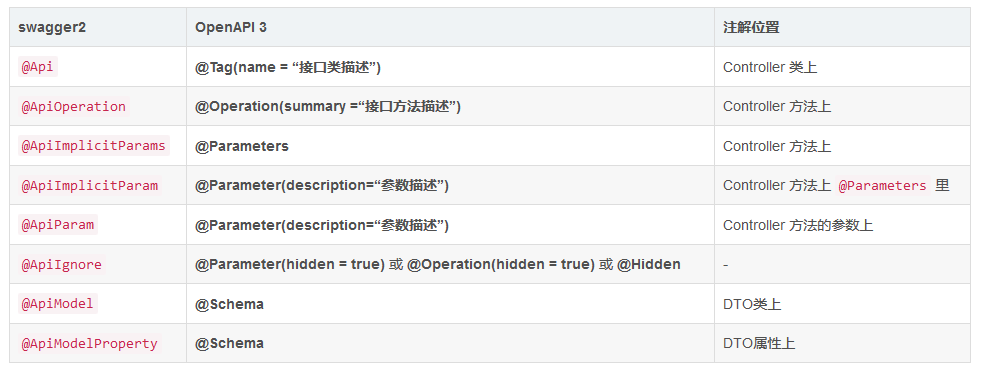

### 4.x 系列

Spring Framework 4.x 最终版本

```xml
<dependency>
    <groupId>org.springframework</groupId>
    <artifactId>spring-core</artifactId>
    <version>4.3.29.RELEASE</version>
</dependency>

```

### 微服务系列

Spring Boot 2.1x 最终版本

`<version>2.1.18.RELEASE</version>`

`<spring-cloud.version>Greenwich.SR6</spring-cloud.version>`

