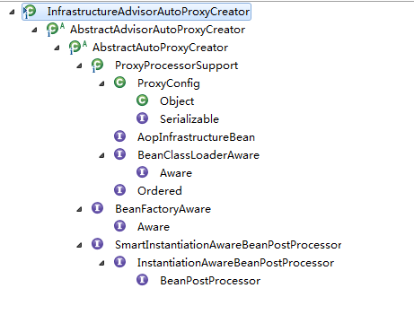
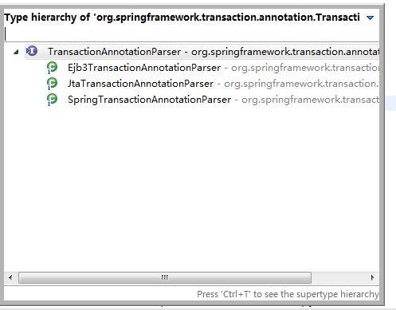
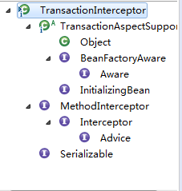

[[TOC]]

2018年11月3日 - 2018年11月25日

# 第十章 事务

## 10.1 JDBC 下的事务例子

前面配置 基本 还是以 SpringCode8 例子

（1） 创建表

（2） 创建实体bean

（3） 创建实体与表的映射

（4） 创建 数据服务service及其实现

```java
@Transactional
@Transactional(propagation = Propagation.REQUIRED) // 加属性
public void save(StudentsBean bean) throws Exception{
		jdbc.update("Insert into students ( stu_name , stu_age , stu_gender ) values (?,?,?)" ,
				new Object[] {bean.getName(),bean.getAge(),bean.getGengder() },
				new int[] {java.sql.Types.VARCHAR,java.sql.Types.INTEGER,java.sql.Types.INTEGER} );
		// 默认 spring 事务 对 RuntimeException 进行回滚。
		throw new RuntimeException("测试事物异常！");
	}
```

（5） 配置spring文件

```xml
<?xml version="1.0" encoding="UTF-8"?>
<beans xmlns="http://www.springframework.org/schema/beans"
	xmlns:xsi="http://www.w3.org/2001/XMLSchema-instance" 
	xmlns:p="http://www.springframework.org/schema/p"
	xmlns:aop="http://www.springframework.org/schema/aop" 
	xmlns:tx="http://www.springframework.org/schema/tx"
	xmlns:mvc="http://www.springframework.org/schema/mvc" 
	xmlns:context="http://www.springframework.org/schema/context"
	xmlns:jpa="http://www.springframework.org/schema/data/jpa" 
	xmlns:cache="http://www.springframework.org/schema/cache"
	xsi:schemaLocation="http://www.springframework.org/schema/beans
						http://www.springframework.org/schema/beans/spring-beans-3.0.xsd 
						http://www.springframework.org/schema/context
						http://www.springframework.org/schema/context/spring-context-3.0.xsd 
						http://www.springframework.org/schema/aop
						http://www.springframework.org/schema/aop/spring-aop-3.0.xsd 
						http://www.springframework.org/schema/tx
						http://www.springframework.org/schema/tx/spring-tx-3.0.xsd 
						http://www.springframework.org/schema/mvc
						http://www.springframework.org/schema/mvc/spring-mvc-3.0.xsd
						http://www.springframework.org/schema/cache
       					http://www.springframework.org/schema/cache/spring-cache.xsd
       					http://www.springframework.org/schema/data/jpa
						http://www.springframework.org/schema/data/jpa/spring-jpa.xsd
						http://www.asd.com/schema/gl
						http://www.asd.com/schema/gl.xsd" >
	<!-- <context:property-placeholder location="classpath:mysql.properties"
		ignore-unresolvable="true" ignore-resource-not-found="true" /> 与下面 效果相同-->
	<tx:annotation-driven transaction-manager="transactionManager"/>
	
	<!-- 5、配置事务管理器 -->
	<bean id="transactionManager" class="org.springframework.jdbc.datasource.DataSourceTransactionManager">
		<property name="dataSource" ref="dataSource"></property>
	</bean>
	
	
	<bean id="configurer" class="org.springframework.beans.factory.config.PropertyPlaceholderConfigurer">
		<property name="locations">
	    	<list>
	        	<value>classpath:mysql.properties</value>
	        </list>
	    </property>
	</bean>
	<!-- 配置数据源 连接池-->
	<bean id="dataSource" class="org.apache.commons.dbcp2.BasicDataSource" destroy-method="close">
		<property name="driverClassName" value="${mysql.driver}"></property>
		<property name="url" value="${mysql.host}"></property>
		<property name="username" value="${mysql.user}"></property>
		<property name="password" value="${mysql.pwd}"></property>
		<!-- 初始连接数 -->
		<property name="initialSize" value="1"></property>
		<!-- 最大连接数  dbcp2 这个版本没有？-->
		<!-- <property name="maxActive maxActive" value="70"></property> -->
		<!-- 连接数 保持最大 -->
		<property name="maxIdle" value="10"></property>
		<!-- 连接数 保持最小 -->
		<property name="minIdle" value="1"></property>
	</bean>
	<bean id="stuService" class="SpringCode10Affair.SpringCode10Affair.service.impl.StudentServiceImpl">
		<property name="dataSource" ref="dataSource"></property>
	</bean>
</beans>

```

## 10.2 事务自定义标签

事务开关 `<tx:annotation-driven transaction-manager="transactionManager"/>`

`org.springframework.transaction.config.TxNamespaceHandler`类中；

```java
	public void init() {
		registerBeanDefinitionParser("advice", new TxAdviceBeanDefinitionParser());
		registerBeanDefinitionParser("annotation-driven", new AnnotationDrivenBeanDefinitionParser());
		registerBeanDefinitionParser("jta-transaction-manager", new JtaTransactionManagerBeanDefinitionParser());
	}
```

由上可知 `annotation-driven`由 `AnnotationDrivenBeanDefinitionParser`进行解析；

```java
	public BeanDefinition parse(Element element, ParserContext parserContext) {
		registerTransactionalEventListenerFactory(parserContext);
		String mode = element.getAttribute("mode");
		if ("aspectj".equals(mode)) {
			// mode="aspectj"
			registerTransactionAspect(element, parserContext);
		}
		else {
			// mode="proxy"
			AopAutoProxyConfigurer.configureAutoProxyCreator(element, parserContext);
		}
		return null;
	}
```

以AspectJ方式 进行事务切入。

```xml
<tx:annotation-driven transaction-manager="transactionManager" mode="aspectj"/>
```

### 10.2.1 注册 InfrastructureAdvisorAutoProxyCreator （基础设施 辅助 自动 代理 创建者）

进入 `	AopAutoProxyConfigurer.configureAutoProxyCreator(element, parserContext);`

```java
public static void configureAutoProxyCreator(Element element, ParserContext parserContext) {
			AopNamespaceUtils.registerAutoProxyCreatorIfNecessary(parserContext, element);

			String txAdvisorBeanName = TransactionManagementConfigUtils.TRANSACTION_ADVISOR_BEAN_NAME;
			if (!parserContext.getRegistry().containsBeanDefinition(txAdvisorBeanName)) {
				Object eleSource = parserContext.extractSource(element);

				// Create the TransactionAttributeSource definition.
                // 创建 TransactionAttributeSource （事务属性源）
				RootBeanDefinition sourceDef = new RootBeanDefinition(
"org.springframework.transaction.annotation.AnnotationTransactionAttributeSource");
				sourceDef.setSource(eleSource);
				sourceDef.setRole(BeanDefinition.ROLE_INFRASTRUCTURE);
                // 注册 bean ，并生成 beanName
				String sourceName = parserContext.getReaderContext().registerWithGeneratedName(sourceDef);

				// Create the TransactionInterceptor definition.
                // 创建 TransactionInterceptor （事务拦截器） 的bean
				RootBeanDefinition interceptorDef = new RootBeanDefinition(TransactionInterceptor.class);
				interceptorDef.setSource(eleSource);
				interceptorDef.setRole(BeanDefinition.ROLE_INFRASTRUCTURE);
				registerTransactionManager(element, interceptorDef);
				interceptorDef.getPropertyValues().add("transactionAttributeSource", new RuntimeBeanReference(sourceName));
				String interceptorName = parserContext.getReaderContext().registerWithGeneratedName(interceptorDef);

				// Create the TransactionAttributeSourceAdvisor definition.
                // 创建 TransactionAttributeSourceAdvisor （事务实现源 顾问） 的 bean
				RootBeanDefinition advisorDef = new RootBeanDefinition
                    (BeanFactoryTransactionAttributeSourceAdvisor.class);
                
				advisorDef.setSource(eleSource);
				advisorDef.setRole(BeanDefinition.ROLE_INFRASTRUCTURE);
                // 将 事务实现源 的bean 注入到 advisorDef的transactionAttributeSource 属性中
				advisorDef.getPropertyValues().add("transactionAttributeSource", 
                                                   new RuntimeBeanReference(sourceName));
                // 将 事务拦截器 的bean 注入到 advisorDef 的 adviceBeanName 属性中
				advisorDef.getPropertyValues().add("adviceBeanName", interceptorName);
                
                // 如果配置了 order 属性则加入到 advisorDef 中；
				if (element.hasAttribute("order")) {
					advisorDef.getPropertyValues().add("order", element.getAttribute("order"));
				}
                
				parserContext.getRegistry().registerBeanDefinition(txAdvisorBeanName, advisorDef);

				CompositeComponentDefinition compositeDef = new CompositeComponentDefinition(element.getTagName(), eleSource);
				compositeDef.addNestedComponent(new BeanComponentDefinition(sourceDef, sourceName));
				compositeDef.addNestedComponent(new BeanComponentDefinition(interceptorDef, interceptorName));
				compositeDef.addNestedComponent(new BeanComponentDefinition(advisorDef, txAdvisorBeanName));
				parserContext.registerComponent(compositeDef);
			}
		}
	}
```

这里注册了代理类 和 三个bean；这三个bean 支撑整个事务功能。

第一行代码：`AopNamespaceUtils.registerAutoProxyCreatorIfNecessary(parserContext, element);`

```java
	public static void registerAutoProxyCreatorIfNecessary(
			ParserContext parserContext, Element sourceElement) {

		BeanDefinition beanDefinition = 
            AopConfigUtils.registerAutoProxyCreatorIfNecessary(
				parserContext.getRegistry(), 
            parserContext.extractSource(sourceElement));
        
		useClassProxyingIfNecessary(parserContext.getRegistry(), sourceElement);
		registerComponentIfNecessary(beanDefinition, parserContext);
	}
	public static BeanDefinition registerAutoProxyCreatorIfNecessary(BeanDefinitionRegistry registry, Object source) {
		return registerOrEscalateApcAsRequired(InfrastructureAdvisorAutoProxyCreator.class, registry, source);
	}

```

功能是注册类型 `InfrastructureAdvisorAutoProxyCreator`（基础设施 辅助代理创建者）的bean；



而这个类间接实现了 `InstantiationAwareBeanPostProcessor`;在spring中，所有实例化的bean都会保证调用其 `postProcessAfterInstantiation`方法，实现是在 `AbstractAutoProxyCreator`中，

```java
	public Object postProcessAfterInitialization(Object bean, String beanName) throws BeansException {
		if (bean != null) {
            // 给指定的bean 设置 key， beanClassName_Name
			Object cacheKey = getCacheKey(bean.getClass(), beanName);
            // 是否由于避免循环依赖而创建bean代理
			if (!this.earlyProxyReferences.contains(cacheKey)) {
				return wrapIfNecessary(bean, beanName, cacheKey);
			}
		}
		return bean;
	}

```

```java
	protected Object wrapIfNecessary(Object bean, String beanName, Object cacheKey) {
        // 如果已经处理过
		if (beanName != null && this.targetSourcedBeans.contains(beanName)) {
			return bean;
		}
		if (Boolean.FALSE.equals(this.advisedBeans.get(cacheKey))) {
			return bean;
		}
        // 给定的bean 是否代表一个基础设施类。
		if (isInfrastructureClass(bean.getClass()) || shouldSkip(bean.getClass(), beanName)) {
			this.advisedBeans.put(cacheKey, Boolean.FALSE);
			return bean;
		}

		// Create proxy if we have advice.
        // 获取对应的 增强器
		Object[] specificInterceptors = getAdvicesAndAdvisorsForBean(bean.getClass(), beanName, null);
		if (specificInterceptors != DO_NOT_PROXY) {
			this.advisedBeans.put(cacheKey, Boolean.TRUE);
			Object proxy = createProxy(
					bean.getClass(), beanName, specificInterceptors, new SingletonTargetSource(bean));
			this.proxyTypes.put(cacheKey, proxy.getClass());
			return proxy;
		}

```

`wrapIfNecessary`主要做了如下：

1. 找出bean对应的 增强器
2. 根据增强器 进行代理创建

### 10.2.2 获取对应的 class/method 增强器

`Object[] specificInterceptors = getAdvicesAndAdvisorsForBean(bean.getClass(), beanName, null);`中找出bean对应增强器，并且还判断增强器是否满足要求。

`AbstractAdvisorAutoProxyCreator`类中：

```java
	protected Object[] getAdvicesAndAdvisorsForBean(Class<?> beanClass, String beanName, TargetSource targetSource) {
		List<Advisor> advisors = findEligibleAdvisors(beanClass, beanName);
		if (advisors.isEmpty()) {
			return DO_NOT_PROXY;
		}
		return advisors.toArray();
	}

	protected List<Advisor> findEligibleAdvisors(Class<?> beanClass, String beanName) {
        // 寻找 Advisor 增强器
		List<Advisor> candidateAdvisors = findCandidateAdvisors();
        // 满足要求 筛选
		List<Advisor> eligibleAdvisors = findAdvisorsThatCanApply(candidateAdvisors, beanClass, beanName);
		extendAdvisors(eligibleAdvisors);
		if (!eligibleAdvisors.isEmpty()) {
			eligibleAdvisors = sortAdvisors(eligibleAdvisors);
		}
		return eligibleAdvisors;
	}

```

#### 10.2.2.1 寻找全部 Advisor 增强器

```java
	protected List<Advisor> findCandidateAdvisors() {
		return this.advisorRetrievalHelper.findAdvisorBeans();
	}

public List<Advisor> findAdvisorBeans() {
	// Determine list of advisor bean names, if not cached already.
	String[] advisorNames = null;
	synchronized (this) {
		advisorNames = this.cachedAdvisorBeanNames;
		if (advisorNames == null) {
			// Do not initialize FactoryBeans here: We need to leave all regular beans
			// uninitialized to let the auto-proxy creator apply to them!
			advisorNames = BeanFactoryUtils.beanNamesForTypeIncludingAncestors(
					this.beanFactory, Advisor.class, true, false);
			this.cachedAdvisorBeanNames = advisorNames;
		}
	}
	if (advisorNames.length == 0) {
		return new LinkedList<Advisor>();
	}

	List<Advisor> advisors = new LinkedList<Advisor>();
	for (String name : advisorNames) {
		if (isEligibleBean(name)) {
			if (this.beanFactory.isCurrentlyInCreation(name)) {
				if (logger.isDebugEnabled()) {
					logger.debug("Skipping currently created advisor '" + name + "'");
				}
			}
			else {
				try {
					advisors.add(this.beanFactory.getBean(name, Advisor.class));
				}
				catch (BeanCreationException ex) {
					Throwable rootCause = ex.getMostSpecificCause();
					if (rootCause instanceof BeanCurrentlyInCreationException) {
						BeanCreationException bce = (BeanCreationException) rootCause;
						if (this.beanFactory.isCurrentlyInCreation(bce.getBeanName())) {
							if (logger.isDebugEnabled()) {
								logger.debug("Skipping advisor '" + name +
										"' with dependency on currently created bean: " + ex.getMessage());
							}
							// Ignore: indicates a reference back to the bean we're trying to advise.
							// We want to find advisors other than the currently created bean itself.
							continue;
						}
					}
					throw ex;
				}
			}
		}
	}
	return advisors;
}

```

第一步：通过 `BeanFactoryUtils.beanNamesForTypeIncludingAncestors(this.beanFactory, Advisor.class, true, false)`获取全部的 增强器 name;

第二步：通过 beanFactory 获取对应 name的 增强器实例。

之前自定义标签解析时， `RootBeanDefinition advisorDef = new RootBeanDefinition(BeanFactoryTransactionAttributeSourceAdvisor.class);` advisorDef 又注入了 之前创建的两个bean。

这时 该 `BeanFactoryTransactionAttributeSourceAdvisor` 就被使用。该bean也是实现了 增强器 （Advisor）接口的，本步骤获取全部bean时也会获取该bean，并在后续中 被 织如入代理。

#### 10.2.2.2 匹配 过滤 增强器

> `List<Advisor> eligibleAdvisors = findAdvisorsThatCanApply(candidateAdvisors, beanClass, beanName);`


```java
	protected List<Advisor> findAdvisorsThatCanApply(
			List<Advisor> candidateAdvisors, Class<?> beanClass, String beanName) {

		ProxyCreationContext.setCurrentProxiedBeanName(beanName);
		try {
			return AopUtils.findAdvisorsThatCanApply(candidateAdvisors, beanClass);
		}
		finally {
			ProxyCreationContext.setCurrentProxiedBeanName(null);
		}
	}

	public static List<Advisor> findAdvisorsThatCanApply(List<Advisor> candidateAdvisors, Class<?> clazz) {
		if (candidateAdvisors.isEmpty()) {
			return candidateAdvisors;
		}
		List<Advisor> eligibleAdvisors = new LinkedList<Advisor>();
        // 首先 处理 特殊增强器  IntroductionAdvisor （引介 引导增强器）
		for (Advisor candidate : candidateAdvisors) {
			if (candidate instanceof IntroductionAdvisor 
                // 并且能应用
                && canApply(candidate, clazz)) {
				eligibleAdvisors.add(candidate);
			}
		}
		boolean hasIntroductions = !eligibleAdvisors.isEmpty();
		for (Advisor candidate : candidateAdvisors) {
			if (candidate instanceof IntroductionAdvisor) {
				// already processed
				continue;
			}
            // 处理 不是 引导 增强器 并且 能应用的 增强器
			if (canApply(candidate, clazz, hasIntroductions)) {
				eligibleAdvisors.add(candidate);
			}
		}
		return eligibleAdvisors;
	}

```

**是否能应用**

```java
	public static boolean canApply(Advisor advisor, Class<?> targetClass, boolean hasIntroductions) {
		if (advisor instanceof IntroductionAdvisor) {
			return ((IntroductionAdvisor) advisor).getClassFilter().matches(targetClass);
		}
        // 切入点 增强器
		else if (advisor instanceof PointcutAdvisor) {
			PointcutAdvisor pca = (PointcutAdvisor) advisor;
            // 将advisor 的getPointcut 继续 调用给 canApply
			return canApply(pca.getPointcut(), targetClass, hasIntroductions);
		}
		else {
			// It doesn't have a pointcut so we assume it applies.
			return true;
		}
	}

```

> pca.getPointcut()返回的是`TransactionAttributeSourcePointcut`类型。因为pca是`BeanFactoryTransactionAttributeSourceAdvisor`。

创建 `BeanFactoryTransactionAttributeSourceAdvisor`实例时，会自动创建 pointcut

```java
	private final TransactionAttributeSourcePointcut pointcut = new TransactionAttributeSourcePointcut() {
		@Override
		protected TransactionAttributeSource getTransactionAttributeSource() {
			return transactionAttributeSource;
		}
	};

```

继续跟着 使用 Pointcut 类型 的canApply函数前进：

```java
	public static boolean canApply(Pointcut pc, Class<?> targetClass, boolean hasIntroductions) {
		Assert.notNull(pc, "Pointcut must not be null");
		if (!pc.getClassFilter().matches(targetClass)) {
			return false;
		}

        // TransactionAttributeSourcePointcut的 getMethodMatcher() 是返回自己
        // 方法 切入点
		MethodMatcher methodMatcher = pc.getMethodMatcher();
		if (methodMatcher == MethodMatcher.TRUE) {
			// No need to iterate the methods if we're matching any method anyway...如果我们匹配任何方法，则无需迭代方法......
			return true;
		}

		IntroductionAwareMethodMatcher introductionAwareMethodMatcher = null;
		if (methodMatcher instanceof IntroductionAwareMethodMatcher) {
			introductionAwareMethodMatcher = (IntroductionAwareMethodMatcher) methodMatcher;
		}

		Set<Class<?>> classes = new LinkedHashSet<Class<?>>(ClassUtils.getAllInterfacesForClassAsSet(targetClass));
		classes.add(targetClass);
		for (Class<?> clazz : classes) {
			Method[] methods = ReflectionUtils.getAllDeclaredMethods(clazz);
			for (Method method : methods) {
				if ((introductionAwareMethodMatcher != null 
&& introductionAwareMethodMatcher.matches(method, targetClass, hasIntroductions)) 
|| methodMatcher.matches(method, targetClass)) {
					return true;
				}
			}
		}

		return false;
	}

```

canApply函数大致逻辑：对参数实例的所有接口 以及本身一起遍历，遍历中 有对各个类中的方法进行遍历，只要匹配成功 就 适用于当前 增强器。返回 true；

继续看 `methodMatcher.matches(method, targetClass)`方法；由于methodMatcher 就是TransactionAttributeSourcePointcut。故而matches也就是 该类的。

```java
	public boolean matches(Method method, Class<?> targetClass) {
		if (targetClass != null && TransactionalProxy.class.isAssignableFrom(targetClass)) {
			return false;
		}
        //  自定义标签 解析时注入 
        // TransactionAttributeSourcePointcut匿名内部类实现该方法
        // 交易属性资源
		TransactionAttributeSource tas = getTransactionAttributeSource();
		return (tas == null || tas.getTransactionAttribute(method, targetClass) != null);
	}

```

tas 就是 最开始 自定义标签注册时，

> RootBeanDefinition sourceDef = new RootBeanDefinition(
> "org.springframework.transaction.annotation.AnnotationTransactionAttributeSource");

```java
	public TransactionAttribute getTransactionAttribute(Method method, Class<?> targetClass) {
		if (method.getDeclaringClass() == Object.class) {
			return null;
		}

		// First, see if we have a cached value.
		Object cacheKey = getCacheKey(method, targetClass);
		Object cached = this.attributeCache.get(cacheKey);
		if (cached != null) {
			// Value will either be canonical value indicating there is no transaction attribute,
			// or an actual transaction attribute.
			if (cached == NULL_TRANSACTION_ATTRIBUTE) {
				return null;
			}
			else {
				return (TransactionAttribute) cached;
			}
		}
		else {
			// We need to work it out.
            // 事务标签的提取
			TransactionAttribute txAttr = computeTransactionAttribute(method, targetClass);
			// Put it in the cache.
			if (txAttr == null) {
				this.attributeCache.put(cacheKey, NULL_TRANSACTION_ATTRIBUTE);
			}
			else {
				String methodIdentification = ClassUtils.getQualifiedMethodName(method, targetClass);
				if (txAttr instanceof DefaultTransactionAttribute) {
					((DefaultTransactionAttribute) txAttr).setDescriptor(methodIdentification);
				}
				if (logger.isDebugEnabled()) {
					logger.debug("Adding transactional method '" + methodIdentification + "' with attribute: " + txAttr);
				}
				this.attributeCache.put(cacheKey, txAttr);
			}
			return txAttr;
		}
	}

```

### 10.2.3 提取事务标签

紧接 `TransactionAttribute txAttr = computeTransactionAttribute(method, targetClass);`

```java
// 计算 事务 属性	
protected TransactionAttribute computeTransactionAttribute(Method method, Class<?> targetClass) {
		// Don't allow no-public methods as required.
		if (allowPublicMethodsOnly() && !Modifier.isPublic(method.getModifiers())) {
			return null;
		}

		// Ignore CGLIB subclasses - introspect the actual user class.
		Class<?> userClass = ClassUtils.getUserClass(targetClass);
		// The method may be on an interface, but we need attributes from the target class.
		// If the target class is null, the method will be unchanged.
    // method 代表 接口中的方法 specificMethod 代表 实现类中方法
		Method specificMethod = ClassUtils.getMostSpecificMethod(method, userClass);
		// If we are dealing with method with generic parameters, find the original method.
		specificMethod = BridgeMethodResolver.findBridgedMethod(specificMethod);

		// First try is the method in the target class.
    // 查看方法中是否存在事务声明
		TransactionAttribute txAttr = 
            findTransactionAttribute(specificMethod);
		if (txAttr != null) {
			return txAttr;
		}

		// Second try is the transaction attribute on the target class.
    // 查看方法所在类中 是否有 事务声明
		txAttr = 
            findTransactionAttribute(specificMethod.getDeclaringClass());
		if (txAttr != null && ClassUtils.isUserLevelMethod(method)) {
			return txAttr;
		}

    // 如果 接口方法 与实现的方法 不是一个 
		if (specificMethod != method) {
			// Fallback is to look at the original method.
            // 从接口 的方法 中去寻找 事务声明
			txAttr = findTransactionAttribute(method);
			if (txAttr != null) {
				return txAttr;
			}
			// Last fallback is the class of the original method.
            // 到接口类中 寻找 事务声明
			txAttr = findTransactionAttribute(method.getDeclaringClass());
			if (txAttr != null && ClassUtils.isUserLevelMethod(method)) {
				return txAttr;
			}
		}
		return null;
	}


```

这里看的比较清楚，单个人来说 前面几步还是不懂 在干什么？

> 10.2.1 创建代理类，各种事务管理注册。
>
> 10.2.2.1  是按照什么条件 获取全部的 增强器的？
>
> 10.2.2.2 将这些 增强器 进行遍历判断
>
> 10.2.3 本步骤 判断中的 某一个条件。前面获取 的 方法 类 接口 接口方法 中是否 有 进行事务处理代码？

看看 `findTransactionAttribute` 如何判断是否有事务声明的

同理 还是 `AnnotationTransactionAttributeSource`中

```java
	protected TransactionAttribute findTransactionAttribute(Method method) {
		return determineTransactionAttribute(method);
	}
/**
* 类与方法 都是最终到该 方法
*/
	protected TransactionAttribute determineTransactionAttribute
	(AnnotatedElement ae) {
		if (ae.getAnnotations().length > 0) {
			for (TransactionAnnotationParser annotationParser : this.annotationParsers) {
			// 通过传入的方法 或者 类 得到 是否有 事务声明
				TransactionAttribute attr = annotationParser.parseTransactionAnnotation(ae);
				if (attr != null) {
					return attr;
				}
			}
		}
		return null;
	}

```

`this.annotationParsers`（注释解析器）是 `AnnotationTransactionAttributeSource` 构造时传人的 `SpringTransactionAnnotationParser`。
)

```java
	public TransactionAttribute parseTransactionAnnotation(AnnotatedElement ae) {
		AnnotationAttributes attributes = AnnotatedElementUtils.getMergedAnnotationAttributes(ae, Transactional.class);
		if (attributes != null) {
			return parseTransactionAnnotation(attributes);
		}
		else {
			return null;
		}
	}

```

来看看 注释解析器 怎么判断的 **`Transactional`** 这里 的逻辑 与 3.x 版本又有点差别，4..3x 多判断

```java
	protected TransactionAttribute parseTransactionAnnotation(AnnotationAttributes attributes) {
		RuleBasedTransactionAttribute rbta = 
            	new RuleBasedTransactionAttribute();
        // 对 propagation 解析
		Propagation propagation = attributes.getEnum("propagation");
		rbta.setPropagationBehavior(propagation.value());
        // isolation 解析
		Isolation isolation = attributes.getEnum("isolation");
		rbta.setIsolationLevel(isolation.value());
        // ....
		rbta.setTimeout(attributes.getNumber("timeout").intValue());
		rbta.setReadOnly(attributes.getBoolean("readOnly"));
		rbta.setQualifier(attributes.getString("value"));
        
		ArrayList<RollbackRuleAttribute> rollBackRules = new ArrayList<RollbackRuleAttribute>();
        // 解析 rollback 回滚
		Class<?>[] rbf = attributes.getClassArray("rollbackFor");
		for (Class<?> rbRule : rbf) {
			RollbackRuleAttribute rule = new RollbackRuleAttribute(rbRule);
			rollBackRules.add(rule);
		}
		String[] rbfc = attributes.getStringArray("rollbackForClassName");
		for (String rbRule : rbfc) {
			RollbackRuleAttribute rule = new RollbackRuleAttribute(rbRule);
			rollBackRules.add(rule);
		}
		Class<?>[] nrbf = attributes.getClassArray("noRollbackFor");
		for (Class<?> rbRule : nrbf) {
			NoRollbackRuleAttribute rule = new NoRollbackRuleAttribute(rbRule);
			rollBackRules.add(rule);
		}
		String[] nrbfc = attributes.getStringArray("noRollbackForClassName");
		for (String rbRule : nrbfc) {
			NoRollbackRuleAttribute rule = new NoRollbackRuleAttribute(rbRule);
			rollBackRules.add(rule);
		}
		rbta.getRollbackRules().addAll(rollBackRules);
		return rbta;
	}

```

上面步骤 就会在 例子中 StudentServiceImpl  与 IStudentServiceImp 中 去解析事务。

事务功能初始化完成，判断某个bean 适用于事务增强时，也就是在用 `BeanFactoryTransactionAttributeSourceAdvisor`。使用自定义注解，创建类该类。而该类又实现了 `Advisor`代理。

当代理被调用时，会调用这个类的增强方法，也就是此bean的 advisor，又因为在解析事务标签定义时把 `TransactionInterceptor（事务拦截器）`类型的 bean注入到类 该 Advisor中：

```java
// 创建 TransactionInterceptor （事务拦截器） 的bean
				RootBeanDefinition interceptorDef = new RootBeanDefinition(TransactionInterceptor.class);

```

所有，在调用事务增强器的代理类时会首先执行 该事务拦截器，即 invoke方法中。

前面 就是 对自定义事务标签的解析。

## 10.3 事务增强



`TransactionInterceptor`即支撑了整个 事务功能的。直接进入代码：

又与 3.x 不同

```java
	@Override
	public Object invoke(final MethodInvocation invocation) throws Throwable {
		// Work out the target class: may be {@code null}.
		// The TransactionAttributeSource should be passed the target class
		// as well as the method, which may be from an interface.
		Class<?> targetClass = (invocation.getThis() != null ? AopUtils.getTargetClass(invocation.getThis()) : null);

		// Adapt to TransactionAspectSupport's invokeWithinTransaction...
		return invokeWithinTransaction(invocation.getMethod(), targetClass, new InvocationCallback() {
			@Override
			public Object proceedWithInvocation() throws Throwable {
				return invocation.proceed();
			}
		});
	}

	protected Object invokeWithinTransaction(Method method, Class<?> targetClass, final InvocationCallback invocation)
			throws Throwable {

		// If the transaction attribute is null, the method is non-transactional.
        // 如果事务属性为空，则该函数没有事务 这里就是获取对应的事务
		final TransactionAttribute txAttr = 
            getTransactionAttributeSource().
            getTransactionAttribute(method, targetClass);
        // 根据事务 获取 事务平台管理
		final PlatformTransactionManager tm = 
            determineTransactionManager(txAttr);
        // joinpoint 连接点 Identification 鉴定
		final String joinpointIdentification = methodIdentification(method, targetClass, txAttr);

        // 声明式事务: 事务为空 或者 不是回调型事务管理
		if (txAttr == null ||
            !(tm instanceof CallbackPreferringPlatformTransactionManager)) {
			// Standard transaction demarcation with getTransaction and commit/rollback calls.
            // 使用getTransaction和commit / rollback调用的标准事务划分
            // 创建事务 信息 10.3.1
			TransactionInfo txInfo = createTransactionIfNecessary(tm, txAttr, joinpointIdentification);
			Object retVal = null;
			try {
				// This is an around advice: Invoke the next interceptor in the chain.
				// This will normally result in a target object being invoked.
				retVal = invocation.proceedWithInvocation();
			}
			catch (Throwable ex) {
				// target invocation exception
                // 异常时 的 回滚 10.3.2
				completeTransactionAfterThrowing(txInfo, ex);
				throw ex;
			}
			finally {
                // 清除信息
				cleanupTransactionInfo(txInfo);
			}
            // 提交事务 commit 10.3.3
			commitTransactionAfterReturning(txInfo);
			return retVal;
		}

        // 编程式事务
else {
final ThrowableHolder throwableHolder = new ThrowableHolder();

			// It's a CallbackPreferringPlatformTransactionManager: pass a TransactionCallback in.
try {
	Object result = ((CallbackPreferringPlatformTransactionManager) tm).
                    execute(txAttr,new TransactionCallback<Object>() {
	@Override
	public Object doInTransaction(TransactionStatus status) {
		TransactionInfo txInfo = 
     prepareTransactionInfo(tm, txAttr, joinpointIdentification, status);
		try {
			return invocation.proceedWithInvocation();
		}
		catch (Throwable ex) {
				if (txAttr.rollbackOn(ex)) {
					// A RuntimeException: will lead to a rollback.
					if (ex instanceof RuntimeException) {
							throw (RuntimeException) ex;
					}
					else {
							throw new ThrowableHolderException(ex);
					}
				}
				else {
					// A normal return value: will lead to a commit.
					throwableHolder.throwable = ex;
					return null;
				}
		}
		finally {
				cleanupTransactionInfo(txInfo);
		}
	}
});

	// Check result state: It might indicate a Throwable to rethrow.
	if (throwableHolder.throwable != null) {
			throw throwableHolder.throwable;
		}
	return result;
}// try 结束
catch (ThrowableHolderException ex) {
				throw ex.getCause();
}catch (TransactionSystemException ex2) {
	if (throwableHolder.throwable != null) {
		logger.error("Application exception overridden by commit exception", throwableHolder.throwable);
					ex2.initApplicationException(throwableHolder.throwable);
		}
				throw ex2;
}
catch (Throwable ex2) {
	if (throwableHolder.throwable != null) {
		logger.error("Application exception overridden by commit exception", throwableHolder.throwable);
		}
				throw ex2;
}
}// 编程式事务结束
}// 该函数结束

```

大致分了两种 **事务类型**：声明式事务 与编程式事务

1. > 获取事务属性：
   >
   > 对于事务处理来说，最基础或者最重要的 就是事务属性。

2. > 加载配置中的 TransactionManager 事务管理

3. > 不同事务 不同的处理逻辑：
   >
   > 编程式事务不需要有事务属性，或者事务管理 （TransactionManager） 的不同。

4. > 在目标方法执行前获取事务并收集事务信息：
   >
   > 事务信息 与 事务属性，不同，事务信息包含有事务属性，和其他的事务信息 ： PlatformTransactionManager （平台事务管理） 与 TransactionStatus （事务状态）

5. > 执行目标方法

6. > 一旦出现异常，尝试处理，但是 spring 一般只是对 RunTimeException 进行处理

7. > 提交事务前的事务清除

8. > 提交事务

### 10.3.1 创建事务信息

声明式事务 中 创建事务信息过程

```java
	protected TransactionInfo createTransactionIfNecessary(
			PlatformTransactionManager tm, TransactionAttribute txAttr, final String joinpointIdentification) {

		// If no name specified, apply method identification as transaction name.
        // 如果未指定名称，请将方法标识应用为事务名称。
		if (txAttr != null && txAttr.getName() == null) {
			txAttr = new DelegatingTransactionAttribute(txAttr) {
				@Override
				public String getName() {
					return joinpointIdentification;
				}
			};
		}

		TransactionStatus status = null;
		if (txAttr != null) {
			if (tm != null) {
                // 获取事务状态 10.3.1.1
				status = tm.getTransaction(txAttr);
			}
			else {
				if (logger.isDebugEnabled()) {
					logger.debug("Skipping transactional joinpoint [" + joinpointIdentification +
							"] because no transaction manager has been configured");
				}
			}
		}
        // 根据指定的 事务属性 与 事务状态 得到一个 事务 信息 10.3.1.3
		return prepareTransactionInfo(tm, txAttr, joinpointIdentification, status);
	}


```

`createTransactionIfNecessary`做类如下事情：

1.使用 `DelegatingTransactionAttribute`封装传人的 事务属性实例；

2.获取事务

3.构建事务信息

#### 10.3.1.1 获取事务

事务的准备工作：事务获取 与 信息的构建

```java
	public final TransactionStatus getTransaction(TransactionDefinition definition) throws TransactionException {
        // 一
		Object transaction = doGetTransaction();

		// Cache debug flag to avoid repeated checks.
		boolean debugEnabled = logger.isDebugEnabled();

		if (definition == null) {
			// Use defaults if no transaction definition given.
			definition = new DefaultTransactionDefinition();
		}
		// 二
        // 判断当前线程是否存在事务，判断的依据是氮气线程记录的连接不为空 且连接中的 TransactionActive（事务活动）属性不为空
		if (isExistingTransaction(transaction)) {
			// Existing transaction found -> check propagation behavior to find out how to behave.
            // 当前线程已经存在事务 直接返回 该事物 10.3.1.2 
			return handleExistingTransaction(definition, transaction, debugEnabled);
		}

		// Check definition settings for new transaction.
        // 三
        // 事务超时验证
		if (definition.getTimeout() < TransactionDefinition.TIMEOUT_DEFAULT) {
			throw new InvalidTimeoutException("Invalid transaction timeout", definition.getTimeout());
		}

		// No existing transaction found -> check propagation behavior to find out how to proceed.
        // 四
        // 如果当前线程不存在事务，但是 PropagationBehavior （传播行为） 被声明为 PROPAGATION_MANDATORY （强制传播） 抛出事务状态异常
		if (definition.getPropagationBehavior() 
            				== TransactionDefinition.PROPAGATION_MANDATORY) {
			throw new IllegalTransactionStateException(
					"No existing transaction found for transaction marked with propagation 'mandatory'");
		}
        // 不存在事务 但是传播类型 为 需要 、 新建 、 嵌套时，都需要创建新的事务
		else if (definition.getPropagationBehavior() == 
                 TransactionDefinition.PROPAGATION_REQUIRED ||
				definition.getPropagationBehavior() == 
                 TransactionDefinition.PROPAGATION_REQUIRES_NEW ||
				definition.getPropagationBehavior() == 
                 TransactionDefinition.PROPAGATION_NESTED) {
			SuspendedResourcesHolder suspendedResources = suspend(null);
			if (debugEnabled) {
				logger.debug("Creating new transaction with name [" 
                             + definition.getName() + "]: " + definition);
			}
			try {
				boolean newSynchronization = 
                    	(getTransactionSynchronization() != SYNCHRONIZATION_NEVER);
                // 五
				DefaultTransactionStatus status = newTransactionStatus(
						definition, transaction, true, newSynchronization, 
                    	debugEnabled, suspendedResources);
                // 六
                // 构造 Transaction，包括设置 ConnectionHolder （连接者）、隔离级别、timout(超时)
				doBegin(transaction, definition);
                // 新同步事务的设置，对当前线程的设置
				prepareSynchronization(status, definition);
				return status;
			}
			catch (RuntimeException ex) {
				resume(null, suspendedResources);
				throw ex;
			}
			catch (Error err) {
				resume(null, suspendedResources);
				throw err;
			}
		}
		else {
			// Create "empty" transaction: no actual transaction, but potentially synchronization.
			if (definition.getIsolationLevel() != TransactionDefinition.ISOLATION_DEFAULT && logger.isWarnEnabled()) {
				logger.warn(
                   "Custom isolation level specified but no actual transaction initiated; " 
                    +"isolation level will effectively be ignored: " + definition);
			}
			boolean newSynchronization = (getTransactionSynchronization() == SYNCHRONIZATION_ALWAYS);
			return prepareTransactionStatus(definition, null, true, newSynchronization, debugEnabled, null);
		}
	}


```

一、`Object transaction = doGetTransaction();` 获取事务实例。创建基于JDBC的事务实例。如果当前线程存在关于 dataSource 的连接，直接使用

二、如果当前线程存在事务，则转向嵌套事务的处理。

三、事务超时设置验证。

四、事务 传播类型属性设置 （PropagationBehavior）

五、构建defaultTransactionStatus

六、构建事务，设置连接者、隔离级别、连接超时，如果时新连接、则绑定到当前线程。

> 再看看第六步 如何继续构建事务的 这些属性的：DataSourceTransactionManager 底层而不是spring实现。
>
> `设置连接者、隔离级别、连接超时，如果时新连接、则绑定到当前线程。`

```java
	protected void doBegin(Object transaction, TransactionDefinition definition) {
        // 转换成 底层 的事务对象
		DataSourceTransactionObject txObject = (DataSourceTransactionObject) transaction;
		Connection con = null;

		try {
			if (!txObject.hasConnectionHolder() ||
					txObject.getConnectionHolder().isSynchronizedWithTransaction()) {
				Connection newCon = this.dataSource.getConnection();
				if (logger.isDebugEnabled()) {
					logger.debug("Acquired Connection [" + newCon + "] for JDBC transaction");
				}
				txObject.setConnectionHolder(new ConnectionHolder(newCon), true);
			}

			txObject.getConnectionHolder().setSynchronizedWithTransaction(true);
            // 尝试获取连接
			con = txObject.getConnectionHolder().getConnection();

            // 隔离级别
			Integer previousIsolationLevel = DataSourceUtils.prepareConnectionForTransaction(con, definition);
            // 设置隔离级别
			txObject.setPreviousIsolationLevel(previousIsolationLevel);

            // 该链接是否是 自动连接
			if (con.getAutoCommit()) {
                // 设置成 必须事务 提交
				txObject.setMustRestoreAutoCommit(true);
				if (logger.isDebugEnabled()) {
					logger.debug("Switching JDBC Connection [" + con + "] to manual commit");
				}
                // 取消该连接的自动提交
				con.setAutoCommit(false);
			}

            // 将修改后的连接 设置进 事务对象 中
			prepareTransactionalConnection(con, definition);
            // 设置当前事务对象连接者的 事务行为 开启
			txObject.getConnectionHolder().setTransactionActive(true);

            //设置连接者  隔离等级 完成，开始设置 连接超时
            // 确定事务默认的 超时时间
			int timeout = determineTimeout(definition);
            // 如果 事务默认超时时间 与 系统默认创建事务的 超时时间不同 需要修改
			if (timeout != TransactionDefinition.TIMEOUT_DEFAULT) {
				txObject.getConnectionHolder().setTimeoutInSeconds(timeout);
			}

			// Bind the connection holder to the thread.
            // 判断是否新连接 并将新连接绑定到 当前线程中
			if (txObject.isNewConnectionHolder()) {
				TransactionSynchronizationManager.bindResource(getDataSource(), txObject.getConnectionHolder());
			}
		}

		catch (Throwable ex) {
			if (txObject.isNewConnectionHolder()) {
				DataSourceUtils.releaseConnection(con, this.dataSource);
				txObject.setConnectionHolder(null, false);
			}
			throw new CannotCreateTransactionException("Could not open JDBC Connection for transaction", ex);
		}
	}

```

再看一看 关于隔离级别的获取 `DataSourceUtils.prepareConnectionForTransaction(con, definition);` 

```java
	public static Integer prepareConnectionForTransaction(Connection con, TransactionDefinition definition) throws SQLException {

		Assert.notNull(con, "No Connection specified");

		// 设置 只读标识
		if (definition != null && definition.isReadOnly()) {
			try {
				if (logger.isDebugEnabled()) {
					logger.debug("Setting JDBC Connection [" + con + "] read-only");
				}
				con.setReadOnly(true);
			}
			catch (SQLException ex) {
				Throwable exToCheck = ex;
				while (exToCheck != null) {
					if (exToCheck.getClass().getSimpleName().contains("Timeout")) {
						// Assume it's a connection timeout that would otherwise get lost: e.g. from JDBC 4.0
						throw ex;
					}
					exToCheck = exToCheck.getCause();
				}
				// "read-only not supported" SQLException -> ignore, it's just a hint anyway
				logger.debug("Could not set JDBC Connection read-only", ex);
			}
			catch (RuntimeException ex) {
				Throwable exToCheck = ex;
				while (exToCheck != null) {
					if (exToCheck.getClass().getSimpleName().contains("Timeout")) {
						// Assume it's a connection timeout that would otherwise get lost: e.g. from Hibernate
						throw ex;
					}
					exToCheck = exToCheck.getCause();
				}
				// "read-only not supported" UnsupportedOperationException -> ignore, it's just a hint anyway
				logger.debug("Could not set JDBC Connection read-only", ex);
			}
		}

		// Apply specific isolation level, if any.
        // 设置数据库的连接隔离级别
		Integer previousIsolationLevel = null;
		if (definition != null && definition.getIsolationLevel() != TransactionDefinition.ISOLATION_DEFAULT) {
			if (logger.isDebugEnabled()) {
				logger.debug("Changing isolation level of JDBC Connection [" + con + "] to " +
						definition.getIsolationLevel());
			}
			int currentIsolation = con.getTransactionIsolation();
			if (currentIsolation != definition.getIsolationLevel()) {
				previousIsolationLevel = currentIsolation;
				con.setTransactionIsolation(definition.getIsolationLevel());
			}
		}

		return previousIsolationLevel;
	}

```

**注：**这里的隔离级别 与 连接时间 需要的是 数据层的 注解 `@Transaction`

```java
@Transactional(isolation = Isolation.READ_UNCOMMITTED)：读取未提交数据(会出现脏读, 不可重复读) 基本不使用
　　@Transactional(isolation = Isolation.READ_COMMITTED)：读取已提交数据(会出现不可重复读和幻读)
　　@Transactional(isolation = Isolation.REPEATABLE_READ)：可重复读(会出现幻读)
　　@Transactional(isolation = Isolation.SERIALIZABLE)：串行化
　　// MYSQL: 默认为REPEATABLE_READ级别
　　// SQLSERVER: 默认为READ_COMMITTED
　　@Transactional(timeout=30) //默认是30秒

```

关于  [隔离级别](https://www.cnblogs.com/yldIndex/p/spring_Transactional.html)

#### 10.3.1.2 处理已存在的事务

前面一节，基本普通事务的过程，但是 spring 是支持 多种事务的传播规则，即在上一节代码中 的 `PROPAGATION_REQUIRES_NEW`  与 `PROPAGATION_NESTED`

```java
        // 不存在事务 但是传播类型 为 需要 、 新建 、 嵌套时，都需要创建新的事务
		else if (definition.getPropagationBehavior() == 
                 TransactionDefinition.PROPAGATION_REQUIRED ||
				definition.getPropagationBehavior() == 
                 TransactionDefinition.PROPAGATION_REQUIRES_NEW ||
				definition.getPropagationBehavior() == 
                 TransactionDefinition.PROPAGATION_NESTED) 

```

这些都是 在已经存在的事务上再操作： 上一节代码 中的第二步

> PROPAGATION_REQUIRED：如果当前没有事务，就新建一个事务，如果已经存在一个事务，就加入到这个事务中。这是最常见的选择。
> PROPAGATION_SUPPORTS：支持当前事务，如果当前没有事务，就以非事务方式执行。
> PROPAGATION_MANDATORY：使用当前的事务，如果当前没有事务，就抛出异常。
> PROPAGATION_REQUIRES_NEW：新建事务，如果当前存在事务，把当前事务挂起。
> PROPAGATION_NOT_SUPPORTED：以非事务方式执行操作，如果当前存在事务，就把当前事务挂起。
> PROPAGATION_NEVER：以非事务方式执行，如果当前存在事务，则抛出异常。
>
> ## PROPAGATION_NESTED：如果当前存在事务，则在嵌套事务内执行。如果当前没有事务，则执行与PROPAGATION_REQUIRED类似的操作。
>
> 作者：韩义 
> 来源：CSDN 
> 原文：https://blog.csdn.net/hy6688_/article/details/44763869 
> 版权声明：本文为博主原创文章，转载请附上博文链接！

```java
	private TransactionStatus handleExistingTransaction(
			TransactionDefinition definition, Object transaction, boolean debugEnabled)
			throws TransactionException {

        // 如果 传播状态 为 非事务方式执行  抛出异常
		if (definition.getPropagationBehavior() == TransactionDefinition.PROPAGATION_NEVER) {
			throw new IllegalTransactionStateException(
			"Existing transaction found for transaction marked with propagation 'never'");
		}

        // 如果是 不支持 传播
		if (definition.getPropagationBehavior() == TransactionDefinition.PROPAGATION_NOT_SUPPORTED) {
			if (debugEnabled) {
				logger.debug("Suspending current transaction");
			}
			Object suspendedResources = suspend(transaction);
            // 是否总是 事务同步
			boolean newSynchronization = (getTransactionSynchronization() == SYNCHRONIZATION_ALWAYS);
			return prepareTransactionStatus(
					definition, null, false, newSynchronization, debugEnabled, suspendedResources);
		}

        // 如果 是新建
		if (definition.getPropagationBehavior() == TransactionDefinition.PROPAGATION_REQUIRES_NEW) {
			if (debugEnabled) {
				logger.debug("Suspending current transaction, creating new transaction with name [" +
						definition.getName() + "]");
			}
            // 创建新的事务 并挂起现在的事务 以便后续对该事务的恢复
			SuspendedResourcesHolder suspendedResources = suspend(transaction);
			try {
				boolean newSynchronization = (getTransactionSynchronization() != SYNCHRONIZATION_NEVER);
				DefaultTransactionStatus status = newTransactionStatus(
						definition, transaction, true, newSynchronization, debugEnabled, suspendedResources);
                // 同上一节  对事务的 连接者 过时 和 隔离级别进行设置
				doBegin(transaction, definition);
				prepareSynchronization(status, definition);
				return status;
			}
			catch (RuntimeException beginEx) {
				resumeAfterBeginException(transaction, suspendedResources, beginEx);
				throw beginEx;
			}
			catch (Error beginErr) {
				resumeAfterBeginException(transaction, suspendedResources, beginErr);
				throw beginErr;
			}
		}

        // 事务嵌套 指  上一个事务还没完成 可以再开一个事务
        // 如果时 嵌套 
		if (definition.getPropagationBehavior() == TransactionDefinition.PROPAGATION_NESTED) {
			if (!isNestedTransactionAllowed()) {
				throw new NestedTransactionNotSupportedException(
						"Transaction manager does not allow nested transactions by default - " +
						"specify 'nestedTransactionAllowed' property with value 'true'");
			}
			if (debugEnabled) {
				logger.debug("Creating nested transaction with name [" + definition.getName() + "]");
			}
            // 如果 使用嵌套事务 为保存点
			if (useSavepointForNestedTransaction()) {
				// Create savepoint within existing Spring-managed transaction,
				// through the SavepointManager API implemented by TransactionStatus.
				// Usually uses JDBC 3.0 savepoints. Never activates Spring synchronization.
				DefaultTransactionStatus status =
						prepareTransactionStatus(definition, transaction, false, false, debugEnabled, null);
				status.createAndHoldSavepoint();
				return status;
			}
			else {
				// Nested transaction through nested begin and commit/rollback calls.
				// Usually only for JTA: Spring synchronization might get activated here
				// in case of a pre-existing JTA transaction.
				boolean newSynchronization = (getTransactionSynchronization() != SYNCHRONIZATION_NEVER);
				DefaultTransactionStatus status = newTransactionStatus(
						definition, transaction, true, newSynchronization, debugEnabled, null);
                // 同上一节  对事务的 连接者 过时 和 隔离级别进行设置
				doBegin(transaction, definition);
				prepareSynchronization(status, definition);
				return status;
			}
		}

		// Assumably PROPAGATION_SUPPORTS or PROPAGATION_REQUIRED.
		if (debugEnabled) {
			logger.debug("Participating in existing transaction");
		}
        // 验证现有的事务
		if (isValidateExistingTransaction()) {
			if (definition.getIsolationLevel() != TransactionDefinition.ISOLATION_DEFAULT) {
				Integer currentIsolationLevel = TransactionSynchronizationManager.getCurrentTransactionIsolationLevel();
				if (currentIsolationLevel == null || currentIsolationLevel != definition.getIsolationLevel()) {
					Constants isoConstants = DefaultTransactionDefinition.constants;
					throw new IllegalTransactionStateException("Participating transaction with definition [" +
							definition + "] specifies isolation level which is incompatible with existing transaction: " +
							(currentIsolationLevel != null ?
									isoConstants.toCode(currentIsolationLevel, DefaultTransactionDefinition.PREFIX_ISOLATION) : "(unknown)"));
				}
			}
			if (!definition.isReadOnly()) {
				if (TransactionSynchronizationManager.isCurrentTransactionReadOnly()) {
					throw new IllegalTransactionStateException("Participating transaction with definition [" +definition + "] is not marked as read-only but existing transaction is");
				}
			}
		}
		boolean newSynchronization = (getTransactionSynchronization() != SYNCHRONIZATION_NEVER);
		return prepareTransactionStatus(definition, transaction, false, newSynchronization, debugEnabled, null);
	}

```

#### 10.3.1.3 创建事务信息 并返回

将事务的所有信息保存在 `TransactionInfo` 实例中，，这个实例包含目标方法开始前的所有状态，spring会通过该实例的信息进行事务回滚。

### 10.3.2 事务回滚

`TransactionInfo` 实例创建，并准备好了。那么当程序出现了异常，即没有像预期的那样执行时，怎么处理数据的回滚呢？

回到 10.3 事务信息实例创建好，执行过程中，出现了异常 

```java
	protected void completeTransactionAfterThrowing(TransactionInfo txInfo, Throwable ex) {
		// 一切都是基于 事务 存在的前提下
        if (txInfo != null && txInfo.hasTransaction()) {
			if (logger.isTraceEnabled()) {
				logger.trace("Completing transaction for [" 
                       + txInfo.getJoinpointIdentification() + "] after exception: " + ex);
			}
            // 判断 抛出的异常 是否是 RuntimeException 或者 Error
            // 如果 设置了 其它异常，会在 自定义事务标签解析时加载
			if (txInfo.transactionAttribute.rollbackOn(ex)) {
				try {
					txInfo.getTransactionManager().rollback(txInfo.getTransactionStatus());
				}
				catch (TransactionSystemException ex2) {
					logger.error("Application exception overridden by rollback exception", ex);
					ex2.initApplicationException(ex);
					throw ex2;
				}
				catch (RuntimeException ex2) {
					logger.error("Application exception overridden by rollback exception", ex);
					throw ex2;
				}
				catch (Error err) {
					logger.error("Application exception overridden by rollback error", ex);
					throw err;
				}
			}
            // 没有匹配到事务异常 条件  继续提交
			else {
				// We don't roll back on this exception.
				// Will still roll back if TransactionStatus.isRollbackOnly() is true.
				try {
					txInfo.getTransactionManager().commit(txInfo.getTransactionStatus());
				}
				catch (TransactionSystemException ex2) {
					logger.error("Application exception overridden by commit exception", ex);
					ex2.initApplicationException(ex);
					throw ex2;
				}
				catch (RuntimeException ex2) {
					logger.error("Application exception overridden by commit exception", ex);
					throw ex2;
				}
				catch (Error err) {
					logger.error("Application exception overridden by commit error", ex);
					throw err;
				}
			}
		}
	}

```

#### 10.3.2.1 **回滚条件** 

默认是 RuntimeException 和 Error

可以在 自定义 事务标签中 设置

```xml
<bean id="transactionManager" class="org.springframework.jdbc.datasource.DataSourceTransactionManager">
       <property name="dataSource" ref="dataSource"/>
    </bean>  
    
	<tx:advice id="dataAdvice" transaction-manager="transactionManager">
		<tx:attributes>
			<tx:method name="insert*" propagation="REQUIRED" rollback-for="java.lang.Exception"/>
            <tx:method name="save*" propagation="REQUIRED" rollback-for="java.lang.Exception"/>
            <tx:method name="add*" propagation="REQUIRED" rollback-for="java.lang.Exception"/>
            
            <tx:method name="delete*" propagation="REQUIRED" rollback-for="java.lang.Exception" />
            <tx:method name="remove*" propagation="REQUIRED" rollback-for="java.lang.Exception" />
            
            <tx:method name="update*" propagation="REQUIRED" rollback-for="java.lang.Exception" />
            <tx:method name="edit*" propagation="REQUIRED" rollback-for="java.lang.Exception" />
            
            <tx:method name="select*" read-only="true" propagation="SUPPORTS" />
            <tx:method name="query*" read-only="true" propagation="SUPPORTS" />
            <tx:method name="get*" read-only="true" propagation="SUPPORTS" />
            <tx:method name="find*" read-only="true" propagation="SUPPORTS" />
		</tx:attributes>
	</tx:advice>	
</beans>

```

也可以使用注解：`@Transaction(propagation=Propagation.REQUIRED, rollbackFor=java.lang.Exception.class)`

#### 10.3.2.2 回滚处理

`txInfo.getTransactionManager().rollback(txInfo.getTransactionStatus());`

```java
	public final void rollback(TransactionStatus status) throws TransactionException {
		// 如果事务已经完成，再回滚 抛出异常
        if (status.isCompleted()) {
			throw new IllegalTransactionStateException(
					"Transaction is already completed - do not call commit or rollback more than once per transaction");
		}

		DefaultTransactionStatus defStatus = (DefaultTransactionStatus) status;
		processRollback(defStatus);
	}

	private void processRollback(DefaultTransactionStatus status) {
		try {
			try {
                // 自定义触发器 开始启用
				triggerBeforeCompletion(status);
                // 如果有保存点 当前事务为单独的线程
				if (status.hasSavepoint()) {
					if (status.isDebug()) {
						logger.debug("Rolling back transaction to savepoint");
					}
                    // 当前事务 回退到保存点
					status.rollbackToHeldSavepoint();
				}
                // 如果是 独立的新事务
				else if (status.isNewTransaction()) {
					if (status.isDebug()) {
						logger.debug("Initiating transaction rollback");
					}
                    // 直接回退到 事务开始时的状态
					doRollback(status);
				}
                // 如果有事务
				else if (status.hasTransaction()) {
					if (status.isLocalRollbackOnly() 
                        || isGlobalRollbackOnParticipationFailure()) {
						if (status.isDebug()) {
							logger.debug("Participating transaction failed - marking existing transaction as rollback-only");
						}
                        // 如果当前事务 不是独立的事务，只能标记，等待事务链 执行完毕后统一 回滚
						doSetRollbackOnly(status);
					}
					else {
						if (status.isDebug()) {
							logger.debug("Participating transaction failed - letting transaction originator decide on rollback");
						}
					}
				}
				else {
					logger.debug("Should roll back transaction but cannot - no transaction available");
				}
			}
			catch (RuntimeException ex) {
				triggerAfterCompletion(status, TransactionSynchronization.STATUS_UNKNOWN);
				throw ex;
			}
			catch (Error err) {
				triggerAfterCompletion(status, TransactionSynchronization.STATUS_UNKNOWN);
				throw err;
			}
            // 回滚完成 自定义触发器 对回滚操作处理
			triggerAfterCompletion(status, TransactionSynchronization.STATUS_ROLLED_BACK);
		}
		finally {
            // 清空记录的资源并将挂起的资源恢复
			cleanupAfterCompletion(status);
		}
	}

```

1. 首先是自定义触发器的调用，包括在回滚前，完成回滚后的调用。正常回滚与回滚中出现异常。自定义的触发器都会进行操作。触发器注册，`TransactionSynchronizizationManager` 中的 registerSynchronization
2. 回滚逻辑处理
   1. 当之前已经保存的事务信息中有保存点信息的时候，使用保存点进行回滚。常用于嵌套事务，嵌套事务内的事务异常，并不会导致外部事务执行回滚。
   2. 事务为新事务，即执勤的事务信息中保存该事务信息为新事务，就直接回滚。
   3. 当前事务表中有该事务，但又不是前面两种类型时，多数为JTA，只做回滚标识，待提交的时候统一步提交。

`简单的说 jta是多库的事务 jdbc是单库的事务` [分布式事务 JTA](http://www.jasongj.com/big_data/two_phase_commit/)

#### 10.3.2.3 回滚后信息清除

`cleanupAfterCompletion(status);` 对于回滚逻辑，无论是否回滚成功，都要进行收尾。

```java
	private void cleanupAfterCompletion(DefaultTransactionStatus status) {
        // 设置完成状态
		status.setCompleted();
		if (status.isNewSynchronization()) {
			TransactionSynchronizationManager.clear();
		}
		if (status.isNewTransaction()) {
			doCleanupAfterCompletion(status.getTransaction());
		}
		if (status.getSuspendedResources() != null) {
			if (status.isDebug()) {
				logger.debug("Resuming suspended transaction after completion of inner transaction");
			}
            // 结束之前挂起的事务 状态
			resume(status.getTransaction(), (SuspendedResourcesHolder) status.getSuspendedResources());
		}
	}

```

1. 设置状态防止重复调用
2. 如果当前事务是新的同步状态，需要将绑定到当前线程的事务信息清除
3. 如果是新事务需要做清除资源的工作，如 释放连接等
4. 如果该事物执行前，有事务被挂起，这个事务则此时需要恢复事务。

### 10.3.3 事务提交

同上 回到 10.3  `commitTransactionAfterReturning(txInfo);` 没有出现异常 执行正常的提交

```java
	protected void commitTransactionAfterReturning(TransactionInfo txInfo) {
		if (txInfo != null && txInfo.hasTransaction()) {
			if (logger.isTraceEnabled()) {
				logger.trace("Completing transaction for [" + txInfo.getJoinpointIdentification() + "]");
			}
			txInfo.getTransactionManager().commit(txInfo.getTransactionStatus());
		}
	}

```

当一个事务，既没有保存点，又不是新事务时，即为JTA事务时，spring所做的是设置标识。这里就要区分

当某个事务为另外一个事务的内部事务时，spring设置回滚标识来禁止提交。并由外部事务来进行同一事务回滚。

所以，当事务没有被异常捕获时也不意味着一定要执行提交。

```java
	public final void commit(TransactionStatus status) throws TransactionException {
		if (status.isCompleted()) {
			throw new IllegalTransactionStateException(
					"Transaction is already completed - do not call commit or rollback more than once per transaction");
		}

		DefaultTransactionStatus defStatus = (DefaultTransactionStatus) status;
        // 如果事务链中 已经被标记为回滚，那么不提交 而是执行 回滚
		if (defStatus.isLocalRollbackOnly()) {
			if (defStatus.isDebug()) {
				logger.debug("Transactional code has requested rollback");
			}
			processRollback(defStatus);
			return;
		}
		if (!shouldCommitOnGlobalRollbackOnly() && defStatus.isGlobalRollbackOnly()) {
			if (defStatus.isDebug()) {
				logger.debug("Global transaction is marked as rollback-only but transactional code requested commit");
			}
			processRollback(defStatus);
			// Throw UnexpectedRollbackException only at outermost transaction boundary
			// or if explicitly asked to.
			if (status.isNewTransaction() || isFailEarlyOnGlobalRollbackOnly()) {
				throw new UnexpectedRollbackException(
						"Transaction rolled back because it has been marked as rollback-only");
			}
			return;
		}

        // 处理事务的提交
		processCommit(defStatus);
	}

```


```java
	private void processCommit(DefaultTransactionStatus status) throws TransactionException {
		try {
			boolean beforeCompletionInvoked = false;
			try {
				prepareForCommit(status);
				triggerBeforeCommit(status);
				triggerBeforeCompletion(status);
				beforeCompletionInvoked = true;
				boolean globalRollbackOnly = false;
				if (status.isNewTransaction() || isFailEarlyOnGlobalRollbackOnly()) {
					globalRollbackOnly = status.isGlobalRollbackOnly();
				}
				if (status.hasSavepoint()) {
					if (status.isDebug()) {
						logger.debug("Releasing transaction savepoint");
					}
                    // 如果存在保存点 清除保存点信息
					status.releaseHeldSavepoint();
				}
				else if (status.isNewTransaction()) {
					if (status.isDebug()) {
						logger.debug("Initiating transaction commit");
					}
                    // 如果是独立事务 直接提交
					doCommit(status);
				}
				// Throw UnexpectedRollbackException if we have a global rollback-only
				// marker but still didn't get a corresponding exception from commit.
				if (globalRollbackOnly) {
					throw new UnexpectedRollbackException(
							"Transaction silently rolled back because it has been marked as rollback-only");
				}
			}
			catch (UnexpectedRollbackException ex) {
				// can only be caused by doCommit
				triggerAfterCompletion(status, TransactionSynchronization.STATUS_ROLLED_BACK);
				throw ex;
			}
			catch (TransactionException ex) {
				// can only be caused by doCommit
				if (isRollbackOnCommitFailure()) {
					doRollbackOnCommitException(status, ex);
				}
				else {
					triggerAfterCompletion(status, TransactionSynchronization.STATUS_UNKNOWN);
				}
				throw ex;
			}
			catch (RuntimeException ex) {
				if (!beforeCompletionInvoked) {
					triggerBeforeCompletion(status);
				}
                // 提交时 出现异常  执行回滚
				doRollbackOnCommitException(status, ex);
				throw ex;
			}
			catch (Error err) {
				if (!beforeCompletionInvoked) {
					triggerBeforeCompletion(status);
				}
				doRollbackOnCommitException(status, err);
				throw err;
			}

			// Trigger afterCommit callbacks, with an exception thrown there
			// propagated to callers but the transaction still considered as committed.
			try {
				triggerAfterCommit(status);
			}
			finally {
				triggerAfterCompletion(status, TransactionSynchronization.STATUS_COMMITTED);
			}

		}
		finally {
			cleanupAfterCompletion(status);
		}
	}

```

提交过程并不是都提交：

- 当事务状态中有保存点信息的话，不会提交事务
- 当事务非新事务的时候也不会提交

spring处理内嵌事务的方式：将内嵌的事务开始之前设置保存点，一旦内嵌事务出现异常便根据保存点进行回滚，单没有出现异常，就会包提交的权利交由最外部的事务统一提交，如果当前事务有保存点信息，便不是最外层事务。然后，新事务 = 最外层事务，doCommit，执行 con.commit();

这里 也就解释了，提交时遇到 回滚标识事务时，再进回滚时，不是再去执行 添加回滚，而是 还原到保存点。