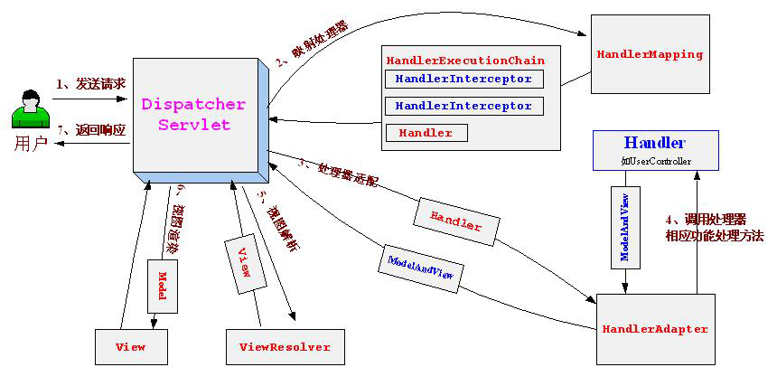

[[TOC]]

2018年11月26日 - 2019年02月10日

# 第十一章 SpringMVC

Spring基于Servlet功能实现，通过实现Servlet接口的`DispatcherServlet`来封装核心功能。

Spring 处理程序的接口 `Controller`，并且该接口只有一个 方法 handleRequest（request，response）



## 11.1 SpringMVC 例子

（1）配置web.XML文件

一个web中可以没有web.xml文件。但是SpringMVC的实现原理是通过Servlet拦截所有的URL达到目的。所以web.xml必须配置。

```xml
<!DOCTYPE web-app PUBLIC
 "-//Sun Microsystems, Inc.//DTD Web Application 2.3//EN"
 "http://java.sun.com/dtd/web-app_2_3.dtd" >

<web-app>
      <display-name>springmvc</display-name>

  <!-- 告诉spring的配置文件的位置 -->
  <context-param>
      <param-name>contextConfigLocation</param-name>
      <param-value>classpath:SpringContext.xml</param-value>
  </context-param>

  <!-- 配置上下文载入器 -->
  <!-- 功能是载入 除 dispatcherServlet载入的配置文件外的 配置文件 -->
  <listener>
      <listener-class>org.springframework.web.context.ContextLoaderListener</listener-class>
  </listener>

<!-- 配置前端控制器，开启springmvc框架支持 配置DispatcherServlet -->
    <servlet>
        <servlet-name>dispatcherServlet</servlet-name>
        <servlet-class>org.springframework.web.servlet.DispatcherServlet</servlet-class>
        <!-- 这里 DispatcherServlet 默认 （即不写以下）会加载WEB-INF中的 springmvc-servlet.xml文件 -->
        <init-param>
            <param-name>contextConfigLocation</param-name>
            <param-value>classpath:spring-servlet.xml</param-value>
        </init-param>
        <load-on-startup>1</load-on-startup>
    </servlet>
    <!-- 开启DispatcherServlet 需要对什么起作用 “/” 表示对任何连接都会拦截 -->
    <servlet-mapping>
        <servlet-name>dispatcherServlet</servlet-name>
        <url-pattern>/</url-pattern>
    </servlet-mapping>
</web-app>
```

SpringMVC必须有web.xml的原因：

Spring就是基于 配置文件的。配置文件对弈Spring 是必不可少的。

DispatcherServlet 包含类SpringMVC的请求逻辑，Spring使用这个类拦截Web请求并进行逻辑处理。

（2） 创建Spring配置文件 `SpringContext.xml`

```xml
<%@ page language="java" contentType="text/html; charset=UTF-8"
    pageEncoding="UTF-8"%>
<%@ page isELIgnored="false"%> <!-- 无法识别el表达式时 -->
<!-- 添加支持jstl 以及maven 依赖 jstl1.2 -->
<%@ taglib prefix="c" uri="http://java.sun.com/jsp/jstl/core" %>
<!DOCTYPE html PUBLIC "-//W3C//DTD HTML 4.01 Transitional//EN" "http://www.w3.org/TR/html4/loose.dtd">
<html>
<head>
<meta http-equiv="Content-Type" content="text/html; charset=UTF-8">
<title>Insert title here</title>
</head>
<body>
<h2>sdfasdfasdf</h2>
<c:forEach items="${users}" var="user" >
    <c:out value="${user.userName}"/><br>
    <c:out value="${user.age}"/><hr>
</c:forEach>

<c:forEach var="i" begin="1" end="5" >
   Item <c:out value="${i}"/><p>
</c:forEach>
<c:forTokens items="google,runoob,taobao" delims="," var="name">
   <c:out value="${name}"/><p>
</c:forTokens>
</body>
</body>
</html>
```

`InternalResourceViewResolver`是一个辅助Bean，在ModelAndView返回的视图名前加上prefix 指定前缀，suffix指定后缀。

（3）创建model

```java
public class User {

    private String userName;
    private int age;
     ........   
}
```

（4）创建Controller

控制web请求，每个controller 对应一个请求

```java
public class UserController extends AbstractController {

    @Override
    protected ModelAndView handleRequestInternal(HttpServletRequest request, HttpServletResponse response)
            throws Exception {
        User user1 = new User("小王",1);
        User user2 = new User("老王",30);
        List<User> lists = new ArrayList<User>() {{
                add(user1);
                add(user2);
        }};

        return new ModelAndView("my", "users", lists);
    }

}
```

（5）创建jsp

```xml
<c:forEach items="$(users)" var="user">
    <c:out value="$(user.userName)"/><br>
    <c:out value="$(user.age)"/><hr>
</c:forEach>
```

（6）创建Servlet配置文件 Spring-Servlet.xml

```java
<?xml version="1.0" encoding="UTF-8"?>
<beans xmlns="http://www.springframework.org/schema/beans"
    xmlns:xsi="http://www.w3.org/2001/XMLSchema-instance" xmlns:p="http://www.springframework.org/schema/p"
    xmlns:context="http://www.springframework.org/schema/context"
    xmlns:mvc="http://www.springframework.org/schema/mvc"
    xsi:schemaLocation="
        http://www.springframework.org/schema/beans
        http://www.springframework.org/schema/beans/spring-beans.xsd
        http://www.springframework.org/schema/context
        http://www.springframework.org/schema/context/spring-context.xsd
        http://www.springframework.org/schema/mvc
        http://www.springframework.org/schema/mvc/spring-mvc.xsd">
<bean id="simpleUrlMapping" class="org.springframework.web.servlet.handler.SimpleUrlHandlerMapping">
    <!-- 表示 mappings的拦截Servlet 是 userlist.html 就会交由 userController 来处理  -->
    <property name="mappings">
        <props>
            <prop key="userlist.html">userController</prop>
        </props>
    </property>
</bean>
<!-- 注册控制器 -->
<bean id="userController" class="com.guo.MyController.UserController"></bean>
</beans>
```

启动服务时，遇到一个坑：由于我是用Spring源码作为启动的依赖包。而该Java项目又不是maven项目，使用的是项目间直接引用，没有采取jar关联，致使Spring源码没有部署到tomcat中。[解决方法](https://blog.csdn.net/testcs_dn/article/details/43764497) [例子](https://blog.csdn.net/FateHJ/article/details/51623164)

又遇到坑： `/spring-web/src/test/resources/org/springframework/web/util/HtmlCharacterEntityReferences.dtd` web项目一关联源码项目 就会报错。还没有找到解决办法！

只有用 spring 的 maven 库中jar包。4.3.18版本。

> java.util.concurrent.ExecutionException: org.apache.catalina.LifecycleException: Failed to start component [StandardEngine[Catalina].StandardHost[localhost].StandardContext[/SpringCode11MVC]]
> 
> 说明 tomcat 中重复存在 或者 web.xml 配置错误
> 
> ------------
> 
> BeanFactory not initialized or already closed - call 'refresh' before accessing beans via the ApplicationContext
> 
> 说明 加载 Applicationcontext.xml 出现了问题： 一 没有找到，二 找到了，解析时错误，重名什么的。
> 
> ----------
> 
> spring 的配置文件 都要加 控制。
> 
> ----
> 
> 还有很多问题：大问题基本都列出来了，或者在例子中有注解，小问题略过。

## 11.2 ContextLoaderListener

web服务是从加载web.xml 中开始的。所以先从这里开始，第一步配置 Spring 的配置文件。再其次就是对 `ContextLoaderListener`的加载解析。

```java
public class ContextLoaderListener extends ContextLoader 
                implements ServletContextListener {


    public ContextLoaderListener() {
    }

    public ContextLoaderListener(WebApplicationContext context) {
        super(context);
    }


    /**
     * Initialize the root web application context.
     */
    @Override
    public void contextInitialized(ServletContextEvent event) {
        initWebApplicationContext(event.getServletContext());
    }


    /**
     * Close the root web application context.
     */
    @Override
    public void contextDestroyed(ServletContextEvent event) {
        closeWebApplicationContext(event.getServletContext());
        ContextCleanupListener.cleanupAttributes(event.getServletContext());
    }

}
```

从源码得知，ContextLoaderListenter 实现了 `ServletContextListener`接口。而启动容器时，就会去调用该接口，创建 `ServletContext`实例，而且开发者可以在，服务启动前向其中添加对象。并且整个服务过程中，该实例都是可以拿到的。而上面源码就是 将 `WebApplicationContext`实例加载到 ServletContext中。

### 11.2.1 ServletContextListenter 使用实例

（1） 实现自定义 的 ServletContextListenter 

```java
public class MyServletContextListener implements ServletContextListener {
    private ServletContext context = null;
    //  该方法在 ServletContext启动后调用
    @Override
    public void contextDestroyed(ServletContextEvent event) {
        this.context = null;
    }
    // 该方法在 ServletContext 销毁时调用
    @Override
    public void contextInitialized(ServletContextEvent event) {
        context = event.getServletContext();
        this.context.setAttribute("myObject", "添加了自定义的对象");
    }
}
```

（2）在 web.xml中注册 该Listenter

（3）在对应 Servlet 或者存在 ServletContext 中。可以直接获取。getAttribute（）

### 11.2.2 Spring 实现的 ServletContextListenter

```java
    public WebApplicationContext initWebApplicationContext(ServletContext servletContext) {
        // 1. 如果web.xml中多次 注册 WebApplicationContext 抛出异常
        if (servletContext.getAttribute
            (WebApplicationContext.ROOT_WEB_APPLICATION_CONTEXT_ATTRIBUTE) != null) {
            throw new IllegalStateException(
                    "Cannot initialize context because there is already a root application context present - " +
                    "check whether you have multiple ContextLoader* definitions in your web.xml!");
        }

        Log logger = LogFactory.getLog(ContextLoader.class);
        servletContext.log("Initializing Spring root WebApplicationContext");
        if (logger.isInfoEnabled()) {
            logger.info("Root WebApplicationContext: initialization started");
        }
        long startTime = System.currentTimeMillis();

        try {
            // Store context in local instance variable, to guarantee that
            // it is available on ServletContext shutdown.
            if (this.context == null) {
                // 2. 创建 WebApplicationContext 实例
                this.context = createWebApplicationContext(servletContext);
            }
            if (this.context instanceof ConfigurableWebApplicationContext) {
                ConfigurableWebApplicationContext cwac = (ConfigurableWebApplicationContext) this.context;
                if (!cwac.isActive()) {
                    // The context has not yet been refreshed -> provide services such as
                    // setting the parent context, setting the application context id, etc
                    if (cwac.getParent() == null) {
                        // The context instance was injected without an explicit parent ->
                        // determine parent for root web application context, if any.
                        ApplicationContext parent = loadParentContext(servletContext);
                        cwac.setParent(parent);
                    }
                    configureAndRefreshWebApplicationContext(cwac, servletContext);
                }
            }
            // 3. 将 WebApplicationContext 保存到 ServletContext实例中 
            servletContext.setAttribute
                (WebApplicationContext.ROOT_WEB_APPLICATION_CONTEXT_ATTRIBUTE,
                 this.context);

            ClassLoader ccl = Thread.currentThread().getContextClassLoader();
            if (ccl == ContextLoader.class.getClassLoader()) {
                currentContext = this.context;
            }
            else if (ccl != null) {
                currentContextPerThread.put(ccl, this.context);
            }

            if (logger.isDebugEnabled()) {
                logger.debug("Published root WebApplicationContext as ServletContext attribute with name [" +
                        WebApplicationContext.ROOT_WEB_APPLICATION_CONTEXT_ATTRIBUTE + "]");
            }
            if (logger.isInfoEnabled()) {
                long elapsedTime = System.currentTimeMillis() - startTime;
                logger.info("Root WebApplicationContext: initialization completed in " + elapsedTime + " ms");
            }

            return this.context;
        }
        catch (RuntimeException ex) {
            logger.error("Context initialization failed", ex);
            servletContext.setAttribute(WebApplicationContext.ROOT_WEB_APPLICATION_CONTEXT_ATTRIBUTE, ex);
            throw ex;
        }
        catch (Error err) {
            logger.error("Context initialization failed", err);
            servletContext.setAttribute(WebApplicationContext.ROOT_WEB_APPLICATION_CONTEXT_ATTRIBUTE, err);
            throw err;
        }
    }
```

`WebApplicationContext` 在web中常用的类型，继承自`ApplicationContext`，并追加了一些对web的操作与属性。

#### 11.2.2.1 判断是否重复注册 `WebApplicationContext`

#### 11.2.2.2 创建 `WebApplicationContext`实例

```java
    protected WebApplicationContext createWebApplicationContext(ServletContext sc) {
        Class<?> contextClass = determineContextClass(sc);
        if (!ConfigurableWebApplicationContext.class.isAssignableFrom(contextClass)) {
            throw new ApplicationContextException("Custom context class [" + contextClass.getName() +
                    "] is not of type [" + ConfigurableWebApplicationContext.class.getName() + "]");
        }
        return (ConfigurableWebApplicationContext) BeanUtils.instantiateClass(contextClass);
    }

// 具体创建
    protected Class<?> determineContextClass(ServletContext servletContext) {
        String contextClassName = servletContext.getInitParameter(CONTEXT_CLASS_PARAM);
        if (contextClassName != null) {
            try {
                return ClassUtils.forName(contextClassName, ClassUtils.getDefaultClassLoader());
            }
            catch (ClassNotFoundException ex) {
                throw new ApplicationContextException(
                        "Failed to load custom context class [" + contextClassName + "]", ex);
            }
        }
        else {
            // defaultStrategies 在 静态块中 实例化
            contextClassName = defaultStrategies.getProperty(WebApplicationContext.class.getName());
            try {
                return ClassUtils.forName(contextClassName, ContextLoader.class.getClassLoader());
            }
            catch (ClassNotFoundException ex) {
                throw new ApplicationContextException(
                        "Failed to load default context class [" + contextClassName + "]", ex);
            }
        }
    }

// ContextLoader 类中的 静态内容
private static final String DEFAULT_STRATEGIES_PATH = "ContextLoader.properties";
// propertites 中内容 
// org.springframework.web.context.WebApplicationContext=org.springframework.web.context.support.XmlWebApplicationContext

    static {
        // Load default strategy implementations from properties file.
        // This is currently strictly internal and not meant to be customized
        // by application developers.
        try {
            ClassPathResource resource = new ClassPathResource(DEFAULT_STRATEGIES_PATH, ContextLoader.class);
            defaultStrategies = PropertiesLoaderUtils.loadProperties(resource);
        }
        catch (IOException ex) {
            throw new IllegalStateException("Could not load 'ContextLoader.properties': " + ex.getMessage());
        }
    }
```

#### 11.2.2.3  将实例注册到ServletContext中

#### 11.2.2.4 映射当前的类加载器 与 创建的实例到全局变量 `currentContextPerThread`

## 11.3 DispatcherServlet 配置前端控制器 支持springmvc

DispatcherServlet 是实现了HttpServlet接口的实例。

### Servlet 回顾

Servlet是 sun公司基于Http协议制定的规范，在服务器端运行，作用是接受处理用户请求。

#### 初始化

1. Servlet容器加载Servlet类，把Servlet类的class文件读取到内存中
2. Servlet容器创建一个ServletConfig对象。该对象包含了Servlet初始化的配置信息
3. Servlet容器创建一个Servlet对象
4. 容器调用init方法初始化 Servlet对象

#### 运行阶段

当容器收到一个请求，容器会创建对应的 request 和 response 对象，然后调用service方法。并将两个对象传递给service。service通过request获取信息，通过response将结果响应返回，然后销毁两个对象。这里不管请求的类型是什么都会由service处理。

#### 销毁阶段

web应用终止时，Servlet容器先调用 Servlet对象的destroy，然后在销毁该对象，同时销毁Servlet关联的 ServletConfig。

> servlet 框架有两个：javax.servlet  与 javax.servlet.http，前者定义 所有Servlet类 必须的扩展。后者 定义采用http协议的HttpServlet类。
> 
> http请求包含 delete get options post put trace

### 11.3.1 Servlet使用

（1）自定义类实现 httpServlet

（2）在web.xml中配置

```xml
<servlet>
    <servlet-name></servlet-name>
    <servlet-class></servlet-class>
    <init-param>
            <param-name>contextConfigLocation</param-name>
            <param-value>classpath:spring-servlet.xml</param-value>
    </init-param>
    <load-on-startup></load-on-startup><!-- 执行顺序 -->
</servlet>
<servlet-mapping>
    <servlet-name></servlet-name>
    <url-pattern></url-pattern><!-- 对应的映射路径 -->
</servlet-mapping>
```

### 11.3.2 DispatchServlet 初始化

可以在父类HttpServletBean的找到初始化实现：

```java
    public final void init() throws ServletException {
        if (logger.isDebugEnabled()) {
            logger.debug("Initializing servlet '" + getServletName() + "'");
        }

        // Set bean properties from init parameters.
        // 1.解析 init-param 并封装在pvs中
        PropertyValues pvs = new ServletConfigPropertyValues(getServletConfig(), this.requiredProperties);
        if (!pvs.isEmpty()) {
            try {
                // 将当前的 beanServlet 转换成 beanWrapper,
                // 2.从而可以用spring的方式对 init-param的值进行注册
                BeanWrapper bw = PropertyAccessorFactory.forBeanPropertyAccess(this);
                ResourceLoader resourceLoader = 
                    new ServletContextResourceLoader(getServletContext());
                // 3.注册自定义属性编辑器 一但 遇到Resource类型的属性将会使用ResourceEditor进行解析
                bw.registerCustomEditor(Resource.class, new ResourceEditor(resourceLoader, getEnvironment()));
                // 空实现  ，可以给子类进行实现扩展
                initBeanWrapper(bw);
                // 4 属性注入
                bw.setPropertyValues(pvs, true);
            }
            catch (BeansException ex) {
                if (logger.isErrorEnabled()) {
                    logger.error("Failed to set bean properties on servlet '" + getServletName() + "'", ex);
                }
                throw ex;
            }
        }

        // Let subclasses do whatever initialization they like.
        // 5 给子类扩展的
        initServletBean();

        if (logger.isDebugEnabled()) {
            logger.debug("Servlet '" + getServletName() + "' configured successfully");
        }
    }
```

这个过程主要就是将 Servlet类型实例转换成为 beanWrapper 类型实例，便于使用spring 中提供的注入功能进行对应属性的注入。属性有：contextAttribute、contextClass、nameSpace、contextConfigLocation等。都可以在web.xml中以初始化参数的方式进行配置，而这些属性 在FrameworkServlet类中有同名属性，所以保证能注册进。

#### 1 封装验证初始化参数

`PropertyValues pvs = new ServletConfigPropertyValues(getServletConfig(), this.requiredProperties);`

```java
        public ServletConfigPropertyValues(ServletConfig config, Set<String> requiredProperties) throws ServletException {

            Set<String> missingProps = (!CollectionUtils.isEmpty(requiredProperties) ?
                    new HashSet<String>(requiredProperties) : null);

            Enumeration<String> paramNames = config.getInitParameterNames();
            while (paramNames.hasMoreElements()) {
                String property = paramNames.nextElement();
                Object value = config.getInitParameter(property);
                addPropertyValue(new PropertyValue(property, value));
                if (missingProps != null) {
                    missingProps.remove(property);
                }
            }

            // Fail if we are still missing properties.
            // 如果我们仍然缺少属性，则失败。
            if (!CollectionUtils.isEmpty(missingProps)) {
                throw new ServletException(
                        "Initialization from ServletConfig for servlet '" + config.getServletName() +
                        "' failed; the following required properties were missing: " +
                        StringUtils.collectionToDelimitedString(missingProps, ", "));
            }
        }
    }
```

在 pvs 的构造函数中，做的是对init-param数据的封装

#### 2 将当前的 Servlet 转换为 beanWrapper

#### 3 注册对应的Resource 属性编辑器

在 DispatcherServlet 属性注入过程中，遇到了 Resource类型 调用

#### 4 属性注入

#### 5 ServletBean （即DispatchServlet） 的初始化

在前面 ContextLoaderListenter加载的时候已经创建好了WebApplicationContext实例，`initServletBean`而这里主要是对这个实例进行进一步的初始化 `FrameworkServlet`

```java
    protected final void initServletBean() throws ServletException {
        getServletContext().log("Initializing Spring FrameworkServlet '" + getServletName() + "'");
        if (this.logger.isInfoEnabled()) {
            this.logger.info("FrameworkServlet '" + getServletName() + "': initialization started");
        }
        long startTime = System.currentTimeMillis();

        try {
            this.webApplicationContext = initWebApplicationContext();
            // 子类可以再进行扩展
            initFrameworkServlet();
        }
        catch (ServletException ex) {
            this.logger.error("Context initialization failed", ex);
            throw ex;
        }
        catch (RuntimeException ex) {
            this.logger.error("Context initialization failed", ex);
            throw ex;
        }

        if (this.logger.isInfoEnabled()) {
            long elapsedTime = System.currentTimeMillis() - startTime;
            this.logger.info("FrameworkServlet '" + getServletName() + "': initialization completed in " +
                    elapsedTime + " ms");
        }
    }
```

可以看到，DispatchServlet的初始化 围绕 到 初始化`WebApplicationContext`进行。

### 11.3.3 WebApplicationContext初始化

`initWebApplicationContext`功能 `FrameworkServlet` 创建或者属创建 webApplicationContext 实现，以及对ServletBean所用到的 变量进行初始化。 

源码：

```java
    protected WebApplicationContext initWebApplicationContext() {
        // 获取 有上下文加载监听器 注册进ServletContext 中的 Spring上下文对象
        WebApplicationContext rootContext =
                WebApplicationContextUtils.getWebApplicationContext(getServletContext());
        WebApplicationContext wac = null;

        if (this.webApplicationContext != null) {
            // A context instance was injected at construction time -> use it
            // context 在构造函数中已经被 注册时 直接获取
            wac = this.webApplicationContext;
            if (wac instanceof ConfigurableWebApplicationContext) {
                ConfigurableWebApplicationContext cwac = 
                    (ConfigurableWebApplicationContext) wac;
                if (!cwac.isActive()) {
                    // The context has not yet been refreshed -> provide services such as
                    // setting the parent context, setting the application context id, etc
                    if (cwac.getParent() == null) {
                        // The context instance was injected without an explicit parent -> set
                        // the root application context (if any; may be null) as the parent
                        cwac.setParent(rootContext);
                    }
                    // 刷新上下问环境
                    configureAndRefreshWebApplicationContext(cwac);
                }
            }
        }
        if (wac == null) {
            // 根据 contextAttribute 属性 进行 加载
            wac = findWebApplicationContext();
        }
        if (wac == null) {
            // 没有为此Servlet 定义上下文实例时
            wac = createWebApplicationContext(rootContext);
        }

        if (!this.refreshEventReceived) {
            // 上下文 不是 没有刷新的情况下，执行刷新
            onRefresh(wac);
        }

        if (this.publishContext) {
            // Publish the context as a servlet context attribute.
            String attrName = getServletContextAttributeName();
            getServletContext().setAttribute(attrName, wac);
            if (this.logger.isDebugEnabled()) {
                this.logger.debug("Published WebApplicationContext of servlet '" + getServletName() +
                        "' as ServletContext attribute with name [" + attrName + "]");
            }
        }
        return wac;
    }
```

#### 11.3.3.1  寻找或者创建 对应 未必WebApplicationContext实例

（1）寻找 ：是否是通过构造函数进行初始化的，即 `this.webApplicationContext;`

（2）重新初始化： `findWebApplicationContext();`通过 ContextAttribute 进行初始化

通过web.xml文件中配置的Servlet参数 ContextAttribute 来查找`ServletContext`中对应的数据，默认为 WebApplicationContext.class.getName + ".ROOT",也就是 ContextLoaderListenter加载时会创建的 web上下文实例，

以类名+.ROOT 为key，放入ServletContext中。所有这里 设置key 可以自己实现进行自定义。

（3） 重写创建 ：`createWebApplicationContext(rootContext);` 

如果通过上来两种方法，都没有获取到 有效的WebApplicationContext实例。那么就在这里进行创建新实例。

```java
    protected WebApplicationContext createWebApplicationContext(WebApplicationContext parent) {
        return createWebApplicationContext((ApplicationContext) parent);
    }
----------
    protected WebApplicationContext createWebApplicationContext(ApplicationContext parent) {
        Class<?> contextClass = getContextClass();
        if (this.logger.isDebugEnabled()) {
            this.logger.debug("Servlet with name '" + getServletName() +
                    "' will try to create custom WebApplicationContext context of class '" +
                    contextClass.getName() + "'" + ", using parent context [" + parent + "]");
        }
        if (!ConfigurableWebApplicationContext.class.isAssignableFrom(contextClass)) {
            throw new ApplicationContextException(
                    "Fatal initialization error in servlet with name '" + getServletName() +
                    "': custom WebApplicationContext class [" + contextClass.getName() +
                    "] is not of type ConfigurableWebApplicationContext");
        }
    // 反射创建 Context
        ConfigurableWebApplicationContext wac =
            (ConfigurableWebApplicationContext) BeanUtils.instantiateClass(contextClass);

        wac.setEnvironment(getEnvironment());
    // parent 为 上下文加载监听器 所创建的web上下文
        wac.setParent(parent);
    // 获取 ContextConfigLocation 属性，配置到Servlet初始化参数中
        wac.setConfigLocation(getContextConfigLocation());
    // 初始化 spring 环境，包括加载配置文件等 配置刷新
        configureAndRefreshWebApplicationContext(wac);
        return wac;
    }
```

#### 11.3.3.2 configureAndRefreshWebApplicationContext 配置和刷新

构造函数注入 和 单独构建，都会调用：

```java
    protected void configureAndRefreshWebApplicationContext(ConfigurableWebApplicationContext wac) {
        if (ObjectUtils.identityToString(wac).equals(wac.getId())) {
            // The application context id is still set to its original default value
            // -> assign a more useful id based on available information
            if (this.contextId != null) {
                wac.setId(this.contextId);
            }
            else {
                // Generate default id...
                wac.setId(ConfigurableWebApplicationContext.APPLICATION_CONTEXT_ID_PREFIX +
                        ObjectUtils.getDisplayString(getServletContext().getContextPath()) + '/' + getServletName());
            }
        }

        wac.setServletContext(getServletContext());
        wac.setServletConfig(getServletConfig());
        wac.setNamespace(getNamespace());
        wac.addApplicationListener(new SourceFilteringListener(wac, new ContextRefreshListener()));

        // The wac environment's #initPropertySources will be called in any case when the context
        // is refreshed; do it eagerly here to ensure servlet property sources are in place for
        // use in any post-processing or initialization that occurs below prior to #refresh
        ConfigurableEnvironment env = wac.getEnvironment();
        if (env instanceof ConfigurableWebEnvironment) {
            ((ConfigurableWebEnvironment) env).initPropertySources(getServletContext(), getServletConfig());
        }

        postProcessWebApplicationContext(wac);
        applyInitializers(wac);
        // 加载配置文件及整合parent到wac
        wac.refresh();
    }
```

无论怎么样，只要使用 ApplicationContext 的功能，都免不了公共父类的 refresh属性，加载 spring的配置文件。

#### 11.3.3.3 刷新 onRefresh

onRefresh 在 FrameworkServlet 提出，`DispatchServlet`中实现，主要是刷新 spring 在web功能中需要使用的全局变量。

```java
    protected void onRefresh(ApplicationContext context) {
        initStrategies(context);
    }
--------
    protected void initStrategies(ApplicationContext context) {
        initMultipartResolver(context);
        initLocaleResolver(context);
        initThemeResolver(context);
        initHandlerMappings(context);
        initHandlerAdapters(context);
        initHandlerExceptionResolvers(context);
        initRequestToViewNameTranslator(context);
        initViewResolvers(context);
        initFlashMapManager(context);
    }
```

##### （1） 初始化`MultipartResolver` (多分解器)

spring 中 MultipartResolver 主要用于处理文件上传。默认 下 Spring 中没有 multipart 处理的。

如何使用：需要在web应用的上下文中添加 multipart 解析器。这样每个请求都会被检查是否含有 multipart。

```xml
<bean id="multipartResolver" class="org.springframework.web.multipart.commons.CommonsMultipartResolver">
    <!-- 上传文件最大 的 byte 数 -->
    <property name="maximumFileSize"><value>10240</value></property>
</bean>
```

initMultipartResolver中 就会直接通过 getBean 获取对应的解析器。对请求中的 Multipart 进行处理。

##### （2）初始化`LocaleResolver`（语言环境 解析器）

spring 的国际化配置红一共有三种使用方式。

+ 基于URL参数的配置

即请求路径参数加上 `?loacle=zh_CN`，使用类似上面，需要spring上下文配置 对应的 `org.springframework.web.servlet.i18n.AcceptHeaderLocaleResolver`

```xml
<bean id="localeResolver" class="org.springframework.web.servlet.i18n.AcceptHeaderLocaleResolver"></bean>
```

+ 基于session的配置

用户登录时设置语言环境，如果没有就会取 accept-language HTTP 头部信息确定默认语言。

```xml
<bean id="localeResolver" class="org.springframework.web.servlet.i18n.SessionLocaleResolver"></bean>
```

+ 基于Cookie的国际化配置

CookieLocaleResolver来处理，浏览器中cookie语言环境

```xml
<bean id="locleResolver" class="org.springframework.web.servlet.i18n.CookieLocaleResolver"></bean>
```

##### （3） 初始化`ThemeResolver` （主题解析器）

属于静态资源，Spring 的主题功能 类似 国际化 

+ 主题资源

`org.springframework.ui.context.ThemeSource`是spring中的主题资源接口，spring的主题需要通过该接口的实现存放主题信息的资源。

`org.springframework.ui.context.support.ResourceBundleThemeSource`就是上接口的默认实现类。

```xml
<bean id="themeSource" class="org.springframework.ui.context.support.ResourceBundleThemeSource">
    <property name="basenamePrefix" value="com.test"></property>
</bean>
```

不配做property，就会默认在类路径根目录下查找资源文件，配置后DispatchServlet会在包com.test中查找。

+ 主题资源

ThemeSource定义类主题资源。这些资源就通过 `解析器` 展现给用户。

1. `FixedThemeResolver`用于选择一个固定主题
   
   ```xml
   <bean id="themeResolver" class="org.springframework.web.servlet.theme.FixedThemeResolver">
       <property name="defaultThemeName" value="summer"></property>
   </bean>
   ```

2. `CookieThemeResolver`用于用户所选的主题
   
   ```xml
   <bean id="themeResolver" class="org.springframework.web.servlet.theme.CookieThemeResolver">
       <property name="defaultThemeName" value="summer"></property>
   </bean>
   ```

3. `SessionThemeResolver` 用户主题保存在用户的Session中
   
   ```xml
   <bean id="themeResolver" class="org.springframework.web.servlet.theme.SessionThemeResolver">
       <property name="defaultThemeName" value="summer"></property>
   </bean>
   ```

4. `AbstractThemeResolver` 用户自定义扩展的。
+ 拦截器

如果用户请求改变主题，Spring提供一个已经实现的`ThemeChangeInterceptor`

```xml
<bean id="themeChangeInterceptor" class="org.springframework.web.servlet.theme.ThemeChangeInterceptor">
    <property name="paraName" value="themeName"></property>
</bean>
```

用户请求参数名称为 themeName，URL 请求 `?themeName=` ,来进行主题设置

另外这里只是注册类拦截器，但没有使用，需要在 `handlerMapping`中配置

```xml
<property name="interceptors">
    <list>
        <ref local="themeChangeInterceptor"></ref>
    </list>
</property>
```

注册基本同其他相同

##### （4）初始化 `HandlerMappings`（行为映射）

当客户端发出 Request ，根据对应的项目地址，DispatcherServlet 会将 Request 提交给 HandlerMapping，

然后HandlerMapping 根据 ，请求的具体路径，通过`WebApplicationContext` 的配置的  `simpleUrlMapping`， 来回传给 `DispatcherServlet` 相应的`Controller`

```xml
<bean id="simpleUrlMapping" class="org.springframework.web.servlet.handler.SimpleUrlHandlerMapping">
    <property name="mappings">
        <props>
            <prop key="userlist.html">userController</prop>
        </props>
    </property>
</bean>
<!-- 注册控制器 -->
<bean id="userController" class="com.guo.MyController.UserController"></bean>
</beans>
```

而这里，`simpleUrlMapping`,可以直接 使用 `@RequestMapping`注解代替，而不需要进行配置。

默认，加载的HandlerMapping是有优先级执行的。

而且默认会加载，当前系统中所有的 实现了 `HandlerMapping`接口的bean。如果只希望，加载单独的需要在web.xml中配置,dispeatherServlet。

```xml
<init-param>
    <param-name>detectAllHandlerMapping</param-name>
    <param-value>false</param-value>
</init-param>
```

此时就只会加载名为 “handlerMapping”的bean，

当没有陪配置时，会加载默认的 HandlerMapping ，使用注解而不配置，就使用的该 handlerMapping。（没有自定义Strategies的情况下）

##### （5）初始化 `HandlerAdapters` （行为适配器）

适配器：将一个类适配成所期待的接口形式。目的消除兼容问题。

这里就是将不同的类，兼容到一起进行合作。用法是将 自己的类的接口包装进一个已经存在的类中。

```java
    private void initHandlerAdapters(ApplicationContext context) {
        this.handlerAdapters = null;

        if (this.detectAllHandlerAdapters) {
            // Find all HandlerAdapters in the ApplicationContext, including ancestor contexts.
            Map<String, HandlerAdapter> matchingBeans =
                    BeanFactoryUtils.beansOfTypeIncludingAncestors(context, HandlerAdapter.class, true, false);
            if (!matchingBeans.isEmpty()) {
                this.handlerAdapters = new ArrayList<HandlerAdapter>(matchingBeans.values());
                // We keep HandlerAdapters in sorted order.
                AnnotationAwareOrderComparator.sort(this.handlerAdapters);
            }
        }
        else {
            try {
                // 在 spring加载的配置中  寻找 handlerAdapter 名称的 适配器
                HandlerAdapter ha = context.getBean(HANDLER_ADAPTER_BEAN_NAME, HandlerAdapter.class);
                this.handlerAdapters = Collections.singletonList(ha);
            }
            catch (NoSuchBeanDefinitionException ex) {
                // Ignore, we'll add a default HandlerAdapter later.
            }
        }

        // Ensure we have at least some HandlerAdapters, by registering
        // default HandlerAdapters if no other adapters are found.
        // 如果没有配置 行为适配器 就使用默认的
        if (this.handlerAdapters == null) {
            this.handlerAdapters = getDefaultStrategies(context, HandlerAdapter.class);
            if (logger.isDebugEnabled()) {
                logger.debug("No HandlerAdapters found in servlet '" + getServletName() + "': using default");
            }
        }
    }
```

以上代码 先 有点和 detectAllHandlerMapping 类似，Spring 默认都会加载 实现了接口 `HandlerAdapter`，的实例。如果配置了 

```xml
<init-param>
    <param-name>detectAllHandlerAdapters</param-name>
    <param-value>false</param-value>
</init-param>
```

就加载 `handlerAdapter` 名称的 实例。

如果没有就找到，就会使用默认的实例。看看获取默认的代码：

```java
    protected <T> List<T> getDefaultStrategies(ApplicationContext context, Class<T> strategyInterface) {
        String key = strategyInterface.getName();
        // 默认策略  同 handlerMapping 相同 ， DispatcherServlet.properties 中的 默认对象路径
        String value = defaultStrategies.getProperty(key);
        if (value != null) {
            String[] classNames = StringUtils.commaDelimitedListToStringArray(value);
            List<T> strategies = new ArrayList<T>(classNames.length);
            for (String className : classNames) {
                try {
                    Class<?> clazz = ClassUtils.forName(className, DispatcherServlet.class.getClassLoader());
                    Object strategy = createDefaultStrategy(context, clazz);
                    strategies.add((T) strategy);
                }
                catch (ClassNotFoundException ex) {
                    throw new BeanInitializationException(
                            "Could not find DispatcherServlet's default strategy class [" + className +
                                    "] for interface [" + key + "]", ex);
                }
                catch (LinkageError err) {
                    throw new BeanInitializationException(
                            "Error loading DispatcherServlet's default strategy class [" + className +
                                    "] for interface [" + key + "]: problem with class file or dependent class", err);
                }
            }
            return strategies;
        }
        else {
            return new LinkedList<T>();
        }
    }
```

`DispatcherServlet.properties`中数据

```java
org.springframework.web.servlet.HandlerAdapter=
    org.springframework.web.servlet.mvc.HttpRequestHandlerAdapter,\
    org.springframework.web.servlet.mvc.SimpleControllerHandlerAdapter,\
    org.springframework.web.servlet.mvc.annotation.AnnotationMethodHandlerAdapter
```

当没有配置 适配器时，就会默认加载这三个适配器。

+ Http 请求处理器适配器 （`HTTPRequestHandlerAdapter`）

该请求处理器适配器只是，支持对http请求的处理的适配。简单的将 http 请求对象 与 返回对象 传递给http请求处理器的实现，没有返回值。

+ 简单控制器处理器适配器（`SimpleControllerHandlerAdapter`）

该实现类 将http请求适配到一个控制器的实现进行处理。这里控制器的实现时一个简单的控制器接口的实现。

该适配器被设计成一个框架类的实现，不需要被改写，客户的业务逻辑 通常 在控制器的接口的实现类中实现。

+ 注解方法处理器适配器（`AnnotationMethodHandlerAdapter`）

顾名思义，这个适配器的实现是 基于注解的。它需要结合主机方法的映射 和注解 方法处理器协同工作。

它通过解析声明在注解控制器的请求映射信息 来进行相应的处理器方法处理当前的Http请求。

在处理过程中，它通过反射来发现探测处理器方法的参数，调用处理器方法。并进行 映射 返回值 到模型和控制对象，最后返回模型和控制器对象作为主控制器的派遣器 Servlet.

##### （6）初始化处理器 异常解析器(`HandlerExceptionResolvers` )

基于 `HandlerExceptionResolver`接口的异常处理。只需要实现 该接口的 `resolverException`方法，该方法返回一个`ModelAndView`对象，在该方法内部进行异常 类型判断，返回对应的不同的 `ModelAndView`，如果返回是一个 `null`，则spring 会继续寻找其他实现了该接口的实例。直到返回一个有用的 `视图控制器`。

可以自定义实现，并配置到spring 配置文件中。

```java
public class MyHandlerExceptionResolver implements HandlerExceptionResolver {

    @Override
    public ModelAndView resolveException(HttpServletRequest request, HttpServletResponse response, Object handler,Exception ex) {
        return new ModelAndView("error/exception");
    }
}
```

```xml
<bean id="exceptionHandler" class="com.guo.Adapter.MyHandlerExceptionResolver"></bean>
```

这样 当 `Controller` 运行过程中出现了异常，就会在 这里执行，并返回对应的 视图控制器。

##### （7）初始化 请求视图名称 翻译器 （`RequestToViewNameTranslator`）

源代码中：依旧是直接通过 `ApplicationContext` ，给出对应的 `viewNameTranslator`获取bean。

而这个翻译器的功能是什么呢？

当 Controller 处理器方法没有返回一个 View 对象 或者逻辑视图名称时，并且 该方法中 没有直接往 **response 的输出流中写数据时** ，Spring就会采用约定好的方式提供一个 `逻辑视图名称`。而这个逻辑视图名称时通过 接口 `org.springframework.web.servlet.RequestToViewNameTranslator`中的`getViewName`实现。故而 我们也可以 实现该接口。

Spring中提供的 实现 ：`org.springframework.web.servlet.view.DefaultRequestToViewNameTranslator`。

DefaultRequestToViewNameTranslator ： 

+ prefix： 前缀 表示约定好的视图名称需要加上的前缀，默认""
+ suffix： 后缀 加上的后缀 ，默认""
+ separator：分割符 默认斜杠 “/”
+ stripLeadingSlash：如果首字符为分割符 默认要删除
+ stripTrailingSlash：如果最后一个字符 为分割符 默认要删除
+ stripExtension：请求路径包含扩展名 是否去除 默认是
+ urlPathHelper：是否需要对URL 解码，默认是true。 它会采用Request指定的编码或者 ISO-8859-1 进行解码

当没有自定义实现对应的 请求视图名称翻译器时，spring就会默认加载这个。

看看如何运转的：

http://localhost:8080/SpringCode11MVC/test/index.html的URL路径在Controller中没有返回对应的。在该功能时，就会是：

```java
    public String getViewName(HttpServletRequest request) {
        String lookupPath = this.urlPathHelper.getLookupPathForRequest(request);
        return (this.prefix + transformPath(lookupPath) + this.suffix);
    }
    protected String transformPath(String lookupPath) {
        String path = lookupPath;
        if (this.stripLeadingSlash && path.startsWith(SLASH)) {
            // 去头/
            path = path.substring(1);
        }
        if (this.stripTrailingSlash && path.endsWith(SLASH)) {
            // 去尾/
            path = path.substring(0, path.length() - 1);
        }
        if (this.stripExtension) {
            // 祛 扩展
            path = StringUtils.stripFilenameExtension(path);
        }
        if (!SLASH.equals(this.separator)) {
            // 修改分割号 为 /
            path = StringUtils.replace(path, SLASH, this.separator);
        }
        return path;
    }
```

故而 得到的 逻辑视图名称 为： test/index

##### （8）初始化视图解析器 `ViewResolver`

配置文件需要的配置：

```xml
    <bean id="viewResoler" class="org.springframework.web.servlet.view.InternalResourceViewResolver">
        <property name="prefix" value="/jsp/"></property>
        <property name="suffix" value=".jsp"></property>
    </bean>
```

逻辑基本就是，通过 逻辑视图名称 创建一个 View。返回。

##### （9） 初始化FlashMap管理器 `FlashMapManager`

注册与 逻辑视图名 翻译器类似： 通过该`flashMapManager`名称，获取注册。

`Flash attributes`：spring提供的一个请求存储属性，可供其他请求使用。在使用重定向时非常有用，如 GET/POST。

可以在重定向之前暂存，以便在重定向后还能使用，使用后立即删除。

FlashMap 用于保持住 Flash attributes，FlashMapManager则是 用于存储检索管理 FlashMap实例。

Flash attributes 默认在spring红是开启的，并不需要进行显示开启。不会导致 HTTP Session 的创建。

## Spring 路线分析

1. 请求到达 `DispatcherServlet`，判断是否有对应路径的 解析器（路径配置文件与注解配置路径）
2. 如果有对应的 `Controller`，到达后，返回 `① View 视图对象` 、`②逻辑视图名称`、`③response输出流`、`④出现异常，由异常解析器返回`、`⑤不返回`
3. 当为五时，到 逻辑视图翻译器中，返回一个 逻辑视图名称
4. 当返回一个二时，由 视图解析器返回一个 View对象

## 11.4 DispatcherServlet 的逻辑处理

HttpServlet类中分别提供类对应的服务方法，doDelete、doGet、doPost、doPut、doOptions、doTrace。基于Rest风格的。

[REST风格接口](https://www.jianshu.com/p/00d1ab8cc073)

在父类 `FrameworkServlet`中的 函数中：基于 delete get post put都默认直接到了 `processRequest(request, response);`中，另外两个有一定的逻辑判断 再进入到这里。

```java
    protected final void processRequest(HttpServletRequest request, HttpServletResponse response) throws ServletException, IOException {

        // 记录当前事件
        long startTime = System.currentTimeMillis();
        Throwable failureCause = null;

        // 环境上下文
        LocaleContext previousLocaleContext = LocaleContextHolder.getLocaleContext();
        LocaleContext localeContext = buildLocaleContext(request);

        // 请求 属性
        RequestAttributes previousAttributes = RequestContextHolder.getRequestAttributes();
        ServletRequestAttributes requestAttributes = buildRequestAttributes(request, response, previousAttributes);

        WebAsyncManager asyncManager = WebAsyncUtils.getAsyncManager(request);
        asyncManager.registerCallableInterceptor(FrameworkServlet.class.getName(), new RequestBindingInterceptor());

        initContextHolders(request, localeContext, requestAttributes);

        try {
            // 进行服务解析
            doService(request, response);
        }
        catch (ServletException ex) {
            failureCause = ex;
            throw ex;
        }
        catch (IOException ex) {
            failureCause = ex;
            throw ex;
        }
        catch (Throwable ex) {
            failureCause = ex;
            throw new NestedServletException("Request processing failed", ex);
        }

        finally {
            resetContextHolders(request, previousLocaleContext, previousAttributes);
            if (requestAttributes != null) {
                requestAttributes.requestCompleted();
            }

            if (logger.isDebugEnabled()) {
                if (failureCause != null) {
                    this.logger.debug("Could not complete request", failureCause);
                }
                else {
                    if (asyncManager.isConcurrentHandlingStarted()) {
                        logger.debug("Leaving response open for concurrent processing");
                    }
                    else {
                        this.logger.debug("Successfully completed request");
                    }
                }
            }

            publishRequestHandledEvent(request, response, startTime, failureCause);
        }
    }
```

1. 保证当前线程中的 LocaleContext 以及 RequestAttributes 可以在请求后还能恢复，先做提取
2. 根据当前请求对象 Request 创建对应的 LocaleContext 与 RequestAttributes，并绑定到当前线程
3. 任务委托给`doService`
4. 请求处理结束后恢复线程到初始状态
5. 请求结束后，无论是否成功，发布事件通知

继续查看 `doService`（DispatcherServlet）

```java
    protected void doService(HttpServletRequest request, HttpServletResponse response) throws Exception {
        if (logger.isDebugEnabled()) {
            String resumed = WebAsyncUtils.getAsyncManager(request).hasConcurrentResult() ? " resumed" : "";
            logger.debug("DispatcherServlet with name '" + getServletName() + "'" + resumed +" processing " + request.getMethod() + " request for [" + getRequestUri(request) + "]");
        }

        // Keep a snapshot of the request attributes in case of an include,
        // to be able to restore the original attributes after the include.
        Map<String, Object> attributesSnapshot = null;
        if (WebUtils.isIncludeRequest(request)) {
            attributesSnapshot = new HashMap<String, Object>();
            Enumeration<?> attrNames = request.getAttributeNames();
            while (attrNames.hasMoreElements()) {
                String attrName = (String) attrNames.nextElement();
                if (this.cleanupAfterInclude || attrName.startsWith(DEFAULT_STRATEGIES_PREFIX)) {
                    attributesSnapshot.put(attrName, request.getAttribute(attrName));
                }
            }
        }

        // Make framework objects available to handlers and view objects.
        request.setAttribute(WEB_APPLICATION_CONTEXT_ATTRIBUTE, getWebApplicationContext());
        request.setAttribute(LOCALE_RESOLVER_ATTRIBUTE, this.localeResolver);
        request.setAttribute(THEME_RESOLVER_ATTRIBUTE, this.themeResolver);
        request.setAttribute(THEME_SOURCE_ATTRIBUTE, getThemeSource());

        FlashMap inputFlashMap = this.flashMapManager.retrieveAndUpdate(request, response);
        if (inputFlashMap != null) {
            request.setAttribute(INPUT_FLASH_MAP_ATTRIBUTE, Collections.unmodifiableMap(inputFlashMap));
        }
        request.setAttribute(OUTPUT_FLASH_MAP_ATTRIBUTE, new FlashMap());
        request.setAttribute(FLASH_MAP_MANAGER_ATTRIBUTE, this.flashMapManager);

        try {
            doDispatch(request, response);
        }
        finally {
            if (!WebAsyncUtils.getAsyncManager(request).isConcurrentHandlingStarted()) {
                // Restore the original attribute snapshot, in case of an include.
                if (attributesSnapshot != null) {
                    restoreAttributesAfterInclude(request, attributesSnapshot);
                }
            }
        }
    }
```

这里并没有什么跳转逻辑，而是初始设置，将 `11.3.3.2`中的初始化的对象注册到Request中。

继续 `doDispatch`

```java
    protected void doDispatch(HttpServletRequest request, HttpServletResponse response) throws Exception {
        HttpServletRequest processedRequest = request;
        HandlerExecutionChain mappedHandler = null;
        boolean multipartRequestParsed = false;

        WebAsyncManager asyncManager = WebAsyncUtils.getAsyncManager(request);

        try {
            ModelAndView mv = null;
            Exception dispatchException = null;

            try {
                // 11.4.1类型转换 MultipartContent的Request转换为 MultipartHttpServletRequest
                processedRequest = checkMultipart(request);
                multipartRequestParsed = (processedRequest != request);

                // 11.4.2 根据 Request中的信息 获取对应的 Handler （行为映射器）
                mappedHandler = getHandler(processedRequest);
                if (mappedHandler == null || mappedHandler.getHandler() == null) {
                    // 11.4.3 如果没有找到对应的Handler 则通过response反馈信息错误
                    noHandlerFound(processedRequest, response);
                    return;
                }

                // 11.4.4 获取对应的 行为适配器
                HandlerAdapter ha = getHandlerAdapter(mappedHandler.getHandler());

                // Process last-modified header, if supported by the handler.
                // 11.4.5 如果当前Handler 支持 last-modified头处理
                String method = request.getMethod();
                boolean isGet = "GET".equals(method);
                if (isGet || "HEAD".equals(method)) {
                    long lastModified = 
                        ha.getLastModified(request, mappedHandler.getHandler());
                    if (logger.isDebugEnabled()) {
                        logger.debug("Last-Modified value for [" + getRequestUri(request) + "] is: " + lastModified);
                    }
                    if (new ServletWebRequest(request, response)
                        .checkNotModified(lastModified) && isGet) {
                        return;
                    }
                }

                //  11.4.6 拦截器  判断请求路径是否 有对应的映射
                if (!mappedHandler.applyPreHandle(processedRequest, response)) {
                    return;
                }

                // 11.4.7 激活 Handler 返回视图
                mv = ha.handle(processedRequest, response, mappedHandler.getHandler());

                if (asyncManager.isConcurrentHandlingStarted()) {
                    return;
                }

                // 视图名称装换应用于需要添加前后缀的情况
                applyDefaultViewName(processedRequest, mv);
                // 应用所有拦截器的postHandler方法
                mappedHandler.applyPostHandle(processedRequest, response, mv);
            }
            catch (Exception ex) {
                dispatchException = ex;
            }
            catch (Throwable err) {
                // As of 4.3, we're processing Errors thrown from handler methods as well,
                // making them available for @ExceptionHandler methods and other scenarios.
                dispatchException = new NestedServletException("Handler dispatch failed", err);
            }
            // 继续执行
            processDispatchResult(processedRequest, response, mappedHandler, mv, dispatchException);
        }
        catch (Exception ex) {
            // 完成处理器激活触发器
            triggerAfterCompletion(processedRequest, response, mappedHandler, ex);
        }
        catch (Throwable err) {
            triggerAfterCompletion(processedRequest, response, mappedHandler,
                    new NestedServletException("Handler processing failed", err));
        }
        finally {
            if (asyncManager.isConcurrentHandlingStarted()) {
                // Instead of postHandle and afterCompletion
                if (mappedHandler != null) {
                    mappedHandler.applyAfterConcurrentHandlingStarted(processedRequest, response);
                }
            }
            else {
                // Clean up any resources used by a multipart request.
                if (multipartRequestParsed) {
                    cleanupMultipart(processedRequest);
                }
            }
        }
    }
----------- 执行
    private void processDispatchResult(HttpServletRequest request, HttpServletResponse response,HandlerExecutionChain mappedHandler, ModelAndView mv, Exception exception) throws Exception {

        boolean errorView = false;

        if (exception != null) {
            if (exception instanceof ModelAndViewDefiningException) {
                logger.debug("ModelAndViewDefiningException encountered", exception);
                mv = ((ModelAndViewDefiningException) exception).getModelAndView();
            }
            else {
                Object handler = (mappedHandler != null ? mappedHandler.getHandler() : null);
                mv = processHandlerException(request, response, handler, exception);
                errorView = (mv != null);
            }
        }

        // 如果在Handler 实例的处理中返回 view，那么需要做页面处理
        if (mv != null && !mv.wasCleared()) {
        // 11.4.9 处理页面跳转
            render(mv, request, response);
            if (errorView) {
                WebUtils.clearErrorRequestAttributes(request);
            }
        }
        else {
            if (logger.isDebugEnabled()) {
                logger.debug("Null ModelAndView returned to DispatcherServlet with name '" + getServletName() +
                        "': assuming HandlerAdapter completed request handling");
            }
        }

        if (WebAsyncUtils.getAsyncManager(request).isConcurrentHandlingStarted()) {
            // Concurrent handling started during a forward
            return;
        }

        if (mappedHandler != null) {
            mappedHandler.triggerAfterCompletion(request, response, null);
        }
    }
```

doDispatch中基本就是Spring中的主要逻辑，并且在 11.3.3 中注册的的许多辅助属性都用上了。

### 11.4.1 MultipartContent 类型 的Request处理

spring 首先会考虑对 Multipart 的处理，所有会转换为`MultipartHttpServletRequest`类型的Request

### 11.4.2 根据Request信息寻找对应 handler

之这里的匹配逻辑，与 配置文件中 或者 注解中（如果都存在时，则不会匹配 使用注解的 controller）

```xml
<bean id="simpleUrlMapping" class="org.springframework.web.servlet.handler.SimpleUrlHandlerMapping">
    <property name="mappings">
        <props>
            <prop key="userlist.html">userController</prop>
        </props>
    </property>
</bean>
```

获取对应的控制器`Controller`：

还在在11.3.3.3 中注册了`HandlerMapping`，可能还不止一个。故而需要遍历。

```java
    protected HandlerExecutionChain getHandler(HttpServletRequest request) throws Exception {
        for (HandlerMapping hm : this.handlerMappings) {
            if (logger.isTraceEnabled()) {
                logger.trace(
                        "Testing handler map [" + hm + "] in DispatcherServlet with name '" + getServletName() + "'");
            }
            HandlerExecutionChain handler = hm.getHandler(request);
            if (handler != null) {
                return handler;
            }
        }
        return null;
    }
```

`AbstractHandlerMapping`中

```java
    public final HandlerExecutionChain getHandler(HttpServletRequest request) throws Exception {
        // 根据Request 获取对应的 handler
        Object handler = getHandlerInternal(request);
        if (handler == null) {
            // 如果没有对应 handler，就使用默认的 handler
            handler = getDefaultHandler();
        }
        // 还是没有 handler 就只有返回 空咯
        if (handler == null) {
            return null;
        }

        // 前面几步 中心就是 找到handler 11.4.2.1
        if (handler instanceof String) {
            String handlerName = (String) handler;
            handler = getApplicationContext().getBean(handlerName);
        }
         // 接下来便是 11.4.2.2 加入拦截器到执行链
        HandlerExecutionChain executionChain = getHandlerExecutionChain(handler, request);
        if (CorsUtils.isCorsRequest(request)) {
            CorsConfiguration globalConfig = this.globalCorsConfigSource.getCorsConfiguration(request);
            CorsConfiguration handlerConfig = getCorsConfiguration(handler, request);
            CorsConfiguration config = (globalConfig != null ? globalConfig.combine(handlerConfig) : handlerConfig);
            executionChain = getCorsHandlerExecutionChain(request, executionChain, config);
        }
        return executionChain;
    }
```

#### 11.4.2.1 根据Request 查找对应的handler

`AbstractUrlHandlerMapping`中

```java
    protected Object getHandlerInternal(HttpServletRequest request) throws Exception {
        // 截取用于匹配的URL 路径有效路径
        String lookupPath = getUrlPathHelper().getLookupPathForRequest(request);
        // 根据路径寻找 handler
        Object handler = lookupHandler(lookupPath, request);
        if (handler == null) {
            // We need to care for the default handler directly, since we need to
            // expose the PATH_WITHIN_HANDLER_MAPPING_ATTRIBUTE for it as well.
            Object rawHandler = null;
            if ("/".equals(lookupPath)) {
                // 如果路径 只是 “/” 就直接使用rootHandler 处理
                rawHandler = getRootHandler();
            }
            if (rawHandler == null) {
                // 无法找到  就使用默认的
                rawHandler = getDefaultHandler();
            }
            if (rawHandler != null) {
                // 如果是 String  说明 使用的是  beanName  获取
                if (rawHandler instanceof String) {
                    String handlerName = (String) rawHandler;
                    rawHandler = getApplicationContext().getBean(handlerName);
                }
                // 
                validateHandler(rawHandler, request);
                // 加载路径 暴露给加载器
                handler = buildPathExposingHandler(rawHandler, lookupPath, lookupPath, null);
            }
        }
        if (handler != null && logger.isDebugEnabled()) {
            logger.debug("Mapping [" + lookupPath + "] to " + handler);
        }
        else if (handler == null && logger.isTraceEnabled()) {
            logger.trace("No handler mapping found for [" + lookupPath + "]");
        }
        return handler;
    }
----------- 路径匹配
    protected Object lookupHandler(String urlPath, HttpServletRequest request) throws Exception {
        // 全部都匹配的情况
        Object handler = this.handlerMap.get(urlPath);
        if (handler != null) {
            // Bean name or resolved handler?
            if (handler instanceof String) {
                String handlerName = (String) handler;
                handler = getApplicationContext().getBean(handlerName);
            }
            validateHandler(handler, request);
            return buildPathExposingHandler(handler, urlPath, urlPath, null);
        }

        // 通配符 匹配的情况 类似 *.HTML 
        List<String> matchingPatterns = new ArrayList<String>();
        for (String registeredPattern : this.handlerMap.keySet()) {
            if (getPathMatcher().match(registeredPattern, urlPath)) {
                matchingPatterns.add(registeredPattern);
            }
            else if (useTrailingSlashMatch()) {
                if (!registeredPattern.endsWith("/") && getPathMatcher().match(registeredPattern + "/", urlPath)) {
                    matchingPatterns.add(registeredPattern +"/");
                }
            }
        }

        String bestMatch = null;
        Comparator<String> patternComparator = getPathMatcher().getPatternComparator(urlPath);
        if (!matchingPatterns.isEmpty()) {
            Collections.sort(matchingPatterns, patternComparator);
            if (logger.isDebugEnabled()) {
                logger.debug("Matching patterns for request [" + urlPath + "] are " + matchingPatterns);
            }
            bestMatch = matchingPatterns.get(0);
        }
        if (bestMatch != null) {
            handler = this.handlerMap.get(bestMatch);
            if (handler == null) {
                if (bestMatch.endsWith("/")) {
                    handler = this.handlerMap.get(bestMatch.substring(0, bestMatch.length() - 1));
                }
                if (handler == null) {
                    throw new IllegalStateException(
                            "Could not find handler for best pattern match [" + bestMatch + "]");
                }
            }
            // Bean name or resolved handler?
            if (handler instanceof String) {
                String handlerName = (String) handler;
                handler = getApplicationContext().getBean(handlerName);
            }
            validateHandler(handler, request);
            String pathWithinMapping = getPathMatcher().extractPathWithinPattern(bestMatch, urlPath);

            // There might be multiple 'best patterns', let's make sure we have the correct URI template variables
            // for all of them
            Map<String, String> uriTemplateVariables = new LinkedHashMap<String, String>();
            for (String matchingPattern : matchingPatterns) {
                if (patternComparator.compare(bestMatch, matchingPattern) == 0) {
                    Map<String, String> vars = getPathMatcher().extractUriTemplateVariables(matchingPattern, urlPath);
                    Map<String, String> decodedVars = getUrlPathHelper().decodePathVariables(request, vars);
                    uriTemplateVariables.putAll(decodedVars);
                }
            }
            if (logger.isDebugEnabled()) {
                logger.debug("URI Template variables for request [" + urlPath + "] are " + uriTemplateVariables);
            }
            return buildPathExposingHandler(handler, bestMatch, pathWithinMapping, uriTemplateVariables);
        }

        // No handler found...
        return null;
    }
```

找到 与 URL 匹配的Handler 后，封装进`HandlerExecutionChain`

```java
    protected Object buildPathExposingHandler(Object rawHandler, String bestMatchingPattern,String pathWithinMapping, Map<String, String> uriTemplateVariables) {

        HandlerExecutionChain chain = new HandlerExecutionChain(rawHandler);
        chain.addInterceptor(new PathExposingHandlerInterceptor(bestMatchingPattern, pathWithinMapping));
        if (!CollectionUtils.isEmpty(uriTemplateVariables)) {
            chain.addInterceptor(new UriTemplateVariablesHandlerInterceptor(uriTemplateVariables));
        }
        return chain;
    }
```

#### 11.4.2.2 加入拦截器到执行链

继续接者11.4.2 抽象类 `AbstractHandlerMapping`中：

```java
    protected HandlerExecutionChain getHandlerExecutionChain(Object handler, HttpServletRequest request) {
        HandlerExecutionChain chain = (handler instanceof HandlerExecutionChain ?
                (HandlerExecutionChain) handler : new HandlerExecutionChain(handler));

        String lookupPath = this.urlPathHelper.getLookupPathForRequest(request);
        for (HandlerInterceptor interceptor : this.adaptedInterceptors) {
            if (interceptor instanceof MappedInterceptor) {
                MappedInterceptor mappedInterceptor = (MappedInterceptor) interceptor;
                if (mappedInterceptor.matches(lookupPath, this.pathMatcher)) {
                    chain.addInterceptor(mappedInterceptor.getInterceptor());
                }
            }
            else {
                chain.addInterceptor(interceptor);
            }
        }
        return chain;
    }
```

+ handler 拦截器
+ execution 执行
+ chain 链

### 11.4.3 没有找到对应的 handler 的错误处理

`DispatcherServlet`中`noHandlerFound(processedRequest, response);`

请求没有对应handler时，就使用默认的handler，但是默认的handler也没有时候。就只有向`response`中写入访问错误信息。

### 11.4.4根据当前handler寻找对应的`HandlerAdapter`（拦截器适配器）

`HandlerAdapter ha = getHandlerAdapter(mappedHandler.getHandler());`

```java
    protected HandlerAdapter getHandlerAdapter(Object handler) throws ServletException {
        for (HandlerAdapter ha : this.handlerAdapters) {
            if (logger.isTraceEnabled()) {
                logger.trace("Testing handler adapter [" + ha + "]");
            }
            if (ha.supports(handler)) {
                return ha;
            }
        }
        throw new ServletException("No adapter for handler [" + handler +
                "]: The DispatcherServlet configuration needs to include a HandlerAdapter that supports this handler");
    }
```

由于 spring 默认情况下，普通的web请求会交给 `SimpleControllerHandlerAdapter`，实现的 support（） 为handler 为 Controller接口类型。

`SimpleServletHandlerAdapter`是判断为 Servlet 接口类型。

### 11.4.5 缓存处理

`last-modified` 缓存机制：

1. 客户端 初次的URL 请求，到服务端，返回内容与状态码200。同时添加名为 "`Last-Modified`"响应头。
2. 第二次请求时，请求头"`If-Modified-Since`"附带第一次请求返回的响应信息。通过事件戳的方式，判断服务器数据是否有修改，没有的话直接返回 304 。

使用是，Controller 实现 `LastModified` 接口。

### 11.4.6 HandlerInterceptor（行为  拦截器） 的处理

SpringMVC中提供的拦截器，与 java web 中的过滤器类似，但是不同

```java
public class MyHandlerInterceptor implements HandlerInterceptor {
    @Override
    public boolean preHandle(HttpServletRequest request, HttpServletResponse response, Object handler)
            throws Exception {
        // 请求到达 控制器之前执行 在过滤器之后执行
//        ●Instant——它代表的是时间戳
//        ●LocalDate——不包含具体时间的日期，比如2014-01-14。它可以用来存储生日，周年纪念日，入职日期等。
//        ●LocalTime——它代表的是不含日期的时间
//        ●LocalDateTime——它包含了日期及时间，不过还是没有偏移信息或者说时区。
//        ●ZonedDateTime——这是一个包含时区的完整的日期时间，偏移量是以UTC/格林威治时间为基准的。
        System.out.println("请求开始时间" + LocalDateTime.now());
        return true;
    }
    @Override
    public void postHandle(HttpServletRequest request, HttpServletResponse response, Object handler,
            ModelAndView modelAndView) throws Exception {
        // 请求到达 控制器后，控制器执行完成后执行 在过滤器之后执行
        // 如果 控制器 Controller 返回了视图 ModelAndView对象 可以在这里进行操作
        System.out.println("请求完成时间" + LocalDateTime.now());
    }
    @Override
    public void afterCompletion(HttpServletRequest request, HttpServletResponse response, Object handler, Exception ex)
            throws Exception {
        // 所有请求处理完成后执行，
        System.out.println("所有请求完成时间" + LocalDateTime.now());
    }
}
```

配置文件中：

```xml
<mvc:interceptors>
    <mvc:interceptor>
        <mvc:mapping  path="/**"></mvc:mapping>
        <bean class="com.guo.myhandlerinterceptor.MyHandlerInterceptor"></bean>
</mvc:interceptor>
</mvc:interceptors>
```

配置还有使用

```java
@Configuration // 配置
public class MyWebMvcConfigurerAdapter extends WebMvcConfigurerAdapter  {
    @Override
    public void addInterceptors(InterceptorRegistry registry) {
        registry.addInterceptor(new MyHandlerInterceptor()).addPathPatterns("/**");
    }
}
```

完成，但是为配置没有效果。

### 11.4.7 逻辑处理

`mv = ha.handle(processedRequest, response, mappedHandler.getHandler());`

SimpleControllerHandlerAdapter 类中：

```java
    public ModelAndView handle(HttpServletRequest request, HttpServletResponse response, Object handler) throws Exception {

        return ((Controller) handler).handleRequest(request, response);
    }
```

这里就是直接在对应实现的 `Controller` 调用方法，来获取视图控制对象。

### 11.4.8 异常视图的处理

在之前的全部过程中，出现了异常，就会被抓取。从而执行这步，

```java
    private void processDispatchResult(HttpServletRequest request, HttpServletResponse response,HandlerExecutionChain mappedHandler, ModelAndView mv, Exception exception) throws Exception {

        boolean errorView = false;

        if (exception != null) {
            if (exception instanceof ModelAndViewDefiningException) {
                logger.debug("ModelAndViewDefiningException encountered", exception);
                mv = ((ModelAndViewDefiningException) exception).getModelAndView();
            }
            else {
                Object handler = (mappedHandler != null ? mappedHandler.getHandler() : null);
                // 这里调用 注册好的 异常视图处理类，返回异常视图！
                mv = processHandlerException(request, response, handler, exception);
                errorView = (mv != null);
            }
        }

        // Did the handler return a view to render?
        if (mv != null && !mv.wasCleared()) {
            render(mv, request, response);
            if (errorView) {
                WebUtils.clearErrorRequestAttributes(request);
            }
        }
        else {
            if (logger.isDebugEnabled()) {
                logger.debug("Null ModelAndView returned to DispatcherServlet with name '" + getServletName() +
                        "': assuming HandlerAdapter completed request handling");
            }
        }

        if (WebAsyncUtils.getAsyncManager(request).isConcurrentHandlingStarted()) {
            // Concurrent handling started during a forward
            return;
        }

        if (mappedHandler != null) {
            mappedHandler.triggerAfterCompletion(request, response, null);
        }
    }
```

### 11.4.9 根据视图跳转页面

无论如何 到达到 `render(mv, request, response);`

```java
    protected void render(ModelAndView mv, HttpServletRequest request, HttpServletResponse response) throws Exception {
        // Determine locale for request and apply it to the response.
        Locale locale = this.localeResolver.resolveLocale(request);
        response.setLocale(locale);

        View view;
        if (mv.isReference()) {
            // We need to resolve the view name.
            // 解析视图名称
            view = resolveViewName(mv.getViewName(), mv.getModelInternal(), locale, request);
            if (view == null) {
                throw new ServletException("Could not resolve view with name '" + mv.getViewName() +"' in servlet with name '" + getServletName() + "'");
            }
        }
        else {
            // No need to lookup: the ModelAndView object contains the actual View object.
            view = mv.getView();
            if (view == null) {
                throw new ServletException("ModelAndView [" + mv + "] neither contains a view name nor a " +"View object in servlet with name '" + getServletName() + "'");
            }
        }

        // Delegate to the View object for rendering.
        if (logger.isDebugEnabled()) {
            logger.debug("Rendering view [" + view + "] in DispatcherServlet with name '" + getServletName() + "'");
        }
        try {
            if (mv.getStatus() != null) {
                response.setStatus(mv.getStatus().value());
            }
            // 页面的跳转
            view.render(mv.getModelInternal(), request, response);
        }
        catch (Exception ex) {
            if (logger.isDebugEnabled()) {
                logger.debug("Error rendering view [" + view + "] in DispatcherServlet with name '" + getServletName() + "'", ex);
            }
            throw ex;
        }
    }
```

#### 11.4.9.1 解析视图名称

[跳转与重定向](https://www.cnblogs.com/selene/p/4518246.html)

Dispatch会通过 `ModelAndView`来选择合适的视图 对象 `View` （缓存，getViewName()，对 redirect：xx forward:xx 前缀处理）。

#### 11.4.9.2 页面跳转

通过前一步得到对应的 View 对象后。进行下一步逻辑。

```java
    public void render(Map<String, ?> model, HttpServletRequest request, HttpServletResponse response) throws Exception {
        if (logger.isTraceEnabled()) {
            logger.trace("Rendering view with name '" + this.beanName + "' with model " + model +
                " and static attributes " + this.staticAttributes);
        }

        // 创建模型 将一些属性放入其中
        Map<String, Object> mergedModel = createMergedOutputModel(model, request, response);
        prepareResponse(request, response);
        // 处理页面跳转， 将上面 得到属性数据，设置到Request 中，进行传送
        renderMergedOutputModel(mergedModel, getRequestToExpose(request), response);
    }
```
