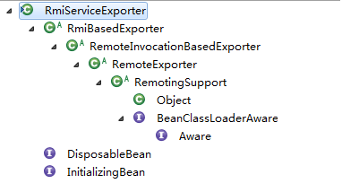
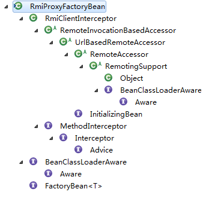
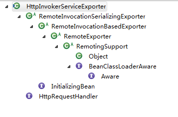
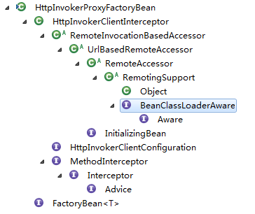

[[TOC]]

# 第十二章 远程服务

Java RMI （Java Remote Method Invcation）Java远程方法调用。

用于远程过程调用的应用程序编程接口。

在需要创建一个远程对象时，程序员通过传递一个接口来隐藏底层实现细节。客户端得到远程对象的**句柄**，正好与本地的根代码连接，后者负责通过网络通信。这样一来，程序员只需要通过直接的接口句柄发送消息。

# 12.1 spring RMI 

### 12.1.1 使用 实例

#### 12.1.1.1 手动实现

服务接口必须实现 `Remote` 并且方法 必须抛出 `RemoteException`

```java
public interface NotUseSpringRmiInterface extends Remote {

	public String getName() throws RemoteException;
}
```

实现：

```java
public class NotUseSpringRMIImpl implements NotUseSpringRmiInterface {
	@Override
	public String getName() throws RemoteException {
		return "小张";
	}
}
```

开启服务：

```java
public class ServerMain {
	public static void main(String[] args) throws RemoteException {
		Remote rmot = UnicastRemoteObject.exportObject(new NotUseSpringRMIImpl(),0);
        // 设置端口号
		Registry registry = LocateRegistry.createRegistry(2004);
		 registry.rebind("userManager", rmot);
	}
}
```

客户端调用：

```java
Registry registry = LocateRegistry.getRegistry("localhost",2004);
		NotUseSpringRmiInterface va = (NotUseSpringRmiInterface)registry.lookup("userManager");
		System.out.println("不使用spring：" + va.getName());
```


#### 12.1.1.2 使用SpringRMI

**公共接口**：

```java
public interface MyRMIInterface {

	public String getName();
}
```

**服务端**：

```java
public class MyRMIInterImpl implements MyRMIInterface {
	@Override
	public String getName() {
		return "老王";
	}
}
```

```xml
	<!-- 服务端 -->
	<bean id="myRMIInterfaceImpl" class="SpringCode12RMI.SpringCode12RMI.use.MyRMIInterImpl"></bean>
	<!-- 开启服务端 -->
	<bean id="myRMI" class="org.springframework.remoting.rmi.RmiServiceExporter">
		<!-- 服务类  不能多个键值-->
		<property name="service" ref="myRMIInterfaceImpl"></property>
		<!-- 服务名 -->
		<property name="serviceName" value="testRmi"></property>
		<!-- 服务接口 -->
		<property name="serviceInterface" value="SpringCode12RMI.SpringCode12RMI.use.MyRMIInterface"></property>
		<!-- 服务端口 -->
		<property name="registryPort" value="1234"></property>
	</bean>
```

开启服务：

```java
	public static void main(String[] args) {
		ClassPathXmlApplicationContext context = 
				new ClassPathXmlApplicationContext("./SpringContext.xml");
	}
```

**客户端**：

```xml
	<!-- 客户端 -->
	<bean id="myClient" class="org.springframework.remoting.rmi.RmiProxyFactoryBean">
		<!-- 远程服务类接口 -->
		<property name="serviceUrl" value="RMI://192.168.0.200:1234"></property>
		<!-- 服务接口 -->
		<property name="serviceInterface" value="SpringCode12RMI.SpringCode12RMI.use.MyRMIInterface"></property>
	</bean>
```

调用服务：

```java
	public static void main(String[] args) {
		ClassPathXmlApplicationContext context = 
				new ClassPathXmlApplicationContext("SpringContext2.xml");
		MyRMIInterface a = context.getBean("myClient", MyRMIInterface.class);
		System.out.println(a.getName());
	}
```

spring 封装 rmi 实现非常简单，但是 如果原生使用Rmi 非常复杂！

### 12.1.2 服务端实现

在服务注册时，就只有两个类进行类注册。自己实现的 并没什么特殊功能。

所以特殊功能 基本 都是 **RmiServiceExporter**实现的。

Spring 的RMI 都是在Context中：

`org.springframework.remoting.rmi.RmiServiceExporter`类



其中：BeanClassLoaderAware DisposableBean InitializingBean这三个接口。什么作用？

`DisposableBean` 接口：保证实现该接口的实例在被销毁时，调用它的 destroy 方法。

`BeanClassLoaderAware` 接口：实例在初始化时，调用  setBeanClassLoader 方法。

`InitializingBean` 接口：实例初始时，调用 afterPropertiesSet 方法。

没有发现，该类的 带参数构造器。

所以 该类 在初始化时，就在这两个 方法 `afterPropertiesSet ` 和 `setBeanClassLoader `中。

```java
	// 所以 这里 就初始化的入口 
	// setBeanClassLoader并没做太多数据的初始化
	@Override
	public void afterPropertiesSet() throws RemoteException {
		prepare();
	}

```


```java
	public void prepare() throws RemoteException {
        // 检查 Service 属性是否存在。而且必须存在
		checkService();

		if (this.serviceName == null) {
			throw new IllegalArgumentException("Property 'serviceName' is required");
		}

		// clientSocketFactory 为 RMIServerSocketFactory这个类型时，转换为serverSocketFactory使用
		if (this.clientSocketFactory instanceof RMIServerSocketFactory) {
			this.serverSocketFactory = (RMIServerSocketFactory) this.clientSocketFactory;
		}
        /* clientSocketFactory 不为RMIServerSocketFactory 时 且没有配置 serverSocketFactory
        *  
        *  没有配置 clientSocketFactory 但又配置了 serverSocketFactory 时
        *
        *  就会出现该异常
        */
		if ((this.clientSocketFactory != null && this.serverSocketFactory == null) ||
				(this.clientSocketFactory == null && this.serverSocketFactory != null)) {
			throw new IllegalArgumentException(
					"Both RMIClientSocketFactory and RMIServerSocketFactory or none required");
		}

		// 注册表 registry，逻辑与上面 类似，
		if (this.registryClientSocketFactory instanceof RMIServerSocketFactory) {
			this.registryServerSocketFactory = (RMIServerSocketFactory) this.registryClientSocketFactory;
		}
		if (this.registryClientSocketFactory == null && this.registryServerSocketFactory != null) {
			throw new IllegalArgumentException(
					"RMIServerSocketFactory without RMIClientSocketFactory for registry not supported");
		}

		this.createdRegistry = false;

		// 确定 RMI 注册表 来使用
		if (this.registry == null) {
            // 获取 Registry 12.1.3.1
			this.registry = getRegistry(this.registryHost, this.registryPort,
				this.registryClientSocketFactory, this.registryServerSocketFactory);
			this.createdRegistry = true;
		}

		// 初始化 缓存 导出的Object 
        // 12.1.3.2
		this.exportedObject = getObjectToExport();

		if (logger.isInfoEnabled()) {
			logger.info("Binding service '" + this.serviceName + "' to RMI registry: " + this.registry);
		}

		// Export RMI object.
		if (this.clientSocketFactory != null) {
            // 使用 给定的套接字工厂 指定的传送方式导出远程对象，以便能够接受传人的调用
            // clientSocketFactory:进行远程对象调用的客户端套接字工厂
            // serverSocketFactory：接收远程调用的服务端套接字工厂
			UnicastRemoteObject.exportObject(
					this.exportedObject, this.servicePort, this.clientSocketFactory, this.serverSocketFactory);
		}
		else {
            // 导出 remote Object，以使它能接收特定端口调用
			UnicastRemoteObject.exportObject(this.exportedObject, this.servicePort);
		}

		// Bind RMI object to registry.
		try {
			if (this.replaceExistingBinding) {
				this.registry.rebind(this.serviceName, this.exportedObject);
			}
			else {
                // 绑定服务名称到 remote Object。外界调用serverName的时候 会被 exportedObject接收
				this.registry.bind(this.serviceName, this.exportedObject);
			}
		}
		catch (AlreadyBoundException ex) {
			// Already an RMI object bound for the specified service name...
			unexportObjectSilently();
			throw new IllegalStateException(
					"Already an RMI object bound for name '"  + this.serviceName + "': " + ex.toString());
		}
		catch (RemoteException ex) {
			// Registry binding failed: let's unexport the RMI object as well.
			unexportObjectSilently();
			throw ex;
		}
	}
```

梳理一下RMI流程：

（1）验证Service

判断 Service 属性是否存在。即 配置文件中 配置，目标接口的实现 `myRMIInterfaceImpl`。最终的 调用 还是 它。

（2）处理用户自定义的 `ScoketFactory`

一共四个 套接字工厂。

`registryClientSocketFactory` 与 `registryServerSocketFactory` 用于RMI 主机 与 RMI服务器间连接的创建。

> java.rmi.registryLocateRegistry 
>
> ```java
> public static Registry createRegistry(int port,
>                                       RMIClientSocketFactory csf,
>                                       RMIServerSocketFactory ssf)
>     throws RemoteException
> {
>     return new RegistryImpl(port, csf, ssf);
> }
> ```

RMI 主机 创建 Registry 时，就会使用`registryServerSocketFactory` ，RMI服务器 与 主机间通信 使用 `registryClientSocketFactory` 创建套接字。

`clientSocketFactory` 与 `serverSocketFactory` 用于 导出远程对象。serverSocketFactory 用于在服务端建立套接字 等待客户端连接。clientSocketFactory为 客户端 调用时 建立套接字发起连接。

（3）根据配置参数获取 Registry

（4）构造对外发布的实例

（5）发布实例

#### 12.1.2.1 获取Registry

RMI 获取 Registry 实例只需要  LocateRegistry.createRegistry(..) 就可以直接创建实例。

但是Spring 就没有如此，考虑了 RMI主机 与 RMI服务没有在同一电脑上时。 使用的 LocateRegistry.getRegistry(String host, int port,RMIClientSocketFactory csf)。

Spring RMI ：

```java
	protected Registry getRegistry(String registryHost, int registryPort,
			RMIClientSocketFactory clientSocketFactory, RMIServerSocketFactory serverSocketFactory)
			throws RemoteException {

		if (registryHost != null) {
			// 测试远程连接
			if (logger.isInfoEnabled()) {
				logger.info("Looking for RMI registry at port '" + registryPort + "' of host [" + registryHost + "]");
			}
            // 如果registryHost 不为空，即可以远程
			Registry reg = LocateRegistry.getRegistry(registryHost, registryPort, clientSocketFactory);
			testRegistry(reg);
			return reg;
		}

        // 从本地 创建 Registry
		else {
			return getRegistry(registryPort, clientSocketFactory, serverSocketFactory);
		}
	}
```

`awaysCreateRegistry` 参数： 为true 时，在获取`Registry`实例，首先建立对指定端口的连接，如果已经有，就直接使用，然则在创建。

```java
	protected Registry getRegistry(
			int registryPort, RMIClientSocketFactory clientSocketFactory, RMIServerSocketFactory serverSocketFactory)
			throws RemoteException {

        // 之前 也判断过了。clientSocketFactory 与 serverSocketFactory 同有同无。
		if (clientSocketFactory != null) {
            // 判断
			if (this.alwaysCreateRegistry) {
				logger.info("Creating new RMI registry");
                // 使用 clientSocketFactory 创建 Registry
				return LocateRegistry.createRegistry(registryPort, clientSocketFactory, serverSocketFactory);
			}
			if (logger.isInfoEnabled()) {
				logger.info("Looking for RMI registry at port '" + registryPort + "', using custom socket factory");
			}
			synchronized (LocateRegistry.class) {
				try {
					// 复用测试
					Registry reg = LocateRegistry.getRegistry(null, registryPort, clientSocketFactory);
					testRegistry(reg);
					return reg;
				}
				catch (RemoteException ex) {
					logger.debug("RMI registry access threw exception", ex);
					logger.info("Could not detect RMI registry - creating new one");
					// Assume no registry found -> create new one.
					return LocateRegistry.createRegistry(registryPort, clientSocketFactory, serverSocketFactory);
				}
			}
		}

		else {
			return getRegistry(registryPort);
		}
	}
```

如果创建 Registry 实例，不需要使用自定义的套接字工厂（即 配置的套接字工厂为空时）。就直接使用

```java
	protected Registry getRegistry(int registryPort) throws RemoteException {
		if (this.alwaysCreateRegistry) {
			logger.info("Creating new RMI registry");
			return LocateRegistry.createRegistry(registryPort);
		}
		if (logger.isInfoEnabled()) {
			logger.info("Looking for RMI registry at port '" + registryPort + "'");
		}
		synchronized (LocateRegistry.class) {
			try {
				// 查看 对应端口的 Registry 是否创建
				Registry reg = LocateRegistry.getRegistry(registryPort);
                // 测试是否可用 不能 抛出异常
				testRegistry(reg);
				return reg;
			}
			catch (RemoteException ex) {
				logger.debug("RMI registry access threw exception", ex);
				logger.info("Could not detect RMI registry - creating new one");
				// 根据端口创建 Registry
				return LocateRegistry.createRegistry(registryPort);
			}
		}
	}
```

#### 12.1.2.2 初始化要导出的实例对象

请求导入远程对象的处理类中。处理类创建。

父类中：getObjectToExport();

```java
	protected Remote getObjectToExport() {
		// 如果配置的service 为 Remote 并且 没有配置 serviceInterface属性
		if (getService() instanceof Remote &&
				(getServiceInterface() == null || Remote.class.isAssignableFrom(getServiceInterface()))) {
			// conventional RMI service
			return (Remote) getService();
		}
		else {
			// RMI invoker
			if (logger.isDebugEnabled()) {
				logger.debug("RMI service [" + getService() + "] is an RMI invoker");
			}
            // 对 service 封装
			return new RmiInvocationWrapper(getProxyForService(), this);
		}
	}
```

`getProxyForService()` 获取 代理 的服务

```java
	protected Object getProxyForService() {
		checkService();
		checkServiceInterface();

        // 创建dialing工厂
		ProxyFactory proxyFactory = new ProxyFactory();
        // 添加代理接口
		proxyFactory.addInterface(getServiceInterface());

		if (this.registerTraceInterceptor != null ? this.registerTraceInterceptor : this.interceptors == null) {
            // 加入代理的横切面 RemoteInvocationTraceInterceptor
			proxyFactory.addAdvice(new RemoteInvocationTraceInterceptor(getExporterName()));
		}
        
		if (this.interceptors != null) {
			AdvisorAdapterRegistry adapterRegistry = GlobalAdvisorAdapterRegistry.getInstance();
			for (Object interceptor : this.interceptors) {
				proxyFactory.addAdvisor(adapterRegistry.wrap(interceptor));
			}
		}

        // 设置代理的 实例
		proxyFactory.setTarget(getService());
		proxyFactory.setOpaque(true);

        // 创建代理 对象
		return proxyFactory.getProxy(getBeanClassLoader());
	}
```

#### 12.1.2.3 RMI 服务激活调用

在初始化时 ： `this.registry.rebind(this.serviceName, this.exportedObject);` 做了 将服务名（serviceName） 与 实例对象的绑定。而 `exportedObject` 是 `RMIInvocationWrapper` 进行封装后的。继而 客户端 通过 服务名 调用 RMI 服务时，就是执行的 `RMIInvocationWrapper` 的 invoke 方法：

```java
	public Object invoke(RemoteInvocation invocation)
		throws RemoteException, NoSuchMethodException, IllegalAccessException, InvocationTargetException {

        // this.wrappedObject 就是 封装的 代理类实例
		return this.rmiExporter.invoke(invocation, this.wrappedObject);
	}
```

```java
	protected Object invoke(RemoteInvocation invocation, Object targetObject)
			throws NoSuchMethodException, IllegalAccessException, InvocationTargetException {

		return super.invoke(invocation, targetObject);
	}
```

```java
	protected Object invoke(RemoteInvocation invocation, Object targetObject)
			throws NoSuchMethodException, IllegalAccessException, InvocationTargetException {

		if (logger.isTraceEnabled()) {
			logger.trace("Executing " + invocation);
		}
		try {
            // 这里跳转
			return getRemoteInvocationExecutor().invoke(invocation, targetObject);
		}
		catch (NoSuchMethodException ex) {
			if (logger.isDebugEnabled()) {
				logger.warn("Could not find target method for " + invocation, ex);
			}
			throw ex;
		}
		catch (IllegalAccessException ex) {
			if (logger.isDebugEnabled()) {
				logger.warn("Could not access target method for " + invocation, ex);
			}
			throw ex;
		}
		catch (InvocationTargetException ex) {
			if (logger.isDebugEnabled()) {
				logger.debug("Target method failed for " + invocation, ex.getTargetException());
			}
			throw ex;
		}
	}
```

```java
	public Object invoke(RemoteInvocation invocation, Object targetObject)
			throws NoSuchMethodException, IllegalAccessException, InvocationTargetException{

		Assert.notNull(invocation, "RemoteInvocation must not be null");
		Assert.notNull(targetObject, "Target object must not be null");
        // 通过反射 执行方法
		return invocation.invoke(targetObject);
	}
```

### 12.1.3 客户端的实现

还是通过注册文件 ： `org.springframework.remoting.rmi.RmiProxyFactoryBean`

继承树结构:



和服务端类似：同理初始化 也就是 `InitializingBean`接口。

```java
	public void afterPropertiesSet() {
		super.afterPropertiesSet();
		if (getServiceInterface() == null) {
			throw new IllegalArgumentException("Property 'serviceInterface' is required");
		}
        // 根据设置的接口 创建代理，使用当前类作为增强器
        // RmiProxyFactoryBean又是实现类 FactoryBean接口的 getObjcet() 返回这个代理
		this.serviceProxy = new ProxyFactory(getServiceInterface(), this).getProxy(getBeanClassLoader());
	}
```

从父类中 ，afterPropertiesSet 只是 对URL 路径进行的判断，真正做事的 是：prepare();

#### 12.1.3.1 通过代理拦截 并 获取 stub（存根）

```java
	public void prepare() throws RemoteLookupFailureException {
		// Cache RMI stub on initialization?
        // 寻找 stub
		if (this.lookupStubOnStartup) {
			Remote remoteObj = lookupStub();
			if (logger.isDebugEnabled()) {
				if (remoteObj instanceof RmiInvocationHandler) {
					logger.debug("RMI stub [" + getServiceUrl() + "] is an RMI invoker");
				} else if (getServiceInterface() != null) {
					boolean isImpl = getServiceInterface().isInstance(remoteObj);
					logger.debug("Using service interface [" + getServiceInterface().getName() +
						"] for RMI stub [" + getServiceUrl() + "] - " +
						(!isImpl ? "not " : "") + "directly implemented");
				}
			}
			if (this.cacheStub) {
                // 将获取的 stub 缓存
				this.cachedStub = remoteObj;
			}
		}
	}
```

如果 配置的 `lookupStubOnStartup` 为 true，就会执行缓存。默认 true

获取stub的方式：

（1）使用 自定义的套接字工厂。在 构造`Registry` 实例时将自己创建的套接字工厂传人，使用 Registry 的lookup获取。

（2）直接使用RMI提供的标注方法 ： `Naming.lookup(getServiceUrl())`

```Java
public static Remote lookup(String name) throws NotBoundException,java.net.MalformedURLException,RemoteException{
        ParsedNamingURL parsed = parseURL(name);
        Registry registry = getRegistry(parsed);

        if (parsed.name == null)
            return registry;
        return registry.lookup(parsed.name);
    }
```

继续跟着代码（获取 stub）

```java
	protected Remote lookupStub() throws RemoteLookupFailureException {
		try {
			Remote stub = null;
            // 自定义 套接字工厂 
			if (this.registryClientSocketFactory != null) {
				URL url = new URL(null, getServiceUrl(), new DummyURLStreamHandler());
				String protocol = url.getProtocol();
                // 验证传输协议
				if (protocol != null && !"rmi".equals(protocol)) {
					throw new MalformedURLException("Invalid URL scheme '" + protocol + "'");
				}
                // 地址
				String host = url.getHost();
                // 端口
				int port = url.getPort();
                // 服务名
				String name = url.getPath();
				if (name != null && name.startsWith("/")) {
					name = name.substring(1);
				}
				Registry registry = LocateRegistry.getRegistry(host, port, this.registryClientSocketFactory);
				stub = registry.lookup(name);
			}
            // RMI 标准
			else {
				stub = Naming.lookup(getServiceUrl());
			}
			if (logger.isDebugEnabled()) {
				logger.debug("Located RMI stub with URL [" + getServiceUrl() + "]");
			}
			return stub;
		}
		catch (Exception ex) {
			
		}
	}
```

#### 12.1.3.2 增强器进行远程连接

`RmiProxyFactoryBean`本身 实现了`MethodInterceptor`（方法拦截器），作为 执行时增强。执行 invoke 方法。

```java
	public Object invoke(MethodInvocation invocation) throws Throwable {
        // 获取服务器中的 Remote对象，序列化传输
		Remote stub = getStub();
		try {
            //执行
			return doInvoke(invocation, stub);
		}
		catch (RemoteConnectFailureException ex) {
			return handleRemoteConnectFailure(invocation, ex);
		}
		catch (RemoteException ex) {
			if (isConnectFailure(ex)) {
				return handleRemoteConnectFailure(invocation, ex);
			}
			else {
				throw ex;
			}
		}
	}
```

```java
	protected Remote getStub() throws RemoteLookupFailureException {
		if (!this.cacheStub || (this.lookupStubOnStartup && !this.refreshStubOnConnectFailure)) {
            // 如果有缓存 直接使用
			return (this.cachedStub != null ? this.cachedStub : lookupStub());
		}
		else {
			synchronized (this.stubMonitor) {
				if (this.cachedStub == null) {
					this.cachedStub = lookupStub();
				}
				return this.cachedStub;
			}
		}
	}
```


```java
	protected Object doInvoke(MethodInvocation invocation, Remote stub) throws Throwable {
		
        if (stub instanceof RmiInvocationHandler) {
			try {
                // 是 直接从服务器传回。
				return doInvoke(invocation, (RmiInvocationHandler) stub);
			}
			catch (RemoteException ex) {
				throw RmiClientInterceptorUtils.convertRmiAccessException(
					invocation.getMethod(), ex, isConnectFailure(ex), getServiceUrl());
			}
			catch (InvocationTargetException ex) {
				Throwable exToThrow = ex.getTargetException();
				RemoteInvocationUtils.fillInClientStackTraceIfPossible(exToThrow);
				throw exToThrow;
			}
			catch (Throwable ex) {
				throw new RemoteInvocationFailureException("Invocation of method [" + invocation.getMethod() +
						"] failed in RMI service [" + getServiceUrl() + "]", ex);
			}
		}
        
		else {
			// 不是 通过反射方法 继续激活
			try {
				return RmiClientInterceptorUtils.invokeRemoteMethod(invocation, stub);
			}
			catch (InvocationTargetException ex) {
				Throwable targetEx = ex.getTargetException();
				if (targetEx instanceof RemoteException) {
					RemoteException rex = (RemoteException) targetEx;
					throw RmiClientInterceptorUtils.convertRmiAccessException(
							invocation.getMethod(), rex, isConnectFailure(rex), getServiceUrl());
				}
				else {
					throw targetEx;
				}
			}
		}
	}
```

## 12.2 HttpInvoker (调用 Http 程序)

即：使用web项目，提供服务接口

### 12.2.1 示例

**公共接口** (需要单独 发布到 web容器的 lib文件夹内)

```java
public interface MyRMIInterface {

	public String getName();
}

```

**服务端**

```java
public class MyRMIInterImpl implements MyRMIInterface {
	@Override
	public String getName() {
		return "老王";
	}
}
```

**服务注册** 一、使用 DispatchServlet

```xml
<!-- dispatcher-servlet.xml -->
<bean name="imp1" class="spring.demo12.MyRMIInterImpl"></bean>
<bean name="/service" class="org.springframework.remoting.httpinvoker.HttpInvokerServiceExporter">
	    <property name="service" ref="imp1"></property>
	    <property name="serviceInterface" value="spring.demo.inter.MyRMIInterface"></property>
</bean>
<!-- web.xml -->
<!-- 配置上下文载入器 -->
<!-- 功能是载入 除 dispatcherServlet载入的配置文件外的 配置文件 -->
<listener>
		<listener-class>org.springframework.web.context.ContextLoaderListener</listener-class>
</listener>
	<servlet>
		<servlet-name>remoting</servlet-name>
		<servlet-class>org.springframework.web.servlet.DispatcherServlet</servlet-class>
		<init-param>
			<param-name>contextConfigLocation</param-name>
			<param-value>classpath:dispatcher-servlet.xml</param-value>
		</init-param>
		<load-on-startup>1</load-on-startup>
</servlet>

<servlet-mapping>
	<servlet-name>exporter</servlet-name>
	<url-pattern>/rmi/interf</url-pattern>
</servlet-mapping>
```

**服务注册** 二、使用 HttpRequestHandlerServlet

```xml
<!-- applicationContext-server.xml -->		
<bean name="imp" class="spring.demo12.MyRMIInterImpl"></bean>
<bean name="exporter"
      class="org.springframework.remoting.httpinvoker.HttpInvokerServiceExporter">
	    <property name="service" ref="imp"></property>
	    <property name="serviceInterface" value="spring.demo.inter.MyRMIInterface"></property>
</bean>

<!-- web.xml -->	
	<!-- 开启除了web层组件的另外一个容器，spring业务层容器 -->
	<context-param>
		<param-name>contextConfigLocation</param-name>
		<param-value>classpath:applicationContext-server.xml</param-value>
	</context-param>
	<servlet>
		<servlet-name>exporter</servlet-name>
		<servlet-class>org.springframework.web.context.support.HttpRequestHandlerServlet</servlet-class>
	</servlet>	

	<servlet-mapping>
		<servlet-name>remoting</servlet-name>
		<url-pattern>/remoting/*</url-pattern>
	</servlet-mapping>
```

**客户端**

```xml
	<bean id="remoteClient"
	      class="org.springframework.remoting.httpinvoker.HttpInvokerProxyFactoryBean">
	    <!-- <property name="serviceUrl" value="http://localhost:8080/SpringCode12HttpInvocker/remoting/service"></property> -->
	    <property name="serviceUrl" value="http://localhost:8080/SpringCode12HttpInvocker/rmi/interf"></property>
	    <property name="serviceInterface" value="spring.demo.inter.MyRMIInterface"></property>
	</bean>
```

```java
	public static void main(String[] args) {
		ClassPathXmlApplicationContext context = new ClassPathXmlApplicationContext("SpringContext3.xml");
		Object o = context.getBean("remoteClient");
		MyRMIInterface imp = (MyRMIInterface) o;
		System.out.println(imp.getName());
	}
```

### 12.2.2 服务端实现

服务开启：



又看见 `InitializingBean` 接口。与 `HttpRequestHandler` 接口。

bean初始化时，调用 `afterPropertiesSet`方法。

当有对应请求时，web服务将引导至HttpRequestHandler的`handleRequest`方法。

#### 12.2.2.1 创建代理

```java
	public void afterPropertiesSet() {
		prepare();
	}
	public void prepare() {
		this.proxy = getProxyForService();
	}
```

和 RMI 的服务开启类似 12.1.2.2 

```java
	protected Object getProxyForService() {
        // 验证 service serviceInterface
		checkService();
		checkServiceInterface();

        // 创建 服务接口代理类
		ProxyFactory proxyFactory = new ProxyFactory();
		proxyFactory.addInterface(getServiceInterface());

		if (this.registerTraceInterceptor != null ? this.registerTraceInterceptor : this.interceptors == null) {
			proxyFactory.addAdvice(new RemoteInvocationTraceInterceptor(getExporterName()));
		}
		if (this.interceptors != null) {
			AdvisorAdapterRegistry adapterRegistry = GlobalAdvisorAdapterRegistry.getInstance();
			for (Object interceptor : this.interceptors) {
				proxyFactory.addAdvisor(adapterRegistry.wrap(interceptor));
			}
		}

        // 设置要代理的目标类
		proxyFactory.setTarget(getService());
		proxyFactory.setOpaque(true);

		return proxyFactory.getProxy(getBeanClassLoader());
	}
```

#### 12.2.2.2 处理Request 

```java
	public void handleRequest(HttpServletRequest request, HttpServletResponse response)
			throws ServletException, IOException {

		try {
            // 从Request中 读取 序列化对象
			RemoteInvocation invocation = readRemoteInvocation(request);
            // 执行调用
			RemoteInvocationResult result = invokeAndCreateResult(invocation, getProxy());
            // 将结果 序列化 写入 对应的输出流 中
			writeRemoteInvocationResult(request, response, result);
		}
		catch (ClassNotFoundException ex) {
			throw new NestedServletException("Class not found during deserialization", ex);
		}
	}
```

### 12.2.3 客户端实现

`org.springframework.remoting.httpinvoker.HttpInvokerProxyFactoryBean`



实现也与RMI 实现类似。

```java
	public void afterPropertiesSet() {
		super.afterPropertiesSet();
		if (getServiceInterface() == null) {
			throw new IllegalArgumentException("Property 'serviceInterface' is required");
		}
		this.serviceProxy = new ProxyFactory(getServiceInterface(), this).getProxy(getBeanClassLoader());
	}
// 父类
	public void afterPropertiesSet() {
        // 只是判断 URL
		super.afterPropertiesSet();

		// Eagerly initialize the default HttpInvokerRequestExecutor, if needed.
		getHttpInvokerRequestExecutor();
	}

	public HttpInvokerRequestExecutor getHttpInvokerRequestExecutor() {
		if (this.httpInvokerRequestExecutor == null) {
			SimpleHttpInvokerRequestExecutor executor = new SimpleHttpInvokerRequestExecutor();
			executor.setBeanClassLoader(getBeanClassLoader());
			this.httpInvokerRequestExecutor = executor;
		}
		return this.httpInvokerRequestExecutor;
	}
```

方法增强`MethodInterceptor`方法拦截器实现的Invoker：

```java
	public Object invoke(MethodInvocation methodInvocation) throws Throwable {
		if (AopUtils.isToStringMethod(methodInvocation.getMethod())) {
			return "HTTP invoker proxy for service URL [" + getServiceUrl() + "]";
		}

        // 将调用的方法  封装
		RemoteInvocation invocation = createRemoteInvocation(methodInvocation);
		RemoteInvocationResult result;

		try {
            // 远程执行方法
			result = executeRequest(invocation, methodInvocation);
		}
		catch (Throwable ex) {
			RemoteAccessException rae = convertHttpInvokerAccessException(ex);
			throw (rae != null ? rae : ex);
		}

		try {
            // 提取结果
			return recreateRemoteInvocationResult(result);
		}
		catch (Throwable ex) {
			if (result.hasInvocationTargetException()) {
				throw ex;
			}
			else {
				throw new RemoteInvocationFailureException("Invocation of method [" + methodInvocation.getMethod() +
						"] failed in HTTP invoker remote service at [" + getServiceUrl() + "]", ex);
			}
		}
	}
```

```java
	protected RemoteInvocationResult executeRequest(
			RemoteInvocation invocation, MethodInvocation originalInvocation) throws Exception {

		return executeRequest(invocation);
	}

	protected RemoteInvocationResult executeRequest(RemoteInvocation invocation) throws Exception {
		return getHttpInvokerRequestExecutor().executeRequest(this, invocation);
	}
	public final RemoteInvocationResult executeRequest(
			HttpInvokerClientConfiguration config, RemoteInvocation invocation) throws Exception {

		ByteArrayOutputStream baos = getByteArrayOutputStream(invocation);
		if (logger.isDebugEnabled()) {
			logger.debug("Sending HTTP invoker request for service at [" + config.getServiceUrl() +
					"], with size " + baos.size());
		}
		return doExecuteRequest(config, baos);
	}
```

```java
	protected RemoteInvocationResult doExecuteRequest(
			HttpInvokerClientConfiguration config, ByteArrayOutputStream baos)
			throws IOException, ClassNotFoundException {

        // 创建 httpPost
		HttpPost postMethod = createHttpPost(config);
        // 设置方法到输入流中
		setRequestBody(config, postMethod, baos);
		try {
            // 执行方法并等待放回结果
			HttpResponse response = executeHttpPost(config, getHttpClient(), postMethod);
            // 验证
			validateResponse(config, response);
            // 提取返回的 输出流
			InputStream responseBody = getResponseBody(config, response);
            // 提取结果
			return readRemoteInvocationResult(responseBody, config.getCodebaseUrl());
		}
		finally {
			postMethod.releaseConnection();
		}
	}
```

