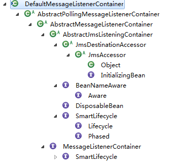

[[TOC]]

# 第十三章 Spring 消息

使用实例消息中间间为 `ActiveMQ`

activemq.xml 中可以看到 几个 关键的 端口：61616  

```xml
        <transportConnectors>
            <!-- DOS protection, limit concurrent connections to 1000 and frame size to 100MB -->
            <transportConnector name="openwire" uri="tcp://0.0.0.0:61616?maximumConnections=1000&amp;wireFormat.maxFrameSize=104857600"/>
            <transportConnector name="amqp" uri="amqp://0.0.0.0:5672?maximumConnections=1000&amp;wireFormat.maxFrameSize=104857600"/>
            <transportConnector name="stomp" uri="stomp://0.0.0.0:61613?maximumConnections=1000&amp;wireFormat.maxFrameSize=104857600"/>
            <transportConnector name="mqtt" uri="mqtt://0.0.0.0:1883?maximumConnections=1000&amp;wireFormat.maxFrameSize=104857600"/>
            <transportConnector name="ws" uri="ws://0.0.0.0:61614?maximumConnections=1000&amp;wireFormat.maxFrameSize=104857600"/>
        </transportConnectors>
```

以及 jetty.xml 中： 8161 (查看消息中间件 后台数据)

```xml
 <bean id="jettyPort" class="org.apache.activemq.web.WebConsolePort" init-method="start">
             <!-- the default port number for the web console -->
        <property name="host" value="0.0.0.0"/>
        <property name="port" value="8161"/>
    </bean>
```

## 13.1 JMS 独立使用

消息生产（Producer）端：

```java
public class MessageProducerMain {
	public static void main(String[] args) throws JMSException, InterruptedException {
		ConnectionFactory connectionFactory = new ActiveMQConnectionFactory();
		// 创建连接
		Connection cont = connectionFactory.createConnection();
		Session session = cont.createSession(Boolean.TRUE, Session.AUTO_ACKNOWLEDGE);
		// 创建 一个 队列
		Queue queue = session.createQueue("notues_spring");
		// 创建生产者 consumers
		MessageProducer messPro = session.createProducer(queue);
		for (int i = 0; i < 3; i++) {
			TextMessage mess = session.createTextMessage("开始执行：" + i);
			Thread.sleep(100L);
			messPro.send(mess);
		}
		session.commit();
		session.close();
		cont.close();
	}
}
```

消息消费（consumers）端：

```java
public class MessageConsumersMain {
	public static void main(String[] args) throws JMSException {
		ConnectionFactory connectionFactory = new ActiveMQConnectionFactory();
		// 创建连接
		Connection cont = connectionFactory.createConnection();
		// 开始接收
		cont.start();
		Session session = cont.createSession(Boolean.TRUE, Session.AUTO_ACKNOWLEDGE);
		// 创建 一个 队列
		Queue queue = session.createQueue("notues_spring");
		// 创建生产者 consumers
		MessageConsumer messCon = session.createConsumer(queue);
		
		while (true) {
			TextMessage mess = (TextMessage) messCon.receive();
			// 如果 这时 中间键 没有队列时  这里就会等待
			if (mess == null)
				break;
			session.commit();
			String text = mess.getText();
			if (text == null || "".equals(text))
				break;
			System.out.println(text);
			
		}
		session.close();
		cont.close();
	}
}
```

## 13.2 spring中使用

```xml
	<!-- 注册工厂 -->
	<bean id="connectionFactory"
		class="org.apache.activemq.ActiveMQConnectionFactory">
		<property name="brokerURL">
			<value>tcp://192.168.0.200:61616</value>
		</property>
	</bean>

	<!-- 开启服务端 -->
	<bean id="jmsTemplate"
		class="org.springframework.jms.core.JmsTemplate">
		<property name="connectionFactory">
			<ref bean="connectionFactory" />
		</property>
	</bean>
	<!-- 配置队列 -->
	<bean id="destination"
		class="org.apache.activemq.command.ActiveMQQueue">
		<constructor-arg index="0">
			<value>ues_spring</value>
		</constructor-arg>
	</bean>
```

服务端：

```java
public class Sender {
	public static void main(String[] args) {
		ApplicationContext context = new ClassPathXmlApplicationContext("SpringContext.xml");
		JmsTemplate jmst = (JmsTemplate) context.getBean("jmsTemplate");
		Destination destination = (Destination) context.getBean("destination");
		jmst.send(destination,new MessageCreator() {
			
			@Override
			public Message createMessage(Session session) throws JMSException {
				return session.createTextMessage("Spring发送消息");
			}
		});
	}
}
```

消费端：

```java
public class ProducerMain {
	public static void main(String[] args) throws JMSException {
		ApplicationContext context = new ClassPathXmlApplicationContext("SpringContext.xml");
		JmsTemplate jmst = (JmsTemplate) context.getBean("jmsTemplate");
		Destination destination = (Destination) context.getBean("destination");
		TextMessage mess = (TextMessage) jmst.receive(destination);
		System.out.println(mess.getText());
	}
}
```

配置 消息监听：

只要 有消息，就会触发消息监听器

```java
@Component("myPushListener")
public class MyMessageListener implements MessageListener {
	@Override
	public void onMessage(Message arg0) {
		if (arg0 instanceof TextMessage) {
			try {
				System.out.println(((TextMessage)arg0).getText());
			} catch (JMSException e) {
				e.printStackTrace();
			}
		}
	}
}
```

配置中注册：

```xml
	    <!-- 接受推送 -->  
    <bean id="myPushListenerConsumer"  
          class="org.springframework.jms.listener.DefaultMessageListenerContainer">  
        <property name="connectionFactory" ref="connectionFactory" />  
        <property name="destination" ref="destination" />  
        <property name="messageListener" ref="myPushListener" />  
    </bean> 
```

## 13.3 源码分析

大致逻辑 基本都时 将 繁琐的步骤封装。

唯一可以看下 消息监听器。

### 消息监听器

（1）SimpleMessageListenerContainer ：最简单的 消息监听容器，只能处理固定的 JMS会话

（2）DefaultMessageListenerContainer： 是上一个的升级版，添加类 对事务的支持。

（3）ServerSessionMessageListenerContainer：支持事务 支持 动态JMS 会话。（但是为没有找到这个类）

还是看  `DefaultMessageListenerContainer` 类。

[]()

又看到 `InitializingBean`。

```java
public void afterPropertiesSet(){
    // 验证
    super.afterPropertiesSet();
    // 验证配置文件
    validateConfiguration();
    // 初始化
    initialize();
}
```


