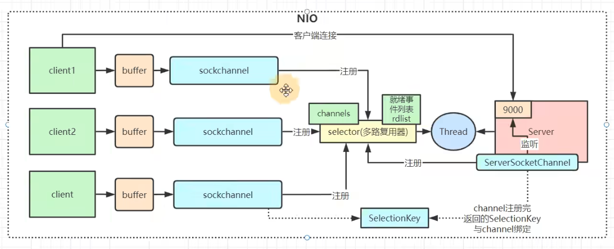
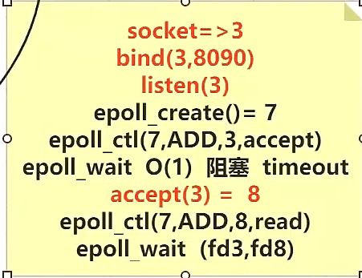
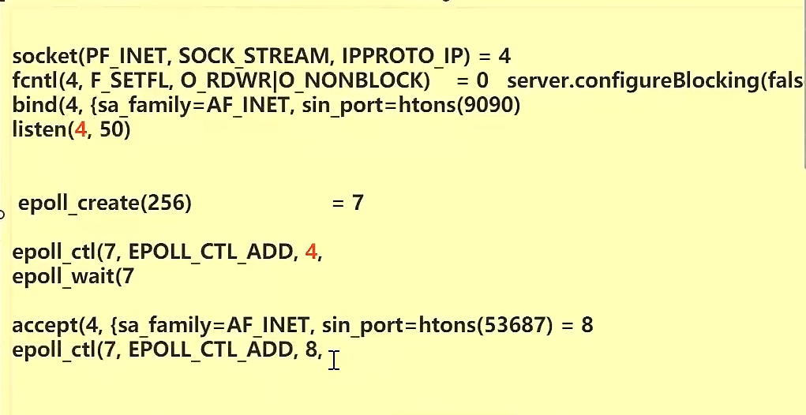
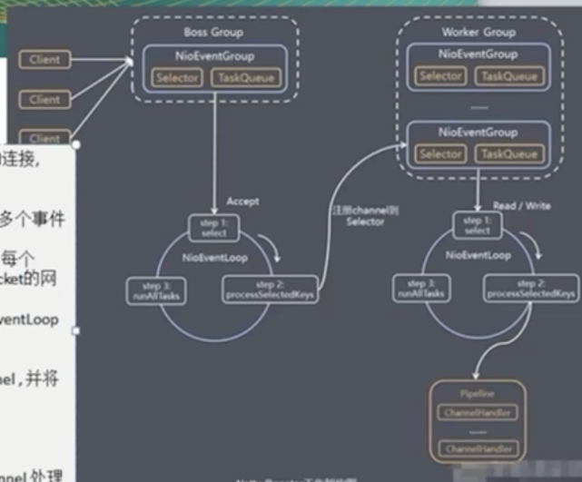

### 同步IO模型

如果程序自己读取IO，那么这个IO模型，无论是 BIO NIO 多路复用器，都是同步IO模型

Windows：IOCP 内核有线程，拷贝数据到程序的内存空间 异步IO模型

### BIO

```java
/**
 * @author GL
 * @version 1.0.0
 * @Description: 基于BIO的每个线程一个链接: 优势：可以接受很多链接 劣势：线程内存浪费、CPU调度消耗 根源：Blocking 两个阻塞，
 * 所以旧有了解决方案 NONBlocking , 即NIO 非阻塞
 * @ClassName SocketBIO.java
 * @createTime 2022年06月12日 00:46:00
 */
public class SocketBIO {

    public static void main(String[] args) throws IOException {
        // Socket bind listen
        ServerSocket serverSocket = new ServerSocket(8090);
        System.out.println("创建Socket服务");
        while (true) {
            System.out.println("阻塞====等待请求服务");
            Socket client = serverSocket.accept();
            System.out.println("请求端口号 = " + client.getPort());

            new Thread(new Runnable() {
                Socket ss;

                public Runnable setSs(Socket ss) {
                    this.ss = ss;
                    return this;
                }

                @Override
                public void run() {
                    try {
                        System.out.println("阻塞====开启处理请求的线程，等待数据，所以开启线程");
                        InputStream inputStream = ss.getInputStream();
                        BufferedReader reader = new BufferedReader(new InputStreamReader(inputStream));
                        while (true) {
                            System.out.println("客户端的数据 = " + reader.readLine());
                        }
                    } catch (IOException e) {
                        throw new RuntimeException(e);
                    }
                }
            }.setSs(client)).start();
        }
    }
}
```

### NIO

一个线程可以干所有工作

```java
/**
 * @author GL
 * @version 1.0.0
 * @Description: NIO : Java new IO 以及 内核中的 NonBlocking。Java NIO有三大组成部分：Buffer；Channel；Selector。
 * 优势：规避了多线程的问题 C10K 弊端：请求数多，但是发送数据的请求少时，系统的全部IO中断，来获取这少数数据，就会消耗太多资源
 * @ClassName SocketNIO.java
 * @createTime 2022年06月12日 01:12:00
 */
public class SocketNIO {
    public static void main(String[] args) throws IOException, InterruptedException {
        LinkedList<SocketChannel> clients = new LinkedList<>();

        ServerSocketChannel ss = ServerSocketChannel.open();
        ss.bind(new InetSocketAddress(9090));
        // 系统 nonblocking
        ss.configureBlocking(false);

        while (true) {
            // 接受链接
            Thread.sleep(1_000);
            // BIO 中，accept 没有请求会被阻塞，NIO 中是不会阻塞，而是返回 -1
            SocketChannel client = ss.accept();

            if (Objects.isNull(client)) {

            } else {
                client.configureBlocking(false);
                System.out.println("NIO 中请求的端口 = " + client.socket().getPort());
                clients.add(client);
            }
            // 可以在 堆外，堆内
            ByteBuffer bf = ByteBuffer.allocateDirect(4096);

            // 这里串行，可多线程处理， 这里就需要 多路复用
            for (SocketChannel channel : clients) {
                // 会调用系统recv
                int read = channel.read(bf);
                if (read > 0) {
                    bf.flip();
                    byte[] bytes = new byte[bf.limit()];
                    String s = new String(bytes);
                    System.out.println(s);
                    bf.clear();
                }
            }
        }
    }
}
```

### 多路复用器

一万个请求，统一打包给系统，得到那些请求是有数据返回的，然后再将返回请求去 系统调用 得到数据。



内核提供的多路复用器**selector poll opoll** 

select 有 1024 个限制， poll 是系统的上线，类似

优势： 通过一次系统调用 把，文件标识符传给内核，内核进行遍历，减少了 系统调用的次数

劣势：

1. 重复传递 **文件标识符** ，解决方案 内核开辟空间保留 文件标识符
2. 每次select poll 都要重新遍历 文件标识符 （计组）

https://www.jianshu.com/p/722819425dbd

#### epoll

```java
/**
 * @author GL
 * @version 1.0.0
 * @Description: NIO 多路复用器：
 * @ClassName SocketNIOepoll.java
 * @createTime 2022年06月12日 02:10:00
 */
public class SocketNIOepoll {
    private ServerSocketChannel ss;
    private Selector selector;
    public static void main(String[] args) throws IOException {
        new SocketNIOepoll().start();
    }

    public void init() throws IOException {
        ServerSocketChannel ss = ServerSocketChannel.open();
        // 系统 nonblocking
        ss.configureBlocking(false);
        ss.bind(new InetSocketAddress(9090));

        // select poll epoll 优先选择 opoll  可以 -D修改， select 在Java中开辟空间存储fd ID
        // 如果是在 Epoll模型下 open-> epoll_create -> fd3， 即 在内核中开辟一个空间
        selector = Selector.open();

        // select poll : JVM 中开辟一个数组 fd4 放入
        // opoll : epoll_ctl(fd3, ADD, fd4, EPOLLIN, 即放入 内核中的空间
        ss.register(selector, SelectionKey.OP_ACCEPT);
    }

    public void start() throws IOException {
        init();
        while (true) {
            Set<SelectionKey> keys = selector.keys();
            System.out.println("keys.size() = " + keys.size());

            // 调用多路复用器 select poll   or   epoll (epoll_wait)
            // select() :
            // select poll 是内核的 select(fd4) poll(fd4)
            // epoll 内核的 epoll_wait, 会阻塞
            // 参数时间，阻塞超时时间
            while (selector.select(500) > 0) {
                // 返回有状态的 fd 集合
                Set<SelectionKey> selectionKeys = selector.selectedKeys();

                // 返回有状态，还是需要一个一个处理 读写， NIO 是 所有无论有无状态的 都要去请求
                Iterator<SelectionKey> iterator = selectionKeys.iterator();

                while (iterator.hasNext()) {
                    SelectionKey next = iterator.next();
                    iterator.remove();
                    if (next.isAcceptable()) {
                        // 如果是新的 accept，即新的连接
                        // 返回了新的 fd
                        // select poll ，保存在 JVM 开辟的空间 FD4 listen 一起
                        // epoll epoll_ctl 把新的客户端fd注册到内和空间
                        ServerSocketChannel channel = (ServerSocketChannel) next.channel();
                        SocketChannel client = channel.accept();
                        client.configureBlocking(false);

                        ByteBuffer bf = ByteBuffer.allocateDirect(4096);
                        // 客户端注册， 同 服务端注册， 即 往客户端 写数据需要管理
                        // select poll : JVM 中开辟一个数组 fd7 放入
                        // opoll : epoll_ctl(fd3, ADD, fd7, EPOLLIN, 即放入 内核中的空间
                        client.register(selector, SelectionKey.OP_READ, bf);
                    }
                    else if (next.isReadable()) {
                        // 是以及建立连接的客户端

                    }
                }
            }
        }
    }
}
```





此时 7 空间中有 4（服务） 和 8（一个客户）

selector 是可以多个的，

第一个 selector  监听连接，得到连接客户端，然后继续监听连接

其他线程：获取连接客户端，注册到自己的 selector 中，进行处理 客户连接 的读写

`Selector.open()` 根据操作系统版本不同，实现不同，Linux 为 EPollSelectorImpl  从而创建了 `EPollArrayWrapper` 作为成员变量，即 在内核中 调用 EPOLL_CREATE ，开辟一个内存空间

`selector.select()` 调用底层 epoll_ctl  opoll_wait

## Netty

```java
public class SocketNetty {
    public static void main(String[] args) {
        // 做连接 接收
        NioEventLoopGroup boss = new NioEventLoopGroup(5);
        // 做读写
        NioEventLoopGroup worker = new NioEventLoopGroup(5);

        // 创建netty 对象
        ServerBootstrap boot = new ServerBootstrap();
        try {
            // 链式编程 绑定参数
            boot
                    // 设置两个线程组
                    .group(boss, worker)
                    // 使用 NioServerSocketChannel 作为服务器通道实现
                    .channel(NioServerSocketChannel.class)
                    //
                    .option(ChannelOption.TCP_NODELAY, false)
                    .childHandler(new ChannelInitializer() {

                        @Override
                        protected void initChannel(Channel channel) throws Exception {
                            ChannelPipeline pipeline = channel.pipeline();
                            pipeline.addLast(new MyInbound());
                        }
                    })
                    // 只监听一个端口号，boss 只会有一个线程 接收
                    .bind(9999)
                    // 阻塞当前线程到服务启动完成
                    .sync()
                    .channel()
                    .closeFuture()
                    // 阻塞当前线程到服务停止
                    .sync();
        } catch (InterruptedException e) {
            throw new RuntimeException(e);
        }
    }

    static class MyInbound extends ChannelInboundHandlerAdapter {

        @Override
        public void channelActive(ChannelHandlerContext ctx) throws Exception {
            System.out.println("客户端建立连接完成");
        }

        @Override
        public void channelRead(ChannelHandlerContext ctx, Object msg) throws Exception {
            ByteBuf byteBuf = (ByteBuf) msg;
            System.out.println("收到数据：" + byteBuf.toString(StandardCharsets.UTF_8));
        }
    }
}
```

### Reactor模型

+ NioEventLoopGroup 下包含多个NioEventLoop

+ 每个 NioEventLoop 包含一个 Selector，一个 TaskQueue

+ 每个 NioEventLoop 的 Selector上可以组测监听多个 NioChannel

+ 每个 NioChannel 只会绑定在唯一的 NioEventLoop 上

+ 每个 NioChannel 会绑定一个自己的 ChannelPipeLine

```java
    // Netty 的reactor
    protected void run() {
        int selectCnt = 0;
        for (;;) {
///////////////////////////////第一段////////////////////////////////////
            try {
                int strategy;
                try {
                    // 是否有任务？： selectNow() selector.selectNow()  : SelectStrategy.SELECT
                    strategy = selectStrategy.calculateStrategy(selectNowSupplier, hasTasks());
                    switch (strategy) {
                    case SelectStrategy.CONTINUE: // 指示应重试IO循环，不直接进行阻塞选择
                        continue;

                    case SelectStrategy.BUSY_WAIT: // 表示IO循环，以轮询新的事件而不阻塞
                        // fall-through to SELECT since the busy-wait is not supported with NIO
                        // 由于NIO不支持繁忙等待，所以切换到SELECT
                    case SelectStrategy.SELECT: // 指示后面应该有一个阻塞选择
                        // 下个计划任务的 纳秒时间
                        long curDeadlineNanos = nextScheduledTaskDeadlineNanos();
                        if (curDeadlineNanos == -1L) {
                            // 没有的话，一直
                            curDeadlineNanos = NONE; // nothing on the calendar
                        }
                        // CAS 操作设值等待时间
                        nextWakeupNanos.set(curDeadlineNanos);
                        try {
                            if (!hasTasks()) {
                                // 说明netty任务队列里面队列为空， 内部判断 有定时任务延迟时间还未到(大于0.5ms)
                                // 3.阻塞式select操作
                                strategy = select(curDeadlineNanos);
                            }
                        } finally {
                            // This update is just to help block unnecessary selector wakeups
                            // so use of lazySet is ok (no race condition)
                            nextWakeupNanos.lazySet(AWAKE);
                        }
                        // fall through
                    default:
                    }
                } catch (IOException e) {
                    // If we receive an IOException here its because the Selector is messed up. Let's rebuild
                    // the selector and retry. https://github.com/netty/netty/issues/8566
                    rebuildSelector0();
                    selectCnt = 0;
                    handleLoopException(e);
                    continue;
                }

///////////////////////////////第二段////////////////////////////////////

                selectCnt++;
                cancelledKeys = 0;
                needsToSelectAgain = false;
                final int ioRatio = this.ioRatio;
                boolean ranTasks;
                if (ioRatio == 100) {
                    try {
                        if (strategy > 0) {
                            // 处理产生网络IO事件的channel
                            processSelectedKeys();
                        }
                    } finally {
                        // Ensure we always run tasks.
                        ranTasks = runAllTasks();
                    }
                } else if (strategy > 0) {
                    final long ioStartTime = System.nanoTime();
                    try {
                        // 处理产生网络IO事件的channel
                        processSelectedKeys();
                    } finally {
                        // Ensure we always run tasks.
                        final long ioTime = System.nanoTime() - ioStartTime;
///////////////////////////////第三段////////////////////////////////////
                        // 处理任务队列
                        ranTasks = runAllTasks(ioTime * (100 - ioRatio) / ioRatio);
                    }
                } else {
                    ranTasks = runAllTasks(0); // This will run the minimum number of tasks
                }

                if (ranTasks || strategy > 0) {
                    if (selectCnt > MIN_PREMATURE_SELECTOR_RETURNS && logger.isDebugEnabled()) {
                        logger.debug("Selector.select() returned prematurely {} times in a row for Selector {}.", selectCnt - 1, selector);
                    }
                    selectCnt = 0;
                } else if (unexpectedSelectorWakeup(selectCnt)) { // Unexpected wakeup (unusual case)
                    selectCnt = 0;
                }
            } catch (CancelledKeyException e) {
                // Harmless exception - log anyway
                if (logger.isDebugEnabled()) {
                    logger.debug(CancelledKeyException.class.getSimpleName() + " raised by a Selector {} - JDK bug?", selector, e);
                }
            } catch (Throwable t) {
                handleLoopException(t);
            }
            // Always handle shutdown even if the loop processing threw an exception.
            // 即使一次循环处理引发异常，也要始终处理shutdown
            try {
                if (isShuttingDown()) {
                    closeAll();
                    if (confirmShutdown()) {
                        return;
                    }
                }
            } catch (Throwable t) {
                handleLoopException(t);
            }
        }
    }
```



#### 大致流程

1. 客户端请求到达 boss NioEventLoopGroup 的线程进行处理
   
   1. 轮询 accept 事件
   
   2. 处理 accept 事件，与 client 建立连接，生成 NioSocketChannel，将其注册到某个 work NioEventLoopGroup 下的 NioEventLoop selector 
   
   3. 处理队列任务的  runAllTasks

2. work NioEventLoopGroup处理
   
   1. 轮询 read write 事件
   
   2. 处理IO事件 即 NioSocketChannel
   
   3. 处理任务队列的任务

#### 具体分析reactor

[netty源码分析之揭开reactor线程的面纱（一） - 简书](https://www.jianshu.com/p/0d0eece6d467)

##### 一、轮询IO事件

轮询注册到reactor线程对用的selector上的所有的channel的IO事件

1. 创建 NioEventLoopGroup 对象，跳转父类 MultithreadEventExecutorGroup 构造器
2. MultithreadEventExecutorGroup ：默认 Executor ThreadPerTaskExecutor， DefaultThreadFactory ， 调用 NioEventLoopGroup#newChild 创建 EpollEventLoop
3. EpollEventLoop 跳转父类 SingleThreadEventExecutor 构造器，设值 Executor ThreadPerTaskExecutor，
4. 每次channel触发 doStartThread
5. SingleThreadEventExecutor#doStartThread 使用 ThreadPerTaskExecutor 异步线程调用 NioEventLoop#run NioEventLoop的run方法是reactor线程的主体，在第一次添加任务的时候被启动（即channl第一次绑定处理线程）
6. NioEventLoop#run 一直循环 selector.select() 阻塞等待 channel 

##### 二、处理IO事件

process selector key 处理产生网络IO事件的channel

1. netty 在获取 Selector 的 selectedKeys 时，反射 修改成了 SelectedSelectionKeySet 数组，并且修改了内存泄漏 
2. AbstractNioChannel#doRegister 在注册的时候，将自己 设值给了 SelectionKey 的 attachment 属性， 通过 unsafe 获取 AbstractNioByteChannel的实现，进行批判 读写， 执行注册的ChannelPipeline
3. 读写完成后判断，needsToSelectAgain ，每个 256 个channel从selector上移除的时候 会进行重新清理 获取SelectionKey

##### 三、执行runAllTask

任务队列中Task分为三种场景

1）用户程序自定义的普通任务 `ctx.channel().eventLoop().execute(....)` 最终 会被加载到 taskQueue.offer(task)，netty使用mpsc，方便的将外部线程的task聚集

2）非当前reactor线程调用channel的各种方法 `channel.write(...)`

3）用户自定义定时任务   `ctx.channel().eventLoop().schedule(....)` 最终 scheduledTaskQueue().add(task);

```java
    protected boolean runAllTasks(long timeoutNanos) {
        // 从scheduledTaskQueue转移定时任务到taskQueue(mpsc queue)
        fetchFromScheduledTaskQueue();
        Runnable task = pollTask();
        if (task == null) {
            afterRunningAllTasks();
            return false;
        }

        final long deadline = timeoutNanos > 0 ? ScheduledFutureTask.nanoTime() + timeoutNanos : 0;
        long runTasks = 0;
        long lastExecutionTime;
        // 循环执行任务
        for (;;) {
            safeExecute(task);

            runTasks ++;

            // Check timeout every 64 tasks because nanoTime() is relatively expensive.
            // XXX: Hard-coded value - will make it configurable if it is really a problem.
// 即每执行完64个任务之后，判断当前时间是否超过本次reactor任务循环的截止时间
            if ((runTasks & 0x3F) == 0) {
                lastExecutionTime = ScheduledFutureTask.nanoTime();
                if (lastExecutionTime >= deadline) {
                    break;
                }
            }

            task = pollTask();
            if (task == null) {
                lastExecutionTime = ScheduledFutureTask.nanoTime();
                break;
            }
        }
        // 收尾
        afterRunningAllTasks();
        this.lastExecutionTime = lastExecutionTime;
        return true;
    }
```