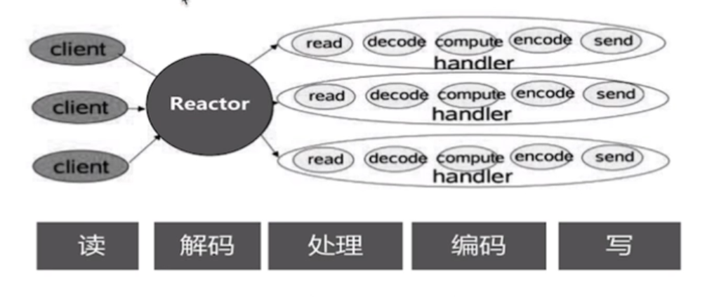
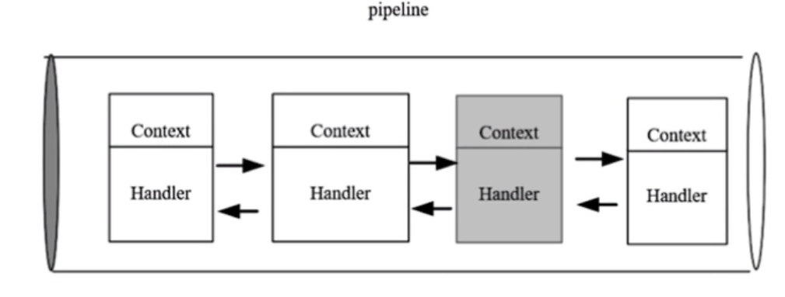
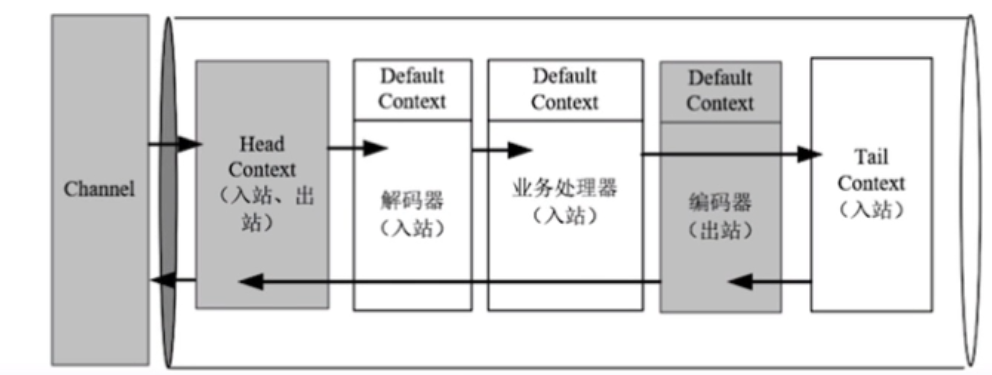
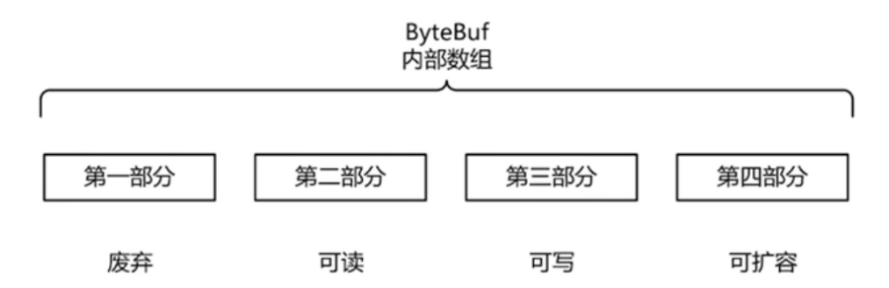
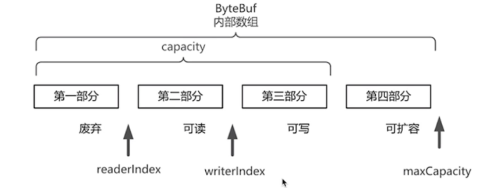
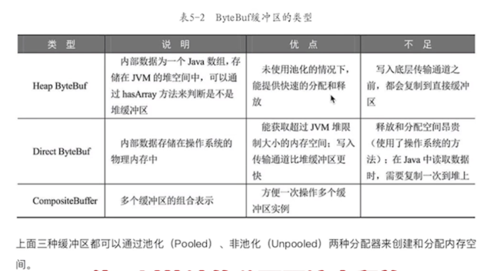
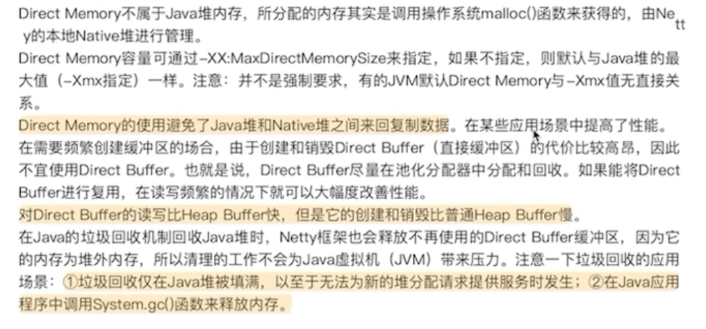
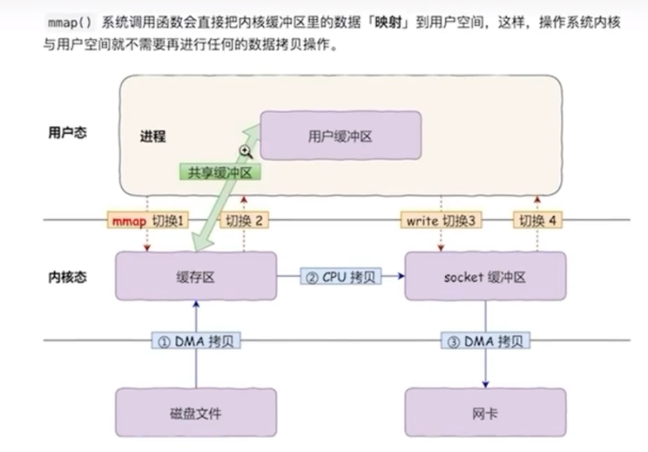
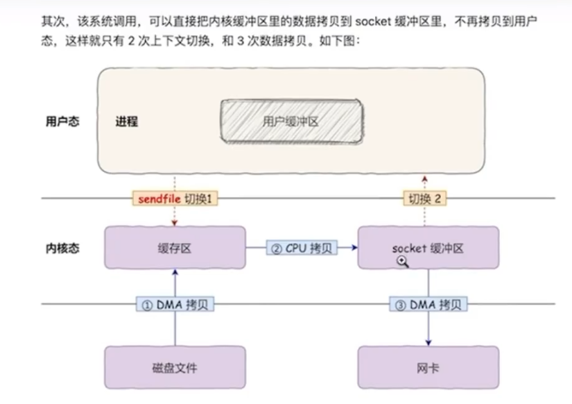

## Bootstrap 启动流程

+ 父类 AbstractBootstrap
  
  + ServerBootstrap server端
  
  + Bootstrap client端
1. 创建 boos（IO事件监听） worker（数据传输事件和处理） 事件轮询组，父子通道

2. 设置 通道 IO类型，NIO 以及 OIO

3. 设置监听端口 

4. 设置传输通道的配置参数 ChannelOption

5. 装配子通道的 Pipeline ，每个通过 channel 都有一条 channelPipeline ，内部为双向链表 的 ChannelHandler，父通道固定，子通道才需要配置

6. 开始绑定服务器连接的监听端口 bind().sync()  服务器启动完成

7. 自我阻塞，直到监听通道关闭

8. 关闭 轮询线程组

## Channel的作用

代变网络连接，负责同对端进行网络通信，既可以写入数据 也可以读数据

### Channel主要成员与方法

AbstractChannel

属性：

1. DefaultChannelPipeline pipeline 处理器线属性，一个channel 一条处理线

2. Channel parent 父通道属性，NioServerScoketChannel 父通道是 null

方法： 很多都是 交给 pipeline 处理的

1. ChannelFuture connect(SocketAddress remoteAddress) 连接远程服务，为客户端通道使用

2. ChannelFuture bind(SocketAddress localAddress) 绑定监听地址。在新建连接和接收通道是调用

3. ChannelFuture close() 关闭通道连接

4. Channel read() 读取数据

5. ChannelFuture write(Object msg) 出战的业务处理

### EmbeddedChannel 嵌入式通道

用于测试用的

## Handler负责功能

整个IO处理操作：从通道中获取数据包，数据包解码，业务处理，目标数据编码，写回通道

程序中Handler涉及  解码 处理 编码 回写

### ChannelInboundHandler 核心方法

入栈操作

### ChannelOutboundHanler 声明周期

主要将数据写回， 可以绑定 其他服务端，

## Pipeline

pipeline 的入站出战流程

正序 与 反序

### Channel Handler ChannelHandlerContext 关系

Handler 是无状态的，不保存 和 Channel相关的信息。Pipeline 是有状态的，保存了 Channel的关系。于是需要一个 将二者联系起来的角色，ChannelHandlerContext 通道处理器上下文

Handler 是以双向链表绑定的，但是 这里 链表链的并不是 Handler，而是 ChannelHandlerContext 的包装。

1. 获取上下文锁关联的Netty组件实例， 如 通道、关联的 流水线、上下文内部Handler

2. 出战入站的处理方法

Channel --> Pipeline -> ChannelHandlerContext(Handler) linked

一条流水线处理流程

### Pipeline 上下文 如何进行传播

HeadContext  TailContext

DefaultChannelPipeline#write 出战

DefaultChannelPipeline#fireChannelRead 入站

### 如何截断流水线的入站处理流程

入站可以 不调用 父类 supper.channelXxx  或者 不调用 ctx.fireChannelXxx

出战无法截断

### 热拔插 流水线上的Handler

主要是 ChannelPipeline 提供了 具体方法

## Unsafe

pipeline中的有关io的操作最终都是落地到unsafe

### Unsafe的分类

从以上继承结构来看，我们可以总结出两种类型的Unsafe分类，一个是与连接的字节数据读写相关的`NioByteUnsafe`，一个是与新连接建立操作相关的`NioMessageUnsafe`

## ByteBuf

### 优势

+ Pooling 池化

+ 减少内存复制和GC

+ 符合缓冲去类型 支持 零复制

+ 不需要调用 fip() 切换读写

+ 扩展性好

+ 可以自定义缓冲区类型

+ 读写索引分开

+ 方法链式调用，可以进行引用计数 方法重复使用

### 组成成分

内部是一个字节容器，内部是一个字节数组。逻辑上分为四个部分

可读：bytebuf 保存的有效数据，读取的就是这里面

可写：写入到bytebuf的数据 存放位置

### 哪些重要属性

读指针 写指针 最大容量，就是上边后三个的

readerIndex：读的初始位置，读一个字节 就会 +1 ，一直到 等于 writeIndex 就不可读了

writeIndex：写的 初始位置，写一个字节就会 +1 ，一直到 capacity（） 相等 就不可写

### 哪些方法

读写

### 引用计数器规则

JVM中使用计数器 来标记对象是否可达 而进行回收，Netty使用这个手段对 ByteBuf 进行引用计数，来追踪 ByteBuf的内存回收管理的。

主要是对 pooled（池化） 缓冲区进行管理。创建一个缓冲区对象池，将没有被引用的 ByteBuf对象放入 对象缓冲池中，需要时，直接拿出。不需要重新创建。

应用计数规则：

+ 创建一个ByteBuf时，引用计数为1

+ 每次调用 retain（） +1

+ 调用 release() -1

+ 如果 引用为0，再访问就会抛出异常

分配器

缓冲去的类型

常用 ctx.alloc().buffer() 创建

### 自动创建和释放

### 浅层复制

调用 slice() 后返回一个 切片后的 新 ByteBuf 对象，

readerIndex 为0

writerIndex 为源 对象的 可读字节数

maxCapacity 为 源 对象的 可读字节数

不可写

slice 是取一段 进行浅层复制

duplicate 整个进行浅层复制

duplicate() 返回 源对象的 整个浅层复制。

浅层复制的问题：

不会真的复制数据，也不会改变 ByteBuf 的引用计数。所以 应该 复制后 执行 retain() ,不适用后 执行 release

## 零拷贝

Netty在接收和发送ByteBuf过程中 会使用直接内存 进行Socket通道读写，使用Jvm 的堆内存进行业务处理，从而涉及 直接内存 和 堆内内存的数据复制。

1. Netty提供 **CompostieByteBuf** 组合作为缓冲类，可以将多个 ByteBuf合并为一个 逻辑上的 ByteBuf ，避免之间的拷贝

2. 提供 ByteBuf 的浅层复制，将 ByteBuf 分解为多个共享，

3. 在进行文件传输时，可以直接使用  FileRegion 的 transferTo() 将文件缓冲的数据，发送给通道

4. 在 将一个 byte数组转换为一个ByteBuf对象时，Netty提供包装类，避免转换过程进行拷贝

5. 如果 通道 接收和发送 都是使用 ByteBuf 都是使用 直接内存 进行Socket读写，就不需要进行拷贝

DMA：直接内存访问

大文件下 ： 异步IO 直接IO 替代，零拷贝

## 粘包 半包与解包

底层是二进制字节报文传输数据的。

Netty程序更加自定义协议将读取到进程缓冲区 ByteBuf 进行二次组装。

1. 自定义解码器

2. 使用内置解码器

### 拆包的原理

在没有netty的情况下，用户如果自己需要拆包，基本原理就是不断从TCP缓冲区中读取数据，每次读取完都需要判断是否是一个完整的数据包

1. 如果当前读取的数据不足以拼接成一个完整的业务数据包，那就保留该数据，继续从tcp缓冲区中读取，直到得到一个完整的数据包  

2. 如果当前读到的数据加上已经读取的数据足够拼接成一个数据包，那就将已经读取的数据拼接上本次读取的数据，够成一个完整的业务数据包传递到业务逻辑，多余的数据仍然保留，以便和下次读到的数据尝试拼接

